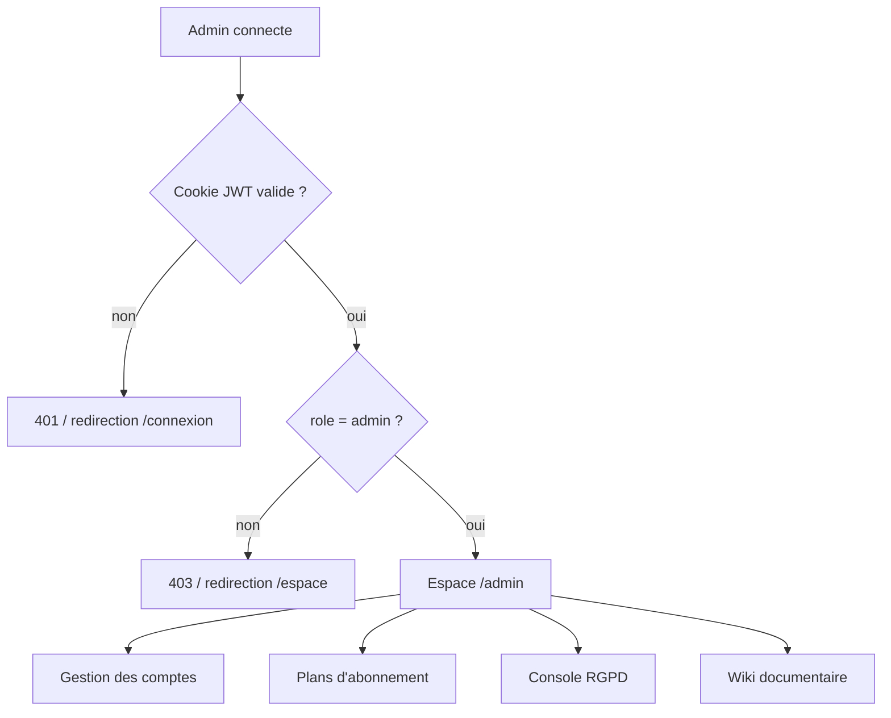
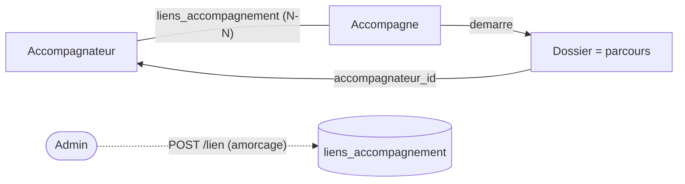
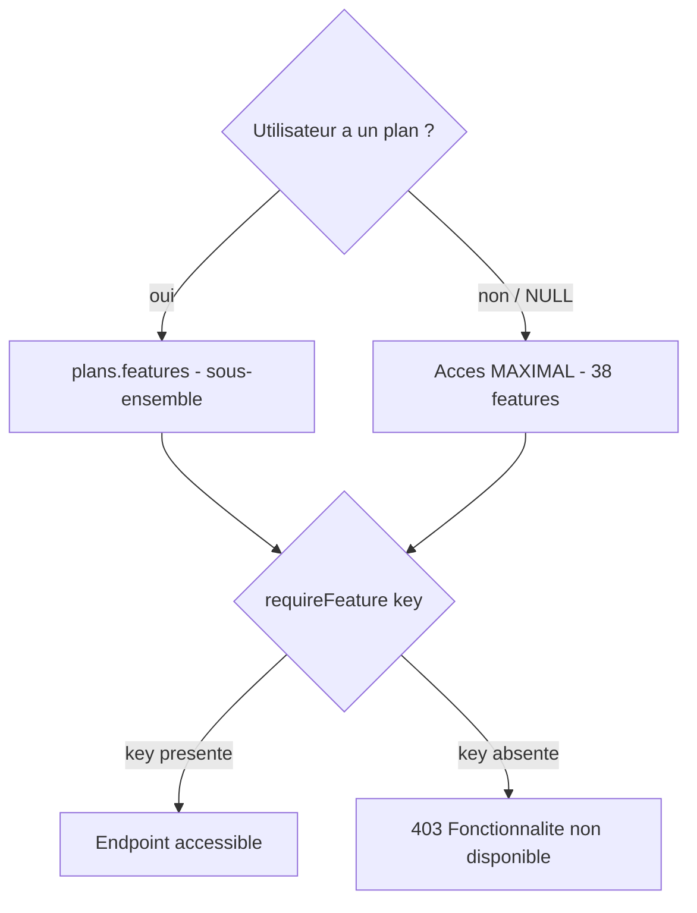
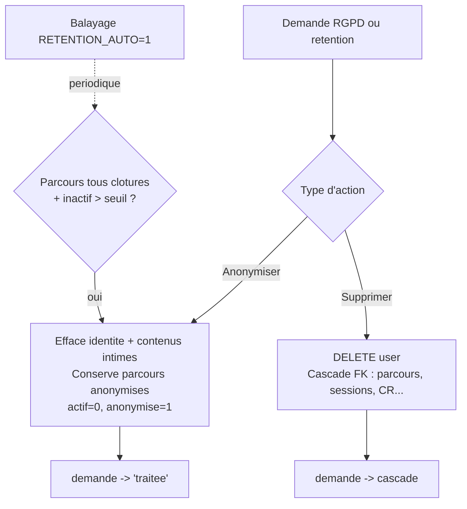
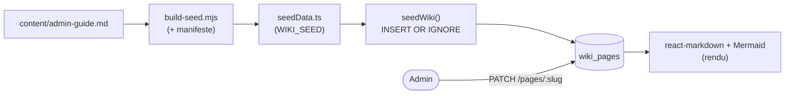

# Guide administrateur

Ce guide est le manuel **opérationnel** de l'administrateur de **Boussole**. Il décrit, action par action, comment piloter la plateforme depuis l'espace d'administration : gérer les comptes et les rôles, rattacher accompagnés et accompagnateurs, modeler les **plans d'abonnement** qui pilotent le *feature-gating*, traiter les **demandes d'effacement RGPD** et la rétention, et enfin exploiter le **wiki documentaire** lui-même (création, édition, statuts, recherche, export). Tout le contenu reflète le code réellement implémenté (`app/api/src/admin.ts`, `app/api/src/ethique.ts`, `app/api/src/wiki.ts`, `app/web/src/pages/Admin.tsx`). Les actions à effet irréversible — suppression de compte, anonymisation, suppression de plan — sont signalées comme **sensibles** et accompagnées de garde-fous. Public visé : l'administrateur unique du projet académique (Mohamed EL AFRIT), et tout exploitant amené à reprendre la console.

## Objectifs de la page

- Donner une **procédure exploitable** pour chaque tâche d'administration, avec l'endpoint et l'écran correspondants.
- Clarifier le modèle **rôles / plans / fonctionnalités** et l'invariant `plan_id NULL = accès maximal`.
- Outiller le traitement **RGPD** (effacement à la demande, action directe, rétention automatique) sans erreur de manipulation.
- Documenter l'**exploitation du wiki admin-only** : cycle de vie d'une page, statuts, recherche, export, impression.
- Énoncer les **bonnes pratiques** (ne pas abîmer la vitrine de démo, sauvegarder avant toute opération RGPD) et la **résolution des incidents** courants.

---

## 1. Accès à l'administration

L'administration est réservée au rôle **`admin`**. Tout l'espace d'administration (gestion des comptes, plans, console RGPD) **et** le wiki sont gardés côté serveur.

| Élément | Réalité (vérifiée dans le code) |
|---|---|
| Écran principal | `/admin` (composant `app/web/src/pages/Admin.tsx`) |
| Garde front | `<Protected role="admin">` — redirige tout non-admin vers `/espace` (ou `/connexion` si non connecté) |
| Garde back (comptes/plans/RGPD) | `requireAuth` + `requireRole('admin')` sur **chaque** route de `app/api/src/admin.ts` |
| Garde back (wiki) | `router.use(requireAuth, requireRole('admin'))` — **toutes** les routes `/api/wiki/*` |
| Réponse si rôle insuffisant | **403** côté API ; redirection côté front |
| Réponse si non authentifié | **401** côté API |

> Le contrôle front (`Protected`) est une commodité d'expérience, **pas** une frontière de sécurité : l'autorisation est toujours tranchée côté API. Voir [Sécurité](security) pour le détail des gardes en cascade.

Ce diagramme situe les quatre domaines d'action de l'administrateur derrière une même double garde (authentification puis rôle). L'écran `/admin` agrège les trois premiers blocs (comptes, plans via `PlansManager`, RGPD via `RgpdConsole`) ; le wiki est un module à part, monté sous `/api/wiki`, mais soumis à la même exigence de rôle.

---

## 2. Gestion des utilisateurs

### 2.1 Vue d'ensemble des comptes

L'écran liste tous les comptes (`GET /api/admin/users`), triés du plus récent au plus ancien, avec leur plan d'abonnement éventuel. Chaque ligne expose des contrôles directs : changement de rôle, choix du plan, activation/désactivation.

| Colonne | Source | Action possible |
|---|---|---|
| Email | `users.email` | — |
| Nom / Prénom | `users.nom`, `users.prenom` | — |
| Rôle | `users.role` | Liste déroulante → `PATCH /api/admin/users/:id` `{role}` |
| Abonnement | `users.plan_id` + `plans.nom` | Liste déroulante (« Niveau max » = `NULL`) → `PATCH … {plan_id}` |
| Validé | `users.email_verifie` | Indicateur (✓ / —) |
| Statut | `users.actif` | Bouton « Activer / Désactiver » → `PATCH … {actif}` |

### 2.2 Créer un compte

Formulaire « Créer un compte » → `POST /api/admin/users` `{email, role, nom, prenom}`.

- Le rôle doit être l'un de `admin`, `accompagnateur`, `accompagne` (sinon **400**).
- Si l'email existe déjà : **409 « Email déjà utilisé »**.
- Le compte est créé **sans mot de passe**, avec `email_verifie = 1`. Un jeton `reset_mdp` (validité **72 h**) est généré et un **e-mail d'activation** est envoyé à l'adresse (via Brevo) : l'utilisateur définit lui-même son mot de passe par ce lien.
- Réponse : **201** + `{id}`. L'écran affiche « Compte créé, email d'activation envoyé. ».

> **Sans `BREVO_API_KEY`**, l'e-mail d'activation est **journalisé** dans les logs au lieu d'être envoyé : récupérez le lien dans les logs de l'API pour activer un compte en environnement sans messagerie. Voir [Exploitation](operations).

### 2.3 Modifier un compte (rôle, activation, plan)

Tout passe par `PATCH /api/admin/users/:id`, qui accepte un ou plusieurs champs parmi `{actif, role, plan_id}` :

| Champ | Effet | Garde-fou |
|---|---|---|
| `actif` | `1` (actif) / `0` (désactivé — login refusé) | — |
| `role` | Bascule entre les 3 rôles (valeur hors liste **ignorée**) | — |
| `plan_id` | `null`/`''` → niveau max ; un id de plan **existant** → ce plan ; plan inexistant → **400** | — |
| **Tous** | — | **Impossible sur son propre compte** : `id == moi` → **400** |

> **Garde-fou anti-verrouillage.** Un administrateur **ne peut pas modifier son propre compte** via cet endpoint (« Vous ne pouvez pas modifier votre propre compte administrateur »). Cela empêche de se rétrograder ou de se désactiver et de perdre l'accès admin. Pour changer l'admin, créez/élevez un **second** compte admin d'abord.

### 2.4 Désactivation vs. suppression

| Opération | Effet | Réversible ? | Endpoint |
|---|---|---|---|
| **Désactiver** | `actif = 0` : le login est refusé, les données restent intactes | **Oui** (réactiver) | `PATCH /api/admin/users/:id {actif:0}` |
| **Anonymiser** | Efface l'identité, conserve les parcours (anonymisés) | **Non** | RGPD (voir §4) |
| **Supprimer** | Retrait complet du compte et cascade FK | **Non** | RGPD (voir §4) |

La désactivation est le levier **réversible** à privilégier pour suspendre un accès. L'anonymisation et la suppression relèvent du RGPD et sont **irréversibles**.

### 2.5 Rattacher un accompagné à un accompagnateur

Formulaire « Rattacher un accompagné » → `POST /api/admin/lien` `{accompagnateurId, accompagneId}`.

- Les deux comptes doivent exister **et** porter le bon rôle (un `accompagnateur` et un `accompagne`), sinon **400 « Sélection invalide »**.
- Crée une ligne dans `liens_accompagnement` en `INSERT OR IGNORE` : un rattachement déjà existant est **idempotent** (pas de doublon, pas d'erreur).
- Ce lien est la relation **N–N** entre accompagnateurs et accompagnés ; il n'ouvre pas à lui seul de parcours.

> **Précision métier — confiance : élevée.** Dans le flux nominal, c'est l'**accompagné** qui démarre un parcours et choisit son accompagnateur, ce qui crée le **dossier** et le **lien** automatiquement. Le rattachement admin est un **outil d'amorçage / de rattrapage** (corriger un oubli, pré-câbler une relation), pas le chemin principal. Voir [Spécifications fonctionnelles](functional-specifications).

Le schéma distingue la voie nominale (l'accompagné démarre un dossier qui matérialise la relation) de l'intervention administrative (rattachement direct, en pointillés), utilisée pour réparer ou préparer une relation sans attendre l'action de l'accompagné.

---

## 3. Plans d'abonnement et fonctionnalités

### 3.1 Principe : le *feature-gating* par plan

Boussole compte **38 fonctionnalités** activables (`app/api/src/features.ts`, registre `FEATURES`). Un **plan** (`plans.features`, tableau JSON de clés) définit le sous-ensemble accessible. Le middleware `requireFeature(key)` renvoie **403 « Fonctionnalité non disponible dans votre offre »** si la clé n'est pas dans le plan de l'utilisateur.

> **Invariant fondamental — `plan_id NULL = accès maximal`.** Un utilisateur **sans plan** (`plan_id NULL`) obtient **toutes** les fonctionnalités (`userFeatures` renvoie `ALL_FEATURE_KEYS`). C'est le **défaut**. Les plans servent à **restreindre** et à démontrer le *gating* — il n'y a **aucun paiement réel**.

| Plan de référence | Périmètre | Nombre de features (indicatif) |
|---|---|---|
| Découverte | Socle uniquement | 8 |
| Essentiel | Socle + confort de lecture + suivi émotionnel + premières aides | ~17 |
| Pro | Les 38 fonctionnalités | 38 |
| *(aucun plan)* | **Tout activé** (niveau max) | 38 |

> **Hypothèse — confiance : moyenne.** Les trois plans nommés ci-dessus correspondent à la spécification produit et au jeu de démo ; leur **composition exacte** (liste des clés) est portée par la base (`plans.features`) et **éditable** par l'admin. Les nombres « ~17 » sont indicatifs : la source de vérité est l'écran d'édition du plan.

### 3.2 Les fonctionnalités par catégorie

Le registre expose chaque feature avec sa clé (stable, utilisée par le code), son libellé et sa catégorie — c'est cette structure qui alimente l'éditeur de plan.

| Catégorie | Clés (extrait) |
|---|---|
| Socle | `questionnaire`, `entretien`, `comptes_rendus`, `rdv`, `plan_action`, `synthese`, `auto_evaluation`, `multi_parcours` |
| Visuel | `boussole`, `audio`, `dark_mode` |
| IA & posture | `miroir`, `copilote`, `banque_questions`, `coach_posture`, `debriefing`, `replay_annote`, `bilan_pratique` |
| Relationnel | `meteo`, `roue_emotions`, `journal` |
| Émergence | `fil_rouge`, `moments_cles`, `nuage_themes`, `problematisation`, `resume_parcours` |
| Pilotage | `signaux_faibles`, `tableau_impact`, `digest_email` |
| Collaboration | `mutualisation` |
| Éthique | `transparence`, `carte_parcours`, `attestation` |
| Confort | `visio`, `pwa_push`, `export_pdf` |
| Adoption | `onboarding`, `falc` |

> **Robustesse.** À l'écriture d'un plan, `sanitizeKeys()` **filtre** les clés : seules les clés valides du registre sont conservées, les doublons et les valeurs inconnues sont éliminés. On ne peut donc pas enregistrer une feature inexistante.

### 3.3 Cycle de vie d'un plan

| Action | Endpoint | Comportement |
|---|---|---|
| **Lister** | `GET /api/admin/plans` | Renvoie chaque plan avec `nb_users` (nombre d'utilisateurs rattachés) |
| **Créer** | `POST /api/admin/plans` `{nom, description?, features[]}` | Nom requis (sinon **400**) ; **201** + `{id}` |
| **Modifier** | `PATCH /api/admin/plans/:id` `{nom?, description?, features?}` | Nom non vide si fourni ; plan inexistant → **404** |
| **Dupliquer** | `POST /api/admin/plans/:id/duplication` | Copie nommée « *<nom>* (copie) » ; **201** + `{id}` |
| **Supprimer** | `DELETE /api/admin/plans/:id` | Les utilisateurs rattachés repassent à **`plan_id NULL` (niveau max)**, puis le plan est supprimé |

> **Effet de bord à connaître — suppression de plan.** Supprimer un plan **ne désactive personne** : tous ses utilisateurs basculent automatiquement en `plan_id NULL`, donc en **accès maximal**. C'est l'inverse d'un retrait d'accès : pour **restreindre**, réaffectez d'abord les utilisateurs à un autre plan, **puis** supprimez. Voir [Risques](#risques--points-dattention).

### 3.4 Affecter un plan à un utilisateur

Depuis la liste des comptes, la colonne « Abonnement » → `PATCH /api/admin/users/:id {plan_id}`. « Niveau max » correspond à `plan_id = NULL`. Un id de plan inexistant est rejeté (**400**), ce qui protège contre les références orphelines.

Le diagramme résume la décision de *gating* à chaque appel d'endpoint protégé : sans plan, toutes les clés sont présentes (accès total) ; avec un plan, seules les clés listées passent. C'est `requireFeature` qui arbitre, en lisant `plans.features` à la volée.

---

## 4. Console RGPD

La console RGPD (`RgpdConsole`, routes dans `admin.ts` et logique dans `ethique.ts`) couvre trois usages : traiter les **demandes d'effacement** émises par les accompagnés, agir **directement** sur un compte, et piloter la **rétention** automatique.

### 4.1 Anonymiser ou supprimer : la différence

| | Anonymiser | Supprimer |
|---|---|---|
| Identité (email, nom, prénom, mot de passe) | **Effacée** ; email remplacé par `anonyme-<id>@boussole.local` | **Effacée** (compte retiré) |
| Compte | `actif = 0`, `anonymise = 1` (conservé, neutralisé) | **Retiré** (`DELETE`) |
| Parcours / sessions / CR | **Conservés** mais anonymisés (traçabilité métier préservée) | **Supprimés en cascade** (FK `ON DELETE CASCADE`) |
| Contenus intimes (journal, météo, émotions) | **Effacés** (`journal_entrees` supprimé ; `meteo_humeur.mot` et `emotions_roue.note` mis à `NULL`) | Supprimés en cascade |
| Jetons & abonnements push | Supprimés | Supprimés en cascade |
| Réversibilité | **Irréversible** | **Irréversible** |

> **Choix de doctrine.** L'**anonymisation** est le mode par défaut recommandé : elle respecte le droit à l'effacement tout en **préservant la valeur métier** des parcours (statistiques, continuité côté accompagnateur). La **suppression** est plus radicale et fait disparaître l'historique lié. Choisir selon la demande explicite de la personne.

### 4.2 Traiter une demande d'effacement

| Étape | Endpoint | Détail |
|---|---|---|
| Lister les demandes en attente | `GET /api/admin/effacements` | Demandes `statut='en_attente'`, avec l'accompagné et le parcours concernés |
| Traiter | `POST /api/admin/effacements/:id` `{action}` | `action` ∈ `{anonymiser, supprimer}` (sinon **400**) ; demande inconnue → **404** |

Après traitement : si `anonymiser`, la demande passe en `statut='traitee'` (avec `action` et `traite_le`) ; si `supprimer`, le compte part et la demande **disparaît en cascade**.

### 4.3 Action RGPD directe (hors demande)

`POST /api/admin/rgpd/:userId` `{action}` applique `anonymiser` ou `supprimer` à un compte **sans** demande préalable (intervention de l'admin, ex. compte compromis ou test).

> **Garde-fou.** L'action est **refusée sur son propre compte** (`userId == moi` → **400 « Action impossible sur votre propre compte »**). Un compte cible inexistant renvoie **404** ; une action inconnue, **400**.

### 4.4 Rétention automatique

La rétention anonymise les comptes **accompagnés** dormants. Un compte est **éligible** si **tous** ses parcours sont **clôturés** et que sa dernière activité (dernière session ou création de dossier) dépasse le **seuil de rétention**.

| Paramètre | Variable d'env | Défaut | Rôle |
|---|---|---|---|
| Seuil (mois d'inactivité) | `RETENTION_MONTHS` | **36** | Au-delà, le compte devient éligible |
| Balayage automatique | `RETENTION_AUTO` | **désactivé** (`!= '1'`) | Si `=1`, `sweepRetention()` anonymise périodiquement |

| Étape | Endpoint | Détail |
|---|---|---|
| Voir les éligibles | `GET /api/admin/retention` | Renvoie `{months, auto, eligibles[]}` |
| Appliquer maintenant | `POST /api/admin/retention/appliquer` | Anonymise tous les éligibles ; renvoie `{anonymises:n}` |

Le diagramme relie les deux portes d'entrée RGPD (demande explicite, rétention) au même couple d'opérations. La rétention n'emprunte **que** la branche anonymisation et ne se déclenche que sous condition stricte (parcours tous clôturés **et** inactivité au-delà du seuil), ce qui évite d'effacer un compte encore actif.

---

## 5. Supervision

> **Cadre.** La supervision applicative (santé, logs, sauvegardes, incidents) est traitée en détail dans [Exploitation](operations) et [Déploiement](deployment). Ce guide se limite aux points qu'un **admin fonctionnel** vérifie depuis la console et l'environnement.

| Point de contrôle | Où / comment | Attendu |
|---|---|---|
| Santé de l'API | `GET /api/health` | Réponse 200 |
| Contexte public | `GET /api/context` | Métadonnées de l'instance |
| Mode démo vs. production | Variable `SEED_PASSWORD` | **Vide en prod réelle** (voir §7) |
| IA disponible | `ANTHROPIC_API_KEY` présente | Sinon **repli déterministe** (jamais de 500) |
| Messagerie | `BREVO_API_KEY` présente | Sinon e-mails **journalisés** dans les logs |
| Journal d'accès | Table `journal_acces` | **Présente mais non alimentée** (angle mort de traçabilité — voir [Sécurité](security)) |

> **Point d'attention.** En l'état, aucune action sensible (login, action RGPD, changement de rôle) n'est **journalisée** applicativement (`journal_acces` non écrit). Un incident serait difficile à reconstituer. C'est une dette identifiée, pas un acquis — voir [Sécurité](security) et [Dette technique](technical-debt).

---

## 6. Exploitation du wiki documentaire

Le présent wiki est **admin-only** : toutes les routes `/api/wiki/*` exigent `requireAuth + requireRole('admin')`. Le contenu est du **Markdown** stocké en base (`wiki_pages`), rendu par `react-markdown` + Mermaid, éditable en ligne.

### 6.1 Cycle de vie d'une page

| Action | Endpoint | Règles |
|---|---|---|
| **Lister** (barre latérale, index) | `GET /api/wiki/pages` | Métadonnées seules, triées par catégorie/ordre/titre |
| **Lire** | `GET /api/wiki/pages/:slug` | Page complète ; inconnue → **404** |
| **Créer** | `POST /api/wiki/pages` | `slug` au format `^[a-z0-9]+(?:-[a-z0-9]+)*$` ; slug déjà pris → **409** |
| **Modifier** | `PATCH /api/wiki/pages/:slug` | Champs partiels ; aucun champ → **400** ; met à jour `maj_le`/`maj_par` |
| **Supprimer** | `DELETE /api/wiki/pages/:slug` | Inconnue → **404** |

Champs d'une page : `titre` (1–200), `categorie` (défaut « Divers »), `resume` (≤ 600), `contenu_md` (≤ 500 000 car.), `statut`, `ordre` (0–100000). Validation **zod** stricte : un slug malformé ou un champ hors borne est rejeté en **400**.

### 6.2 Statuts éditoriaux

| Statut | Sens | Usage conseillé |
|---|---|---|
| `redige` | Page finalisée, de référence | Contenu validé (défaut du seed) |
| `partiel` | Page créée, contenu incomplet | Placeholder ou rédaction en cours |
| `brouillon` | Travail non publiable | Exploration, notes |
| `deprecie` | Obsolète, conservé pour mémoire | À ne plus suivre |

### 6.3 Recherche

`GET /api/wiki/search?q=...` : plein-texte simple sur **titre, résumé et contenu**, avec extrait contextuel.

- Requête **< 2 caractères** → résultats vides (anti-bruit).
- Caractères `%` et `_` **échappés** (pas d'injection de jokers SQL `LIKE`).
- Jusqu'à **40** résultats, triés par catégorie/ordre, chacun avec un extrait de ~140 caractères autour du terme.

### 6.4 Export et impression

| Format | Endpoint | Dépendance | Repli |
|---|---|---|---|
| **Markdown** | `GET /api/wiki/export/:slug.md` | Aucune | Toujours disponible |
| **DOCX** | `GET /api/wiki/export/:slug.docx` | **pandoc** (`-f gfm -t docx --toc`) | **503** + message « utilisez l'impression du navigateur » si pandoc absent |
| **PDF** | `GET /api/wiki/export/:slug.pdf` | **pandoc + wkhtmltopdf** | **503** + message « utilisez Imprimer (PDF du navigateur) » si indisponible |

> **Dégradation gracieuse.** L'export Markdown ne dépend de rien. DOCX et PDF passent par **pandoc** : si l'outil est absent de l'image, l'API renvoie un **503 explicite** (jamais un 500) invitant à utiliser l'**impression navigateur** (Ctrl/Cmd+P → « Enregistrer en PDF »). C'est la voie de secours universelle.

### 6.5 Seed et édition : qui gagne ?

Au démarrage, `seedWiki()` injecte le contenu de référence en **`INSERT OR IGNORE` par slug**. Conséquence : **le seed ne crée que les pages absentes et n'écrase jamais une page éditée** par l'admin. Les pages de référence vivent dans `app/api/src/wiki/content/<slug>.md` ; pour régénérer le seed après modification d'un `.md`, lancer `node app/api/src/wiki/build-seed.mjs`.

Le diagramme montre la double provenance du contenu : le **seed** (fichier `.md` → générateur → base, sans écrasement) et l'**édition en ligne** (PATCH direct en base). Une fois une page éditée, elle est la **source de vérité** ; le `.md` de référence ne sert qu'au premier amorçage et à la traçabilité Git.

---

## 7. Actions sensibles et bonnes pratiques

| Action sensible | Risque | Bonne pratique |
|---|---|---|
| Supprimer un compte (RGPD) | **Irréversible**, cascade FK | Préférer l'**anonymisation** ; sauvegarder la base avant |
| Anonymiser un compte | **Irréversible** | S'assurer que la demande est explicite ; sauvegarder avant |
| Supprimer un plan | Utilisateurs → **accès max** (pas une restriction) | Réaffecter d'abord, supprimer ensuite |
| `RETENTION_AUTO=1` | Anonymisation **automatique** des éligibles | N'activer qu'avec un seuil revu et une sauvegarde planifiée |
| `SEED_PASSWORD` défini en prod | **Réinitialise le jeu de démo à chaque démarrage** (efface les données réelles) | Laisser **vide** en production réelle |
| Modifier la vitrine de démo | Casse l'oral / les tests E2E | **Ne jamais** toucher le couple Mohamed/Amine et le dossier D1 |

> **Protéger la vitrine de démo.** Le jeu de démonstration (2 accompagnateurs, 3 accompagnés, 6 dossiers ; couple **Mohamed/Amine**, dossier **D1**) est utilisé pour l'oral et la batterie de tests E2E. Pour toute manipulation destructive (RGPD, suppression de plan), opérer sur des **comptes jetables** (`@boussole.test`) et **jamais** sur la vitrine. Voir [Stratégie de tests](testing-strategy).

> **Sauvegarder avant toute opération RGPD.** La base étant un **fichier SQLite unique**, une sauvegarde est une **copie de fichier**. Réaliser systématiquement une copie horodatée du `.sqlite` **avant** anonymisation/suppression/rétention : c'est le seul filet en cas d'erreur de cible (les opérations RGPD sont irréversibles). Voir [Exploitation](operations) et [Déploiement](deployment).

---

## 8. Résolution de problèmes courants

| Symptôme | Cause probable | Résolution |
|---|---|---|
| **403** à l'ouverture de `/admin` ou du wiki | Compte non `admin` | Élever le rôle (`PATCH /api/admin/users/:id {role:'admin'}`) depuis un autre admin |
| « Vous ne pouvez pas modifier votre propre compte » | Garde-fou anti-auto-verrouillage | Agir depuis un **second** compte admin |
| « Action impossible sur votre propre compte » (RGPD) | Garde-fou `userId == moi` | Cibler un autre compte |
| E-mail d'activation jamais reçu | `BREVO_API_KEY` absente | Récupérer le lien `reset_mdp` dans les **logs** de l'API |
| Lien d'activation expiré | Jeton `reset_mdp` > **72 h** | Recréer le compte / relancer un lien de réinitialisation |
| **409** à la création de compte | Email déjà présent | Réutiliser le compte existant ou changer d'email |
| **409** à la création de page wiki | Slug déjà pris | Choisir un autre slug (le slug est unique) |
| **400** « slug invalide » | Slug hors `^[a-z0-9-]+$` | Minuscules, chiffres, tirets uniquement |
| Export **DOCX/PDF** en **503** | pandoc/wkhtmltopdf absents | Utiliser l'**impression navigateur** (PDF) |
| Suppression de plan « n'a rien restreint » | Comportement attendu : retour à l'accès max | Réaffecter les utilisateurs à un plan **avant** suppression |
| Comptes anonymisés réapparus | `RETENTION_AUTO=1` + seuil court | Revoir `RETENTION_MONTHS`, désactiver l'auto si non voulu |
| Données de prod effacées au redémarrage | `SEED_PASSWORD` défini en prod | Vider `SEED_PASSWORD`, restaurer la sauvegarde |
| Fonctionnalité « non disponible dans votre offre » | Plan trop restrictif | Vérifier `plans.features` ; passer l'utilisateur en « Niveau max » si besoin |

---

## Hypothèses

> **Hypothèse — confiance : moyenne.** La composition exacte des plans « Découverte / Essentiel / Pro » (~8 / ~17 / 38 features) provient de la spécification et du jeu de démo ; la **source de vérité reste la base** (`plans.features`), éditable par l'admin. Les nombres intermédiaires sont indicatifs.

> **Hypothèse — confiance : élevée.** Le jeton d'activation envoyé à la création de compte est un jeton `reset_mdp` d'une **validité de 72 h** (`expiryHours(72)`), réutilisant le même mécanisme que la réinitialisation de mot de passe.

> **Hypothèse — confiance : élevée.** Les sauvegardes de la base sont des **copies du fichier `.sqlite`** ; la procédure d'automatisation (cron) relève de l'exploitation et n'est pas portée par la console admin.

> **Hypothèse — confiance : moyenne.** En production, l'envoi d'e-mails (activation, réinitialisation) dépend d'une `BREVO_API_KEY` valide ; sans elle, les liens transitent par les logs. La configuration effective n'est vérifiable que côté environnement.

*Information non identifiée dans le code ou la conversation : interface dédiée de visualisation des sauvegardes, et tableau de bord de supervision temps réel — la supervision repose sur `/api/health`, les logs et l'environnement.*

## Risques & points d'attention

- **Auto-verrouillage admin** : un seul compte admin est un point unique de défaillance — la modification de son propre compte étant bloquée, prévoir **un second admin** avant toute bascule de rôle.
- **Suppression de plan = élargissement d'accès** : l'effet contre-intuitif (`plan_id NULL` → accès max) doit être anticipé ; toujours réaffecter avant de supprimer.
- **Irréversibilité RGPD** : anonymisation et suppression n'ont **aucun retour arrière** applicatif ; la seule sécurité est la **sauvegarde préalable**.
- **`RETENTION_AUTO=1`** : automatise une opération **destructive** (anonymisation) ; à n'activer qu'avec un seuil validé et des sauvegardes.
- **`SEED_PASSWORD` en prod** : risque **critique** d'effacement des données réelles à chaque démarrage ; doit rester vide.
- **Traçabilité absente** (`journal_acces` non alimenté) : les actions admin sensibles ne laissent pas de piste d'audit applicative — angle mort de détection.
- **Vitrine de démo** : toute opération destructive doit éviter le couple Mohamed/Amine et le dossier D1, sous peine de casser l'oral et les tests E2E.

## Recommandations

1. **Maintenir deux comptes admin** au minimum pour neutraliser le garde-fou d'auto-modification sans perdre l'accès.
2. **Sauvegarder la base avant toute opération RGPD** (anonymisation, suppression, rétention) : copie horodatée du `.sqlite`.
3. **Réaffecter avant de supprimer un plan** pour éviter la bascule involontaire des utilisateurs en accès maximal.
4. **Privilégier l'anonymisation** à la suppression, sauf demande explicite contraire : elle préserve la valeur métier des parcours.
5. **Vérifier `SEED_PASSWORD` (vide) et `RETENTION_AUTO` (désactivé sauf intention)** avant chaque mise en production.
6. **Câbler `journal_acces`** sur les actions admin sensibles (création/élévation de compte, RGPD) pour disposer d'une piste d'audit — voir [Sécurité](security).
7. **Documenter la composition réelle des plans** dans le wiki si elle diverge des valeurs indicatives, la base faisant foi.

## Pages liées

- [Exploitation](operations) — runbook, supervision, sauvegardes, incidents en production.
- [Sécurité](security) — gardes d'accès, RGPD, traçabilité, garde-fous.
- [Guide utilisateur](user-guide) — parcours accompagnateur et accompagné côté usage.
- [Déploiement](deployment) — variables d'environnement, `SEED_PASSWORD`, sauvegarde SQLite.
- [Documentation API](api-documentation) — contrat des endpoints `/api/admin` et `/api/wiki`.
- [Architecture des données](data-architecture) — tables `users`, `plans`, `liens_accompagnement`, `demandes_effacement`.
- [Spécifications fonctionnelles](functional-specifications) — flux de rattachement et de gating fonctionnel.
- [Stratégie de tests](testing-strategy) — vitrine de démo, comptes jetables, non-régression.
- [Registre des risques](risk-register) — risques d'exploitation et RGPD consolidés.
- [Dette technique](technical-debt) — journal d'accès non câblé, pipeline manuel.
