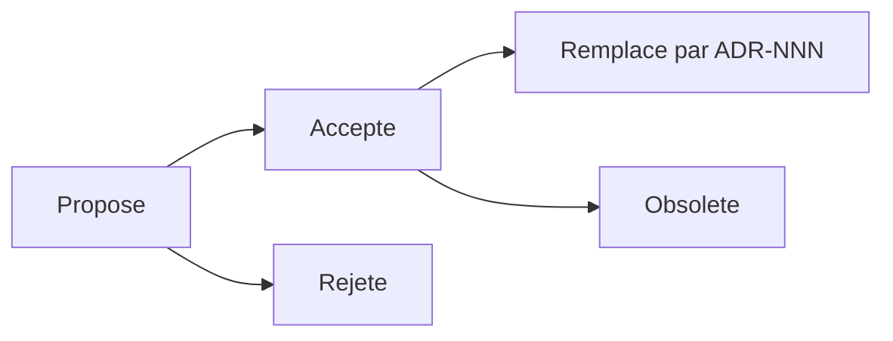
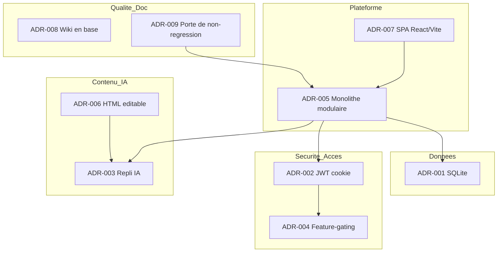
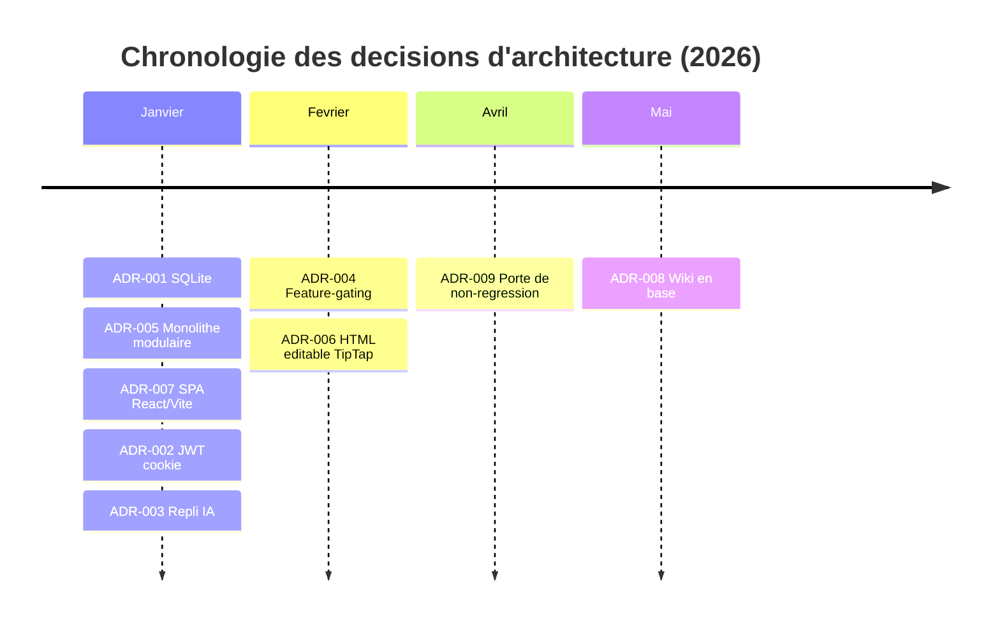

# Décisions d'architecture (ADR)

Cette page constitue le **registre des Architecture Decision Records (ADR)** du projet **Boussole** (accompagnement à la rédaction de mémoires, cadre Cnam / UE FAD130, auteur unique Mohamed EL AFRIT). Un ADR documente une décision d'architecture *structurante* : son contexte, l'option retenue, les alternatives écartées et les conséquences assumées — de façon à ce qu'une décision puisse être comprise, contestée ou révisée plus tard sans avoir à reconstituer le raisonnement de mémoire. Les ADR ci-dessous sont **reconstruits a posteriori** à partir de l'architecture réellement observée dans le code (stack, structure du monorepo, mécanismes d'auth, repli IA, feature-gating, tests). Chaque ADR suit un format normalisé (Statut, Contexte, Décision, Alternatives, Conséquences ±, Impacts techniques, Date) et chaque décision est tracée vers les pages de détail correspondantes.

## Objectifs de la page

- Fournir un **journal traçable** des décisions d'architecture structurantes, lisible par un architecte, un PMO ou un évaluateur FAD130.
- Pour chaque décision : expliciter le **contexte** déclencheur, l'**option retenue**, les **alternatives étudiées** et les **conséquences** positives comme négatives.
- Distinguer les décisions **acceptées** (en vigueur), celles qui resteraient **proposées** ou **à réviser**, de celles écartées.
- Relier chaque ADR aux pages de référence ([Architecture technique](technical-architecture), [Architecture de données](data-architecture), [Sécurité](security), [Stratégie de tests](testing-strategy)…).
- Servir de socle au suivi de la [Dette technique](technical-debt) et du [Registre des risques](risk-register), dont plusieurs entrées découlent directement de ces décisions.

## Méthode et convention ADR

Le registre applique la convention ADR usuelle (M. Nygard) : un fichier = une décision = un identifiant **ADR-NNN** immuable. Une décision n'est jamais supprimée ; si elle est invalidée, elle passe au statut *Remplacée par ADR-NNN* ou *Obsolète*, ce qui préserve l'historique du raisonnement.

| Statut | Signification | Dans ce registre |
|--------|---------------|------------------|
| **Accepté** | Décision en vigueur, implémentée dans le code | Tous les ADR ci-dessous |
| Proposé | Décision envisagée, non encore tranchée | *Aucun à ce jour* |
| Remplacé | Invalidé par un ADR ultérieur | *Aucun à ce jour* |
| Obsolète | N'a plus d'objet | *Aucun à ce jour* |

Le cycle de vie ci-dessus est volontairement simple : une décision naît *Proposée*, devient *Acceptée* une fois implémentée, et ne quitte cet état que par remplacement ou obsolescence — jamais par effacement. À la date de rédaction, les neuf décisions du registre sont toutes au statut **Accepté** : elles décrivent une architecture déjà construite et déployée, non un projet en cours d'arbitrage.

## Cartographie des décisions

Le tableau de tête condense les neuf ADR. Les sections détaillées qui suivent développent chaque ligne.

| ID | Titre | Domaine | Statut | Date |
|----|-------|---------|--------|------|
| ADR-001 | Persistance SQLite via better-sqlite3 (sans ORM) | Données | Accepté | 2026-01-08 |
| ADR-002 | Authentification JWT en cookie httpOnly | Sécurité | Accepté | 2026-01-12 |
| ADR-003 | IA Claude avec repli déterministe systématique | IA / Robustesse | Accepté | 2026-01-20 |
| ADR-004 | Feature-gating par plan d'abonnement | Produit / Accès | Accepté | 2026-02-03 |
| ADR-005 | Monolithe Express modulaire par routeur | Architecture applicative | Accepté | 2026-01-10 |
| ADR-006 | CR & synthèses en HTML éditable (TipTap) | Contenu / Édition | Accepté | 2026-02-14 |
| ADR-007 | Front React + Vite en SPA (pas de SSR) | Frontend | Accepté | 2026-01-09 |
| ADR-008 | Wiki documentaire admin-only, Markdown stocké en base | Documentation | Accepté | 2026-05-28 |
| ADR-009 | Batterie de tests comme porte de non-régression | Qualité | Accepté | 2026-04-05 |

Cette carte regroupe les décisions par domaine et matérialise leurs dépendances : le monolithe modulaire (ADR-005) est le socle qui porte la persistance (ADR-001), l'auth (ADR-002) et le repli IA (ADR-003) ; le feature-gating (ADR-004) s'appuie sur l'auth ; l'édition HTML (ADR-006) et le repli IA (ADR-003) se rejoignent sur la production de contenu ; la porte de non-régression (ADR-009) couvre l'ensemble du monolithe. Aucune décision n'est isolée : c'est la cohérence de l'ensemble qui fait la robustesse revendiquée.

---

# ADR-001 — Persistance SQLite via better-sqlite3 (sans ORM)

## Statut
**Accepté.**

## Contexte
Le projet est mono-acteur, mono-instance, à volumétrie de démonstration, et doit être trivial à déployer, sauvegarder et restaurer sous contrainte académique. Le besoin de persistance est relationnel (33 tables, FK avec cascades) mais sans exigence de scalabilité horizontale ni de haute disponibilité. Un serveur de base de données dédié (Postgres, MySQL) ajouterait un composant à provisionner, configurer, superviser et sauvegarder séparément — coût d'exploitation injustifié pour la cible.

## Décision
Utiliser **SQLite** comme moteur de persistance, accédé via **better-sqlite3** (API synchrone), dans un **fichier unique** `./data/boussole.sqlite` en mode **WAL** avec `foreign_keys = ON`. **Aucun ORM** : le SQL est écrit à la main, les entrées sont validées par **zod** au niveau des routes.

## Alternatives étudiées
| Alternative | Pourquoi écartée |
|-------------|------------------|
| PostgreSQL + ORM (Prisma / TypeORM) | Composant serveur à exploiter, surcouche ORM masquant le SQL, sur-dimensionné pour une mono-instance |
| SQLite + driver asynchrone (`node-sqlite3`) | API en callbacks/promesses moins lisible ; le synchrone de better-sqlite3 simplifie le code mono-instance |
| ORM léger sur SQLite (Drizzle, Knex) | Abstraction non nécessaire ; SQL direct plus transparent et plus facile à auditer |

## Conséquences positives
- Déploiement et sauvegarde **triviaux** : un seul fichier à copier (avec le WAL).
- Accès **synchrone** : code linéaire, pas de gestion de pool ni d'`await` sur chaque requête.
- SQL **explicite et auditable**, sans magie d'ORM ; intégrité garantie par les FK et les contraintes CHECK.
- Empreinte d'exploitation minimale (pas de serveur de base à administrer).

## Conséquences négatives
- **Pas de scalabilité horizontale** : un seul writer, mono-instance par construction.
- SQL manuel = **plus de discipline** requise (risque d'erreurs sans garde-fou ORM, compensé par zod et les tests).
- Sauvegarde à **formaliser explicitement** (le fichier unique est aussi un point de défaillance unique).
- Build natif de better-sqlite3 à recompiler dans l'image Docker.

## Impacts techniques
- Image API `node:20-bookworm-slim` compilant le binaire natif.
- `data-architecture` : 33 tables, snake_case, `id INTEGER PK AUTOINCREMENT`, `datetime('now')`, FK `ON DELETE CASCADE/SET NULL`.
- Risque « perte du fichier unique » à couvrir par une routine de sauvegarde ([Exploitation](operations)).

## Date
2026-01-08. Voir [Architecture de données](data-architecture) et [Architecture technique](technical-architecture).

---

# ADR-002 — Authentification JWT en cookie httpOnly

## Statut
**Accepté.**

## Contexte
L'application est une SPA (cf. ADR-007) consommant une API REST. Il faut authentifier l'utilisateur de manière sûre face au vol de session (XSS) et exploitable côté navigateur sans logique de stockage de jeton dans le front. Deux familles s'opposent : session serveur (état stocké côté API) vs jeton autoporteur (JWT). La cible mono-instance ne tire aucun bénéfice d'un store de session partagé.

## Décision
Émettre un **JWT** (jsonwebtoken) à la connexion, déposé dans un **cookie httpOnly** `boussole_token` : `sameSite=lax`, `secure` en production, expiration **7 jours**. Le front n'accède jamais au jeton (httpOnly). Côté API, `requireAuth` vérifie le cookie, `getUser(req)` lit l'utilisateur du token. Mots de passe hachés en **bcryptjs (10 rounds)**.

## Alternatives étudiées
| Alternative | Pourquoi écartée |
|-------------|------------------|
| Session serveur (cookie de session + store) | Nécessite un store d'état ; inutile pour une mono-instance, et JWT évite la persistance de session |
| JWT en `localStorage` | Accessible au JavaScript → exposé au vol par XSS ; le cookie httpOnly y est immunisé |
| OAuth2 / fournisseur d'identité externe | Sur-dimensionné pour un projet académique solo, dépendance externe non justifiée |

## Conséquences positives
- Jeton **inaccessible au JavaScript** (httpOnly) → résistance au vol par XSS.
- **Pas de store de session** à maintenir : l'API reste sans état d'authentification.
- `sameSite=lax` + `secure` (prod) → réduction du risque CSRF et interdiction du transport en clair.
- Modèle simple et homogène avec le RBAC (`requireRole`) et le gating (`requireFeature`, cf. ADR-004).

## Conséquences négatives
- **Révocation non immédiate** : un JWT reste valide jusqu'à expiration (atténuation : durée bornée à 7 jours).
- Rotation/blacklist de jetons **non implémentée** ; *Information non identifiée dans le code ou la conversation.*
- La taille du cookie croît avec le contenu du token (maîtrisée ici : claims minimaux).

## Impacts techniques
- `helmet`, `cors` (credentials), `cookie-parser` côté Express.
- Chaîne de contrôle d'accès : `requireAuth` → `requireRole` → `requireFeature`.
- Parcours RGPD/auth associés : vérification d'email, reset, changement d'email (table `tokens`).

## Date
2026-01-12. Voir [Sécurité](security).

---

# ADR-003 — IA Claude avec repli déterministe systématique

## Statut
**Accepté.** *Décision la plus structurante du produit.*

## Contexte
Plusieurs fonctionnalités cœur reposent sur l'IA (questionnaire assisté, co-pilote d'entretien, génération de comptes rendus, synthèses, miroir de posture, auto-évaluation…). L'API Anthropic est un **service externe** : latence variable, indisponibilité possible, quota, coût à l'appel. Un produit d'accompagnement ne peut pas se permettre un écran d'erreur 500 au milieu d'un entretien. La disponibilité fonctionnelle doit être **indépendante** de la disponibilité de l'IA.

## Décision
**Chaque fonctionnalité IA possède un repli déterministe** (fallback) codé en dur, utilisé automatiquement si l'IA est indisponible, en erreur ou hors quota. Invariant produit : **jamais de 500 sur une feature IA — on dégrade gracieusement** vers une réponse déterministe utile (questions génériques par phase, gabarit de CR, synthèse à partir des données structurées…). La logique IA est centralisée dans `app/api/src/claude.ts`.

## Alternatives étudiées
| Alternative | Pourquoi écartée |
|-------------|------------------|
| Appel IA direct sans repli | Couple la disponibilité du produit à celle d'un tiers ; risque de 500 en plein entretien — inacceptable |
| Repli par simple message d'erreur | Bloque l'utilisateur au lieu de le laisser avancer ; ne préserve pas le parcours métier |
| File d'attente / retry asynchrone | Ajoute latence et complexité ; l'entretien est synchrone, l'utilisateur attend une réponse immédiate |

## Conséquences positives
- **Robustesse** : l'application reste utilisable de bout en bout même API Claude coupée.
- **Bornage du coût et du risque** : l'IA devient un *enrichissement*, pas une dépendance critique.
- **Testabilité** : le chemin déterministe est testable sans appeler l'IA (utile pour la batterie de tests, ADR-009).
- Posture éthique cohérente : l'outil n'impose jamais l'IA comme passage obligé.

## Conséquences négatives
- **Double implémentation** à maintenir par feature (chemin IA + chemin déterministe) → coût de maintenance.
- Qualité du repli **inférieure** à celle de l'IA (questions génériques vs contextualisées) — dégradation assumée.
- Risque de **divergence** entre les deux chemins si l'un évolue sans l'autre (à couvrir par les tests).

## Impacts techniques
- `app/api/src/claude.ts` : point d'entrée IA + repli ; `app/api/src/phases.ts` alimente les replis par phase.
- Tests : le repli déterministe rend les fonctionnalités IA vérifiables hors ligne.
- Mention de transparence RGPD sur la sous-traitance IA à expliciter (cf. [Sécurité](security)).

## Date
2026-01-20. Voir [Spécifications fonctionnelles](functional-specifications) et [Architecture technique](technical-architecture).

---

# ADR-004 — Feature-gating par plan d'abonnement

## Statut
**Accepté.**

## Contexte
L'application expose **38 fonctionnalités** de richesse très variable. Le projet doit pouvoir **démontrer la modularité de l'offre** (plans Découverte / Essentiel / Pro) et restreindre l'accès aux fonctionnalités selon le plan de l'utilisateur — sans paiement réel à implémenter. Il faut un mécanisme d'autorisation fonctionnelle distinct du contrôle de rôle (un même rôle peut avoir des plans différents).

## Décision
Définir les **38 features** dans `app/api/src/features.ts` et les rattacher à des **plans** (table `plans`, `features` = tableau JSON de clés). Un middleware **`requireFeature(key)`** renvoie **403 « Fonctionnalité non disponible dans votre offre »** si la feature n'est pas dans le plan de l'utilisateur. Côté front, `FeaturesContext` conditionne l'affichage. Convention : **`plan_id NULL = accès maximal** (toutes features actives)** — c'est le défaut.

## Alternatives étudiées
| Alternative | Pourquoi écartée |
|-------------|------------------|
| Flags par utilisateur (booléens en table users) | Non scalable à 38 features × N utilisateurs ; pas de notion réutilisable de « plan » |
| Gating uniquement front | Contournable (l'API resterait ouverte) ; la sécurité doit être côté serveur |
| Système de licences / paiement réel | Hors périmètre académique ; les plans servent à *démontrer* le gating, pas à facturer |

## Conséquences positives
- **Séparation nette** rôle (qui es-tu) vs feature (à quoi as-tu droit).
- Offre **configurable** par l'admin (CRUD + duplication de plans) sans toucher au code.
- Gating **appliqué côté serveur** (403), donc non contournable, et reflété côté front pour l'UX.
- Démonstration pédagogique claire de la modularité produit.

## Conséquences négatives
- Surface à tester accrue (chaque feature × chaque plan).
- Risque d'**incohérence front/back** si une feature est masquée côté UI mais non gardée côté API (à éviter par discipline).
- **Pas de paiement réel** : le modèle économique reste illustratif (assumé, cf. [Business case](business-case)).

## Impacts techniques
- `app/api/src/features.ts` (clés), table `plans` (features JSON), middleware `requireFeature`.
- Front : `FeaturesContext`, `GET /api/auth/me/features`.
- Admin : `/api/admin` (plans CRUD + duplication).

## Date
2026-02-03. Voir [Cahier des charges](requirements) et [Guide administrateur](admin-guide).

---

# ADR-005 — Monolithe Express modulaire par routeur

## Statut
**Accepté.**

## Contexte
Le système expose **145 endpoints** couvrant 38 fonctionnalités. Pour un développeur solo, une architecture microservices multiplierait les coûts d'orchestration, de déploiement et d'observabilité sans bénéfice à cette échelle. Il faut néanmoins éviter le « monolithe spaghetti » : la modularité interne est nécessaire pour la lisibilité et la maintenance.

## Décision
Construire un **monolithe Express** unique, **structuré en routeurs par domaine** : **24 routeurs montés sous `/api`** dans `app/api/src/index.ts` (`/api/auth`, `/api/entretien`, `/api/cr`, `/api/dossiers`, `/api/admin`…). Un seul processus, un seul déploiement, mais une séparation claire des responsabilités par fichier de routeur.

## Alternatives étudiées
| Alternative | Pourquoi écartée |
|-------------|------------------|
| Microservices | Orchestration, réseau inter-services, observabilité distribuée — sur-dimensionné pour un solo mono-instance |
| Monolithe non modularisé (un gros fichier) | Illisible et non maintenable à 145 endpoints |
| Framework lourd (NestJS) | Cérémonie et abstractions supplémentaires non justifiées ; Express reste minimal et explicite |

## Conséquences positives
- **Un seul artefact** à builder, déployer, superviser → exploitation simple.
- **Modularité par routeur** : navigation et maintenance aisées malgré 145 endpoints.
- Transactions et accès SQLite **dans le même processus** (cohérent avec ADR-001, accès synchrone).
- Latence interne nulle entre domaines (pas d'appels réseau internes).

## Conséquences négatives
- **Scalabilité par réplication limitée** (cohérent avec la mono-instance SQLite) : pas de scaling indépendant par domaine.
- Couplage de déploiement : tout part ensemble (un déploiement = toute l'API).
- Surface de panne partagée (un crash impacte tous les domaines) — atténué par la simplicité du runtime.

## Impacts techniques
- `app/api/src/index.ts` : montage des 24 routeurs, middlewares globaux (`helmet`, `cors`, `cookie-parser`).
- Santé : `GET /api/health` ; contexte public : `GET /api/context`.
- Build : `tsc` → `dist`, `node dist/index.js` (image API séparée du web).

## Date
2026-01-10. Voir [Architecture technique](technical-architecture) et [Documentation API](api-documentation).

---

# ADR-006 — CR & synthèses en HTML éditable (TipTap)

## Statut
**Accepté.**

## Contexte
Les comptes rendus et les synthèses sont des livrables **rédactionnels** : produits par l'IA (cf. ADR-003), puis **relus et amendés** par l'accompagnateur, **versionnés**, **publiés** à l'accompagné et **discutés**. Le format de stockage doit donc être à la fois éditable richement (titres, listes, emphase) et restituable fidèlement. Un PDF figé interdirait l'édition ; du Markdown brut limiterait l'expérience d'édition WYSIWYG.

## Décision
Stocker les comptes rendus (`comptes_rendus.contenu_html`) et synthèses (`syntheses`) en **HTML**, édités via **TipTap** (@tiptap/react + starter-kit) côté front, avec **sanitisation par DOMPurify** au rendu. Versionnement (champ `version`, `source` ia/manuel, `publie`). L'export PDF est une **projection** du HTML (feature `export_pdf`), pas le format de stockage.

## Alternatives étudiées
| Alternative | Pourquoi écartée |
|-------------|------------------|
| Markdown stocké, rendu à la lecture | Édition WYSIWYG riche moins naturelle ; perte de fidélité de mise en forme fine |
| PDF figé généré une fois | Non éditable, non versionnable au fil de la discussion accompagnateur↔accompagné |
| Document binaire (docx) | Surcouche lourde, mauvaise intégration web, édition en ligne complexe |

## Conséquences positives
- **Édition riche WYSIWYG** alignée sur un livrable rédactionnel relu humainement.
- **Versionnement et publication** naturels (HTML en base, champs de version/état).
- Export PDF **dérivé** à la demande, sans figer la source.
- Continuité IA → humain : l'IA produit le HTML, l'humain l'amende dans le même format.

## Conséquences négatives
- HTML stocké = **risque XSS** si non assaini → impose **DOMPurify** systématiquement au rendu.
- Format **plus verbeux** que Markdown en base.
- Couplage au modèle d'éditeur TipTap pour la cohérence de la structure HTML produite.

## Impacts techniques
- Front : `@tiptap/react` + `starter-kit`, `dompurify` ; tables `comptes_rendus`, `syntheses`.
- Routeurs `/api/cr` (génération, versions, publication, messages, notes) et `/api/synthese`.
- Export : `/api/confort` (export PDF) projette le HTML.

## Date
2026-02-14. Voir [Spécifications fonctionnelles](functional-specifications) et [Sécurité](security) (assainissement HTML).

---

# ADR-007 — Front React + Vite en SPA (pas de SSR)

## Statut
**Accepté.**

## Contexte
L'application est un **outil authentifié** (espaces accompagnateur / accompagné / admin) : pas de pages publiques à indexer, peu d'enjeu SEO, mais une forte interactivité (entretien guidé, éditeur riche, glisser-déposer du plan d'action, animations). Le rendu serveur (SSR/Next) apporte surtout SEO et time-to-first-byte pour des pages publiques — bénéfices marginaux ici — au prix d'une complexité d'infrastructure (runtime Node de rendu, hydratation).

## Décision
Construire le front comme une **Single Page Application** : **React 18 + Vite 5 + TypeScript 5 + react-router-dom 6**, état via **React Context** (`AuthContext`, `FeaturesContext`), **CSS maison** (`app/web/src/index.css`). **Pas de SSR / pas de Next.js.** Build statique Vite servi derrière Traefik, image web séparée de l'API.

## Alternatives étudiées
| Alternative | Pourquoi écartée |
|-------------|------------------|
| Next.js (SSR/SSG) | SEO et SSR sans valeur pour une app authentifiée ; complexité d'infra (runtime de rendu) injustifiée |
| Rendu serveur classique (templates Express) | Interactivité riche (éditeur, DnD) mal servie ; recouplerait front et back |
| Bibliothèque d'état lourde (Redux) | Contextes React suffisent au périmètre ; Redux ajouterait de la cérémonie |

## Conséquences positives
- **Build statique** simple à servir (CDN/Traefik), découplé de l'API.
- **Interactivité riche** native (SPA), adaptée à l'entretien guidé et à l'éditeur TipTap.
- État léger via Contexts, sans dépendance d'état tierce.
- Séparation nette des images Docker (web vs API) → déploiements indépendants côté build.

## Conséquences négatives
- **SEO/indexation faibles** (acceptable : app authentifiée).
- **Time-to-first-paint** dépendant du bundle JS (atténué par Vite + PWA/cache).
- Logique d'autorisation **dupliquée** côté front (`Protected`, `FeaturesContext`) et back — la source de vérité reste l'API.

## Impacts techniques
- `app/web` : React/Vite/TS, `react-router-dom`, `Protected.tsx`, PWA + web-push.
- Libs : `@tiptap/react`, `dompurify`, `framer-motion`.
- Cohérent avec ADR-005 (API REST consommée par la SPA) et ADR-002 (cookie httpOnly).

## Date
2026-01-09. Voir [Dossier UX/UI](ux-ui) et [Architecture technique](technical-architecture).

---

# ADR-008 — Wiki documentaire admin-only, Markdown stocké en base

## Statut
**Accepté.** *Décision décrivant la présente page.*

## Contexte
Le projet doit produire une **documentation d'architecture et de pilotage** vivante, éditable, versionnable dans le produit lui-même, et restituable dans les livrables académiques (export Word). Un wiki externe (Confluence, dépôt Markdown séparé) sortirait du périmètre et du déploiement. La documentation contient des informations sensibles (architecture, sécurité, RGPD) : elle ne doit pas être exposée aux utilisateurs finaux.

## Décision
Intégrer un **wiki documentaire au produit**, **réservé à l'administrateur** (admin-only), dont le contenu est du **Markdown éditable stocké en base** (table `wiki_pages`). Rendu via **react-markdown + Mermaid** (diagrammes), **export pandoc** vers Word. Contenu de référence injecté au démarrage (`seedWiki()`, INSERT OR IGNORE) à partir des fichiers `app/api/src/wiki/content/<slug>.md` et d'un manifeste (slug, catégorie, ordre, statut).

## Alternatives étudiées
| Alternative | Pourquoi écartée |
|-------------|------------------|
| Wiki externe (Confluence / Notion) | Hors produit et hors déploiement ; pas d'intégration RBAC ; dépendance tierce |
| Markdown versionné en dépôt Git uniquement | Pas de rendu intégré ni d'édition en ligne pour l'admin ; pas de restitution produit |
| Documentation en HTML stockée | Markdown plus simple à éditer et à exporter (pandoc) ; HTML réservé aux livrables rédactionnels (ADR-006) |

## Conséquences positives
- Documentation **intégrée, éditable en ligne**, versionnable et **exportable** (pandoc → Word).
- **Cloisonnement admin-only** : contenu sensible non exposé aux rôles accompagnateur/accompagné.
- **Diagrammes Mermaid** rendus nativement → ADR, ERD, séquences au plus près du contenu.
- Seed reproductible : le contenu de référence est versionné en fichiers `.md` et rejoué au démarrage.

## Conséquences négatives
- **Couplage** de la doc au runtime de l'app (la doc vit dans la base produit).
- Double source potentielle (fichiers `.md` de seed vs édition en base) à arbitrer — le seed est en `INSERT OR IGNORE` (ne réécrase pas l'édité).
- Maintenance du pipeline `build-seed.mjs` + pandoc.

## Impacts techniques
- Table `wiki_pages` ; `app/api/src/wiki/` (`content/*.md`, `build-seed.mjs`, `seedData.ts` généré).
- Rendu front : react-markdown + Mermaid ; export : pandoc.
- RBAC : accès restreint au rôle `admin`.

## Date
2026-05-28. Voir [Guide administrateur](admin-guide).

---

# ADR-009 — Batterie de tests comme porte de non-régression

## Statut
**Accepté.**

## Contexte
Le système est large (38 features, 145 endpoints, 33 tables) et maintenu par **une seule personne** : tout changement risque une régression silencieuse, et le repli IA (ADR-003) crée deux chemins à protéger. Il faut un **filet de sécurité automatisé** rejouable avant chaque livraison, couvrant l'unitaire, l'intégration API et l'UI multi-rôles, sans dépendre d'une relecture manuelle exhaustive.

## Décision
Maintenir une **batterie de tests ISTQB** dans `app/tests` : **Vitest** (unitaire + intégration API) et **Playwright** (UI E2E, 3 rôles). Une commande unique **`run-all`** sert de **porte de non-régression** : *reseed base de démo → unitaire → API → UI → rapport*, **rejouée avant chaque livraison**. État de référence : **959/961 vert** (unit 88 + 2 ignorés documentés, API 781/781, UI 90/90). Tests joués contre la stack Docker (`:8080`), avec comptes jetables `@boussole.test` pour les cas destructeurs afin de **préserver la vitrine** (Mohamed/Amine, dossier D1).

## Alternatives étudiées
| Alternative | Pourquoi écartée |
|-------------|------------------|
| Tests unitaires seuls | Ne couvrent ni l'intégration API ni les parcours UI par rôle |
| Vérification manuelle avant livraison | Non reproductible, non exhaustive, intenable à 145 endpoints en solo |
| Outils E2E hétérogènes par couche | Fragmente l'exécution ; `run-all` unifie la porte en une commande |

## Conséquences positives
- **Porte de non-régression unique** : une commande verte = livraison autorisée.
- Couvre les **deux chemins** (IA et repli déterministe) et les **3 rôles** (RBAC réellement éprouvé).
- **Reseed** intégré → état déterministe ; vitrine protégée par des comptes jetables.
- Documentation ISTQB / IEEE 829 associée (plan, catalogue, matrice de traçabilité, rapport).

## Conséquences négatives
- **Coût de maintenance** des tests à chaque évolution fonctionnelle.
- Dépendance à la **stack Docker** disponible pour l'API/UI (tests d'intégration et E2E).
- **2 cas ignorés** documentés → dette de test résiduelle assumée et tracée.

## Impacts techniques
- `app/tests` : Vitest + Playwright ; commande `run-all` ; cible Docker `:8080`.
- Lien direct avec la [Matrice de traçabilité](traceability-matrix) (besoin → test).
- Cohérent avec ADR-003 (le repli déterministe est testable hors ligne).

## Date
2026-04-05. Voir [Stratégie de tests](testing-strategy) et [Matrice de traçabilité](traceability-matrix).

---

## Vue temporelle des décisions

La frise situe les décisions dans le temps : les choix de **plateforme** (persistance, monolithe, SPA, auth, repli IA) sont posés tôt, en janvier, car ils conditionnent tout le reste ; les choix **produit/contenu** (gating, édition HTML) suivent en février ; la **qualité** (porte de non-régression) est formalisée en avril, une fois le périmètre stabilisé ; la **documentation** (ce wiki) clôt la séquence en mai, en aval de l'architecture qu'elle décrit.

## Hypothèses

- **Confiance élevée** — Le contenu des ADR (SQLite/better-sqlite3, JWT httpOnly, repli IA, feature-gating, monolithe à 24 routeurs, HTML/TipTap, SPA React/Vite, wiki en base, batterie de tests) reflète l'architecture réellement décrite dans le contexte projet et observable dans le code.
- **Confiance moyenne** — Les **dates** de chaque ADR sont **reconstruites a posteriori** et cohérentes avec la chronologie 2026 du projet, mais ne proviennent pas d'un journal de décision daté. Elles sont **estimées** pour situer l'ordre des choix, pas pour attester d'un événement précis. *Information non identifiée dans le code ou la conversation* quant à des dates de décision formelles.
- **Confiance moyenne** — Le statut « Accepté » pour les neuf ADR traduit l'état *implémenté et en vigueur* ; aucun ADR « Remplacé » ou « Obsolète » n'a été identifié, ce qui est cohérent avec un produit construit d'un seul tenant.
- **Confiance faible** — L'absence de rotation/blacklist de jetons (ADR-002) et le détail de la politique de rétention des replis IA ne sont pas précisément documentés ; ils sont signalés comme tels.

## Risques & points d'attention

| Risque lié à une décision | ADR | Probabilité | Impact | Parade |
|---------------------------|-----|-------------|--------|--------|
| Perte du fichier SQLite unique | ADR-001 | Faible | Élevé | Sauvegarde périodique fichier + WAL, restauration testée ([Exploitation](operations)) |
| Révocation de jeton non immédiate | ADR-002 | Faible | Moyen | Durée bornée 7 jours ; envisager une blacklist si besoin |
| Divergence chemin IA / chemin de repli | ADR-003 | Moyenne | Moyen | Couverture par la batterie de tests (ADR-009) |
| Incohérence gating front/back | ADR-004 | Moyenne | Moyen | Source de vérité côté API (`requireFeature`), tests par plan |
| XSS via HTML stocké (CR/synthèses) | ADR-006 | Moyenne | Élevé | DOMPurify systématique au rendu |
| Scalabilité limitée (mono-instance) | ADR-001/005 | Certaine | Faible (cadre acad.) | Choix assumé ; documenté comme limite, non comme défaut |
| Dette de test résiduelle (2 cas ignorés) | ADR-009 | Certaine | Faible | Cas documentés et tracés |

Le suivi détaillé de ces risques est tenu en [Registre des risques](risk-register) ; les éléments de dette induits par ces décisions sont consolidés en [Dette technique](technical-debt).

## Recommandations

1. **Tenir le registre vivant** : tout nouveau choix structurant (rotation de jetons, cache d'appels IA, sauvegarde automatisée…) doit donner lieu à un **nouvel ADR** (ADR-010, ADR-011…), jamais à la modification silencieuse d'un ADR existant.
2. **Ne jamais retirer l'invariant « jamais de 500 » d'ADR-003** : c'est la décision de robustesse centrale ; toute évolution IA doit conserver son repli déterministe et le faire tester (ADR-009).
3. **Documenter explicitement la limite « mono-instance »** (ADR-001/005) comme un **choix assumé** dans [Architecture technique](technical-architecture), afin que la faisabilité technique « Élevée » soit lue dans son contexte.
4. **Sécuriser le HTML éditable** (ADR-006) : faire de l'assainissement DOMPurify un point de contrôle non négociable, audité par les tests de sécurité.
5. **Dater et journaliser** les prochaines décisions au fil de l'eau pour éviter la reconstruction a posteriori (limite signalée en hypothèses).
6. **Réviser ADR-002** (rotation/expiration courte, voire blacklist) **et ADR-004** (gating renforcé) avant toute **mise en production publique élargie**, en lien avec un audit de [Sécurité](security).

## Pages liées

- [Architecture technique](technical-architecture) — vue d'ensemble de la stack et du mono-instance, contexte de la plupart des ADR.
- [Architecture de données](data-architecture) — modèle SQLite 33 tables, détail d'ADR-001.
- [Documentation API](api-documentation) — catalogue des 145 endpoints servis par le monolithe (ADR-005).
- [Sécurité](security) — auth JWT httpOnly (ADR-002), gating (ADR-004), assainissement HTML (ADR-006).
- [Spécifications fonctionnelles](functional-specifications) — fonctionnalités IA et repli (ADR-003), édition des CR/synthèses (ADR-006).
- [Dossier UX/UI](ux-ui) — SPA React/Vite et expérience d'édition (ADR-007, ADR-006).
- [Stratégie de tests](testing-strategy) et [Matrice de traçabilité](traceability-matrix) — porte de non-régression (ADR-009).
- [Dette technique](technical-debt) et [Registre des risques](risk-register) — conséquences négatives consolidées des décisions.
- [Étude de faisabilité](feasibility-study) et [Business case](business-case) — cadre décisionnel amont (dont le caractère illustratif des plans, ADR-004).
- [Guide administrateur](admin-guide) — gestion des plans (ADR-004) et du wiki (ADR-008).
