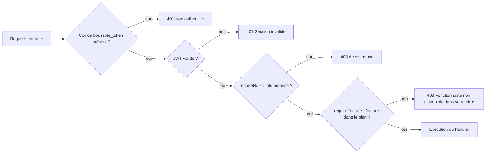
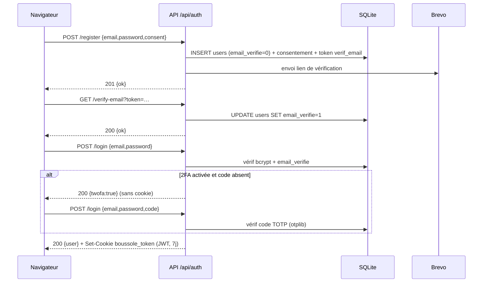
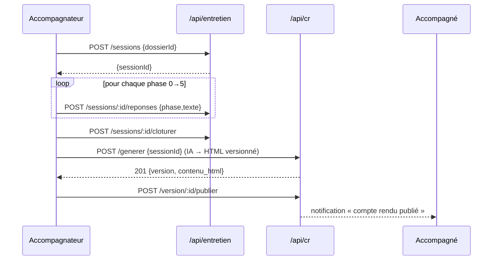

# Documentation API

L'API REST de Boussole expose ses ressources sous le préfixe `/api` (point d'assemblage : `app/api/src/index.ts`). Toutes les ressources métier transitent en JSON ; l'authentification repose sur un cookie `httpOnly` portant un JWT ; les autorisations combinent un rôle (`admin` / `accompagnateur` / `accompagne`) et, pour les fonctionnalités optionnelles, un *feature-gate* dépendant du plan d'abonnement. Cette page documente le contrat général, puis détaille de façon exhaustive les routeurs cœur (`auth`, `dossiers`, `entretien`, `cr`, `actions`, `rdv`, `admin`), le routeur `wiki` (livré) et le routeur d'observabilité, et résume les routeurs transverses. Elle fournit un extrait de spécification OpenAPI pour le routeur d'authentification.

## Objectifs de la page

- Donner aux développeurs et intégrateurs un **contrat d'API stable** : conventions de transport, d'authentification, d'autorisation et de gestion d'erreur.
- Fournir un **catalogue par domaine** suffisamment précis pour appeler chaque endpoint sans relire le code (méthode, chemin, rôle, gate, paramètres, corps, réponse, erreurs).
- Servir de **point d'ancrage à la traçabilité** (exigences ⇄ endpoints) et à la stratégie de tests d'intégration API.
- Poser les **bases d'une formalisation OpenAPI** ultérieure (le projet ne publie pas encore de fichier `openapi.yaml` interactif — voir Hypothèses).

## Contrat général de l'API

### Transport et format

| Aspect | Règle |
| --- | --- |
| Préfixe | Tous les endpoints applicatifs sont sous `/api`. |
| Format des corps | `application/json` (limite `1mb`, via `express.json({ limit: '1mb' })`). |
| Réponses | JSON, sauf `GET /api/rdv/:id/ics` (`text/calendar`, pièce jointe `.ics`), les exports wiki (`.md`/`.docx`/`.pdf`) et l'export PDF de `/api/confort`. |
| Sécurité HTTP | `helmet` (en-têtes de sécurité + CSP côté API), `cors({ origin: true, credentials: true })`, `cookie-parser`, *rate-limiting* (`express-rate-limit`), protection CSRF double-submit. |
| CORS | Origine reflétée + `credentials` activés (le cookie d'auth est envoyé avec les requêtes cross-site autorisées). |

### Durcissement et protection (livré)

L'API applique en production une chaîne de durcissement (voir [Sécurité](security)) :

- **Rate-limiting** (`express-rate-limit`) : un limiteur **global** sur l'ensemble de `/api` et un limiteur **strict** sur `/api/auth` (anti-brute-force / anti-énumération). Désactivable en local/test via `RATE_LIMIT_DISABLED=1`.
- **CSP & en-têtes de durcissement** : `helmet` pose les en-têtes de sécurité et la CSP au niveau API ; la SPA reçoit en plus, posés par nginx sur le document HTML, `Content-Security-Policy`, `X-Frame-Options`, `X-Content-Type-Options` et `Referrer-Policy`.
- **Protection CSRF (double-submit)** : un cookie `csrf_token` **lisible par JavaScript** est posé ; toute **mutation** (POST/PATCH/PUT/DELETE) doit renvoyer sa valeur dans l'en-tête **`X-CSRF-Token`**. La protection est active en production et désactivable en local/test via `CSRF_DISABLED=1`.
- **Sauvegardes** : sauvegardes SQLite « online » horodatées quotidiennes avec rétention (`backups.ts`).

### Authentification & session

L'authentification est **stateless côté serveur** (pas de table de sessions) : un JWT signé (`jsonwebtoken`, secret `JWT_SECRET`) est déposé dans un cookie `boussole_token`.

| Propriété du cookie | Valeur |
| --- | --- |
| Nom | `boussole_token` |
| `httpOnly` | `true` (inaccessible au JavaScript client) |
| `sameSite` | `lax` |
| `secure` | `true` en production (`NODE_ENV=production`), sinon `false` |
| `maxAge` / `expiresIn` | 7 jours |
| Charge utile JWT | `{ id, email, role }` |

Le cookie est posé par `POST /api/auth/login` et effacé par `POST /api/auth/logout`. Aucun en-tête `Authorization: Bearer` n'est attendu ; l'API lit exclusivement le cookie.

**2FA (TOTP) opt-in (livré)** : lorsqu'un compte a activé la double authentification, `POST /api/auth/login` ne pose **pas** le cookie tant que le code à usage unique n'est pas fourni : la première requête (email + mot de passe valides, sans `code`) répond par un **challenge** `{ twofa: true }` sans `Set-Cookie`. Le client rejoue alors `login` en ajoutant le champ `code` (code TOTP à 6 chiffres) pour obtenir le cookie de session. Voir le sous-domaine `/api/auth/2fa/*` ci-dessous.

### Autorisation (rôle + feature-gate)



La chaîne de garde est appliquée par middlewares Express, dans l'ordre : `requireAuth` (vérifie le cookie/JWT, peuple `req.user`), puis `requireRole(...roles)` (403 si le rôle ne correspond pas), puis le cas échéant `requireFeature(key)` (403 si la fonctionnalité n'est pas dans le plan de l'utilisateur). Un utilisateur **sans plan** (`plan_id NULL`) bénéficie de **toutes** les fonctionnalités (niveau maximal par défaut). La propriété des ressources est vérifiée *en plus* dans chaque handler (un accompagnateur ne voit que ses dossiers, etc.), souvent par un **404 délibéré** plutôt qu'un 403 pour ne pas révéler l'existence d'une ressource d'autrui.

### Codes de statut et enveloppe d'erreur

| Code | Signification dans Boussole |
| --- | --- |
| `200 OK` | Succès d'une lecture ou d'une mutation idempotente. |
| `201 Created` | Création d'une ressource (inscription, dossier, action, créneau, version de CR, page de wiki…). |
| `400 Bad Request` | Validation échouée (zod ou contrôle manuel) : données invalides, champ requis manquant. |
| `401 Unauthorized` | Cookie absent (`Non authentifié`) ou JWT invalide/expiré (`Session invalide`). |
| `403 Forbidden` | Rôle non autorisé (`Accès refusé`), feature absente du plan, compte désactivé, email non vérifié, **ou jeton CSRF manquant/invalide sur une mutation en production**. |
| `404 Not Found` | Ressource introuvable **ou** non possédée par l'appelant (masquage volontaire). |
| `409 Conflict` | Conflit d'état : email déjà utilisé, créneau déjà réservé/indisponible. |
| `429 Too Many Requests` | Quota de *rate-limiting* dépassé (limiteur global ou strict sur `/api/auth`). |
| `500 Internal Server Error` | Erreur serveur. Centralisée par un middleware d'erreur terminal qui **respecte le statut porté par l'erreur** et journalise via `reportError()`. Les fonctionnalités IA disposent toutes d'un **repli déterministe**, ce qui rend les 500 rares par conception. |

Enveloppe d'erreur **uniforme** : `{ "error": "message lisible en français" }`, désormais garantie par un **middleware d'erreur centralisé** (livré) qui respecte le statut porté par l'erreur (un 400 de parsing reste un 400) et route toute exception vers `reportError()`. Les réponses de succès n'ont pas d'enveloppe normalisée — chaque endpoint renvoie l'objet métier pertinent (`{ user }`, `{ dossiers }`, `{ ok: true }`, etc.).

> **Note — livré** — Le projet dispose désormais d'un **gestionnaire d'erreur Express global centralisé** : il pose l'enveloppe `{ error }` en JSON, respecte le statut métier (404/400/403…) et journalise via `reportError()` (logs `pino` + table `error_log`). Ce middleware a corrigé un bug détecté par la CI où des 400 de parsing étaient forcés en 500.

## Routeur `auth` — `/api/auth`

Inscription, vérification d'email, connexion par cookie, profil, gestion du mot de passe / de l'email, et double authentification TOTP. `register` n'autorise que les rôles `accompagnateur` et `accompagne` (le rôle `admin` n'est jamais auto-attribuable).

| Méthode | Endpoint | Description | Auth / rôle | Feature | Paramètres | Corps | Réponse | Erreurs |
| --- | --- | --- | --- | --- | --- | --- | --- | --- |
| POST | `/api/auth/register` | Crée un compte, enregistre le consentement (CGU/PC v1.0 + IP), émet un jeton `verif_email` (48 h) envoyé par email. | Public | — | — | `{ email, password(≥8), role(accompagnateur\|accompagne), nom?, prenom?, consent:true }` | `201 { ok, message }` | `400` données invalides ; `409` email déjà pris ; `429` quota |
| GET | `/api/auth/verify-email` | Active le compte (ou confirme un changement d'email si le jeton porte `email_cible`). | Public | — | `?token` | — | `200 { ok, message }` | `400` lien invalide/expiré ; `409` adresse cible déjà prise |
| POST | `/api/auth/login` | Authentifie et pose le cookie `boussole_token`. Met à jour `dernier_acces`. Si la 2FA est activée et `code` absent : renvoie le challenge `{ twofa:true }` **sans cookie**. | Public | — | — | `{ email, password, code? }` | `200 { user }` + Set-Cookie **ou** `200 { twofa:true }` | `400` invalide ; `401` identifiants incorrects / code TOTP invalide ; `403` compte désactivé / email non vérifié ; `429` quota |
| POST | `/api/auth/logout` | Efface le cookie d'authentification. | Public | — | — | — | `200 { ok }` | — |
| GET | `/api/auth/me` | Profil de l'utilisateur courant. | Authentifié | — | — | — | `200 { user }` | `401` |
| PATCH | `/api/auth/me` | Met à jour prénom / nom. | Authentifié | — | — | `{ prenom?, nom? }` | `200 { user }` | `400` ; `401` |
| GET | `/api/auth/me/features` | Liste des clés de fonctionnalités actives pour l'utilisateur (selon son plan). | Authentifié | — | — | — | `200 { features: string[] }` | `401` |
| POST | `/api/auth/change-password` | Change le mot de passe (vérifie l'ancien). | Authentifié | — | — | `{ ancien, nouveau(≥8) }` | `200 { ok }` | `400` mot de passe actuel incorrect / trop court ; `401` |
| POST | `/api/auth/change-email` | Demande un changement d'email avec re-validation (lien envoyé à la nouvelle adresse). | Authentifié | — | — | `{ email }` | `200 { ok, message }` | `400` ; `409` adresse déjà utilisée |
| POST | `/api/auth/request-reset` | Émet un jeton `reset_mdp` (2 h). Réponse **non révélatrice** (toujours 200). | Public | — | — | `{ email }` | `200 { ok, message }` | `400` email invalide ; `429` quota |
| POST | `/api/auth/reset` | Réinitialise le mot de passe via le jeton. | Public | — | — | `{ token, password(≥8) }` | `200 { ok, message }` | `400` lien invalide/expiré ou mot de passe trop court |
| GET | `/api/auth/2fa/status` | Indique si la 2FA TOTP est activée pour le compte. | Authentifié | — | — | — | `200 { enabled }` | `401` |
| POST | `/api/auth/2fa/setup` | Initialise un secret TOTP (`users.totp_secret`) et renvoie l'`otpauth` + un **QR code** à scanner (non encore activé). | Authentifié | — | — | — | `200 { secret, otpauth, qr }` | `401` |
| POST | `/api/auth/2fa/enable` | Active la 2FA après vérification d'un premier code (`totp_enabled=1`). | Authentifié | — | — | `{ code }` | `200 { ok }` | `400` code invalide ; `401` |
| POST | `/api/auth/2fa/disable` | Désactive la 2FA (efface `totp_secret`, `totp_enabled=0`). | Authentifié | — | — | `{ code }` | `200 { ok }` | `400` code invalide ; `401` |



Ce diagramme illustre le parcours nominal d'enrôlement : l'inscription crée un compte inactif (`email_verifie=0`), la vérification l'active, et seule la connexion d'un compte vérifié et actif dépose le cookie de session — précédée, si la 2FA est activée, d'un challenge TOTP. Les jetons (`verif_email`, `reset_mdp`) sont à usage unique et expirent.

## Routeur `dossiers` — `/api/dossiers`

Un **dossier = un parcours de mémoire** (multi-parcours : un accompagné peut en avoir plusieurs). Les routes `/accompagnateurs`, `/start`, `/mine`, `/mine/:id` (côté accompagné) sont déclarées **avant** `/:id` pour la priorité de routage Express.

| Méthode | Endpoint | Description | Auth / rôle | Paramètres | Corps | Réponse | Erreurs |
| --- | --- | --- | --- | --- | --- | --- | --- |
| GET | `/api/dossiers/accompagnateurs` | Accompagnateurs actifs disponibles au démarrage d'un parcours. | `accompagne` | — | — | `200 { accompagnateurs[] }` | `401/403` |
| POST | `/api/dossiers/start` | Démarre un parcours (titre + accompagnateur), crée le lien d'accompagnement, notifie l'accompagnateur (in-app + email). | `accompagne` | — | `{ titre, accompagnateurId }` | `201 { dossierId }` | `400` titre vide / accompagnateur invalide |
| GET | `/api/dossiers/mine` | Liste des parcours de l'accompagné (avec indicateurs : questionnaire, CR publiés, synthèse, RDV). | `accompagne` | — | — | `200 { dossiers[] }` | `401/403` |
| GET | `/api/dossiers/mine/:id` | Détail lecture seule d'un parcours (questionnaire, CR publiés, synthèse, progression de phase, actions, RDV). | `accompagne` | `:id` | — | `200 { dossier, questionnaire, crs, synthese_publiee, phase_max, nb_entretiens, actions, rdvs }` | `404` parcours introuvable |
| GET | `/api/dossiers/:id` | Détail complet côté accompagnateur (sessions + CR par version, actions, RDV, synthèse). | `accompagnateur` (propriétaire) | `:id` | — | `200 { dossier, questionnaire, sessions, synthese_publiee, actions, rdvs }` | `404` |
| GET | `/api/dossiers/:id/synthese` | Données agrégées du parcours pour le rendu de la synthèse à l'écran. | `accompagnateur` (propriétaire) | `:id` | — | `200 { titre, accompagne, entretiens, actions, rdvs, … }` | `404` |
| POST | `/api/dossiers/:id/cloturer` | Clôture le parcours (`statut=cloture`) avec synthèse finale optionnelle, notifie l'accompagné. | `accompagnateur` (propriétaire) | `:id` | `{ synthese? }` | `200 { ok }` | `404` |
| POST | `/api/dossiers/:id/rouvrir` | Rouvre un dossier clôturé (`statut=en_cours`). | `accompagnateur` (propriétaire) | `:id` | — | `200 { ok }` | `404` |

## Routeur `entretien` — `/api/entretien`

Entretien guidé en **6 phases** (référentiel `phases.ts`), réponses par phase, banque de questions de séance, suggestions IA. La propriété est vérifiée par jointure `sessions → dossiers.accompagnateur_id`.

| Méthode | Endpoint | Description | Auth / rôle | Corps / Paramètres | Réponse | Erreurs |
| --- | --- | --- | --- | --- | --- | --- |
| GET | `/api/entretien/phases` | Référentiel des 6 phases. | Authentifié | — | `200 { phases[] }` | `401` |
| GET | `/api/entretien/dossiers` | Dossiers de l'accompagnateur (+ récap questionnaire). | `accompagnateur` | — | `200 { dossiers[] }` | `401/403` |
| GET | `/api/entretien/dashboard` | Tableau de bord : par dossier, nb sessions, actions ouvertes, CR, tags. | `accompagnateur` | — | `200 { dossiers[] }` | `401/403` |
| POST | `/api/entretien/sessions` | Démarre ou reprend la session `en_cours` d'un dossier. | `accompagnateur` (propriétaire) | `{ dossierId }` | `200 { sessionId }` | `404` dossier introuvable |
| GET | `/api/entretien/sessions/:id` | Détail de session : réponses + questions. | `accompagnateur` (propriétaire) | `:id` | `200 { session, reponses, questions }` | `404` |
| POST | `/api/entretien/sessions/:id/reponses` | Enregistre les notes d'une phase (remplace l'existant) et avance `phase_atteinte`. | `accompagnateur` (propriétaire) | `{ phase, texte }` | `200 { ok }` | `404` |
| POST | `/api/entretien/sessions/:id/questions` | Ajoute une question posée (par phase). | `accompagnateur` (propriétaire) | `{ phase, texte }` | `201 { id, phase, texte }` | `400` question vide ; `404` |
| PATCH | `/api/entretien/sessions/:id/questions/:qid` | Mise à jour **partielle** d'une question (texte et/ou réponse). | `accompagnateur` (propriétaire) | `{ texte?, reponse? }` | `200 { ok }` | `400` texte vide ; `404` |
| DELETE | `/api/entretien/sessions/:id/questions/:qid` | Supprime une question. | `accompagnateur` (propriétaire) | `:id`, `:qid` | `200 { ok }` | `404` |
| POST | `/api/entretien/sessions/:id/cloturer` | Clôture la session (`statut=terminee`). | `accompagnateur` (propriétaire) | `:id` | `200 { ok }` | `404` |
| POST | `/api/entretien/suggestions` | Suggestions IA (reformulation + questions d'approfondissement) pour une phase. | `accompagnateur` | `{ phase, transcript }` | `200 { … }` | `500` génération échouée |



Ce flux relie l'entretien au compte rendu : la session capture les notes des 6 phases, sa clôture conditionne la génération du CR par l'IA (première génération seulement : le plan d'action est pré-alimenté), puis la publication rend le document visible à l'accompagné.

## Routeur `cr` — `/api/cr`

Comptes rendus en **HTML versionné** : génération IA, édition (version courante uniquement), publication exclusive (une seule version publiée par session), discussion accompagné↔accompagnateur, notes privées de l'accompagnateur.

| Méthode | Endpoint | Description | Auth / rôle | Corps / Paramètres | Réponse | Erreurs |
| --- | --- | --- | --- | --- | --- | --- |
| POST | `/api/cr/generer` | Génère/régénère le CR (IA → HTML), crée une nouvelle version ; à la 1re génération, alimente le plan d'action. | `accompagnateur` (propriétaire) | `{ sessionId }` | `201 { id, version, contenu_html, source, publie }` | `404` session introuvable |
| GET | `/api/cr/session/:sid` | État du CR : accompagnateur → version courante + historique ; accompagné → version publiée. | Authentifié (propriétaire/lié) | `:sid` | `200 { role, cr, versions }` | `404` |
| GET | `/api/cr/version/:id` | Lecture d'une version précise (historique). | `accompagnateur` (propriétaire) | `:id` | `200 { cr }` | `404` |
| PATCH | `/api/cr/version/:id` | Enregistre le contenu édité (**version courante uniquement** ; `source=edition`). | `accompagnateur` (propriétaire) | `{ contenu_html }` | `200 { ok }` | `400` version d'historique figée ; `404` |
| POST | `/api/cr/version/:id/publier` | Publie une version (dépublie les autres), notifie l'accompagné. | `accompagnateur` (propriétaire) | `:id` | `200 { ok }` | `404` |
| GET | `/api/cr/mine` | CR publiés visibles par l'accompagné (tous parcours). | `accompagne` | — | `200 { comptesRendus[] }` | `401/403` |
| GET | `/api/cr/session/:sid/messages` | Fil de discussion du CR (accompagné seulement si un CR est publié). | Authentifié (propriétaire/lié) | `:sid` | `200 { messages[] }` | `404` discussion indisponible |
| POST | `/api/cr/session/:sid/messages` | Poste un message, notifie l'autre partie. | Authentifié (propriétaire/lié) | `{ texte }` | `201 { id }` | `400` message vide ; `404` |
| GET | `/api/cr/session/:sid/notes` | Notes privées de l'accompagnateur (jamais publiées). | `accompagnateur` (propriétaire) | `:sid` | `200 { contenu_html, maj_le }` | `404` |
| PUT | `/api/cr/session/:sid/notes` | Crée/met à jour les notes privées (upsert). | `accompagnateur` (propriétaire) | `{ contenu_html }` | `200 { ok }` | `404` |

## Routeur `actions` — `/api/actions`

Plan d'action SMART du dossier. Écriture **partagée** : l'accompagnateur **et** l'accompagné du dossier peuvent ajouter/modifier/réordonner. Statuts : `a_faire`, `en_cours`, `fait` ; priorités : `haute`, `moyenne`, `basse`.

| Méthode | Endpoint | Description | Auth / rôle | Corps / Paramètres | Réponse | Erreurs |
| --- | --- | --- | --- | --- | --- | --- |
| GET | `/api/actions/mine` | Actions du dernier dossier de l'accompagné (+ `dossierId`). | `accompagne` | — | `200 { actions[], dossierId }` | `401/403` |
| GET | `/api/actions/` | Actions d'un dossier de l'accompagnateur. | `accompagnateur` (propriétaire) | `?dossierId` | `200 { actions[] }` | `404` |
| POST | `/api/actions/` | Ajoute une action. | Accompagnateur **ou** accompagné du dossier | `{ dossierId, libelle, echeance?, critere?, details?, priorite?, rappel_le? }` | `201 { id }` | `400` libellé requis / priorité invalide ; `404` dossier |
| PATCH | `/api/actions/:id` | Met à jour des champs partiels ; modifier `rappel_le` ré-arme le rappel. | Accompagnateur **ou** accompagné du dossier | `{ libelle?, statut?, priorite?, echeance?, critere?, details?, rappel_le? }` | `200 { ok }` | `400` valeurs invalides ; `404` |
| DELETE | `/api/actions/:id` | Supprime une action. | Accompagnateur **ou** accompagné du dossier | `:id` | `200 { ok }` | `404` |
| POST | `/api/actions/reorder` | Réordonne (glisser-déposer) ; renumérote l'ordre de façon contiguë. | Accompagnateur **ou** accompagné du dossier | `{ dossierId, ids:number[] }` | `200 { ok }` | `400` ordre invalide ; `404` |

## Routeur `rdv` — `/api/rdv`

Créneaux publiés par l'accompagnateur, réservation par l'accompagné (par parcours), demande de RDV à défaut de créneau, export iCalendar.

| Méthode | Endpoint | Description | Auth / rôle | Corps / Paramètres | Réponse | Erreurs |
| --- | --- | --- | --- | --- | --- | --- |
| POST | `/api/rdv/creneaux` | Publie un créneau ; satisfait les demandes en attente et notifie les demandeurs. | `accompagnateur` | `{ debut, fin }` | `201 { id, debut, fin, reserve }` | `400` créneau invalide |
| GET | `/api/rdv/creneaux/mine` | Créneaux de l'accompagnateur (+ réservation éventuelle). | `accompagnateur` | — | `200 { creneaux[] }` | `401/403` |
| DELETE | `/api/rdv/creneaux/:id` | Supprime un créneau non réservé. | `accompagnateur` (propriétaire) | `:id` | `200 { ok }` | `404` introuvable ; `409` déjà réservé |
| GET | `/api/rdv/disponibles` | Créneaux libres et futurs de l'accompagnateur ciblé (par `dossierId` sinon par défaut). | `accompagne` | `?dossierId` | `200 { creneaux[] }` | `401/403` |
| POST | `/api/rdv/reserver` | Réserve un créneau (le rattache au parcours), notifie les deux parties (in-app + email). | `accompagne` | `{ creneauId, dossierId? }` | `200 { ok }` | `409` créneau indisponible / hors parcours |
| POST | `/api/rdv/demander` | Demande un RDV quand aucun créneau n'est disponible (dédupliquée), notifie l'accompagnateur. | `accompagne` | `{ dossierId }` | `200 { ok }` | `404` parcours introuvable |
| GET | `/api/rdv/mine` | RDV de l'accompagné. | `accompagne` | — | `200 { rdv[] }` | `401/403` |
| GET | `/api/rdv/:id/ics` | Export iCalendar (`text/calendar`, pièce jointe). | Authentifié (partie au RDV) | `:id` | `200` corps `.ics` | `403` non partie ; `404` introuvable |

## Routeur `wiki` — `/api/wiki` (livré)

Wiki de documentation du projet : CRUD de pages, recherche plein-texte, **historique de versions** (table `wiki_page_versions`, instantané avant chaque modification + restauration), **partage public opt-in** par lien tokenisé (colonne `wiki_pages.public_token`, route publique en lecture seule, révocable) et **exports** par page (`.md`/`.docx`/`.pdf`) ou global (`export-all`). Les chemins exacts et le découpage des sous-routes restent **à confirmer ligne à ligne** (voir Hypothèses) ; le tableau ci-dessous reflète les capacités livrées.

| Méthode | Endpoint | Description | Auth / rôle | Corps / Paramètres | Réponse | Erreurs |
| --- | --- | --- | --- | --- | --- | --- |
| GET | `/api/wiki/pages` | Liste des pages du wiki (index). | Authentifié | — | `200 { pages[] }` | `401` |
| GET | `/api/wiki/search` | Recherche plein-texte dans les pages. | Authentifié | `?q` | `200 { resultats[] }` | `401` |
| GET | `/api/wiki/page/:slug` | Lecture d'une page par son identifiant. | Authentifié | `:slug` | `200 { page }` | `404` |
| POST | `/api/wiki/page` | Crée une page. | Authentifié (rôle éditeur) | `{ slug, titre, contenu }` | `201 { id }` | `400` ; `409` slug déjà pris |
| PATCH | `/api/wiki/page/:slug` | Modifie une page (instantané dans `wiki_page_versions` avant écriture). | Authentifié (rôle éditeur) | `{ titre?, contenu? }` | `200 { ok }` | `400` ; `404` |
| DELETE | `/api/wiki/page/:slug` | Supprime une page. | Authentifié (rôle éditeur) | `:slug` | `200 { ok }` | `404` |
| GET | `/api/wiki/page/:slug/versions` | Historique des versions d'une page. | Authentifié | `:slug` | `200 { versions[] }` | `404` |
| POST | `/api/wiki/page/:slug/restore` | Restaure une version antérieure. | Authentifié (rôle éditeur) | `{ versionId }` | `200 { ok }` | `400` ; `404` |
| POST | `/api/wiki/page/:slug/share` | Active/révoque le partage public (génère/efface `public_token`). | Authentifié (rôle éditeur) | `{ enable }` | `200 { public_token? }` | `404` |
| GET | `/api/wiki/page/:slug/export.{md,docx,pdf}` | Exporte une page (Markdown / Word / PDF). | Authentifié | `:slug` | `200` fichier | `404` |
| GET | `/api/wiki/export-all.{md,docx,pdf}` | Export **global** de tout le wiki (Markdown / Word / PDF). | Authentifié | — | `200` fichier | `401` |
| GET | `/api/wiki/public/:token` | **Route publique** : lecture seule d'une page partagée via son `public_token`. | Public | `:token` | `200 { page }` | `404` jeton invalide / révoqué |

La page publique `/wiki/p/:token` de la SPA consomme `GET /api/wiki/public/:token` (lecture seule, sans authentification). Le partage est **révocable** : révoquer efface le `public_token` et rend le lien caduc (404).

## Routeur `admin` — `/api/admin`

Console d'administration : comptes, fonctionnalités/plans (CRUD + duplication), console RGPD (effacements, rétention), rattachement de liens. **Tous** les endpoints sont `requireRole('admin')`.

| Méthode | Endpoint | Description | Corps / Paramètres | Réponse | Erreurs |
| --- | --- | --- | --- | --- | --- |
| GET | `/api/admin/users` | Liste des comptes (+ plan). | — | `200 { users[] }` | `401/403` |
| GET | `/api/admin/features` | Registre des 38 fonctionnalités + toutes les clés. | — | `200 { features[], all[] }` | — |
| GET | `/api/admin/plans` | Plans (+ nb d'utilisateurs rattachés). | — | `200 { plans[] }` | — |
| POST | `/api/admin/plans` | Crée un plan (features assainies). | `{ nom, description?, features[] }` | `201 { id }` | `400` nom requis |
| PATCH | `/api/admin/plans/:id` | Modifie un plan. | `{ nom?, description?, features? }` | `200 { ok }` | `400` nom vide ; `404` |
| POST | `/api/admin/plans/:id/duplication` | Duplique un plan (« (copie) »). | `:id` | `201 { id }` | `404` |
| DELETE | `/api/admin/plans/:id` | Supprime un plan (les utilisateurs repassent au niveau max). | `:id` | `200 { ok }` | `404` |
| GET | `/api/admin/effacements` | Demandes d'effacement RGPD en attente. | — | `200 { demandes[] }` | — |
| POST | `/api/admin/effacements/:id` | Traite une demande (`anonymiser` \| `supprimer`) ; trace `action` et `traite_le`. | `{ action }` | `200 { ok, action }` | `400` action invalide ; `404` |
| POST | `/api/admin/rgpd/:userId` | Action RGPD directe sur un compte. | `{ action }` | `200 { ok, action }` | `400` (soi-même / action invalide) ; `404` |
| GET | `/api/admin/retention` | Comptes éligibles à l'anonymisation automatique. | — | `200 { months, auto, eligibles[] }` | — |
| POST | `/api/admin/retention/appliquer` | Applique la rétention maintenant. | — | `200 { ok, anonymises }` | — |
| POST | `/api/admin/users` | Crée un compte (lien d'activation envoyé). | `{ email, role, nom?, prenom? }` | `201 { id }` | `400` invalide ; `409` email déjà pris |
| PATCH | `/api/admin/users/:id` | Active/désactive, change le rôle ou le plan. | `{ actif?, role?, plan_id? }` | `200 { ok }` | `400` (soi-même / plan introuvable) ; `404` |
| POST | `/api/admin/lien` | Rattache un accompagné à un accompagnateur. | `{ accompagnateurId, accompagneId }` | `200 { ok }` | `400` sélection invalide |

> **Note** — Les colonnes `demandes_effacement.action` et `demandes_effacement.traite_le` sont créées par `ALTER` puis par le `CREATE` : un bug d'ordre (anonymisation RGPD en 500 sur base neuve) a été détecté par la CI et corrigé.

## Observabilité — `/api/metrics` & journalisation (livré)

L'observabilité est **auto-hébergée, sans tiers** : logs structurés `pino`, table `error_log`, point unique `reportError()` (adaptateur Sentry brançable plus tard) et middleware d'erreur centralisé.

| Méthode | Endpoint | Description | Auth / rôle | Réponse | Erreurs |
| --- | --- | --- | --- | --- | --- |
| GET | `/api/metrics` | Métriques d'exploitation : uptime, compteurs de requêtes 2xx/3xx/4xx/5xx, nombre d'erreurs, comptes de tables. | `admin` | `200 { uptime, requests:{…}, errors, tables:{…} }` | `401/403` |

## Routeurs transverses (résumé)

Ces routeurs couvrent les fonctionnalités IA, relationnelles et de pilotage. Chacun est protégé par un **feature-gate** (constaté dans le code) en plus du rôle. Toutes les fonctionnalités IA possèdent un **repli déterministe** : en cas d'indisponibilité de l'IA, l'endpoint dégrade sans renvoyer 500.

| Routeur | Préfixe | Périmètre | Rôle principal | Feature(s)-gate |
| --- | --- | --- | --- | --- |
| questionnaire | `/api/questionnaire` | Questionnaire initial assisté (next / save), récap IA. | accompagné | `questionnaire` *(à confirmer côté code)* |
| autoeval | `/api/autoeval` | Grille d'auto-évaluation, assistance IA, validation. | accompagnateur | `auto_evaluation` *(à confirmer)* |
| synthese | `/api/synthese` | Synthèse de parcours (HTML versionné, publication, discussion). | accompagnateur / accompagné | `synthese` *(à confirmer)* |
| miroir | `/api/miroir` | Miroir réflexif de posture (analyse, application). | accompagnateur | `miroir` |
| relationnel | `/api/relationnel` | Météo intérieure, roue des émotions, micro-journal. | accompagné | `meteo` / `roue_emotions` / `journal` *(à confirmer)* |
| emergence | `/api/emergence` | Banque de questions, fil rouge, moments-clés. | mixte | `banque_questions` / `fil_rouge` / `moments_cles` *(à confirmer)* |
| pilotage | `/api/pilotage` | Signaux faibles, tableau d'impact, digest hebdo. | accompagnateur | `signaux_faibles`, `tableau_impact`, `digest_email` |
| reflexivite | `/api/reflexivite` | Bilan de pratique, coach de posture, débriefing, replay annoté. | accompagnateur | `bilan_pratique`, `coach_posture`, `debriefing`, `replay_annote` |
| collab | `/api/collab` | Mutualisation, problématisation, résumé « où j'en suis ». | mixte | `mutualisation`, `problematisation`, `resume_parcours` |
| viz | `/api/viz` | Nuage de thèmes, catalogue/roue des émotions. | mixte | `nuage_themes`, `roue_emotions` |
| confort | `/api/confort` | Visio, PWA & push (clé VAPID, abonnement, test), export PDF. | mixte | `visio`, `pwa_push`, `export_pdf` |
| ethique | `/api/ethique` | Attestation de fin (les actions RGPD admin sont dans `/api/admin`). | mixte | `attestation` |
| adoption | `/api/adoption` | Reformulation FALC (facile à lire et à comprendre). | mixte | `falc` |
| transparence | `/api/transparence` | Transparence RGPD : données du dossier, demande d'effacement. | accompagné | `transparence` |
| tags | `/api/tags` | Étiquettes sur les dossiers (organisation accompagnateur). | accompagnateur | — *(non gardé par feature dans le code constaté)* |
| notifications | `/api/notifications` | Notifications in-app ; consulter déclenche le balayage des rappels d'action. | authentifié | — |

> **Hypothèse — confiance : moyenne** — Les feature-gates marqués *(à confirmer)* concernent des routeurs non relus ligne à ligne dans le cadre de cette page (`questionnaire`, `autoeval`, `synthese`, `relationnel`, `emergence`). L'inventaire `requireFeature` du code confirme en revanche : `miroir`, `mutualisation`, `problematisation`, `resume_parcours`, `visio`, `pwa_push`, `export_pdf`, `attestation`, `falc`, `nuage_themes`, `roue_emotions`, `signaux_faibles`, `tableau_impact`, `digest_email`, `bilan_pratique`, `coach_posture`, `debriefing`, `replay_annote`, `transparence`.

## Endpoints de service (non préfixés métier)

| Méthode | Endpoint | Description | Auth | Réponse |
| --- | --- | --- | --- | --- |
| GET | `/api/health` | Santé du service (checks de déploiement). | Public | `{ status:'ok', service, version, tables, time }` |
| GET | `/api/context` | Contexte public (page d'accueil / aide) : nom, cadre, objectif, public cible. | Public | `{ nom, cadre, objectif, publicCible[] }` |
| GET | `/api/metrics` | Métriques d'exploitation (voir Observabilité). | `admin` | `{ uptime, requests, errors, tables }` |

`/api/health` interroge `sqlite_master` pour compter les tables : c'est à la fois une sonde de vie **et** de connectivité base. Il est destiné aux sondes Docker et à la façade **Caddy** de production.

## En-tête CSRF requis sur les mutations (production)

En production, la protection CSRF **double-submit** est active : toute requête de **mutation** (POST/PATCH/PUT/DELETE) doit porter l'en-tête **`X-CSRF-Token`** dont la valeur reproduit le cookie `csrf_token` (lisible par JavaScript). Une mutation sans jeton valide est rejetée (403). Les requêtes de lecture (GET) ne sont pas concernées. Cette protection est désactivée en local/test via `CSRF_DISABLED=1` (et activée en production). De même, le *rate-limiting* est désactivable via `RATE_LIMIT_DISABLED=1`.

## Extrait de spécification OpenAPI (routeur `auth`)

Extrait OpenAPI 3.0 documentant trois opérations représentatives du routeur d'authentification (inscription, connexion, profil). Il sert de **gabarit** pour une future spécification complète (un fichier `openapi.yaml` interactif / Swagger UI n'est **pas encore livré** — voir Recommandations).

```yaml
openapi: 3.0.3
info:
  title: Boussole API — Authentification
  version: 0.1.0
  description: Sous-ensemble auth de l'API Boussole (cookie httpOnly JWT, 2FA TOTP opt-in).
servers:
  - url: https://boussole.elafrit.com/api
components:
  securitySchemes:
    cookieAuth:
      type: apiKey
      in: cookie
      name: boussole_token
    csrfToken:
      type: apiKey
      in: header
      name: X-CSRF-Token
  schemas:
    Error:
      type: object
      properties:
        error: { type: string }
      required: [error]
    User:
      type: object
      properties:
        id: { type: integer }
        email: { type: string, format: email }
        role: { type: string, enum: [admin, accompagnateur, accompagne] }
        nom: { type: string, nullable: true }
        prenom: { type: string, nullable: true }
paths:
  /auth/register:
    post:
      summary: Inscription d'un nouveau compte
      requestBody:
        required: true
        content:
          application/json:
            schema:
              type: object
              required: [email, password, role, consent]
              properties:
                email: { type: string, format: email }
                password: { type: string, minLength: 8 }
                role: { type: string, enum: [accompagnateur, accompagne] }
                nom: { type: string }
                prenom: { type: string }
                consent: { type: boolean, enum: [true] }
      responses:
        '201': { description: Compte créé, email de vérification envoyé }
        '400': { description: Données invalides, content: { application/json: { schema: { $ref: '#/components/schemas/Error' } } } }
        '409': { description: Email déjà utilisé }
        '429': { description: Quota de requêtes dépassé (rate-limiting) }
  /auth/login:
    post:
      summary: Connexion (pose le cookie de session ; challenge 2FA si activée)
      requestBody:
        required: true
        content:
          application/json:
            schema:
              type: object
              required: [email, password]
              properties:
                email: { type: string, format: email }
                password: { type: string }
                code: { type: string, description: Code TOTP à 6 chiffres si la 2FA est activée }
      responses:
        '200':
          description: Authentifié (Set-Cookie boussole_token) — ou challenge { twofa:true } sans cookie si la 2FA est activée et le code absent
          headers:
            Set-Cookie: { schema: { type: string }, description: boussole_token (JWT, httpOnly, 7j) }
          content:
            application/json:
              schema:
                oneOf:
                  - type: object
                    properties:
                      user: { $ref: '#/components/schemas/User' }
                  - type: object
                    properties:
                      twofa: { type: boolean, enum: [true] }
        '401': { description: Identifiants incorrects ou code TOTP invalide }
        '403': { description: Compte désactivé ou email non vérifié }
        '429': { description: Quota de requêtes dépassé (rate-limiting) }
  /auth/me:
    get:
      summary: Profil de l'utilisateur courant
      security:
        - cookieAuth: []
      responses:
        '200':
          description: Profil
          content:
            application/json:
              schema:
                type: object
                properties:
                  user: { $ref: '#/components/schemas/User' }
        '401': { description: Non authentifié }
```

## Hypothèses

> **Hypothèse — confiance : moyenne** — Les chemins exacts du routeur `wiki` (`/pages`, `/page/:slug`, `/search`, `/share`, `/versions`, `/restore`, `export.*`, `export-all.*`, `public/:token`) sont reconstitués à partir des capacités livrées (CRUD, recherche, partage tokenisé, historique, export par page et global, route publique). À valider ligne à ligne dans `app/api/src/routes/wiki*` avant d'en faire un contrat opposable. Les capacités elles-mêmes (partage public révocable via `wiki_pages.public_token`, versions via `wiki_page_versions`, export global) sont **livrées**.

> **Hypothèse — confiance : élevée** — Aucun fichier `openapi.yaml` / `swagger.json` interactif n'est publié dans le dépôt à ce jour : l'extrait OpenAPI ci-dessus est **rédigé pour cette documentation**, non généré depuis le code. *OpenAPI/Swagger interactif : non encore livré.*

> **Hypothèse — confiance : moyenne** — Les feature-gates des routeurs non relus en détail sont déduits par cohérence avec le registre des 38 fonctionnalités ; à valider endpoint par endpoint avant d'en faire un contrat opposable.

## Risques & points d'attention

| Risque | Portée | Mitigation |
| --- | --- | --- |
| **Dérive doc/code** : la table de routes est tenue à la main et peut diverger du code. | Moyenne | Générer la spec OpenAPI depuis le code (annotations zod → schéma) et intégrer un test de non-régression de contrat. La **CI** (GitHub Actions) rejoue déjà les tests d'intégration API + UI à chaque push sur base fraîche. |
| **Absence de versionnement d'API** (`/api` sans `/v1`). | Faible | Introduire un préfixe de version avant tout client tiers ; documenter la politique de dépréciation. |
| **404 polysémique** (« introuvable » vs « non autorisé »). | Faible | Comportement **volontaire** (anti-énumération) ; à documenter pour éviter les faux diagnostics côté intégrateur. |
| **Oubli de l'en-tête `X-CSRF-Token`** sur une mutation en production → 403. | Moyenne | Le client SPA injecte automatiquement le jeton ; documenter ce prérequis pour tout intégrateur externe. Désactivable en test via `CSRF_DISABLED=1`. |
| **Limite de corps à 1 Mo** : les CR/synthèses/pages wiki HTML volumineux pourraient être rejetés. | Faible | Surveiller la taille des contenus TipTap ; ajuster la limite si besoin. |
| **Partage public wiki** : un lien tokenisé fuité expose la page en lecture seule. | Faible | Jeton non devinable, **révocable** (efface `public_token`) ; n'activer que sur des pages non sensibles. |

## Recommandations

1. **Formaliser un OpenAPI 3.0 complet** pour l'ensemble des routeurs (étendre l'extrait `auth`), puis publier un **Swagger UI interactif** et brancher un test de contrat dans la batterie API. *(prévu — non encore livré)*
2. **Auditer la couverture RGAA** de la SPA exposant l'API. *(prévu — non encore livré)*
3. **Documenter la convention 404-vs-403** comme décision d'architecture (anti-énumération) dans les [ADR](adr).
4. **Recompter et figer l'inventaire exact** des endpoints par routeur dans la [matrice de traçabilité](traceability-matrix) pour lier chaque endpoint à une exigence et à un cas de test (en intégrant les routeurs `wiki` et `metrics`).
5. **Préparer un préfixe de version** (`/api/v1`) avant toute ouverture à un client externe.
6. **Préparer l'intégration paiement** (jalonnée ultérieurement) sans impacter le contrat actuel. *(préparé — non encore livré)*

> **Statut livré** : middleware d'erreur global centralisé, *rate-limiting*, CSP / en-têtes de durcissement, 2FA TOTP opt-in, protection CSRF double-submit, sauvegardes SQLite, observabilité (`pino`, `error_log`, `reportError()`, `/api/metrics`), wiki avancé (versions, partage public tokenisé, export global) et **intégration continue** (GitHub Actions, base fraîche, repli IA déterministe). Les recommandations 1, 2 et 6 restent à venir.

## Pages liées

- [Architecture technique](technical-architecture) — stack, découpage monorepo, middlewares.
- [Architecture des données](data-architecture) — tables référencées par les endpoints (dont `wiki_pages` + `public_token`, `wiki_page_versions`, `error_log`, `users` + `totp_secret`/`totp_enabled`, `demandes_effacement` + `action`/`traite_le`).
- [Sécurité](security) — auth par cookie JWT, 2FA TOTP, CSRF, rate-limiting, CSP/en-têtes, RGPD, sauvegardes.
- [Spécifications fonctionnelles](functional-specifications) — fonctionnalités exposées par l'API.
- [Stratégie de tests](testing-strategy) — tests d'intégration API et E2E (Playwright) couvrant ces endpoints, plus la CI.
- [Matrice de traçabilité](traceability-matrix) — liaison exigences ⇄ endpoints ⇄ tests.
- [Guide administrateur](admin-guide) — usage de la console `/api/admin` (plans, RGPD) et des métriques `/api/metrics`.
- [Journal des décisions (ADR)](adr) — choix structurants (cookie JWT, feature-gating, 404 anti-énumération, CSRF double-submit).
- [Glossaire](glossary) — rôles, dossier/parcours, session, feature-gate, 2FA, CSRF.
