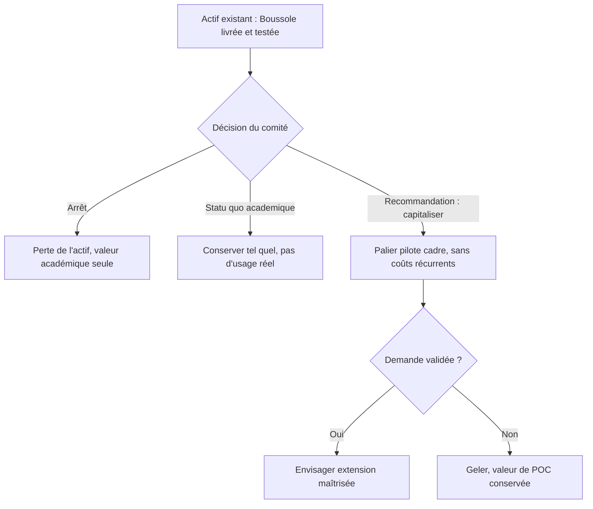
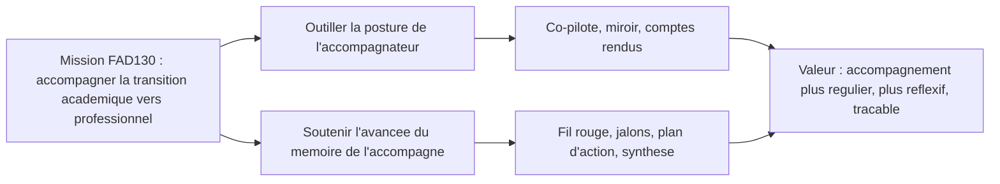
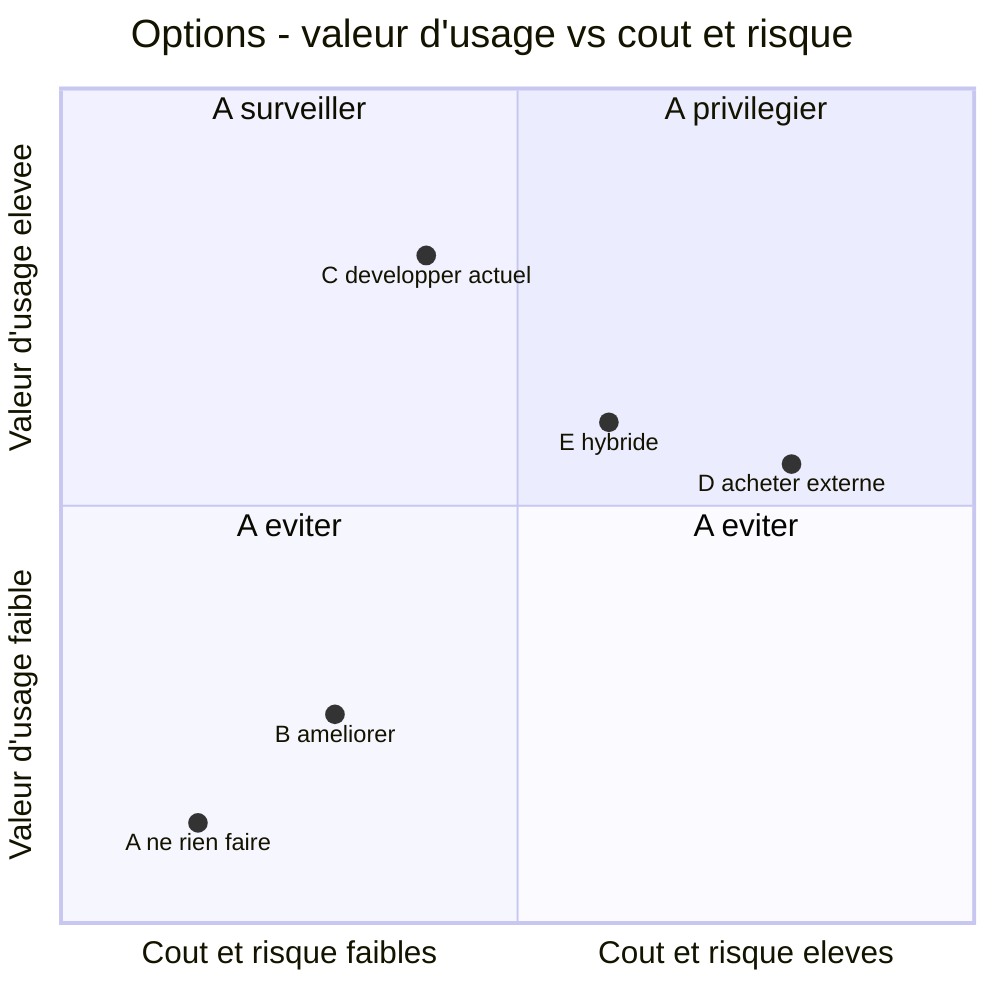

# Business case — Boussole

> Catégorie : Cadrage & stratégie · Slug : `business-case`

Ce business case s'adresse à un **comité d'investissement fictif** appelé à arbitrer la poursuite, la consolidation ou l'arrêt de la plateforme **Boussole**, un outil d'accompagnement à la rédaction de mémoires professionnels qui assiste à la fois l'accompagnateur (posture, questionnement, comptes rendus, plan d'action) et l'accompagné (avancée de son mémoire). Le produit est **déjà construit et opérationnel** (38 fonctionnalités, 145 endpoints, 33 tables, batterie de tests 959/961 verte) dans un cadre **académique solo** (Cnam, UE FAD130, auteur unique Mohamed EL AFRIT). Le présent document transpose ce livrable dans une grille de lecture d'investissement : il distingue rigoureusement ce qui est **factuel** (codé, livré) de ce qui relève d'**hypothèses chiffrées** explicitement marquées, et conclut sur une recommandation conditionnée.

> **Hypothèse — confiance : élevée** — Il n'existe à ce jour **aucun budget réel, aucun revenu, aucun client payant ni aucune équipe** : Boussole est un projet pédagogique individuel. Tous les montants, gains et ratios financiers ci-dessous sont des **estimations de cadrage** destinées à démontrer une méthode d'analyse de la valeur, *non* des données comptables. Ils doivent être lus comme un exercice de modélisation, pas comme un prévisionnel engageant.

## Objectifs de la page

- Fournir au comité un **résumé de décision** actionnable (recommandation, justification, priorité, conditions, décision attendue).
- Établir l'**analyse stratégique** : problème, opportunité, alignement, bénéfices, différenciation.
- Décliner l'**analyse de la valeur** sur six axes (utilisateur, métier, opérationnel, financier, technologique, organisationnel).
- Comparer les **options d'investissement** (ne rien faire / améliorer / développer la solution actuelle / acheter / hybride) sur un même barème.
- Poser une **estimation économique** avec hypothèses explicites, ROI, délai de retour et analyse de sensibilité.
- Tracer clairement la frontière entre le **réalisé**, le **partiel**, le **prévu** et l'**absent**.

---

## 1. Résumé de décision

| Rubrique | Position |
|---|---|
| **Recommandation** | **Capitaliser** sur l'actif logiciel existant (option « Développer la solution actuelle ») et le faire passer du statut de livrable académique à celui de **preuve de concept transférable**, sans engager de coûts d'exploitation marchande tant que la demande n'est pas validée. |
| **Justification** | L'essentiel de l'investissement de construction est **déjà consenti et de qualité démontrable** (couverture de test, architecture documentée, repli déterministe systématique sur l'IA). Le coût marginal pour atteindre un palier « pilote réel » est faible au regard de la valeur d'usage potentielle. |
| **Priorité** | **Moyenne à élevée** sur l'horizon académique (échéances oral 12/06, dépôt 19/06), **conditionnelle** au-delà : toute extension marchande dépend d'une validation de besoin externe. |
| **Conditions** | (1) Aucun engagement de coûts récurrents avant un pilote cadré ; (2) maintien de la conformité RGPD déjà outillée ; (3) préservation de la « vitrine » de démonstration ; (4) décision de scope figée avant le dépôt. |
| **Décision attendue du comité** | Valider la **poursuite en l'état + un palier pilote optionnel** plutôt qu'un arrêt ou une réécriture. Arbitrer le périmètre du palier pilote (cf. §5). |
| **Montant à engager (palier pilote)** | *Hypothèse — confiance : faible* — de l'ordre de **2 000 à 5 000 € équivalent-effort** sur 3 à 6 mois (cf. §6), majoritairement du temps, sans CAPEX matériel. |

Ce schéma de décision résume les branches ouvertes au comité : la recommandation (branche « capitaliser ») cherche à préserver la valeur déjà créée tout en plaçant un point de contrôle (validation de demande) **avant** tout engagement de dépenses récurrentes. C'est une stratégie d'option réelle : on paie un petit coût de pilote pour conserver le droit, sans obligation, d'investir davantage ensuite.

---

## 2. Analyse stratégique

### 2.1 Pourquoi — le problème

L'accompagnement à la rédaction de mémoires professionnels (étudiants/alternants de master) repose aujourd'hui sur des pratiques **artisanales et hétérogènes** : l'accompagnateur improvise souvent son questionnement, peine à tenir une posture réflexive constante, et produit des comptes rendus manuels chronophages et inégaux. Côté accompagné, le parcours de mémoire est **long, anxiogène et faiblement instrumenté** : peu de visibilité sur l'avancement, ruptures de suivi, perte du fil conducteur.

| Symptôme | Conséquence | Public touché |
|---|---|---|
| Questionnement non structuré | Entretiens à faible valeur, redondants | Accompagnateur |
| Posture difficile à objectiver | Dérive vers le conseil prescriptif | Accompagnateur |
| Comptes rendus manuels | Temps perdu, traçabilité faible | Accompagnateur |
| Pas de fil rouge ni de jalons | Décrochage, anxiété, abandon | Accompagné |
| Suivi cloisonné par outils disparates | Perte d'information entre séances | Les deux |

### 2.2 L'opportunité

Boussole adresse ce problème par un **parcours outillé de bout en bout** : entretien guidé en 6 phases avec co-pilote IA, miroir réflexif de posture, comptes rendus générés et versionnés, plan d'action SMART, synthèse de parcours, plus une couche relationnelle (météo intérieure, roue des émotions, micro-journal) et de pilotage (signaux faibles, digest). L'**IA Claude avec repli déterministe systématique** est le différenciateur central : l'outil reste fonctionnel même hors-ligne IA, ce qui lève l'objection de fiabilité habituelle des produits « IA-dépendants ».

### 2.3 Alignement

Ce diagramme relie la mission de l'UE FAD130 aux fonctionnalités livrées : chaque axe stratégique (posture / avancée du mémoire) trouve un répondant fonctionnel concret déjà codé, ce qui démontre l'alignement entre l'intention pédagogique et la réalisation logicielle.

### 2.4 Bénéfices et différenciation

| Bénéficiaire | Bénéfice attendu | Statut |
|---|---|---|
| Organisation (école/Cnam) | Standardisation de la qualité d'accompagnement, traçabilité, conformité RGPD native | Réalisé (outillé) |
| Accompagnateur | Gain de temps sur les CR, posture soutenue, pilotage des décrochages | Réalisé |
| Accompagné | Parcours lisible, jalonné, dédramatisé ; multi-parcours | Réalisé |
| Différenciation marché | Repli déterministe systématique + feature-gating par plan + RGPD by design | Réalisé |

> **Hypothèse — confiance : moyenne** — La différenciation « repli déterministe » est techniquement réelle et vérifiable dans le code ; son **avantage concurrentiel marchand** reste à confirmer par une étude d'opportunité (voir [Étude d'opportunité](opportunity-study)).

---

## 3. Analyse de la valeur

| Axe de valeur | Description | Preuve dans le produit | Statut |
|---|---|---|---|
| **Utilisateur** | Réduction de la charge cognitive et émotionnelle du parcours mémoire ; accompagnement régulier | Couche relationnelle (météo, roue, journal), fil rouge, FALC, onboarding | Réalisé |
| **Métier** | Industrialisation de la posture d'accompagnement et du compte rendu | 6 phases, co-pilote, miroir, CR versionnés, synthèse | Réalisé |
| **Opérationnelle** | Mono-instance simple à exploiter, peu d'incidents | SQLite mono-fichier, Docker, pas d'ORM, repli IA = pas de 500 | Réalisé |
| **Financière** | Coût marginal d'usage faible (pas de serveur lourd, IA en option) | Stack légère, hébergement modeste | Partiel (non chiffré réellement) |
| **Technologique** | Socle moderne, testé, documenté, réutilisable | TS de bout en bout, 959/961 tests, ISTQB/IEEE 829 | Réalisé |
| **Organisationnelle** | Gating par plan d'abonnement, rôles, admin RGPD | 3 rôles, `requireFeature`, plans Découverte/Essentiel/Pro | Réalisé |

La valeur la plus tangible et la **moins risquée** est technologique et métier : l'actif est construit, testé et documenté. La valeur financière est la **plus incertaine** car elle dépend d'hypothèses de demande non encore validées par un marché réel.

---

## 4. Options étudiées

| Option | Avantages | Inconvénients | Coût (hyp.) | Risque | Reco |
|---|---|---|---|---|---|
| **A. Ne rien faire** | Aucun coût additionnel | Actif gelé, valeur d'usage nulle hors note académique, obsolescence progressive | ~0 € | Faible (mais valeur perdue) | Non |
| **B. Améliorer l'existant (sans l'utiliser)** | Polit le livrable académique | Effort sans bénéfice d'usage, sur-ingénierie | Faible | Faible | Partiel |
| **C. Développer la solution actuelle (palier pilote)** | Capitalise l'investissement déjà fait, coût marginal faible, validation de demande possible | Demande un cadrage et un peu d'effort ; dépend d'un pilote réel | Faible à moyen | Moyen | **Oui** |
| **D. Acheter une solution externe** | Délègue la maintenance | Aucun outil marché ne couple posture + IA à repli + RGPD natif ; coût de licence récurrent ; perte du différenciateur | Moyen à élevé | Élevé | Non |
| **E. Hybride (garder le socle, sous-traiter une brique)** | Concentre l'effort sur le cœur métier | Complexité d'intégration, dépendance fournisseur | Moyen | Moyen | Repli si C bloque |

Ce graphique positionne les options sur deux axes décisionnels (valeur d'usage attendue contre coût/risque). L'option **C** se détache dans le quadrant favorable : forte valeur d'usage pour un coût et un risque contenus, parce qu'elle réutilise un actif déjà payé. L'achat externe (**D**) cumule coût élevé et perte du différenciateur, ce qui le disqualifie.

---

## 5. Périmètre du palier pilote (option C)

| Bloc | Contenu | Statut actuel | Effort pilote |
|---|---|---|---|
| Socle métier | Questionnaire, entretien, CR, plan d'action, synthèse, RDV, multi-parcours | **Réalisé** | Nul (déjà livré) |
| Conformité | RGPD, consentement versionné, journal d'accès, rétention | **Réalisé** | Faible (revue) |
| Mise en service pilote | Déploiement prod Traefik/TLS, comptes réels, sauvegarde SQLite | **Partiel** (compose local + prod décrits) | Moyen |
| Mesure de la valeur | Tableau d'impact, signaux faibles, digest | **Réalisé** (fonctionnel) | Faible (instrumenter le suivi pilote) |
| Validation de demande | Recrutement de 2–3 binômes réels accompagnateur/accompagné | **Absent** | Moyen (hors code) |

> **Hypothèse — confiance : faible** — Le pilote suppose de trouver **2 à 3 binômes réels** acceptant d'utiliser Boussole sur un cycle de mémoire. Cette disponibilité n'est pas garantie et constitue le principal aléa de l'option C.

---

## 6. Estimation économique

Toutes les valeurs ci-dessous sont des **hypothèses de cadrage** (exercice de modélisation), valorisées en **équivalent-effort** faute de comptabilité réelle. Taux journalier de référence retenu pour la conversion : **400 €/jour** (coût d'opportunité d'un profil consultant/enseignant, *hypothèse — confiance : faible*).

### 6.1 Coûts (hypothèses)

| Poste | Hypothèse | Base de calcul | Montant annuel (hyp.) |
|---|---|---|---|
| Développement résiduel (pilote) | 5 à 10 j d'effort de mise en service | 7,5 j × 400 € | **3 000 €** (one-shot) |
| Hébergement | 1 VPS modeste + domaine + TLS | ~15 €/mois | **180 €/an** |
| Maintenance | Correctifs + montée de version dépendances | 3 j/an × 400 € | **1 200 €/an** |
| Support utilisateur | 2–3 binômes pilotes, suivi léger | 2 j/an × 400 € | **800 €/an** |
| Formation/onboarding | Outillé (tour guidé, FALC) ⇒ effort marginal | 1 j × 400 € | **400 €/an** |
| Coût IA (API Anthropic) | Volume pilote faible, repli déterministe limite la dépendance | usage pilote | **~120 €/an** *(hyp. faible)* |
| **Total récurrent annuel** | | | **~2 700 €/an** |
| **Investissement initial pilote** | | | **~3 000 € (one-shot)** |

### 6.2 Gains (hypothèses)

| Source de gain | Hypothèse | Valorisation annuelle (hyp.) |
|---|---|---|
| Temps accompagnateur économisé sur les CR | ~1 h gagnée / entretien × ~40 entretiens/an × 50 €/h | **2 000 €** |
| Réduction du décrochage (signaux faibles) | Évite 1 abandon/an évitable, valeur pédagogique | **non monétisé** *(hyp. faible)* |
| Qualité/traçabilité (valeur intangible) | Standardisation, conformité | **non monétisé** |
| Réutilisabilité du socle (autres contextes) | Brique réemployable | **non monétisé** |

> **Hypothèse — confiance : faible** — Seul le gain de temps accompagnateur est monétisé (~2 000 €/an). Les autres bénéfices sont réels mais **non monétisés** faute de données ; ils renforcent le dossier sans gonfler artificiellement le ROI.

### 6.3 ROI et délai de retour (hypothèses)

| Indicateur | Calcul (hyp.) | Résultat |
|---|---|---|
| Coût total an 1 | 3 000 € (initial) + 2 700 € (récurrent) | **5 700 €** |
| Gain monétisé an 1 | 2 000 € | **2 000 €** |
| Solde an 1 | 2 000 − 5 700 | **−3 700 €** |
| Solde an 2 (régime établi) | 2 000 − 2 700 | **−700 €/an** |
| **ROI strictement monétisé** | Négatif sur 2 ans | **Non rentable en cash seul** |
| **Délai de retour** | > 3 ans si seul le temps CR est compté | **Non atteint sur l'horizon** |

> **Hypothèse — confiance : élevée** — Sur le **seul** gain monétisé (temps CR), Boussole **n'est pas rentable** à l'échelle d'un pilote de 2–3 binômes : les volumes sont trop faibles. La justification de l'investissement repose donc **principalement sur la valeur académique, pédagogique et de réutilisabilité**, pas sur un retour cash. Le comité doit décider en connaissance de cause : c'est un investissement de **capacité et d'apprentissage**, pas de rendement.

### 6.4 Analyse de sensibilité simple

| Variable | −50 % | Hypothèse centrale | +100 % | Effet sur le solde an 2 |
|---|---|---|---|---|
| Nombre d'entretiens/an | 20 | 40 | 80 | Gain 1 000 → 2 000 → 4 000 € ⇒ bascule à l'équilibre vers **~55 entretiens/an** |
| Coût IA | 60 € | 120 € | 240 € | Impact mineur (repli amortit) |
| Effort maintenance | 1,5 j | 3 j | 6 j | Sensible : double le poste dominant récurrent |
| Taux journalier | 200 € | 400 € | 800 € | Amplifie symétriquement coûts et gains |

L'analyse montre que le **levier décisif est le volume d'usage** : l'équilibre monétaire n'est atteint qu'au-delà d'environ 55 entretiens/an (*hypothèse — confiance : faible*), ce qui dépasse le cadre d'un pilote à 2–3 binômes. La maintenance est le poste récurrent le plus sensible. Ces deux constats orientent la stratégie : ne pas engager de récurrent avant d'avoir un volume crédible.

---

## 7. Conclusion

Boussole est un **actif logiciel mûr, testé et documenté**, dont le coût de construction est déjà consenti. Sur une grille strictement financière à petite échelle, il **n'est pas rentable** ; sa valeur réside dans l'**usage, la conformité, la réutilisabilité et l'apprentissage**. La décision rationnelle pour le comité n'est donc **ni l'arrêt** (qui détruit un actif de qualité) **ni la réécriture/achat** (qui paie deux fois ou perd le différenciateur), mais la **capitalisation maîtrisée** : conserver et valoriser l'existant, ouvrir une **option réelle** via un petit palier pilote, et ne déclencher tout coût récurrent qu'**après** validation d'un volume d'usage suffisant.

---

## Hypothèses

> **Hypothèse — confiance : élevée** — Aucune donnée comptable réelle n'existe : tous les montants sont des estimations de cadrage en équivalent-effort.
> **Hypothèse — confiance : élevée** — Le produit est intégralement livré et testé (959/961) ; le coût de construction est un coût *passé*, non à re-engager.
> **Hypothèse — confiance : moyenne** — Taux journalier de référence 400 €/j et coût d'heure accompagnateur 50 €/h.
> **Hypothèse — confiance : faible** — Volume d'usage pilote (~40 entretiens/an), nombre de binômes (2–3), coût API IA (~120 €/an), gain de temps CR (~1 h/entretien).
> **Hypothèse — confiance : faible** — Disponibilité de binômes réels pour un pilote sur cycle de mémoire.
> *Information non identifiée dans le code ou la conversation* : prix de vente cible, taille du marché adressable, concurrents nommés, coûts d'acquisition client (relèvent de l'[Étude d'opportunité](opportunity-study)).

## Risques & points d'attention

| Risque | Probabilité | Impact | Atténuation |
|---|---|---|---|
| Non-rentabilité monétaire à petite échelle | Élevée | Moyen | Assumer un investissement de capacité ; ne pas engager de récurrent prématurément |
| Pas de binômes pilotes disponibles | Moyenne | Élevé | Cadrer le pilote sur le réseau académique existant ; sinon rester en POC |
| Dépendance API IA (coût/disponibilité) | Faible | Faible | Repli déterministe **déjà** implémenté sur chaque feature |
| Dérive de scope avant le dépôt | Moyenne | Moyen | Geler le périmètre ; voir [Feuille de route](roadmap) et [Registre des risques](risk-register) |
| Erreur de lecture des chiffres comme prévisionnel | Moyenne | Élevé | Marquage systématique « hypothèse » ; rappel en tête de page |
| Conformité RGPD en usage réel | Faible | Élevé | Outillage RGPD natif ; voir [Sécurité](security) et [Transparence/RGPD](functional-specifications) |

## Recommandations

1. **Adopter l'option C** (capitaliser/développer la solution actuelle) plutôt que l'arrêt, l'achat ou la réécriture.
2. **Figer le périmètre** avant le dépôt du 19/06 ; ne traiter le palier pilote qu'en option post-dépôt.
3. **N'engager aucun coût récurrent** avant d'avoir validé un volume d'usage proche du seuil d'équilibre (~55 entretiens/an, hyp.).
4. **Valoriser explicitement les bénéfices non monétisés** (qualité, conformité, réutilisabilité) dans la décision, sans les chiffrer abusivement.
5. **Conditionner l'extension** à un livrable d'[Étude d'opportunité](opportunity-study) confirmant la demande et le marché.
6. **Préserver l'actif** : maintien des tests, des sauvegardes SQLite et de la vitrine de démonstration.

## Pages liées

- [Synthèse exécutive](executive-summary)
- [Note de cadrage](project-charter)
- [Étude d'opportunité](opportunity-study)
- [Étude de faisabilité](feasibility-study)
- [Exigences](requirements)
- [Spécifications fonctionnelles](functional-specifications)
- [Architecture technique](technical-architecture)
- [Feuille de route](roadmap)
- [Registre des risques](risk-register)
- [Sécurité](security)
- [Stratégie de test](testing-strategy)
- [Matrice de traçabilité](traceability-matrix)
