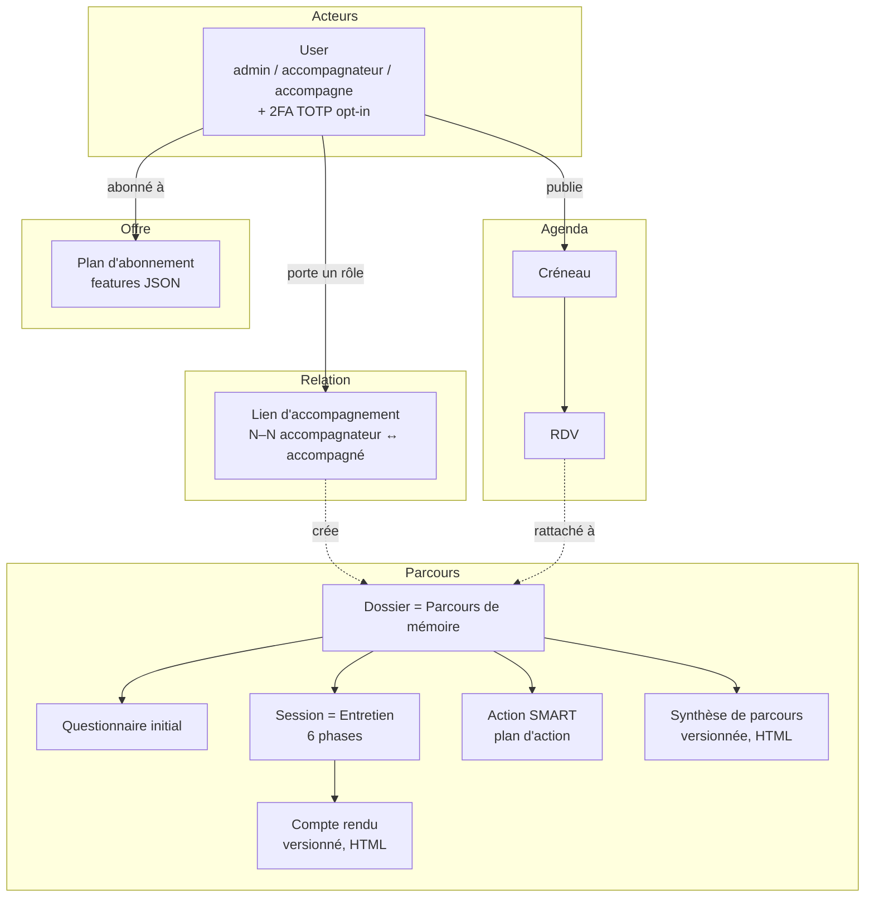
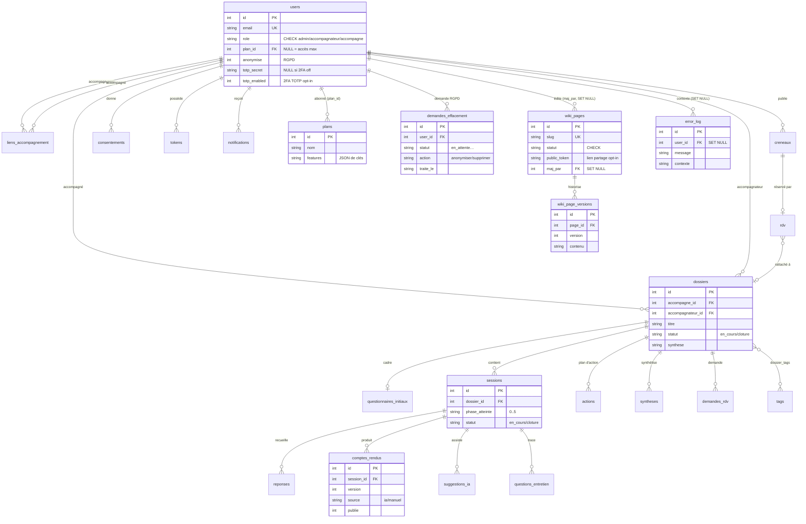
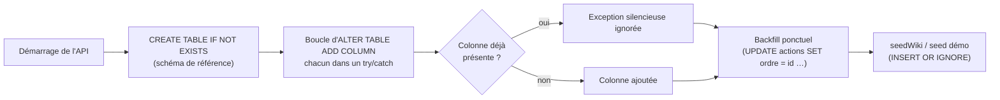

# Architecture de données

Cette page décrit l'architecture de données de l'application **Boussole** : du modèle conceptuel (entités métier majeures) jusqu'au modèle physique réellement implémenté dans SQLite, en passant par le modèle logique. Elle fournit le **diagramme entité-relation** des tables pivots, un **dictionnaire de données** couvrant l'intégralité des 33 tables métier ainsi que les tables d'**outillage** (wiki documentaire, observabilité) et leurs colonnes de sécurité (2FA, RGPD), les conventions de modélisation, la stratégie de migration et les paramètres de persistance. Elle est la source de vérité pour quiconque lit, fait évoluer ou audite le schéma. Le schéma physique est défini dans un fichier unique, `app/api/src/db.ts`, qui crée les tables et applique les migrations légères au démarrage.

## Objectifs de la page

- Donner une vue **conceptuelle** lisible par un non-développeur (entités, rôles, relations métier).
- Documenter le **modèle logique** : clés, cardinalités, intégrité référentielle.
- Détailler le **modèle physique** tel qu'implémenté (types SQLite, contraintes `CHECK`, valeurs par défaut, index implicites).
- Fournir un **dictionnaire de données** exhaustif et un **ERD Mermaid** des tables pivots.
- Expliciter les **conventions** transverses et la **stratégie de migration** pour éviter toute dérive entre code et schéma.

---

## 1. Principes et conventions transverses

Le modèle suit un petit nombre de conventions strictes, appliquées uniformément. Les connaître permet de lire n'importe quelle table sans surprise.

| Convention | Règle appliquée | Portée |
|---|---|---|
| Casse | `snake_case` pour tables et colonnes | Toutes |
| Clé primaire technique | `id INTEGER PRIMARY KEY AUTOINCREMENT` | Tables à entités multiples |
| Clé primaire métier | PK = FK (ex. `session_id`) quand la relation est **1‑1** | Tables d'extension (miroir, débriefing…) |
| Horodatage de création | `cree_le` / `genere_le` `TEXT NOT NULL DEFAULT (datetime('now'))` | Quasi toutes |
| Horodatage de mise à jour | `maj_le` (UTC, format ISO SQLite) | Tables éditables |
| Booléens | `INTEGER NOT NULL DEFAULT 0/1` (pas de type bool en SQLite) | `lu`, `publie`, `reserve`, `partage`, `anonymise`, `totp_enabled`… |
| Énumérations | Contrainte `CHECK (col IN (...))` au niveau colonne | `role`, `statut` d'actions, `source` de réponses… |
| Suppression en cascade | `ON DELETE CASCADE` pour les données **possédées** par un parent | Quasi toutes les FK |
| Découplage souple | `ON DELETE SET NULL` quand la donnée survit à son parent | `rdv.dossier_id`, `journal_acces.user_id`, `wiki_pages.maj_par`, `error_log.user_id` |
| Données structurées | JSON sérialisé dans un `TEXT` | `plans.features`, `emotions_roue.emotions`, contenus IA |
| Dates au format texte | Tout est `TEXT` ISO‑8601 (pas de type `DATE` natif exploité) | Toutes les colonnes temporelles |

> **Hypothèse — confiance : élevée** — Les colonnes temporelles sont stockées et comparées comme du texte ISO (`datetime('now')` renvoie `YYYY-MM-DD HH:MM:SS` en UTC). C'est cohérent avec SQLite qui n'a pas de type date dédié ; les tris et filtres reposent sur l'ordre lexicographique, valide pour ce format.

### Paramètres de persistance (PRAGMA)

Définis à l'ouverture de la base dans `db.ts` :

| PRAGMA | Valeur | Effet |
|---|---|---|
| `journal_mode` | `WAL` | Journalisation *Write-Ahead Logging* : lectures concurrentes pendant l'écriture, meilleure résilience. |
| `foreign_keys` | `ON` | Active réellement l'application des contraintes FK (désactivées par défaut en SQLite). |

Le chemin de la base est `process.env.DB_PATH || './data/boussole.sqlite'` ; le répertoire parent est créé au démarrage (`mkdirSync(..., { recursive: true })`). La base est **mono-fichier, mono-instance** : pas de réplication, pas d'ORM, accès **synchrone** via `better-sqlite3`. Des **sauvegardes « online » horodatées** quotidiennes (avec rétention) sont prises sans interrompre le service (cf. `backups.ts` et la page [Exploitation](operations)).

---

## 2. Modèle conceptuel

Le métier s'organise autour d'un acteur central — l'**utilisateur** porteur d'un rôle — et d'un objet pivot — le **dossier**, qui matérialise *un parcours de mémoire*. Tout le reste gravite autour du dossier (entretiens, comptes rendus, plan d'action, synthèse, outils réflexifs) ou autour de l'utilisateur (rendez-vous, consentements, notifications).

*Lecture du schéma* : un **User** accompagnateur et un User accompagné sont reliés par un **Lien d'accompagnement** (N–N). Ce lien donne naissance à un ou plusieurs **Dossiers** (multi-parcours : un accompagné peut mener plusieurs mémoires de front). Chaque dossier porte son questionnaire initial, ses entretiens (**Sessions**), et agrège comptes rendus, actions et synthèse. L'agenda (créneaux publiés → RDV réservés) est rattaché aux utilisateurs et, optionnellement, à un dossier. Le **Plan** conditionne les fonctionnalités accessibles (gating), sans lien d'intégrité fort avec les données métier. L'utilisateur peut activer une **double authentification TOTP** (opt-in) : un secret est alors stocké côté `users`.

### Entités majeures

| Entité conceptuelle | Table physique | Définition métier |
|---|---|---|
| Utilisateur | `users` | Compte unique, un seul rôle (`admin`, `accompagnateur`, `accompagne`), 2FA TOTP opt-in. |
| Lien d'accompagnement | `liens_accompagnement` | Association N–N entre un accompagnateur et un accompagné. |
| Dossier / Parcours | `dossiers` | Un parcours de rédaction de mémoire (titre, contexte, statut). |
| Questionnaire initial | `questionnaires_initiaux` | Cadrage de départ assisté par IA, un par dossier. |
| Session / Entretien | `sessions` | Un entretien guidé en 6 phases, rattaché à un dossier. |
| Compte rendu | `comptes_rendus` | Document HTML versionné produit par session. |
| Synthèse | `syntheses` | Document HTML versionné de bilan, par dossier. |
| Action | `actions` | Tâche SMART du plan d'action du dossier. |
| Créneau / RDV | `creneaux`, `rdv`, `demandes_rdv` | Agenda : offre de créneaux, réservations, demandes. |
| Plan | `plans` | Offre d'abonnement = liste de fonctionnalités (JSON). |

---

## 3. Modèle logique — diagramme entité-relation

Le diagramme ci-dessous couvre les **tables pivots** (cœur du modèle) avec leurs cardinalités, ainsi que les principales **tables d'outillage** (wiki documentaire et journal d'erreurs) rattachées à `users`. Les nombreuses tables d'extension 1‑1 (miroir, débriefing, nuage de thèmes, résumé…) sont décrites dans le dictionnaire mais omises ici pour la lisibilité.

*Lecture du diagramme* : `users` joue **deux rôles** dans `liens_accompagnement` et `dossiers` (accompagnateur et accompagné, d'où les doubles relations). Le **dossier** est le hub : il agrège sessions, actions, synthèses et demandes de RDV, et porte une relation N–N vers `tags` via la table de jonction `dossier_tags`. La **session** est le second hub, autour de l'entretien : réponses, comptes rendus versionnés, suggestions IA et questions posées. L'agenda relie `creneaux` (publiés par l'accompagnateur) à `rdv` ; le rattachement d'un RDV à un dossier est **optionnel** et survit à la suppression du dossier (`SET NULL`). Côté **outillage**, chaque `wiki_pages` historise ses modifications dans `wiki_page_versions` et peut être partagée publiquement via un `public_token` ; `error_log` rattache (en `SET NULL`) un contexte utilisateur aux erreurs observées.

---

## 4. Modèle physique — dictionnaire de données

Couverture exhaustive des 33 tables métier, regroupées par domaine, **complétée** par les tables d'outillage transverse (wiki documentaire, observabilité). Pour chaque table : rôle, champs principaux, clés, relations, contraintes et observations. Toutes les colonnes `*_id` sont des FK `INTEGER` ; les valeurs par défaut indiquées proviennent directement de `db.ts`.

### 4.1 Comptes, sécurité et conformité

| Table | Rôle | Champs principaux | Clés | Relations | Contraintes | Observations |
|---|---|---|---|---|---|---|
| `users` | Compte et identité | `email`, `password_hash`, `role`, `nom`, `prenom`, `email_verifie`, `actif`, `plan_id`, `anonymise`, `email_pending`, `dernier_acces`, `totp_secret`, `totp_enabled` | PK `id` ; UNIQUE `email` | → `plans` (`plan_id`), cible de la plupart des FK | `CHECK role IN (admin, accompagnateur, accompagne)` | `password_hash` bcrypt (10 rounds). `plan_id` NULL = toutes fonctionnalités. `anonymise=1` après traitement RGPD. `email_pending` = changement d'email en attente. **2FA opt-in** : `totp_secret` (TEXT, NULL si désactivé) et `totp_enabled` (booléen) ajoutés par migration ; pilotent les endpoints `/api/auth/2fa/*` et le challenge `{ twofa:true }` au login. |
| `tokens` | Jetons à usage unique | `type`, `valeur`, `expire_le`, `utilise`, `email_cible` | PK `id` | → `users` CASCADE | `CHECK type IN (verif_email, reset_mdp)` | `email_cible` lie un jeton de confirmation à l'adresse visée (changement d'email). `utilise` empêche le rejeu. |
| `consentements` | Traçabilité CGU/PC | `version_cgu`, `version_pc`, `accepte_le`, `ip` | PK `id` | → `users` CASCADE | — | Consentement **versionné** + IP : preuve RGPD. Historisé (pas d'écrasement). |
| `journal_acces` | Journal d'audit | `action`, `cible`, `horodatage` | PK `id` | → `users` **SET NULL** | — | `SET NULL` : la trace d'audit survit à la suppression de l'utilisateur. |
| `demandes_effacement` | Droit à l'effacement | `motif`, `statut`, `traite_le`, `action` | PK `id` | → `dossiers`, `users` CASCADE | `statut` libre (`en_attente` par défaut) | `action` = `anonymiser`/`supprimer` (renseignée au traitement par l'admin). `action` et `traite_le` ajoutées par migration. **Piège migration corrigé** : ces `ALTER` doivent s'exécuter *après* le `CREATE` de la table (cf. §5) — l'ordre inverse provoquait un 500 sur base neuve. |
| `plans` | Offres d'abonnement | `nom`, `description`, `features` | PK `id` | référencée par `users.plan_id` | `features TEXT DEFAULT '[]'` | `features` = **tableau JSON de clés** validé contre le registre côté code. Pas de FK depuis `users` vers `plans` côté schéma au sens DDL inline. |

> **Hypothèse — confiance : moyenne** — `users.plan_id` est ajouté par migration `ALTER TABLE` sans clause `REFERENCES`. L'intégrité « plan_id pointe vers un plan existant » est donc **applicative** (jointure `LEFT JOIN plans`), non garantie par une contrainte FK physique. *À confirmer si une cohérence stricte est requise.*

### 4.2 Relation d'accompagnement et parcours

| Table | Rôle | Champs principaux | Clés | Relations | Contraintes | Observations |
|---|---|---|---|---|---|---|
| `liens_accompagnement` | Couplage N–N | `accompagnateur_id`, `accompagne_id`, `statut` | PK `id` ; UNIQUE (`accompagnateur_id`,`accompagne_id`) | 2× → `users` CASCADE | `statut` libre (`actif` par défaut) | Contrainte d'unicité = un seul lien par couple. |
| `dossiers` | **Parcours de mémoire** (pivot) | `accompagne_id`, `accompagnateur_id`, `titre`, `contexte`, `statut`, `synthese` | PK `id` | 2× → `users` CASCADE ; parent de la majorité des tables métier | `statut` `en_cours`/`cloture` (défaut `en_cours`, via ALTER) | `synthese` (TEXT) ajoutée par migration. Un accompagné peut détenir **plusieurs** dossiers (multi-parcours). |
| `questionnaires_initiaux` | Cadrage initial | `contenu`, `cr_recap`, `complete_le` | PK `id` | → `dossiers` CASCADE | — | `cr_recap` = récapitulatif généré par IA. Relation pratiquement 1‑1 avec le dossier. |
| `tags` | Mots-clés | `nom` | PK `id` ; UNIQUE `nom` | jonction `dossier_tags` | — | Référentiel partagé de tags. |
| `dossier_tags` | Jonction N–N | `dossier_id`, `tag_id` | **PK composite** (`dossier_id`,`tag_id`) | → `dossiers`, `tags` CASCADE | — | Table d'association pure (pas d'`id` technique). |

### 4.3 Entretien et production documentaire

| Table | Rôle | Champs principaux | Clés | Relations | Contraintes | Observations |
|---|---|---|---|---|---|---|
| `sessions` | **Entretien** (pivot) | `date`, `phase_atteinte`, `statut` | PK `id` | → `dossiers` CASCADE ; parent des tables d'entretien | `statut` défaut `en_cours` | `phase_atteinte` = phase 0–5 atteinte (stockée en TEXT). |
| `reponses` | Réponses recueillies | `phase`, `question`, `texte_reponse`, `source` | PK `id` | → `sessions` CASCADE | `CHECK source IN (saisie, dictee)` | Trace des échanges par phase. |
| `suggestions_ia` | Propositions du co-pilote | `type`, `contenu`, `retenue` | PK `id` | → `sessions` (CASCADE, nullable) | `CHECK type IN (reformulation, question, cr)` | `retenue=1` si l'accompagnateur a adopté la suggestion. |
| `questions_entretien` | Questions réellement posées | `phase`, `texte`, `reponse` | PK `id` | → `sessions` CASCADE | — | `reponse` ajoutée par migration. Alimente l'analyse de questionnement. |
| `comptes_rendus` | **CR versionné** | `version`, `contenu_html`, `source`, `publie`, `publie_le`, `chemin`, `genere_le` | PK `id` | → `sessions` CASCADE | `source` défaut `ia` (via ALTER) | Passage du `.docx` (`chemin`) au **HTML éditable** (`contenu_html`). `publie` gère la visibilité côté accompagné. |
| `cr_messages` | Discussion sur le CR | `auteur_id`, `texte`, `cree_le` | PK `id` | → `sessions`, `users` CASCADE | — | Fil de discussion accompagné ↔ accompagnateur autour d'un CR. |
| `cr_notes_privees` | Notes privées | `contenu_html`, `maj_le` | **PK = `session_id`** | → `sessions` CASCADE | — | **1‑1** par session ; privé à l'accompagnateur. |
| `syntheses` | **Synthèse versionnée** | `version`, `contenu_html`, `source`, `publie`, `publie_le` | PK `id` | → `dossiers` CASCADE | `source` défaut `ia` | Équivalent du CR mais **par dossier** (bilan de parcours). |
| `synthese_messages` | Discussion sur la synthèse | `auteur_id`, `texte` | PK `id` | → `dossiers`, `users` CASCADE | — | Fil de discussion lié à la synthèse du dossier. |
| `actions` | **Plan d'action SMART** | `libelle`, `echeance`, `critere`, `statut`, `priorite`, `ordre`, `details`, `rappel_le`, `rappel_envoye` | PK `id` | → `dossiers` CASCADE | `CHECK statut IN (a_faire, en_cours, fait)` | `ordre` pour le glisser-déposer (initialisé à `id`). `rappel_envoye` évite les doublons de relance email. |

### 4.4 Agenda et rendez-vous

| Table | Rôle | Champs principaux | Clés | Relations | Contraintes | Observations |
|---|---|---|---|---|---|---|
| `creneaux` | Disponibilités publiées | `accompagnateur_id`, `debut`, `fin`, `reserve` | PK `id` | → `users` CASCADE | — | `reserve=1` quand un RDV est posé. |
| `rdv` | Rendez-vous confirmé | `creneau_id`, `accompagne_id`, `dossier_id`, `statut` | PK `id` | → `creneaux`, `users` CASCADE ; → `dossiers` **SET NULL** | `statut` défaut `confirme` | Rattachement au dossier **optionnel** et résilient (`SET NULL`). Export `.ics` côté API. |
| `demandes_rdv` | Demande sans créneau | `accompagne_id`, `accompagnateur_id`, `statut` | PK `id` | → `dossiers`, `users` CASCADE | `statut` défaut `en_attente` | Utilisée quand aucun créneau n'est disponible. |
| `notifications` | Notifications in-app | `texte`, `lu`, `cree_le` | PK `id` | → `users` CASCADE | — | `lu` = état de lecture. |

### 4.5 Outils réflexifs, relationnels et d'émergence

La plupart de ces tables sont des **extensions 1‑1** (PK = `session_id` ou `dossier_id`) portant un contenu généré par IA ou saisi, avec un champ `source` (`ia`/`manuel`) et un horodatage. Le champ `partage` (booléen) contrôle, le cas échéant, la visibilité côté accompagnateur/IA.

| Table | Rôle | Cardinalité | Parent | Champs notables | Observations |
|---|---|---|---|---|---|
| `auto_evaluations` | Auto-évaluation de la pratique | N par dossier | `dossiers` CASCADE | `statut` (`brouillon`/`validee`), `note_globale`, `analyse_questions` | Versionnée ; privée à l'accompagnateur. |
| `auto_evaluation_scores` | Scores par indicateur | N par éval | `auto_evaluations` CASCADE | `indicateur`, `score` ; UNIQUE (`eval_id`,`indicateur`) | Détail chiffré de la grille. |
| `analyses_posture` | Miroir réflexif IA | **1‑1 session** | `sessions` CASCADE (+ `dossier_id`) | `contenu`, `source` | PK = `session_id`. |
| `moments_cles` | Verbatims pivots | **1‑1 session** | `sessions` CASCADE | `contenu`, `partage` | PK = `session_id`. |
| `debriefings` | Débriefing à chaud | **1‑1 session** | `sessions` CASCADE | `contenu`, `source` (défaut `manuel`) | PK = `session_id`. |
| `replays` | Auto-confrontation annotée | **1‑1 session** | `sessions` CASCADE | `contenu` (blob d'annotations) | PK = `session_id`. |
| `meteo_humeur` | Météo intérieure | N par dossier | `dossiers` CASCADE | `role`, `niveau` (1–5), `mot` | `role` distingue saisie accompagné (vue) / accompagnateur (privée). |
| `emotions_roue` | Roue des émotions | N par dossier | `dossiers` CASCADE | `role`, `emotions` (JSON), `note` | Émotions sélectionnées à un instant T. |
| `journal_entrees` | Micro-journal | N par dossier | `dossiers` CASCADE | `texte`, `partage`, `maj_le` | `partage=1` rend l'entrée visible par l'accompagnateur et l'IA. |
| `emergence` | Banque de questions / fil rouge | 1 par (dossier, type) | `dossiers` CASCADE | `type`, `contenu`, `partage` ; **PK composite** (`dossier_id`,`type`) | Mutualise plusieurs outils IA d'émergence. |
| `nuages_themes` | Nuage de thèmes | **1‑1 dossier** | `dossiers` CASCADE | `contenu`, `source` | Régénérable. PK = `dossier_id`. |
| `problematisations` | Assistant de problématisation | **1‑1 dossier** | `dossiers` CASCADE | `contenu`, `source` (défaut `manuel`) | PK = `dossier_id`. |
| `resumes_parcours` | Résumé « où j'en suis » | **1‑1 dossier** | `dossiers` CASCADE | `contenu`, `source` | PK = `dossier_id`. |
| `bilans_pratique` | Bilan de pratique global | **1‑1 accompagnateur** | `users` CASCADE | `contenu`, `source` | PK = `accompagnateur_id` (1 bilan courant par accompagnateur). |
| `signaux_etat` | Dernier état (signaux faibles) | **1‑1 dossier** | `dossiers` CASCADE | `niveau`, `signature` | `signature` évite de re-notifier un état inchangé. |
| `digest_envois` | Trace du digest hebdo | N par user | `users` CASCADE | `semaine` ; UNIQUE (`user_id`,`semaine`) | Garantit un seul digest par semaine ISO. |
| `ressources_partagees` | Mutualisation entre pairs | N par auteur | `users` CASCADE | `type`, `portee` (`interne`/public), `token` | `token` = lien public partageable. |
| `push_subscriptions` | Abonnements Web Push | N par user | `users` CASCADE | `endpoint` (UNIQUE), `p256dh`, `auth` | Un appareil = une entrée (PWA). |

### 4.6 Outillage transverse — wiki documentaire et observabilité

Ces tables ne portent pas de donnée *métier d'accompagnement* : elles supportent le **wiki interne** (documentation admin éditable, livrée) et l'**observabilité auto-hébergée** (journal d'erreurs, livrée). Elles sont décrites ici pour l'exhaustivité du schéma physique.

| Table | Rôle | Champs principaux | Clés | Relations | Contraintes | Observations |
|---|---|---|---|---|---|---|
| `wiki_pages` | Page de wiki interne | `slug`, `titre`, `contenu`, `statut`, `maj_le`, `maj_par`, `public_token` | PK `id` ; UNIQUE `slug` | → `users` (`maj_par`) **SET NULL** | `CHECK statut IN (...)` | Markdown éditable (admin), seedée puis modifiable. **Partage public opt-in** : `public_token` (NULL par défaut) expose la page en lecture seule via `GET /api/wiki/public/:token` et la route `/wiki/p/:token` ; révocable (remise à NULL). |
| `wiki_page_versions` | Historique de versions | `page_id`, `version`, `contenu`, `titre`, `cree_le` | PK `id` | → `wiki_pages` CASCADE | — | **Instantané pris avant chaque modification** d'une page : permet la consultation et la **restauration** d'une version antérieure. |
| `error_log` | Journal d'erreurs (observabilité) | `message`, `stack`, `contexte`, `user_id`, `cree_le` | PK `id` | → `users` **SET NULL** | — | Alimentée par le point unique `reportError()` (adaptateur Sentry brançable plus tard). `user_id` en `SET NULL` : la trace survit à la suppression du compte. Exploitée par `GET /api/metrics` (admin). |

> **Note de portée** — Les tables `wiki_pages`, `wiki_page_versions` et `error_log` sont des supports d'**outillage** (documentation interne, observabilité). Elles restent **exclues du décompte des 33 tables métier** décrites en §4.1 à §4.5, mais sont désormais documentées ici car elles font partie du schéma physique livré.

---

## 5. Stratégie de migration

Boussole n'utilise **pas** d'outil de migration versionné (pas de Knex/Prisma migrate, pas de table `schema_version`). La stratégie est délibérément légère et **idempotente**, adaptée à une base mono-fichier mono-instance :

*Principe* : au démarrage, le schéma de référence est (re)créé via `CREATE TABLE IF NOT EXISTS` ; puis une **boucle d'`ALTER TABLE ... ADD COLUMN`** ajoute les colonnes apparues après coup (statut/synthèse de dossier, enrichissements du plan d'action, HTML des CR, champs RGPD `action`/`traite_le`, 2FA `totp_secret`/`totp_enabled`, `public_token` du wiki…). Chaque `ALTER` est enveloppé d'un `try/catch` qui **avale l'erreur « colonne déjà présente »** : l'opération est donc rejouable sans risque à chaque démarrage. Les *backfills* (ex. `UPDATE actions SET ordre = id WHERE ordre IS NULL`) garantissent la cohérence des données héritées. Le seed (wiki de référence, jeu de démo) utilise `INSERT OR IGNORE` pour ne jamais écraser une édition manuelle.

> **Piège d'ordonnancement — confiance : élevée (vécu)** — Un `ALTER TABLE ... ADD COLUMN` ne peut s'appliquer qu'à une table **déjà créée**. Lorsqu'un `ALTER` (ex. `demandes_effacement.action` / `demandes_effacement.traite_le`) est positionné *avant* le `CREATE TABLE IF NOT EXISTS` de sa propre table, il échoue silencieusement sur une **base neuve** (la table n'existe pas encore) et la colonne reste manquante — ce qui s'est traduit par une **anonymisation RGPD en HTTP 500** détectée uniquement par la CI (base fraîche, cf. [Stratégie de test](testing-strategy)). **Règle** : tout `ALTER` doit suivre le `CREATE` de sa table dans `db.ts`, et l'ordre relatif des migrations est significatif (pas de rollback).

| Aspect | Mécanisme | Conséquence |
|---|---|---|
| Création | `CREATE TABLE IF NOT EXISTS` | Schéma auto-réparant au boot. |
| Évolution | `ALTER TABLE ADD COLUMN` en `try/catch` | Idempotent, pas de no-op explicite à maintenir. |
| Ordonnancement | `ALTER` **après** le `CREATE` de sa table | Indispensable sur base neuve ; sinon colonne manquante (bug CI vécu). |
| Données héritées | `UPDATE ... WHERE col IS NULL` | Backfill déterministe. |
| Contenu de référence | `INSERT OR IGNORE` (seed) | Les éditions ne sont jamais écrasées au redémarrage. |
| Suppression de colonne | *Non géré* | SQLite ne supporte historiquement pas `DROP COLUMN` simplement ; aucune suppression n'est pratiquée. |

---

## Hypothèses

> **Hypothèse — confiance : élevée** — Les énumérations métier (statuts de dossier `en_cours`/`cloture`, etc.) qui ne sont **pas** matérialisées par un `CHECK` dans `db.ts` sont validées au niveau applicatif (zod + logique des routeurs). Seuls `users.role`, `actions.statut`, `reponses.source`, `suggestions_ia.type`, `tokens.type`, `auto_evaluations.statut` et `wiki_pages.statut` ont un `CHECK` physique.

> **Hypothèse — confiance : moyenne** — Aucun index secondaire explicite n'est défini au-delà des index implicites créés par les PK et les contraintes `UNIQUE` (dont `wiki_pages.slug`). Les volumes (mono-instance, projet académique) rendent l'optimisation par index non critique. *À confirmer : besoin éventuel d'un index sur `dossiers(accompagne_id)` / `sessions(dossier_id)` / `wiki_page_versions(page_id)` si la volumétrie croît.*

> **Hypothèse — confiance : moyenne** — `phase_atteinte` (sessions) et `version` (CR/synthèses, wiki) sont stockés respectivement en `TEXT` et `INTEGER` ; la borne 0–5 des phases est garantie applicativement (`phases.ts`), pas par contrainte.

---

## Risques & points d'attention

| # | Risque / point d'attention | Sévérité | Mitigation |
|---|---|---|---|
| 1 | `users.plan_id` sans `REFERENCES` : un plan supprimé peut laisser des `plan_id` orphelins. | Moyenne | Jointure défensive côté code ; `userFeatures()` retombe sur l'accès maximal si le plan est introuvable. Ajouter une FK si cohérence stricte voulue. |
| 2 | Énumérations partiellement non contraintes en base (statuts de lien, demandes, RDV, `demandes_effacement.action`). | Faible | Validation zod en amont ; documenter les valeurs admises. |
| 3 | Absence de migrations versionnées : **ordre des `ALTER` à respecter** (chaque `ALTER` après le `CREATE` de sa table), pas de rollback. | Moyenne | Boucle idempotente + `try/catch` ; règle d'ordonnancement documentée (§5) ; **CI sur base neuve** qui rejoue le schéma à zéro. |
| 4 | Mono-fichier SQLite : pas de réplication ; sauvegarde = copie du fichier (+ WAL). | Moyenne | **Sauvegardes « online » horodatées quotidiennes + rétention** (`backups.ts`) ; copie du `.sqlite` et du `-wal`/`-shm` (cf. [Exploitation](operations)). |
| 5 | Contenus IA, HTML et **Markdown du wiki** stockés en `TEXT` brut : risque XSS si rendu sans assainissement. | Élevée | Assainissement DOMPurify côté front ; CSP/helmet ; voir [Sécurité](security). |
| 6 | Dates en `TEXT` UTC : comparaisons correctes seulement si le format ISO est respecté partout. | Faible | Toujours produire les dates via `datetime('now')` ou ISO côté code. |
| 7 | `ON DELETE CASCADE` étendu : la suppression d'un `users` ou `dossiers` efface en cascade un large sous-arbre. | Moyenne | Préférer l'**anonymisation** RGPD à la suppression ; `journal_acces`, `rdv.dossier_id`, `wiki_pages.maj_par` et `error_log.user_id` en `SET NULL` préservent les traces utiles. |
| 8 | `wiki_pages.public_token` : un lien public tokenisé fuité expose la page concernée en lecture seule. | Faible | Partage **opt-in** par page, jeton **révocable** (remise à NULL) ; seules les pages explicitement publiées sont accessibles via `/api/wiki/public/:token`. |
| 9 | `users.totp_secret` (2FA) : secret sensible stocké en base. | Moyenne | 2FA **opt-in** ; secret non exposé par l'API après activation ; durcissement global (helmet, rate-limiting sur `/api/auth`, CSRF). Voir [Sécurité](security). |

---

## Recommandations

1. **Introduire une table `schema_version`** (ou adopter un outil de migration léger) si l'application doit tourner sur plusieurs environnements en parallèle, pour tracer et ordonner les évolutions de schéma — et **figer formellement** la règle « `ALTER` après `CREATE` » aujourd'hui garantie par convention.
2. **Ajouter la clause `REFERENCES plans(id) ON DELETE SET NULL`** à `users.plan_id` (via recréation contrôlée) pour aligner l'intégrité physique sur l'intention métier, ou documenter explicitement que la cohérence est applicative.
3. **Indexer les colonnes de jointure chaudes** (`sessions.dossier_id`, `dossiers.accompagne_id`, `dossiers.accompagnateur_id`, `rdv.accompagne_id`, `wiki_page_versions.page_id`) si la volumétrie augmente ; aujourd'hui non bloquant.
4. **Centraliser les énumérations** (statuts) dans des constantes TypeScript partagées et, si possible, refléter les valeurs admises par des `CHECK` pour les statuts stables.
5. **Formaliser la procédure de sauvegarde/restauration** du fichier SQLite (avec WAL) et l'intégrer aux runbooks d'[Exploitation](operations) — la base technique (`backups.ts`) est livrée, reste à documenter le runbook de restauration.
6. **Conserver la cascade mais privilégier l'anonymisation** dans les traitements RGPD, afin de préserver l'intégrité statistique (tableau d'impact, signaux) sans données personnelles.

---

## Pages liées

- [Architecture technique](technical-architecture) — stack, déploiement Docker, façade Caddy, runtime.
- [Documentation API](api-documentation) — endpoints exposant ces entités (dont `/api/wiki/*`, `/api/auth/2fa/*`, `/api/metrics`).
- [Sécurité](security) — auth JWT, 2FA TOTP, CSRF, helmet/CSP, rate-limiting, assainissement HTML, contraintes RGPD.
- [Stratégie de test](testing-strategy) — couverture des invariants de données, CI sur base neuve.
- [Exploitation](operations) — sauvegardes « online » horodatées, restauration du fichier SQLite, WAL, observabilité.
- [Matrice de traçabilité](traceability-matrix) — liens exigences ↔ tables.
- [Glossaire](glossary) — définitions des entités et termes métier.
- [Décisions d'architecture (ADR)](adr) — choix SQLite, absence d'ORM, multi-parcours.
