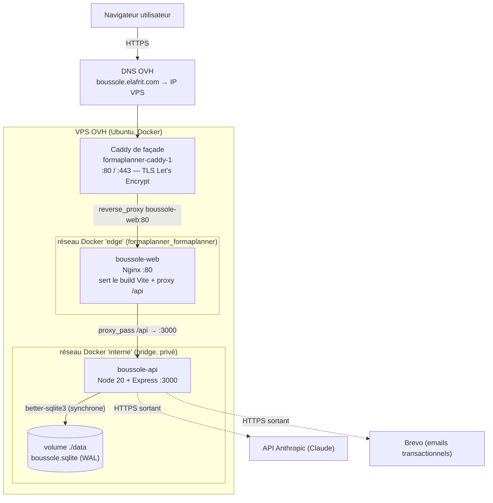
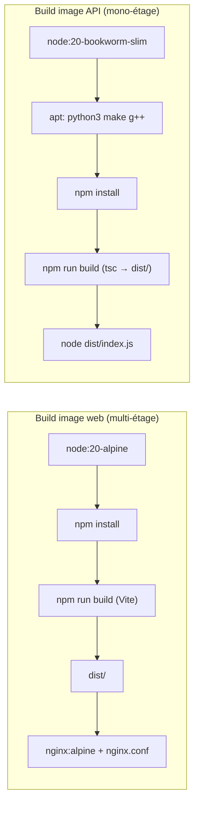
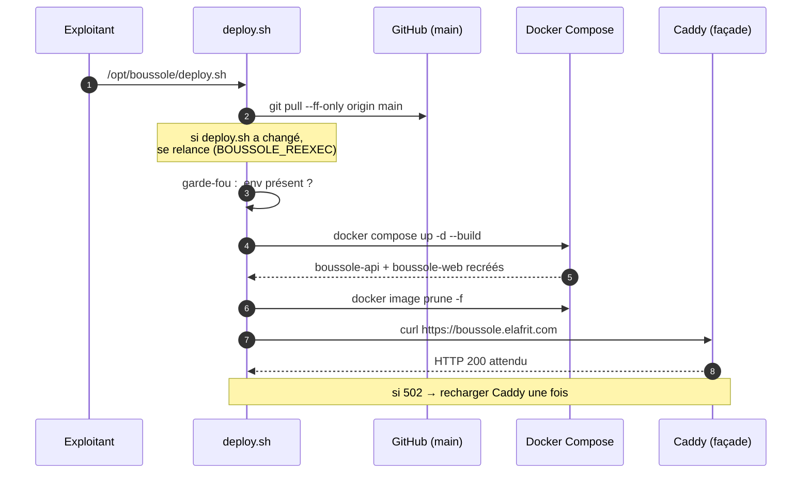
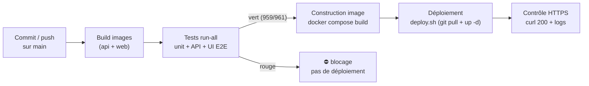

# Déploiement & intégration

Cette page décrit la **topologie de déploiement réelle** de l'application Boussole, sa chaîne de construction (build), ses variables d'environnement, ainsi que les procédures de **montée de version, de rollback et de continuité de service**. Elle reflète la production telle qu'elle est exploitée : un VPS OVH (Ubuntu) sous Docker, un front Nginx servant le build Vite, une API Node 20, une base **SQLite mono-fichier**, le tout publié sur `boussole.elafrit.com` derrière un **reverse-proxy Caddy mutualisé** déjà présent sur le serveur. La contrainte structurante — un **stockage SQLite mono-instance** qui interdit la mise à l'échelle horizontale sans changement de socle de données — est traitée explicitement.

> **Note de cohérence — confiance : élevée.** La spécification projet mentionne « Traefik » comme reverse-proxy. **En production, le proxy de façade réel est Caddy** (container `formaplanner-caddy-1`, ports 80/443, certificats Let's Encrypt), mutualisé avec l'application *FormaPlanner*. Cette page documente l'état réellement déployé. Voir [ADR](adr) pour la décision et la [Dette technique](technical-debt) pour le suivi de l'écart documentaire.

## Objectifs de la page

- Donner une vue d'ensemble **exploitable** de la topologie de déploiement (qui parle à qui, sur quels ports, via quels réseaux Docker).
- Documenter la **chaîne de build** des deux images (API et web) et les **variables d'environnement** requises.
- Décrire les procédures de **mise à jour**, de **rollback** et de **continuité de service** (faible indisponibilité acceptée en mono-instance).
- Formaliser le **pipeline recommandé** (build → tests `run-all` → image → déploiement).
- Expliciter la **contrainte mono-instance SQLite** et ses implications de scalabilité.

## 1. Topologie de déploiement

### 1.1 Vue d'ensemble

L'architecture de production repose sur **trois acteurs Docker** : le proxy de façade Caddy (préexistant, mutualisé), le container `boussole-web` (Nginx + build React/Vite, qui proxifie aussi `/api`), et le container `boussole-api` (Node 20 + Express). La base SQLite est un **volume hôte** monté dans l'API.

**Lecture du diagramme.** Le trafic entrant arrive en HTTPS sur Caddy, qui détient seul les ports 80/443 et gère les certificats Let's Encrypt. Caddy relaie vers `boussole-web` (Nginx) via le réseau `edge` partagé. Nginx sert les fichiers statiques du build React et proxifie tout `/api/` vers `boussole-api` sur le réseau `interne` privé. L'API accède à la base SQLite via un volume hôte monté (`./data`). Deux flux sortants existent : vers l'API Anthropic (IA, avec repli déterministe si indisponible) et vers Brevo (emails). **L'API n'est jamais exposée directement à Internet** : elle n'est joignable que depuis le réseau `interne`.

### 1.2 Inventaire des composants déployés

| Composant | Image / base | Port exposé | Réseau Docker | Rôle |
|---|---|---|---|---|
| `boussole-api` | `node:20-bookworm-slim` (build natif `better-sqlite3`) | `3000` (interne uniquement) | `interne` | API Express, logique métier, IA, base SQLite |
| `boussole-web` | build `node:20-alpine` → `nginx:alpine` | `80` (vers Caddy) | `interne` + `edge` | Sert le build Vite ; proxifie `/api` vers l'API |
| Caddy (façade) | `formaplanner-caddy-1` (préexistant) | `80` / `443` (publics) | `edge` (`formaplanner_formaplanner`) | TLS Let's Encrypt + routage HTTP(S) |
| Volume `./data` | volume hôte (`/opt/boussole/app/data`) | — | — | Persistance SQLite (`boussole.sqlite` + WAL) |

> **Hypothèse — confiance : moyenne.** Le proxy de façade est piloté par un **Caddyfile statique** (`/opt/FormaPlanner/Caddyfile`) qui **ne lit pas les labels Docker** : la publication d'un site se fait en ajoutant un bloc puis en rechargeant Caddy à chaud. C'est la raison pour laquelle le routage n'est pas déclaré via labels dans `docker-compose.yml`.

### 1.3 Réseaux Docker

| Réseau | Type | Membres | Justification |
|---|---|---|---|
| `interne` | `bridge` (créé par le compose) | `boussole-api`, `boussole-web` | Isole l'API ; seul le web la joint (`boussole-api:3000` via Docker DNS) |
| `edge` | `external` (`formaplanner_formaplanner`) | `boussole-web`, Caddy | Permet à Caddy d'atteindre le front sans publier de port public |

L'API **ne publie aucun port** : c'est un choix de sécurité (cf. [Sécurité](security)). En local, le compose `docker-compose.local.yml` publie en revanche le front sur `localhost:8080` et n'utilise pas le réseau `edge`.

## 2. Chaîne de build

### 2.1 Image API (`app/api/Dockerfile`)

Image **mono-étage** sur `node:20-bookworm-slim` (Debian) — choisie volontairement plutôt qu'Alpine pour **compiler nativement `better-sqlite3`** (toolchain `python3 make g++`).

| Étape | Commande | Effet |
|---|---|---|
| 1. Toolchain native | `apt-get install python3 make g++` | Permet la compilation de `better-sqlite3` |
| 2. Dépendances | `npm install` | Installe les paquets (lockfile copié d'abord pour le cache de couche) |
| 3. Compilation TS | `npm run build` (`tsc` → `dist/`) | Transpile TypeScript en JavaScript |
| 4. Exécution | `CMD ["node", "dist/index.js"]` | Démarre l'API sur le port `3000` |

### 2.2 Image web (`app/web/Dockerfile`)

Image **multi-étage** : un étage de build (`node:20-alpine`) qui produit le bundle Vite, puis un étage d'exécution **`nginx:alpine`** ne contenant que les fichiers statiques et la configuration Nginx.

| Étape | Base | Commande | Effet |
|---|---|---|---|
| 1. Build front | `node:20-alpine` | `npm install` puis `npm run build` | Produit le bundle statique dans `dist/` |
| 2. Runtime | `nginx:alpine` | copie `nginx.conf` + `dist/` → `/usr/share/nginx/html` | Sert le SPA et proxifie `/api` |

La configuration Nginx (`app/web/nginx.conf`) assure deux fonctions clés : le **fallback SPA** (`try_files $uri $uri/ /index.html`) pour le routage côté client (react-router), et le **proxy `/api/`** vers `http://boussole-api:3000` avec transmission des en-têtes `X-Forwarded-*`.

**Lecture du diagramme.** À gauche, l'image web compile le front avec Vite puis ne conserve que le résultat statique servi par Nginx (image finale légère, sans Node). À droite, l'image API installe la toolchain native, compile `better-sqlite3` à l'installation puis transpile le TypeScript ; l'image finale embarque Node et le binaire SQLite natif. Les deux builds sont orchestrés par `docker compose up -d --build`.

### 2.3 Durée et coût de build

> **Hypothèse — confiance : moyenne.** Le guide de déploiement indique un build complet d'environ **2 à 3 minutes**, dominé par la **compilation native de `better-sqlite3`**. Le cache de couches Docker (lockfiles copiés avant le code source) réduit fortement les rebuilds lorsque seules les sources changent.

## 3. Variables d'environnement

Les secrets et paramètres sont injectés via un fichier `app/.env` (hors Git, modèle : `app/.env.example`). En production, `docker-compose.yml` charge ce fichier (`env_file: .env`) pour l'API.

| Variable | Rôle | Production | Sensible |
|---|---|---|---|
| `DOMAIN` | Domaine public | `boussole.elafrit.com` | Non |
| `APP_URL` | Base des liens emails | `https://boussole.elafrit.com` | Non |
| `EDGE_NETWORK` | Réseau du Caddy de façade | `formaplanner_formaplanner` | Non |
| `NODE_ENV` | Mode d'exécution | `production` | Non |
| `PORT` | Port d'écoute de l'API | `3000` | Non |
| `DB_PATH` | Chemin du fichier SQLite | `/app/data/boussole.sqlite` | Non |
| `SESSION_SECRET` | Secret de session | `openssl rand -hex 32` | **Oui** |
| `JWT_SECRET` | Signature des cookies JWT | `openssl rand -hex 32` | **Oui** |
| `ANTHROPIC_API_KEY` | Clé Claude (IA) | clé Anthropic | **Oui** |
| `ANTHROPIC_MODEL_REALTIME` | Modèle temps réel | `claude-sonnet-4-6` | Non |
| `ANTHROPIC_MODEL_REPORT` | Modèle pour CR/synthèses | `claude-opus-4-8` | Non |
| `BREVO_API_KEY` | Clé emails transactionnels | clé Brevo | **Oui** |
| `MAIL_FROM` | Expéditeur des emails | `contact@elafrit.com` | Non |
| `ADMIN_EMAIL` | Compte admin initial (seed) | `mohamed@elafrit.com` | Non |
| `ACCOMPAGNATEUR_EMAIL` | Compte accompagnateur initial | `elafrit.mohamed@gmail.com` | Non |
| `SEED_PASSWORD` | Mode démo vs. production | **vide en prod réelle** | **Oui (si défini)** |

> **Point d'attention `SEED_PASSWORD`.** S'il est **défini**, l'application charge un **jeu de démo complet réinitialisé à chaque démarrage** (2 accompagnateurs, 3 accompagnés, 6 dossiers) — idéal pour l'oral, **destructeur de toute donnée réelle**. En **production réelle, il doit rester vide** : seuls l'admin et l'accompagnateur sont créés, l'activation se fait par email. Voir [Guide d'administration](admin-guide).

Sans `ANTHROPIC_API_KEY`, l'IA bascule sur son **repli déterministe** (jamais de 500). Sans `BREVO_API_KEY`, les emails sont journalisés dans les logs au lieu d'être envoyés. Ces dégradations sont gracieuses et permettent un fonctionnement minimal sans comptes externes.

## 4. Montée de version, rollback et continuité de service

### 4.1 Montée de version (`deploy.sh`)

Un script versionné (`deploy.sh`, déployé en `/opt/boussole/deploy.sh`) automatise la mise à jour. Il est idempotent et **ne touche ni à Caddy ni à l'application voisine FormaPlanner**.

**Lecture du diagramme.** Le script récupère le dernier code de `main`, se relance si lui-même a été modifié, vérifie la présence du `.env` (garde-fou), reconstruit et relance les containers, nettoie les images orphelines, puis teste l'URL HTTPS publique. Comme le container `boussole-web` est recréé **avec le même nom**, le Docker DNS le re-résout automatiquement : Caddy continue de router sans reconfiguration. En cas de `502` transitoire, un simple `caddy reload` suffit.

### 4.2 Rollback (image / commit précédent)

| Scénario | Procédure | Données |
|---|---|---|
| Régression applicative | `git checkout <commit_ok>` dans `/opt/boussole` puis `docker compose up -d --build` | Préservées (volume `./data` intact) |
| Image défaillante | Conserver l'image précédente (`docker images`) et relancer le container sur l'ancien tag | Préservées |
| Corruption de base | Restaurer la dernière sauvegarde SQLite (`cp ~/backups/boussole-AAAA-MM-JJ.sqlite data/boussole.sqlite`) | Restaurées à la date de sauvegarde |

> **Hypothèse — confiance : moyenne.** Le rollback applicatif repose aujourd'hui sur le **retour au commit précédent + rebuild**, et non sur un **registre d'images taguées** (pas de registry privé identifié dans le code). Un tagging d'images (`boussole-api:<sha>`) accélérerait le rollback sans rebuild. Voir [Recommandations](#recommandations).

### 4.3 Continuité de service (mono-instance)

L'architecture étant **mono-instance**, une montée de version implique une **brève indisponibilité** (recréation des containers, ~quelques secondes à dizaines de secondes selon le rebuild). Ce n'est **pas** du zéro-downtime au sens strict, mais une **faible indisponibilité maîtrisée**, acceptable pour le contexte académique et le volume d'usage attendu.

| Propriété | État réel | Commentaire |
|---|---|---|
| Zéro-downtime strict | **Non** | Mono-instance : recréation = court arrêt |
| Faible indisponibilité | **Oui** | Quelques secondes ; build à chaud côté serveur |
| Bascule sans coupure du proxy | **Oui** | Caddy non touché ; même nom de container re-résolu |
| Drain / health-check de bascule | *Information non identifiée dans le code ou la conversation.* | Pas d'orchestration blue-green détectée |

## 5. Pipeline recommandé

La porte de non-régression existe déjà : la commande unique **`run-all`** (reseed base de démo → tests unitaires → API → UI E2E → rapport), état de référence **959/961 vert** (cf. [Stratégie de tests](testing-strategy)). Le pipeline cible enchaîne build, tests et déploiement.

**Lecture du diagramme.** Le pipeline recommandé fait de la suite `run-all` une **porte bloquante** : aucun déploiement si les tests sont rouges. Aujourd'hui, l'enchaînement est **opéré manuellement** (tests joués avant livraison, puis `deploy.sh` sur le serveur). L'automatisation complète (CI déclenchée sur `main`) est un objectif, pas un acquis.

| Étape | Outil actuel | Statut |
|---|---|---|
| Build | `docker compose build` | **Développé** |
| Tests `run-all` | Vitest + Playwright | **Développé** (joué avant livraison) |
| Image | `docker compose up --build` | **Développé** |
| Déploiement serveur | `deploy.sh` | **Développé** |
| Orchestration CI/CD automatisée | — | *Information non identifiée dans le code ou la conversation.* (**prévu / absent**) |

## 6. Contrainte mono-instance SQLite

C'est la contrainte d'architecture la plus structurante pour le déploiement. SQLite via `better-sqlite3` est un moteur **embarqué mono-fichier, à accès synchrone**, lié au **système de fichiers local** de l'API (volume `./data`).

| Implication | Détail | Conséquence déploiement |
|---|---|---|
| Pas de scale horizontal | Plusieurs instances API → écritures concurrentes sur le même fichier → corruption / verrous | **Une seule instance API** |
| Couplage au volume hôte | La base vit sur le disque du VPS | Sauvegarde/restauration = **copie de fichier** |
| Pas de réplication native | Aucun cluster ni réplica | Disponibilité = celle de l'unique VPS |
| Mise à jour = court arrêt | Recréation de l'instance unique | Faible indisponibilité assumée |

Le passage à une mise à l'échelle horizontale (plusieurs API derrière un load-balancer) **exige un changement de socle de données** (PostgreSQL ou équivalent client-serveur). C'est un choix délibéré et documenté : la simplicité opérationnelle prime sur la scalabilité pour ce projet. Voir [Architecture des données](data-architecture) et l'[ADR](adr) correspondant.

## Hypothèses

> **Hypothèse — confiance : élevée.** Le reverse-proxy de production est **Caddy** (mutualisé `formaplanner-caddy-1`), pas Traefik comme l'indique la spécification. Cette page documente l'état déployé réel.

> **Hypothèse — confiance : moyenne.** Durée de build ~2-3 min (dominée par `better-sqlite3`) ; aucune métrique instrumentée dans le code.

> **Hypothèse — confiance : moyenne.** Pas de registry d'images privé ni de CI/CD automatisée identifiés : le pipeline est aujourd'hui **manuel/semi-automatisé** (script `deploy.sh` sur le serveur).

> **Hypothèse — confiance : élevée.** Les sauvegardes SQLite sont des **copies de fichier** ; le guide recommande de les automatiser via `cron` mais ne fournit pas la tâche cron elle-même. *Détail de l'automatisation non identifié dans le code.*

## Risques & points d'attention

| Risque | Probabilité | Impact | Mitigation |
|---|---|---|---|
| **SPOF VPS unique** (mono-instance, mono-serveur) | Moyenne | Élevé | Sauvegardes régulières ; `restart: unless-stopped` ; supervision |
| **Indisponibilité pendant la montée de version** | Élevée | Faible | Acceptée (court arrêt) ; déploiement hors heures de pointe |
| **`SEED_PASSWORD` laissé défini en prod** | Moyenne | **Critique** (efface les données réelles à chaque démarrage) | Garde-fou documentaire ; vérification au déploiement |
| **Perte de la base SQLite** (volume non sauvegardé) | Moyenne | Élevé | Sauvegarde automatisée + rétention hors VPS recommandée |
| **Couplage au proxy mutualisé** (Caddyfile partagé) | Faible | Moyen | Sauvegarde du Caddyfile avant modif ; `caddy validate` avant `reload` |
| **Fuite de secrets** (`.env`, clés Anthropic/Brevo) | Faible | Élevé | `.env` hors Git ; rotation possible (`docker compose restart`) |
| **502 après redéploiement** | Faible | Faible | `caddy reload` ponctuel ; `deploy.sh` le signale |
| **Absence de tag d'image** (rollback = rebuild) | Moyenne | Moyen | Tagging d'images recommandé |

## Recommandations

1. **Aligner la documentation sur la réalité** : corriger « Traefik » en « Caddy » dans la spécification, ou tracer l'écart dans la [Dette technique](technical-debt) et un [ADR](adr).
2. **Automatiser la sauvegarde SQLite** : tâche `cron` quotidienne avec **rétention hors VPS** (copie chiffrée externe) ; tester une restauration.
3. **Taguer les images** (`boussole-api:<sha>`, `boussole-web:<sha>`) pour un rollback **sans rebuild** ; conserver les N dernières.
4. **Garde-fou `SEED_PASSWORD`** : ajouter au `deploy.sh` un avertissement bloquant si `SEED_PASSWORD` est non vide alors que `NODE_ENV=production`, afin de prévenir l'effacement accidentel de données réelles.
5. **Industrialiser le pipeline** : déclencher `run-all` automatiquement sur `main` (CI) comme **porte bloquante** avant tout déploiement.
6. **Documenter le seuil de bascule SQLite → PostgreSQL** : définir les critères (volume, concurrence, besoin de HA) qui justifieraient le changement de socle et la mise à l'échelle horizontale.

## Pages liées

- [Architecture technique](technical-architecture) — vue d'ensemble de la stack et des composants.
- [Architecture des données](data-architecture) — modèle SQLite, contrainte mono-fichier.
- [Exploitation](operations) — supervision, sauvegardes, incidents en production.
- [Sécurité](security) — secrets, isolation réseau, TLS, RGPD.
- [Stratégie de tests](testing-strategy) — la porte `run-all` du pipeline.
- [Guide d'administration](admin-guide) — comptes seed, mode démo vs. production.
- [Registre des risques](risk-register) — risques d'exploitation consolidés.
- [Dette technique](technical-debt) — écart Traefik/Caddy, pipeline manuel.
- [Décisions d'architecture (ADR)](adr) — choix SQLite, reverse-proxy, mono-instance.
