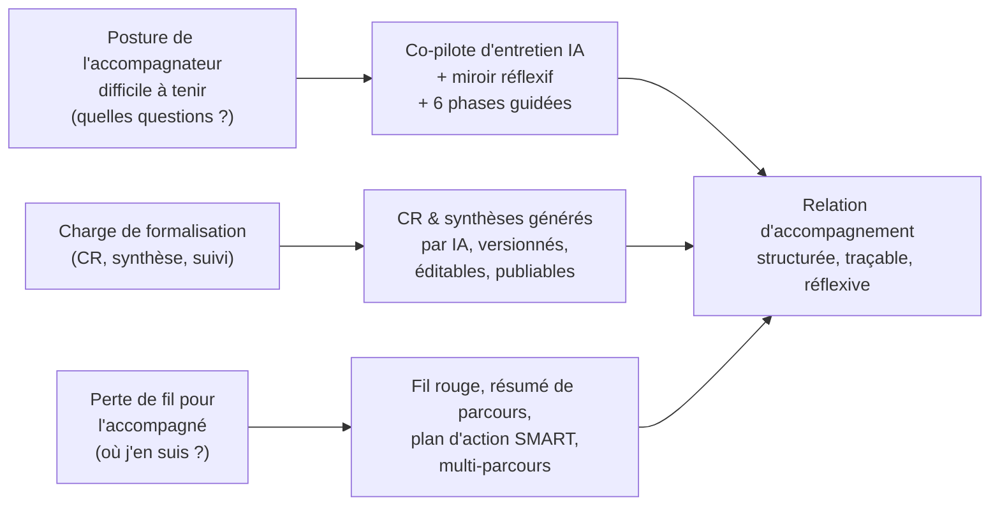
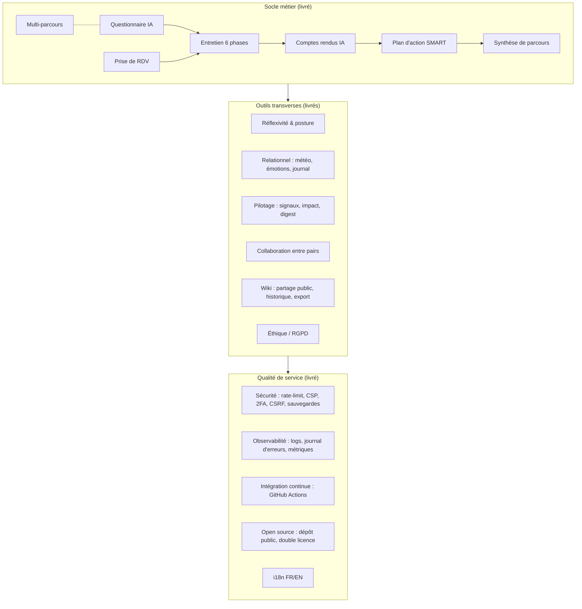
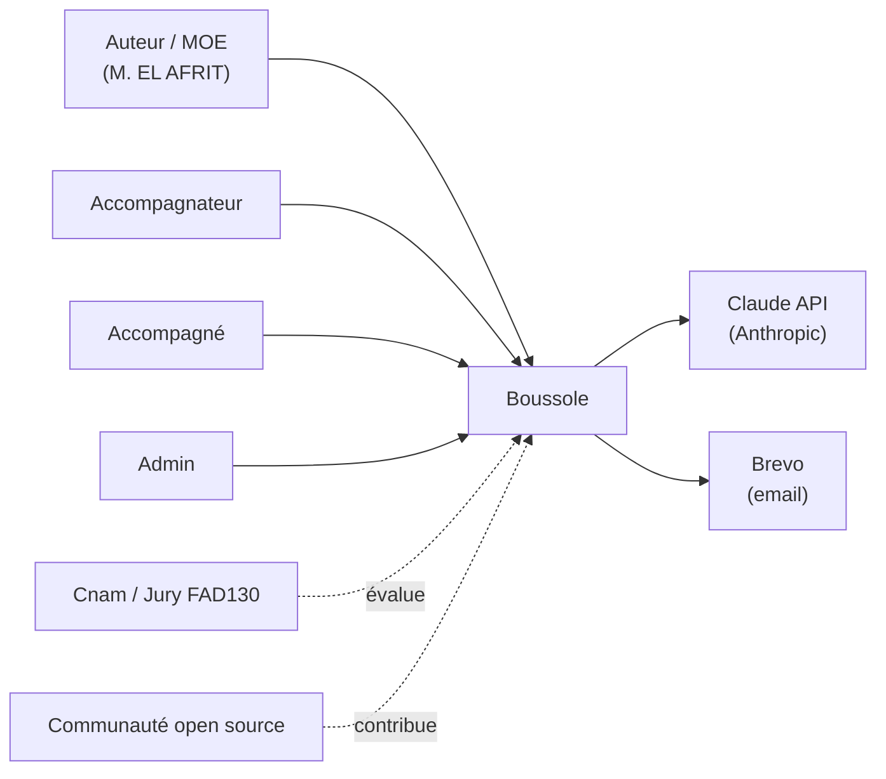
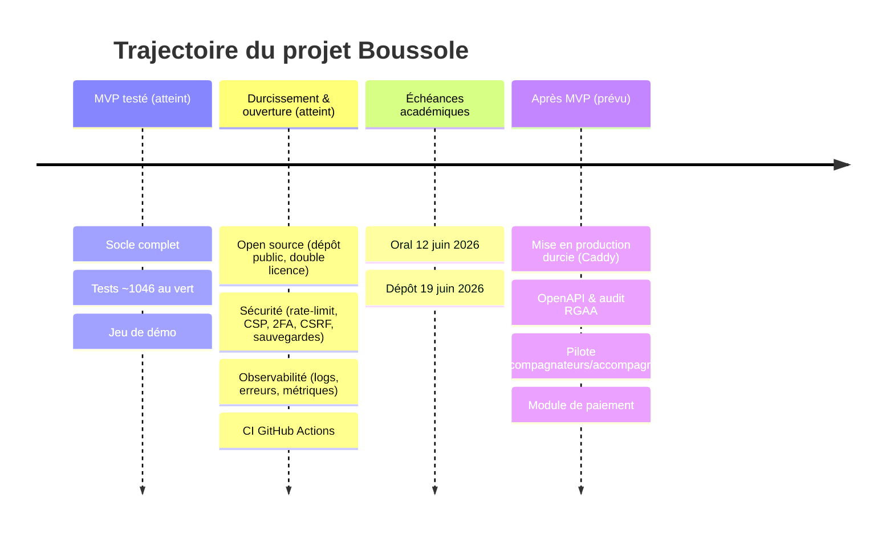

# Résumé exécutif — Boussole

Boussole est une plateforme web d'accompagnement à la rédaction de mémoires de master, conçue dans le cadre de l'UE FAD130 du Cnam. Elle outille la relation entre un **accompagnateur** (qui doit poser les bonnes questions et tenir une posture juste) et un **accompagné** (étudiant ou alternant qui doit faire avancer son mémoire), en s'appuyant sur l'IA Claude pour structurer l'entretien, produire des comptes rendus et des synthèses, et piloter un plan d'action. À la date de ce dossier, le produit est un **MVP fonctionnellement riche**, désormais **publié en open source** (dépôt GitHub public, double licence), **durci côté sécurité** (rate-limiting, CSP, 2FA, CSRF, sauvegardes), **observable** (logs structurés, journal d'erreurs, métriques) et adossé à une **intégration continue opérationnelle** qui a déjà détecté de vrais bugs. Il est couvert par une **batterie de tests** de l'ordre de **~1046 cas**, porte de non-régression au vert. Ce document est destiné à un comité de direction ou à un investisseur : il synthétise la vision, la valeur, le périmètre, l'état réel et les recommandations, sans entrer dans le détail technique.

## Objectifs de la page

- Donner en une lecture une vision décisionnelle complète du projet Boussole : pourquoi, pour qui, où il en est.
- Distinguer sans ambiguïté ce qui est **déjà livré**, **partiel** ou **prévu**.
- Fournir aux décideurs les indicateurs, bénéfices et recommandations nécessaires à un arbitrage (poursuite, financement, mise en production, transfert).
- Servir de point d'entrée vers les pages d'instruction détaillées (charte, exigences, architecture, business case, feuille de route).

---

## 1. Vision, mission, objectifs

### Vision

Faire de l'entretien d'accompagnement un acte **structuré, traçable et réflexif**, où l'accompagnateur est soutenu dans sa posture par l'IA plutôt que remplacé par elle, et où l'accompagné dispose d'un fil conducteur clair de bout en bout de son mémoire.

### Mission

| Bénéficiaire | Mission de Boussole |
| --- | --- |
| **Accompagnateur** | L'aider à poser les bonnes questions, tenir une posture juste, et produire un compte rendu structuré + un plan d'action sans charge rédactionnelle excessive. |
| **Accompagné** (étudiant / alternant master) | L'aider à avancer concrètement sur son mémoire : clarifier le besoin, structurer la pensée, suivre ses engagements, garder une vision « où j'en suis ». |
| **Institution (Cnam / cadre FAD130)** | Démontrer un dispositif d'accompagnement outillé, éthique (RGPD), testé, reproductible et **ouvert** (open source, double licence). |

### Objectifs stratégiques

| # | Objectif | Horizon | État |
| --- | --- | --- | --- |
| O1 | Couvrir le parcours complet d'accompagnement (questionnaire → entretien → CR → plan → synthèse) | Court terme | **Livré** |
| O2 | Garantir une IA qui ne tombe jamais en panne (repli déterministe systématique) | Court terme | **Livré** |
| O3 | Industrialiser la qualité par une batterie de tests automatisée **et une CI** (porte de non-régression) | Court terme | **Livré** (~1046 cas + CI GitHub Actions) |
| O4 | Modéliser une offre commerciale par feature-gating (plans d'abonnement) | Court terme | **Livré** (gating), **partiel** (pas de paiement réel) |
| O5 | Durcir la sécurité et l'observabilité de niveau production (rate-limit, CSP, 2FA, CSRF, sauvegardes, logs, métriques) | Court terme | **Livré** |
| O6 | Ouvrir le projet (open source, double licence, gouvernance de contribution) | Court terme | **Livré** |
| O7 | Atteindre la conformité de production (déploiement Caddy/TLS, domaine `boussole.elafrit.com`) | Moyen terme | **Partiel** |
| O8 | Valider l'usage réel auprès d'accompagnateurs et d'accompagnés du Cnam | Moyen terme | **Prévu** |

> **Hypothèse — confiance : moyenne** — Les horizons « court / moyen terme » sont déduits de l'état d'avancement et des échéances académiques (oral 12 juin, dépôt 19 juin 2026) ; ils ne correspondent pas à un planning d'entreprise formalisé. Voir [Feuille de route](roadmap).

---

## 2. Problématique adressée & contexte métier

L'accompagnement de mémoires souffre de trois tensions récurrentes que Boussole adresse directement.

Ce diagramme relie chaque problème métier à la réponse fonctionnelle de Boussole et à la valeur consolidée. **Contexte** : le terrain est l'accompagnement de mémoires de master au Cnam (étudiants et alternants), un acte relationnel et exigeant où la qualité de l'entretien conditionne l'avancement du mémoire. Boussole ne se substitue pas à l'accompagnateur : elle l'outille.

> **Hypothèse — confiance : faible** — La taille de marché (nombre d'accompagnateurs/accompagnés concernés au Cnam et au-delà) n'est pas chiffrée dans le code ni la documentation fournie. *Information non identifiée dans le code ou la conversation.* Une instruction de marché relève de l'[Étude d'opportunité](opportunity-study).

---

## 3. Valeur apportée

| Axe de valeur | Pour qui | Comment Boussole le délivre |
| --- | --- | --- |
| **Gain de temps de formalisation** | Accompagnateur | Génération IA des comptes rendus et synthèses, éditables en HTML (TipTap), versionnés. |
| **Qualité de posture** | Accompagnateur | Co-pilote d'entretien, miroir réflexif de posture, entretien guidé en 6 phases, banque de questions. |
| **Continuité & autonomie** | Accompagné | Fil rouge, résumé « où j'en suis », plan d'action SMART avec rappels, multi-parcours. |
| **Robustesse** | Tous | Repli déterministe sur chaque fonction IA : jamais de 500, dégradation maîtrisée. |
| **Confiance & conformité** | Institution / accompagné | RGPD natif (consentement versionné, effacement, anonymisation, rétention, journal d'accès). |
| **Sécurité** | Tous | Durcissement complet : rate-limiting, CSP & en-têtes, 2FA TOTP opt-in, protection CSRF, sauvegardes SQLite horodatées. |
| **Transparence & confiance** | Institution / écosystème | **Open source** (dépôt public, double licence AGPL-3.0 + CC BY-NC-SA 4.0), code auditable et reproductible. |
| **Pilotage** | Accompagnateur | Signaux faibles (décrochage), tableau d'impact, digest hebdomadaire. |
| **Preuve de qualité** | Direction / financeur | Batterie de tests ISTQB (~1046 cas) + **CI** rejouée à chaque push, ayant déjà détecté de vrais bugs. |

---

## 4. Périmètre

### Dans le périmètre (livré ou en cours)

Le diagramme distingue le **socle métier** (le parcours linéaire questionnaire → synthèse, plus RDV et multi-parcours), les **outils transverses** activables (dont un wiki avec partage public opt-in, historique de versions et export global), et la **qualité de service** désormais livrée (sécurité, observabilité, CI, open source, i18n). Les fonctionnalités sont regroupées en familles : socle, visuel, IA & posture, relationnel, émergence, pilotage, collaboration, éthique, confort, adoption.

### Hors périmètre actuel

| Élément hors périmètre | Statut | Note |
| --- | --- | --- |
| Paiement / facturation réel | **Absent** | Les plans démontrent le gating ; aucun encaissement implémenté (préparé pour plus tard). |
| OpenAPI / Swagger interactif | **Prévu** | Documentation d'API interactive non encore livrée. |
| Audit RGAA (accessibilité) | **Prévu** | Audit d'accessibilité formel non encore réalisé. |
| Application mobile native | **Absent** | PWA + push présents ; pas d'app store. |
| Multi-tenant / multi-établissement | *Non identifié dans le code* | SQLite mono-instance, mono-fichier. |
| SSO institutionnel (Cnam) | *Non identifié dans le code* | Auth propre par cookie JWT (+ 2FA TOTP opt-in). |

---

## 5. Parties prenantes

| Partie prenante | Rôle | Intérêt principal |
| --- | --- | --- |
| **Mohamed EL AFRIT** | Auteur unique, maître d'œuvre (projet académique solo) | Livrer un produit complet, testé, ouvert, soutenable à l'oral et au dépôt. |
| **Accompagnateur** | Utilisateur clé (rôle `accompagnateur`) | Tenir une posture juste, gagner du temps sur la formalisation. |
| **Accompagné** | Utilisateur clé (rôle `accompagne`) | Avancer sur son mémoire, garder le fil. |
| **Administrateur** | Rôle `admin` | Gérer utilisateurs, plans/features, demandes RGPD, superviser les métriques. |
| **Cnam / jury FAD130** | Commanditaire académique | Qualité, conformité, démonstrabilité et ouverture du dispositif. |
| **Communauté open source** | Contributeurs potentiels (dépôt public) | Auditer, réutiliser, contribuer dans le cadre des licences. |
| **Anthropic (Claude)** | Fournisseur IA externe | Dépendance technique encadrée par repli déterministe. |
| **Brevo** | Fournisseur d'emails transactionnels | Délivrabilité des notifications/rappels. |

Ce diagramme positionne les utilisateurs (à gauche), les dépendances externes (à droite), le commanditaire académique (en évaluation) et la communauté open source (en contribution). Le détail des accès et habilitations figure dans [Sécurité](security) et [Charte de projet](project-charter).

---

## 6. Indicateurs de succès (KPI)

| KPI | Définition | Cible | Source / état |
| --- | --- | --- | --- |
| Taux de réussite des tests | Tests verts / total | ≥ 99 % | **Au vert** (~1046 cas, gate « run-all »). |
| Intégration continue | Pipeline rejoué à chaque push | Vert systématique | **Opérationnelle** (GitHub Actions) — a déjà détecté 2 vrais bugs invisibles en local. |
| Disponibilité de l'IA perçue | Absence de 500 sur fonctions IA | 100 % | **Garanti par conception** (repli déterministe). |
| Couverture du parcours | Étapes métier outillées de bout en bout | 100 % du socle | **Atteint** (questionnaire → synthèse). |
| Posture de sécurité | Contrôles de durcissement en place | Conforme aux bonnes pratiques | **Livré** (rate-limit, CSP, 2FA, CSRF, sauvegardes). |
| Parcours menés à terme | Dossiers passés à `cloture` avec synthèse publiée | *À définir* | Mesurable (statut `dossiers`, `syntheses.publiable`) — pas encore suivi en usage réel. |
| Adoption accompagnateurs | Comptes actifs hors démo | *À définir* | **Prévu** — nécessite déploiement & pilote. |

> **Hypothèse — confiance : moyenne** — Les cibles « réussite tests », « CI verte » et « disponibilité IA » sont déduites de la stratégie qualité réelle. Les cibles d'adoption et de complétion sont des **placeholders** : *aucun objectif chiffré d'usage n'est fixé dans le code ou la conversation.* Voir [Stratégie de test](testing-strategy) et [Business case](business-case).

---

## 7. Bénéfices attendus

| Type | Bénéfice | Confiance |
| --- | --- | --- |
| **Qualitatif** | Meilleure posture d'accompagnement, entretiens plus structurés. | Élevée (conçu pour cela). |
| **Qualitatif** | Réduction de la charge de rédaction des CR/synthèses. | Élevée. |
| **Qualitatif** | Continuité et autonomie de l'accompagné (fil rouge, résumé, plan). | Élevée. |
| **Opérationnel** | Robustesse opérationnelle (jamais de panne IA bloquante). | Élevée (vérifié par conception + tests). |
| **Opérationnel** | Sécurité durcie et exploitation observable (logs, métriques, sauvegardes). | Élevée (livré). |
| **Conformité** | Conformité RGPD démontrable (consentement, effacement, rétention). | Élevée. |
| **Transparence** | Ouverture du code (open source, double licence) : auditabilité, réutilisabilité. | Élevée (livré). |
| **Économique** | Modèle d'offre par paliers (Découverte / Essentiel / Pro). | Moyenne (gating réel, monétisation non implémentée). |

> **Hypothèse — confiance : faible** — Aucun bénéfice **financier chiffré** (ROI, revenu, économies en euros) n'est étayé par le code ou la conversation. *Information non identifiée.* Toute valorisation monétaire doit être instruite dans le [Business case](business-case).

---

## 8. État actuel du projet

Le produit est un **MVP riche, testé, sécurisé et ouvert**, pas un prototype. Depuis la version initiale du dossier, il a franchi plusieurs caps de qualité de service.

| Dimension | Mesure | Statut |
| --- | --- | --- |
| Fonctionnalités | Familles métier + transverses activables par plan | **Livré** |
| API | Routeurs sous `/api` (dont wiki, 2FA, sécurité, observabilité) | **Livré** |
| Données | SQLite (better-sqlite3, WAL, FK ON) + nouvelles tables/colonnes (wiki, versions, error_log, 2FA, RGPD) | **Livré** |
| Rôles & sécurité | 3 rôles, auth JWT cookie httpOnly, gating par feature | **Livré** |
| IA | Claude + repli déterministe sur chaque fonction | **Livré** |
| Open source | Dépôt GitHub **public** `melafrit/FAD130_accompagnement_pro`, double licence AGPL-3.0 (code) + CC BY-NC-SA 4.0 (doc), README / CONTRIBUTING / SECURITY | **Livré** |
| Internationalisation | react-i18next (FR par défaut, amorce EN, sélecteur FR/EN) | **Livré** |
| Wiki avancé | Partage public opt-in par lien tokenisé (révocable), historique de versions (restauration), export global (md/docx/pdf) | **Livré** |
| Sécurité durcie | Rate-limiting (global + strict `/api/auth`), CSP & en-têtes (helmet + nginx), 2FA TOTP opt-in (otplib, QR), CSRF double-submit, sauvegardes SQLite « online » horodatées + rétention | **Livré** |
| Observabilité | Logs structurés (pino), table `error_log` + `reportError()`, middleware d'erreur centralisé, endpoint `GET /api/metrics` (admin) | **Livré** |
| Intégration continue | GitHub Actions (unit + API + UI Playwright) sur base fraîche, sans clé Anthropic (repli déterministe ⇒ reproductible) ; a déjà détecté 2 vrais bugs | **Livré** |
| Qualité | Batterie ~1046 cas (1204 d'origine + domaines wiki / 2FA / sécurité / CSRF / observabilité), gate « run-all » au vert | **Livré** |
| Données de démo | Vitrine Mohamed/Amine, jeu 2 accompagnateurs / 3 accompagnés / 6 dossiers | **Livré** |
| Déploiement prod | **Caddy** + TLS, `boussole.elafrit.com` | **Partiel** |
| Documentation d'API interactive | OpenAPI / Swagger | **Prévu** |
| Accessibilité | Audit RGAA | **Prévu** |
| Monétisation | Paiement réel | **Absent** (volontairement, préparé plus tard) |
| Pilote terrain | Usage réel hors démo | **Prévu** |

Cette frise situe l'état atteint (MVP testé, puis durci et ouvert), les jalons académiques imposés, puis les étapes envisagées post-MVP (OpenAPI, RGAA, paiement, pilote). Le détail figure dans [Feuille de route](roadmap) et l'[état de dette technique](technical-debt).

---

## Hypothèses

> **Hypothèse — confiance : élevée** — L'état de référence des tests (~1046 cas au vert), la CI GitHub Actions opérationnelle, le durcissement sécurité (rate-limit, CSP, 2FA, CSRF, sauvegardes), l'observabilité et l'ouverture open source (double licence) sont exacts à la date du dossier : ils proviennent directement du contexte projet et sont cohérents avec le code source inspecté.

> **Hypothèse — confiance : moyenne** — Le projet reste un **livrable académique solo** (auteur unique, cadre FAD130) ; toute lecture « investisseur » est une projection pédagogique, non un plan d'affaires engagé.

> **Hypothèse — confiance : faible** — Les éléments de marché, de revenu et de ROI ne sont **pas définis** dans les sources. Ils sont explicitement laissés à instruire (business case, étude d'opportunité). *Information non identifiée dans le code ou la conversation.*

---

## Risques & points d'attention

| Risque | Impact | Probabilité | Atténuation actuelle / recommandée |
| --- | --- | --- | --- |
| Dépendance à l'API Claude (coût, disponibilité) | Moyen | Moyenne | **Atténué** : repli déterministe sur chaque fonction IA. Surveiller le coût d'usage à l'échelle. |
| Mono-instance SQLite (montée en charge, concurrence) | Moyen | Faible à l'échelle académique | Acceptable pour le périmètre ; sauvegardes « online » horodatées en place. À réévaluer pour un usage multi-établissement. Voir [Architecture des données](data-architecture). |
| Absence de monétisation réelle | Faible (volontaire) | — | Décision assumée ; gating prêt à recevoir un module de paiement. |
| API non documentée formellement (pas d'OpenAPI) | Faible à moyen | Moyenne | À instruire : OpenAPI/Swagger interactif prévu. |
| Accessibilité non auditée (RGAA) | Moyen | Certaine tant que non fait | Audit RGAA prévu ; à planifier avant ouverture publique large. |
| Projet à acteur unique (bus factor = 1) | Élevé en cas de transfert | — | Atténué : documentation (ce wiki), tests automatisés + CI, ADR, code ouvert. Voir [ADR](adr). |
| Données de marché / ROI non établies | Moyen pour une décision d'investissement | Certaine | Instruire [Business case](business-case) et [Étude d'opportunité](opportunity-study). |
| Mise en production non finalisée | Moyen | Moyenne | Durcir le déploiement **Caddy**/TLS. Sécurité et sauvegardes déjà en place. Voir [Déploiement](deployment) et [Exploitation](operations). |

Le registre complet et qualifié figure dans [Registre des risques](risk-register).

---

## Recommandations

1. **Valider le MVP en l'état comme socle décisionnel.** Le produit est complet sur son périmètre métier, couvert par une batterie de tests (~1046 cas) **et une CI** qui a déjà détecté de vrais bugs, désormais **sécurisé, observable et ouvert** ; il constitue une base crédible pour un arbitrage.
2. **Lancer un pilote terrain restreint** auprès d'accompagnateurs et d'accompagnés réels du Cnam pour instrumenter les KPI d'usage aujourd'hui non mesurés (complétion de parcours, adoption). Voir [Feuille de route](roadmap).
3. **Finaliser la mise en production durcie** (Caddy/TLS sur `boussole.elafrit.com`, supervision, sauvegardes — déjà partiellement en place) avant toute ouverture externe. Voir [Déploiement](deployment) et [Exploitation](operations).
4. **Compléter la documentation et la conformité** restantes : **OpenAPI/Swagger interactif** et **audit RGAA**, identifiés comme non encore livrés.
5. **Instruire la dimension économique** (coûts d'API Claude à l'échelle, modèle de revenu des plans, futur module de paiement) dans un [Business case](business-case) chiffré avant toute décision d'investissement.
6. **Capitaliser sur l'ouverture** (dépôt public, double licence, CONTRIBUTING/SECURITY) pour réduire le risque de transfert (acteur unique) et favoriser l'auditabilité. Voir [ADR](adr) et [Matrice de traçabilité](traceability-matrix).

---

## Pages liées

- [Charte de projet](project-charter)
- [Exigences](requirements)
- [Spécifications fonctionnelles](functional-specifications)
- [Business case](business-case)
- [Étude d'opportunité](opportunity-study)
- [Étude de faisabilité](feasibility-study)
- [Architecture technique](technical-architecture)
- [Architecture des données](data-architecture)
- [Stratégie de test](testing-strategy)
- [Feuille de route](roadmap)
- [Registre des risques](risk-register)
- [Sécurité](security)
