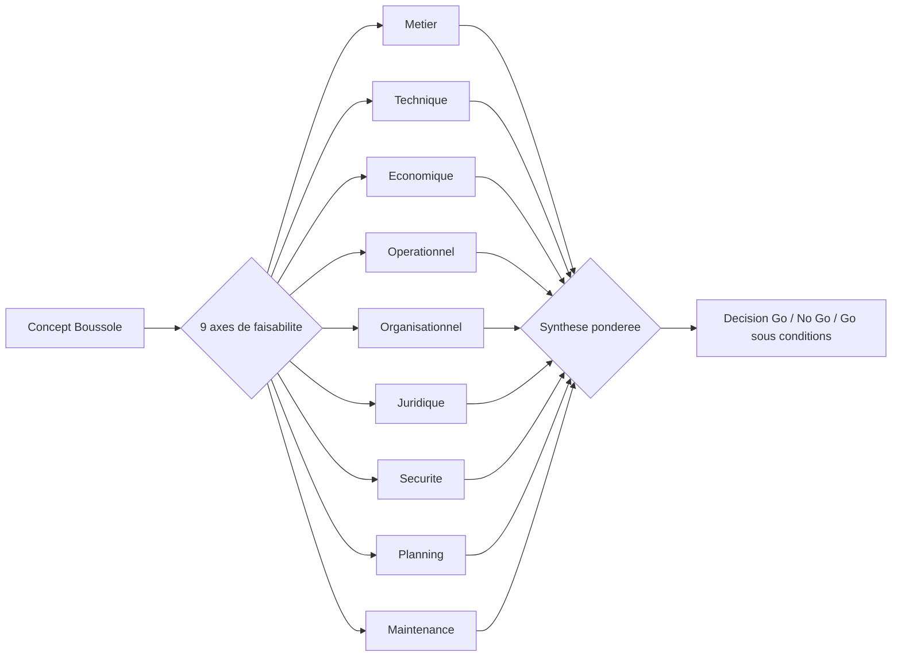
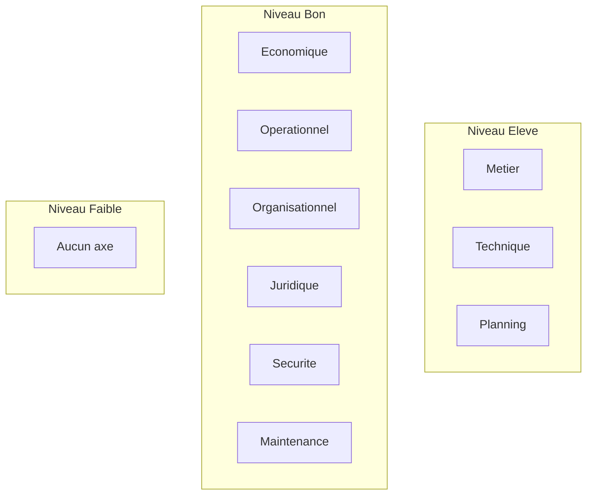
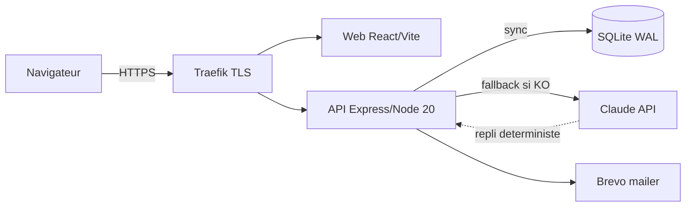
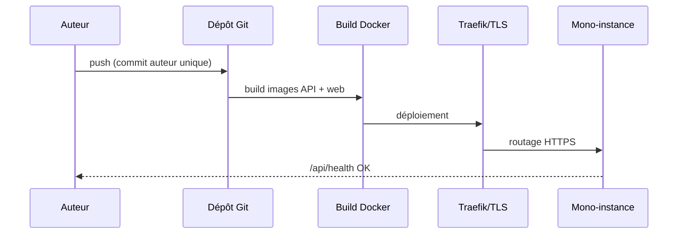
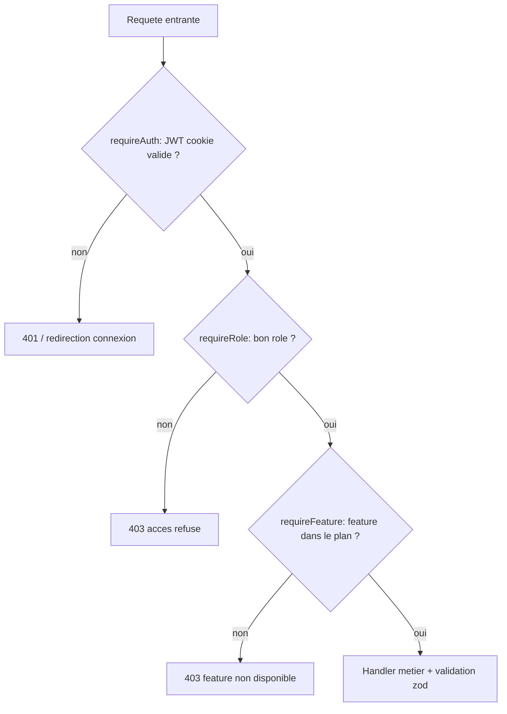
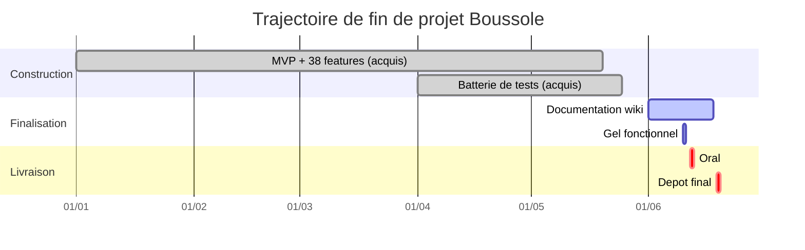
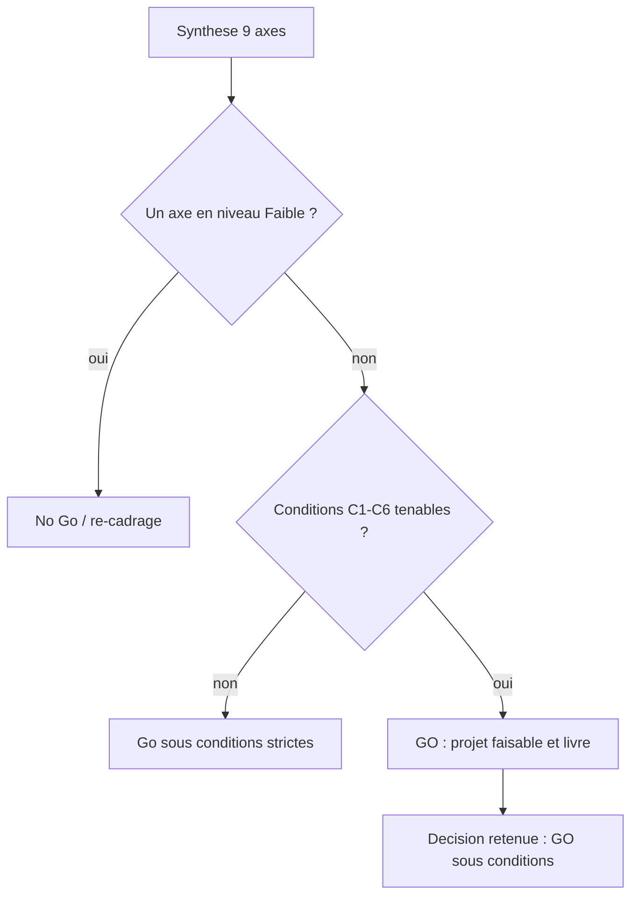

# Étude de faisabilité

Cette page établit la faisabilité de l'application **Boussole** (accompagnement à la rédaction de mémoires, cadre Cnam / UE FAD130) selon neuf axes d'analyse : métier, technique, économique, opérationnel, organisationnel, juridique, sécurité, planning et maintenance. Chaque axe est noté, ses risques et ses conditions de succès identifiés, puis une décision **Go / No Go / Go sous conditions** est formulée. L'analyse s'ancre sur le réel observé dans le projet : une stack maîtrisée et homogène (Node/React/TypeScript/SQLite/Claude), un **MVP déjà fonctionnel et déployé** (38 fonctionnalités, 145 endpoints, 33 tables), une **batterie de tests verte** (959/961) et un **périmètre solo** assumé avec des contraintes RGPD intégrées dès la conception.

## Objectifs de la page

- Statuer sur la **faisabilité globale** du projet à l'horizon de la livraison académique (oral 12 juin 2026, dépôt 19 juin 2026).
- Décomposer la faisabilité par **axe d'analyse** avec une grille homogène : analyse, niveau, risques, conditions de succès.
- Distinguer ce qui est **déjà acquis** (développé, testé, déployé) de ce qui reste **conditionnel** ou **hors périmètre**.
- Produire une **conclusion décisionnelle explicite** (Go / No Go / Go sous conditions) assortie de recommandations actionnables.
- Servir de pièce de cadrage reliée au [Résumé exécutif](executive-summary), à l'[Étude d'opportunité](opportunity-study) et à la [Charte de projet](project-charter).

## 1. Cadre et méthode

L'étude couvre la viabilité d'un produit **déjà construit** : il ne s'agit pas d'évaluer un concept abstrait mais de vérifier que le système livré est soutenable dans sa dimension académique (démontrer la maîtrise FAD130) et, secondairement, exploitable au-delà. La grille d'évaluation s'appuie sur une échelle à quatre niveaux.

| Niveau | Signification | Critère de décision |
|--------|---------------|---------------------|
| **Élevé** | Faisabilité démontrée, preuve dans le code / les tests | Go franc |
| **Bon** | Faisabilité acquise, quelques conditions mineures | Go |
| **Moyen** | Faisable sous conditions explicites à lever | Go sous conditions |
| **Faible** | Obstacle structurel non résolu | No Go ou re-cadrage |

Le diagramme ci-dessus rappelle la logique d'agrégation : chaque axe produit un niveau de faisabilité, et la synthèse pondérée conduit à la décision finale. Aucun axe pris isolément ne suffit ; un axe « Faible » sur une dimension structurelle (ex. juridique) pèserait fortement sur la conclusion.

## 2. Synthèse par axe

Le tableau suivant est la **vue de direction** : il condense les neuf axes. Les sections détaillées qui suivent développent chaque ligne.

| Axe | Analyse (synthèse) | Niveau | Risque principal | Condition de succès clé |
|-----|--------------------|--------|------------------|--------------------------|
| Métier | Besoin réel (accompagnement mémoire), valeur posée sur posture + IA + CR structuré | Élevé | Adoption au-delà de la démo non prouvée | Maintenir le repli déterministe (jamais de blocage) |
| Technique | Stack homogène et maîtrisée, MVP fonctionnel | Élevé | Mono-instance SQLite, dépendance API Anthropic | Repli IA systématique déjà en place |
| Économique | Coûts maîtrisés, pas de paiement réel | Bon | Coût variable des appels Claude | Plafonner / cacher les appels IA |
| Opérationnel | Docker + Traefik, déploiement reproductible | Bon | Exploitation 1 personne | Sauvegardes + supervision minimale |
| Organisationnel | Projet solo, périmètre figé | Bon | Bus factor = 1 | Documentation (ce wiki) à jour |
| Juridique | RGPD intégré (consentement, effacement, rétention) | Bon | Sous-traitance IA hors UE | Mention transparente + minimisation |
| Sécurité | JWT httpOnly, bcrypt, helmet, zod, RBAC | Bon | Surface d'attente d'audit formel | Revue de sécurité avant prod publique |
| Planning | Échéances proches mais MVP déjà livré | Élevé | Marge faible avant l'oral | Gel fonctionnel, focus dépôt |
| Maintenance | Tests verts, monorepo, ADR | Bon | Dette technique latente | Porte de non-régression « run-all » |

Aucun axe n'atteint le niveau « Faible » : c'est le constat structurant de l'étude. Trois axes (métier, technique, planning) sont au niveau **Élevé** grâce à des preuves matérielles (code, tests, déploiement). Les six autres sont **Bons**, avec des conditions de succès maîtrisables. Cette répartition oriente directement la conclusion vers un **Go**.

## 3. Faisabilité métier

**Analyse.** Le besoin est avéré : les étudiants/alternants de master peinent à structurer leur mémoire et les accompagnateurs manquent d'outils pour tenir une posture juste et produire des comptes rendus exploitables. Boussole adresse les deux versants (accompagnateur ET accompagné) avec un parcours métier complet en six phases d'entretien, un compte rendu structuré, un plan d'action SMART et une synthèse de parcours. Le multi-parcours couvre le cas réel d'un accompagné suivant plusieurs mémoires/itérations.

**Niveau : Élevé.** Le workflow métier est entièrement implémenté et démontré par un jeu de données vitrine (Mohamed/Amine).

| Élément métier | État | Preuve |
|----------------|------|--------|
| Parcours en 6 phases | Développé | `app/api/src/phases.ts` |
| Compte rendu structuré IA + édition | Développé | routeur `/api/cr`, TipTap |
| Plan d'action SMART | Développé | routeur `/api/actions`, table `actions` |
| Synthèse de parcours | Développé | routeur `/api/synthese`, table `syntheses` |
| Multi-parcours | Développé | table `dossiers`, `/api/dossiers` |
| Adoption hors démo | Non prouvée | *Information non identifiée dans le code ou la conversation.* |

> **Hypothèse — confiance : moyenne** — la valeur perçue par des accompagnateurs réels (hors auteur) est plausible au vu de la complétude fonctionnelle, mais non mesurée. La preuve attendue dans le cadre FAD130 est la **démonstration de maîtrise**, pas la traction marché.

## 4. Faisabilité technique

**Analyse.** La stack est volontairement homogène et sans surprise : React 18 + Vite + TypeScript en front, Node 20 + Express + TypeScript en back, SQLite via `better-sqlite3` (synchrone, mono-fichier, WAL), validation `zod`, IA Claude avec **repli déterministe systématique**. Cette homogénéité (un seul langage de bout en bout, pas d'ORM, pas de base distribuée) réduit drastiquement la complexité pour un développeur solo. Le système est **déjà fonctionnel** : 145 endpoints, 33 tables, 38 fonctionnalités.

**Niveau : Élevé.** La faisabilité n'est pas à prouver — elle est constatée. Les points d'attention sont des choix d'architecture assumés, non des blocages.

| Sujet technique | Évaluation | Mitigation en place |
|-----------------|------------|---------------------|
| Persistance SQLite mono-instance | Limite la scalabilité horizontale | Acceptable pour cible mono-instance ; cf. [Architecture des données](data-architecture) |
| Dépendance API Anthropic | Point de défaillance externe | **Repli déterministe** sur chaque feature IA (jamais de 500) |
| Build natif `better-sqlite3` en Docker | Risque de portabilité | Image `node:20-bookworm-slim` qui compile le natif |
| TypeScript strict de bout en bout | Réduit les bugs d'intégration | Compilation `tsc` bloquante |

Le schéma d'architecture montre le découplage : le front et l'API sont servis derrière Traefik, l'API accède à SQLite en synchrone, et **l'appel à Claude est toujours doublé d'un repli déterministe** — ce qui élimine l'IA comme point de défaillance bloquant. Voir [Architecture technique](technical-architecture) pour le détail.

## 5. Faisabilité économique

**Analyse.** Le modèle économique réel du projet est **académique** : il n'y a pas de paiement implémenté (les plans d'abonnement Découverte/Essentiel/Pro servent uniquement à démontrer le **feature-gating**). Les coûts d'exploitation se limitent à l'hébergement d'une mono-instance, au domaine `boussole.elafrit.com` et au **coût variable des appels à l'API Claude** et de l'envoi d'emails (Brevo).

**Niveau : Bon.** Les coûts fixes sont faibles et déjà engagés ; le seul poste variable significatif (appels IA) est borné par l'architecture de repli.

| Poste de coût | Nature | Niveau | Maîtrise |
|---------------|--------|--------|----------|
| Hébergement (1 VPS) | Fixe | Faible | Mono-instance Docker |
| Domaine + TLS | Fixe | Très faible | Traefik (Let's Encrypt présumé) |
| Appels API Claude | Variable | Modéré | Repli déterministe + usage maîtrisé |
| Emails transactionnels (Brevo) | Variable | Faible | Volume académique |
| Développement | Interne | — | Auteur unique, déjà réalisé |

> **Hypothèse — confiance : faible** — montants non chiffrés dans le projet. Un VPS d'entrée de gamme se situe usuellement autour de 5–15 €/mois et le coût des appels Claude reste faible à volume de démonstration ; ces chiffres sont **estimés** et n'engagent pas le projet. *Information non identifiée dans le code ou la conversation* concernant un budget formel.

La rentabilité n'est pas un critère FAD130 ; la **soutenabilité du coût** l'est, et elle est acquise.

## 6. Faisabilité opérationnelle

**Analyse.** Le déploiement est reproductible : `docker-compose.local.yml` en local, Traefik + TLS en production, images séparées pour l'API et le web. L'exploitation courante (mises à jour, redémarrage, sauvegarde du fichier SQLite unique) est simple par construction.

**Niveau : Bon.** L'exploitation par une seule personne est réaliste pour la cible, sous réserve d'une routine de sauvegarde.

| Activité opérationnelle | État | Condition |
|--------------------------|------|-----------|
| Déploiement | Reproductible (Docker) | — |
| Sauvegarde | À formaliser | Copie périodique de `boussole.sqlite` (+ WAL) |
| Supervision | Endpoint `/api/health` | Sonde externe à brancher |
| Restauration | Triviale (mono-fichier) | Tester la procédure |

Ce diagramme de séquence décrit la chaîne de livraison : du commit au déploiement derrière Traefik, avec vérification de santé. La simplicité de la chaîne (pas d'orchestrateur lourd, pas de base répliquée) est un atout pour une exploitation solo. Détails en [Déploiement](deployment) et [Exploitation](operations).

## 7. Faisabilité organisationnelle

**Analyse.** Le projet est **solo** (auteur unique, contexte académique). C'est à la fois une force (décision rapide, cohérence) et la principale fragilité organisationnelle (**bus factor = 1** : toute la connaissance repose sur une personne).

**Niveau : Bon.** Le périmètre est figé et la connaissance est en cours de documentation (ce wiki), ce qui compense partiellement le risque de concentration.

| Facteur organisationnel | Évaluation |
|--------------------------|------------|
| Vélocité de décision | Élevée (solo) |
| Bus factor | Faible (= 1) — risque assumé |
| Documentation | En place (wiki admin, ADR, tests documentés) |
| Périmètre | Figé pour la livraison |

> **Hypothèse — confiance : élevée** — pour un livrable académique solo, l'organisation mono-acteur est non seulement faisable mais attendue. Le risque de bus factor n'a pas d'impact sur l'échéance puisque le MVP est déjà livré.

## 8. Faisabilité juridique (RGPD)

**Analyse.** La conformité RGPD est **intégrée par conception**, pas ajoutée après coup : consentement CGU/Politique de confidentialité versionné (table `consentements`, IP horodatée), droit à l'effacement (table `demandes_effacement`, traité par anonymisation `users.anonymise=1` ou suppression), rétention balayée périodiquement (`sweepRetention`), journal d'accès (`journal_acces`), et un routeur dédié `/api/transparence`.

**Niveau : Bon.** Les mécanismes structurants sont présents. Le point d'attention est la **sous-traitance IA** (Anthropic) et le transfert de données potentiellement hors UE.

| Exigence RGPD | Mécanisme implémenté | État |
|---------------|----------------------|------|
| Consentement éclairé et versionné | Table `consentements` + IP | Développé |
| Droit à l'effacement | `demandes_effacement` + anonymisation | Développé |
| Minimisation / rétention | `sweepRetention` | Développé |
| Traçabilité des accès | `journal_acces` | Développé |
| Transparence | Routeur `/api/transparence`, feature `transparence` | Développé |
| Information sur la sous-traitance IA | À expliciter | Partiel |

> **Hypothèse — confiance : moyenne** — l'envoi de contenus d'entretien à un sous-traitant IA externe doit être couvert par une mention de transparence et une minimisation des données transmises. Le cadre académique réduit l'exposition, mais une mise en production publique exigerait une analyse d'impact (AIPD) formelle. Voir [Sécurité](security) et [Transparence (RGPD)](transparence) le cas échéant.

## 9. Faisabilité sécurité

**Analyse.** Les fondamentaux de sécurité applicative sont en place : authentification JWT en **cookie httpOnly** (`sameSite=lax`, `secure` en prod, expiration 7 jours), mots de passe `bcryptjs` (10 rounds), en-têtes durcis par `helmet`, CORS avec credentials, validation systématique des entrées par `zod`, contrôle d'accès à trois niveaux (`requireAuth`, `requireRole`, `requireFeature`).

**Niveau : Bon.** Le socle est solide pour un projet académique ; un **audit de sécurité formel** reste la condition d'une exposition publique large.

| Contrôle de sécurité | Mécanisme | État |
|----------------------|-----------|------|
| Authentification | JWT cookie httpOnly | Développé |
| Mots de passe | bcrypt 10 rounds | Développé |
| Autorisation (RBAC) | `requireRole`, 3 rôles + CHECK base | Développé |
| Gating fonctionnel | `requireFeature` par plan | Développé |
| Validation d'entrée | `zod` sur les routes | Développé |
| Durcissement HTTP | `helmet`, CORS credentials | Développé |
| Audit de sécurité formel | — | Absent (hors périmètre académique) |

Cette chaîne de contrôle illustre la défense en profondeur côté API : authentification, puis rôle, puis disponibilité de la fonctionnalité dans le plan, avant toute logique métier. Aucune route protégée n'échappe à ce filtrage. Détail complet en [Sécurité](security).

## 10. Faisabilité planning

**Analyse.** Les échéances sont **proches** (oral 12 juin 2026, dépôt 19 juin 2026), ce qui laisserait peu de marge si le développement restait à faire. Or le **MVP est déjà livré et testé** : la charge restante est de l'ordre de la finalisation documentaire et de la non-régression, pas de la construction.

**Niveau : Élevé.** Le risque planning est faible précisément parce que l'essentiel est derrière nous.

| Jalon | Date | État |
|-------|------|------|
| MVP fonctionnel (38 features) | Atteint | Développé et déployé |
| Batterie de tests verte | Atteint | 959/961 |
| Documentation wiki | En cours | Pages de cadrage en rédaction |
| Oral | 12 juin 2026 | À venir |
| Dépôt final | 19 juin 2026 | À venir |

Le diagramme de Gantt situe la finalisation documentaire et le gel fonctionnel sur les dernières semaines, les deux jalons critiques (oral, dépôt) étant alignés sur les dates imposées. La marge est mince mais suffisante puisqu'elle ne porte que sur de la finition. Voir [Feuille de route](roadmap).

## 11. Faisabilité maintenance

**Analyse.** La maintenabilité est soutenue par plusieurs dispositifs : monorepo clair (`app/api`, `app/web`, `app/tests`), typage strict de bout en bout, une **batterie ISTQB** servant de porte de non-régression (`run-all` : reseed → unit → API → UI → rapport), et une traçabilité documentaire (ADR, matrice de traçabilité).

**Niveau : Bon.** La base est saine ; la dette technique existe (inhérente à tout projet livré sous contrainte) mais est tracée.

| Levier de maintenance | État | Référence |
|------------------------|------|-----------|
| Tests automatisés | 959/961 vert | [Stratégie de test](testing-strategy) |
| Porte de non-régression | `run-all` rejouée avant livraison | [Stratégie de test](testing-strategy) |
| Décisions tracées | ADR | [ADR](adr) |
| Traçabilité besoins↔tests | Matrice | [Matrice de traçabilité](traceability-matrix) |
| Dette technique | Suivie | [Dette technique](technical-debt) |

> **Hypothèse — confiance : moyenne** — la dette technique précise (TODO, raccourcis assumés) n'est pas détaillée dans le contexte fourni ; elle est renvoyée à la page [Dette technique](technical-debt). *Information non identifiée dans le code ou la conversation* sur un inventaire chiffré de la dette.

## Conclusion — Décision de faisabilité

**Décision : GO sous conditions** (avec une faisabilité globale forte).

La faisabilité du projet Boussole est **démontrée, non spéculative** : trois axes structurants (métier, technique, planning) sont au niveau **Élevé** grâce à des preuves matérielles — un MVP fonctionnel et déployé, une batterie de tests verte, une stack homogène et maîtrisée. Les six autres axes sont **Bons**, sans aucun axe en niveau « Faible ». Le projet est donc **réalisable et déjà largement réalisé** pour son cadre académique.

Les conditions à tenir sont peu nombreuses et toutes maîtrisables :

| # | Condition de succès | Axe | Criticité |
|---|---------------------|-----|-----------|
| C1 | Maintenir le repli déterministe sur toute feature IA (jamais de 500) | Technique / Métier | Haute |
| C2 | Formaliser une routine de sauvegarde/restauration du fichier SQLite | Opérationnel | Haute |
| C3 | Expliciter la sous-traitance IA dans la mention RGPD + minimiser les données envoyées | Juridique | Moyenne |
| C4 | Geler le périmètre fonctionnel avant l'oral, focaliser sur la livraison | Planning | Haute |
| C5 | Rejouer `run-all` (porte de non-régression) avant chaque livraison | Maintenance | Haute |
| C6 | Réserver un audit de sécurité formel à toute exposition publique élargie | Sécurité | Moyenne |

Cet arbre de décision formalise le raisonnement : aucun axe « Faible » écarte le No Go ; les six conditions étant toutes tenables, la conclusion est un **Go**, qualifié « sous conditions » pour acter le suivi explicite de C1–C6.

## Hypothèses

- **Confiance élevée** — Le MVP, les 38 fonctionnalités, les 145 endpoints, les 33 tables et le score de tests 959/961 sont conformes au contexte projet fourni et constituent des faits acquis.
- **Confiance moyenne** — La valeur perçue par des accompagnateurs réels hors démonstration est plausible mais non mesurée ; l'attendu FAD130 est la maîtrise démontrée, pas la traction.
- **Confiance moyenne** — Le traitement RGPD de la sous-traitance IA (Anthropic, transfert potentiel hors UE) est à expliciter ; il n'engage pas le cadre académique mais conditionnerait une mise en production publique.
- **Confiance faible** — Les montants économiques (VPS ~5–15 €/mois, coût des appels Claude) sont **estimés** et ne figurent pas dans le projet ; aucun budget formel n'a été identifié.
- **Confiance faible** — L'usage de Let's Encrypt via Traefik pour le TLS est supposé d'après la mention « Traefik + TLS » sans configuration explicite vérifiée.

## Risques & points d'attention

| Risque | Axe | Probabilité | Impact | Parade |
|--------|-----|-------------|--------|--------|
| Indisponibilité de l'API Claude | Technique | Moyenne | Faible | Repli déterministe déjà systématique |
| Perte de données (mono-fichier SQLite) | Opérationnel | Faible | Élevé | Sauvegarde périodique + test de restauration (C2) |
| Bus factor = 1 | Organisationnel | Élevée | Moyen | Documentation wiki / ADR à jour |
| Sous-traitance IA hors UE non explicitée | Juridique | Moyenne | Moyen | Mention transparente + minimisation (C3) |
| Absence d'audit de sécurité formel | Sécurité | Certaine | Faible (cadre acad.) | Audit avant exposition publique (C6) |
| Marge planning étroite avant l'oral | Planning | Faible | Moyen | Gel fonctionnel, focus dépôt (C4) |
| Dette technique latente non inventoriée | Maintenance | Moyenne | Faible | Suivi en [Dette technique](technical-debt) |

Le registre détaillé est tenu en [Registre des risques](risk-register).

## Recommandations

1. **Conserver l'invariant « jamais de 500 »** : le repli déterministe est l'atout de robustesse central — ne jamais le retirer ni le contourner, même temporairement (condition C1).
2. **Automatiser la sauvegarde SQLite** (fichier + WAL) avec une procédure de restauration testée avant la livraison (condition C2) — c'est le risque le plus élevé en impact.
3. **Ajouter une mention de transparence sur le recours à l'IA** dans la politique de confidentialité et minimiser les données transmises à Claude (condition C3), pour sécuriser l'axe juridique.
4. **Geler le périmètre fonctionnel** dès maintenant et concentrer l'effort restant sur la documentation et la non-régression jusqu'au dépôt (conditions C4, C5).
5. **Documenter explicitement la limite « mono-instance »** comme un choix d'architecture assumé (et non un défaut) dans [Architecture technique](technical-architecture) et [ADR](adr), afin que la faisabilité technique « Élevée » soit lue dans son contexte.
6. **Réserver l'audit de sécurité et l'AIPD** à un éventuel passage en production publique élargie (condition C6) ; ils sont hors du périmètre académique mais doivent être nommés.

## Pages liées

- [Résumé exécutif](executive-summary) — synthèse décisionnelle d'ensemble.
- [Étude d'opportunité](opportunity-study) — pourquoi ce projet, en amont de la faisabilité.
- [Charte de projet](project-charter) — cadre, périmètre et jalons.
- [Cas d'affaire](business-case) — justification valeur/coût.
- [Architecture technique](technical-architecture) — détail de la stack et du mono-instance.
- [Architecture des données](data-architecture) — modèle SQLite et 33 tables.
- [Sécurité](security) — contrôles d'authentification, RBAC et RGPD.
- [Stratégie de test](testing-strategy) — batterie ISTQB et porte de non-régression.
- [Déploiement](deployment) et [Exploitation](operations) — chaîne de livraison et exploitation.
- [Feuille de route](roadmap) — jalons et trajectoire de fin de projet.
- [Registre des risques](risk-register) et [Dette technique](technical-debt) — suivi des risques et de la dette.
