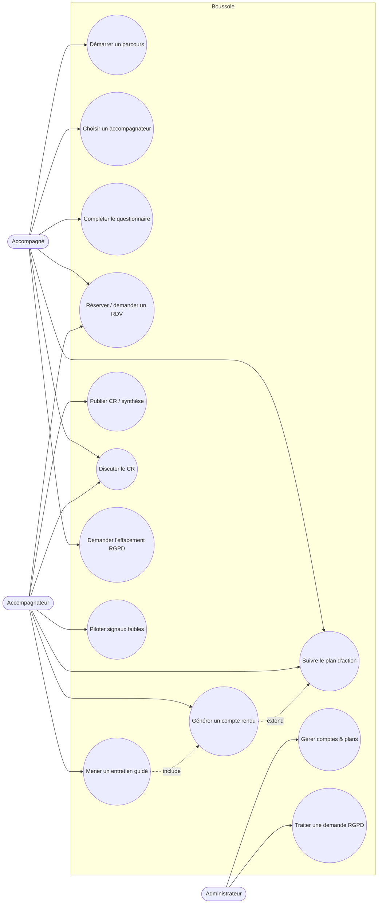
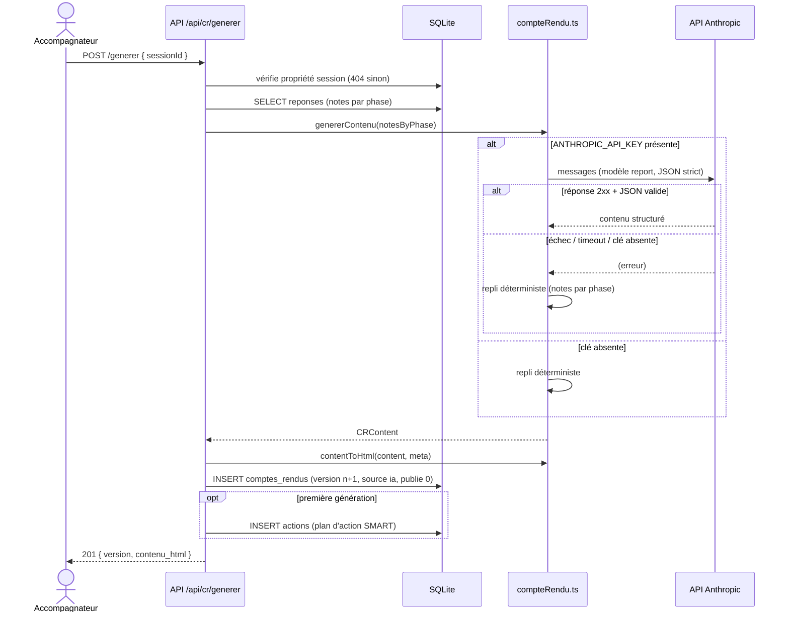
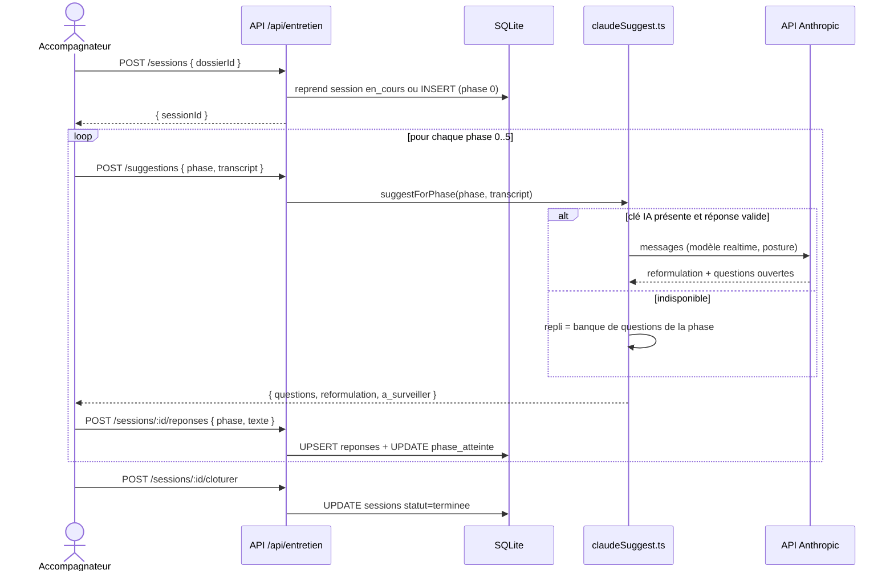
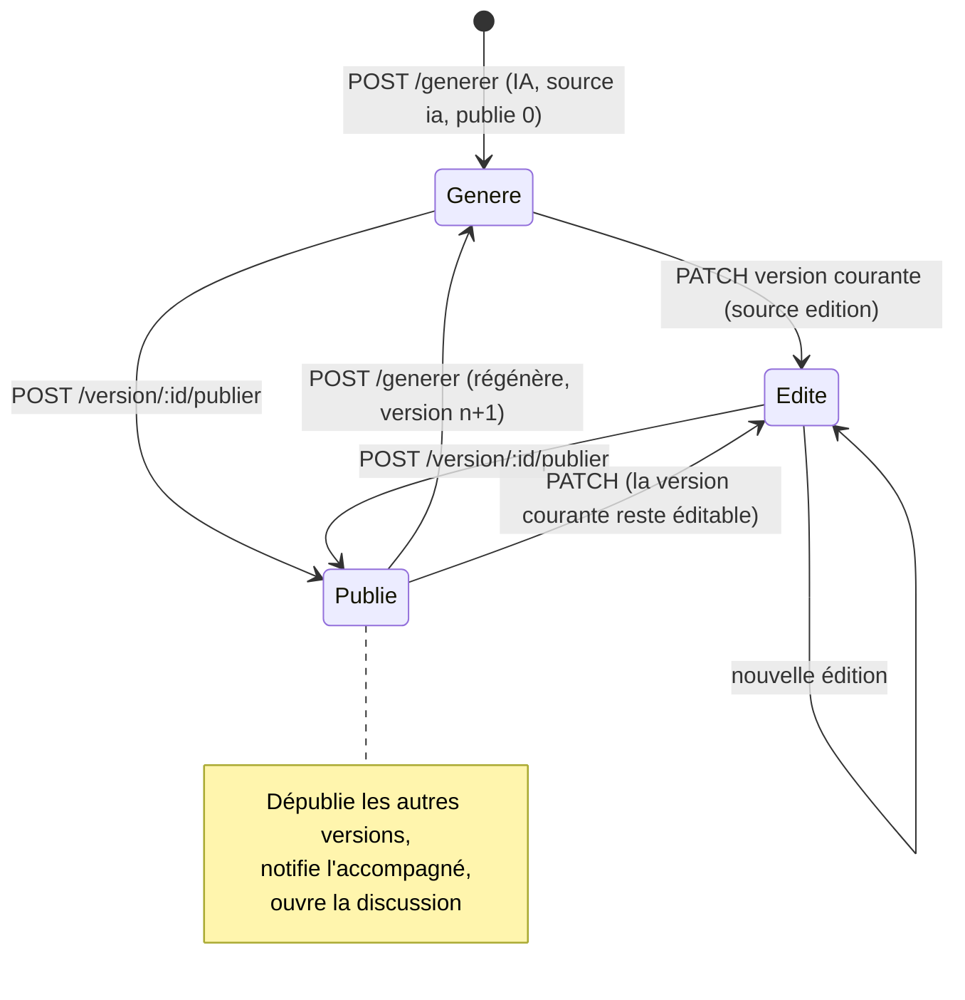

# Spécifications fonctionnelles

Cette page établit la cartographie fonctionnelle exhaustive de l'application **Boussole** et formalise ses cas d'utilisation clés. Elle relie chaque fonctionnalité à ses acteurs, à son module logiciel, à son statut de réalisation et aux données qu'elle manipule, afin de servir de référence partagée entre la maîtrise d'ouvrage (cadrage FAD130) et la réalisation technique. Le périmètre couvert correspond aux **38 fonctionnalités** déclarées dans le registre `features.ts`, exposées par **24 routeurs** (~145 endpoints) montés sous `/api`, et adossées à **3 rôles** (`admin`, `accompagnateur`, `accompagne`). Les éléments non démontrés par le code sont explicitement marqués comme hypothèses.

## Objectifs de la page

- Fournir une **vue d'ensemble actionnable** du quoi-fait-quoi : fonctionnalité, module, acteurs, description, statut, fichiers, données.
- Donner une lecture **par acteur** (diagramme de cas d'utilisation) du système.
- Détailler les **cas d'utilisation structurants** (préconditions, scénario nominal, extensions, règles métier) pour cadrer développement, tests et recette.
- Documenter les **interactions IA ↔ repli déterministe** au moyen de diagrammes de séquence, afin de garantir la propriété « jamais de 500, on dégrade ».
- Établir les **liens de traçabilité** vers les exigences, l'architecture, les données et la stratégie de test.

Cette page est descriptive (le « quoi »). Le « comment » technique est traité dans [Architecture technique](technical-architecture) et [Documentation API](api-documentation) ; le « pourquoi » dans [Cahier des besoins](requirements).

## Cartographie fonctionnelle

### Conventions de lecture

- **Acteurs** : `ADM` = admin, `ACC` = accompagnateur, `ACG` = accompagné. `SYS` = tâche planifiée serveur (`setInterval`/`setTimeout`).
- **Statut** : ✅ *Développé* (endpoint + écran opérationnels) · 🟧 *Partiel* (back présent, surface front ou IA réduite) · 🟦 *Prévu* · ⬜ *Absent*. Hors marquage contraire, l'ensemble du périchamp ci-dessous est ✅, conformément à l'état de référence des tests (959/961 verts).
- **Gating** : sauf le socle, chaque fonctionnalité est conditionnée à la présence de sa clé dans le plan d'abonnement de l'utilisateur (`requireFeature(key)` → 403 si absente ; `plan_id` NULL = accès maximal).

### Socle métier

| Fonctionnalité | Module (routeur) | Acteurs | Description | Statut | Fichiers concernés | Données manipulées |
|---|---|---|---|---|---|---|
| Authentification & compte | `/api/auth` | ADM, ACC, ACG | Inscription, vérif. email, login (cookie JWT httpOnly), logout, profil, changement mot de passe / email, reset | ✅ | `auth.ts` | `users`, `tokens`, `consentements`, `journal_acces` |
| Multi-parcours | `/api/dossiers` | ACG, ACC | L'accompagné démarre N parcours, choisit son accompagnateur (création du lien + dossier) ; liste et détail | ✅ | `dossier.ts` | `dossiers`, `liens_accompagnement`, `notifications` |
| Questionnaire initial | `/api/questionnaire` | ACG | Recueil guidé par IA du point de départ ; récapitulatif (`cr_recap`) rattaché au dossier | ✅ | `questionnaire.ts` | `questionnaires_initiaux`, `dossiers` |
| Rendez-vous | `/api/rdv` | ACC, ACG | Publication de créneaux, réservation, demande si aucun créneau, export `.ics` | ✅ | `rdv.ts` | `creneaux`, `rdv`, `demandes_rdv` |
| Entretien guidé (6 phases) | `/api/entretien` | ACC | Session rattachée à un dossier ; notes par phase ; questions posées ; suggestions IA temps réel | ✅ | `entretien.ts`, `phases.ts`, `claudeSuggest.ts` | `sessions`, `reponses`, `questions_entretien`, `suggestions_ia` |
| Comptes rendus | `/api/cr` | ACC, ACG | Génération IA (HTML), versions, édition, publication, discussion, notes privées | ✅ | `cr.ts`, `compteRendu.ts` | `comptes_rendus`, `cr_messages`, `cr_notes_privees`, `actions` |
| Plan d'action | `/api/actions` | ACC, ACG | Actions SMART (libellé, échéance, critère, priorité), réordonnancement glisser-déposer, rappels email | ✅ | `actions.ts`, `notifications.ts` | `actions`, `notifications` |
| Synthèse de parcours | `/api/synthese`, `/api/dossiers/:id/synthese` | ACC, ACG | Document de synthèse versionné, publiable, avec fil de discussion | ✅ | `synthese.ts`, `dossier.ts` | `syntheses`, `synthese_messages`, `dossiers` |
| Auto-évaluation | `/api/autoeval` | ACC | Grille interactive de la pratique, scoring, aide IA, validation | ✅ | `autoeval.ts` | `auto_evaluations`, `auto_evaluation_scores` |

### IA & posture

| Fonctionnalité | Module | Acteurs | Description | Statut | Fichiers | Données |
|---|---|---|---|---|---|---|
| Co-pilote d'entretien | `/api/entretien/suggestions` | ACC | Reformulation + 2–3 questions ouvertes par phase ; repli sur la banque de questions de la phase | ✅ | `claudeSuggest.ts`, `phases.ts` | `suggestions_ia` (trace) |
| Miroir réflexif | `/api/miroir` | ACC | Analyse de la posture de l'accompagnateur (induction, jugement) | ✅ | `miroir.ts` | `analyses_posture` |
| Banque de questions | `/api/emergence` | ACC | Questions d'entretien personnalisées | ✅ | `emergence.ts` | `questions_entretien` |
| Coach de posture | `/api/reflexivite` | ACC | Conseils contextuels de posture | ✅ | `reflexivite.ts` | `analyses_posture` |
| Débriefing à chaud | `/api/reflexivite` | ACC | Débriefing réflexif post-entretien | ✅ | `reflexivite.ts` | `debriefings` |
| Replay annoté | `/api/reflexivite` | ACC | Auto-confrontation, annotations d'un entretien | ✅ | `reflexivite.ts` | `replays` |
| Bilan de pratique | `/api/reflexivite` | ACC | Bilan global de la pratique d'accompagnement | ✅ | `reflexivite.ts` | `bilans_pratique` |

### Relationnel & émergence

| Fonctionnalité | Module | Acteurs | Description | Statut | Fichiers | Données |
|---|---|---|---|---|---|---|
| Météo intérieure | `/api/relationnel` | ACG | Humeur 1–5 + mot du jour | ✅ | `relationnel.ts` | `meteo_humeur` |
| Roue des émotions | `/api/relationnel`, `/api/viz` | ACG | Sélection d'émotions sur une roue | ✅ | `relationnel.ts`, `visualisation.ts` | `emotions_roue` |
| Micro-journal | `/api/relationnel` | ACG | Entrées courtes de journal de bord | ✅ | `relationnel.ts` | `journal_entrees` |
| Fil rouge du mémoire | `/api/emergence` | ACG | Émergence du fil conducteur du mémoire | ✅ | `emergence.ts` | `emergence` |
| Moments-clés | `/api/emergence` | ACC, ACG | Capture des moments marquants du parcours | ✅ | `emergence.ts` | `moments_cles` |
| Nuage de thèmes | `/api/viz` | ACC, ACG | Visualisation des thèmes récurrents | ✅ | `visualisation.ts` | `nuages_themes` |
| Assistant de problématisation | `/api/collab` | ACG | Aide à la formulation de la problématique | ✅ | `collaboration.ts` | `problematisations` |
| Résumé « où j'en suis » | `/api/collab` | ACG | Synthèse personnelle d'avancement | ✅ | `collaboration.ts` | `resumes_parcours` |

### Pilotage, collaboration, éthique, confort, adoption

| Fonctionnalité | Module | Acteurs | Description | Statut | Fichiers | Données |
|---|---|---|---|---|---|---|
| Signaux faibles | `/api/pilotage` | ACC, SYS | Voyant de décrochage + alerte (balayage horaire) | ✅ | `pilotage.ts` | `signaux_etat`, `notifications` |
| Tableau d'impact | `/api/pilotage` | ACC | Indicateurs d'impact de l'accompagnement | ✅ | `pilotage.ts` | dérivé (`sessions`, `actions`) |
| Digest hebdomadaire | `/api/pilotage` | ACC, SYS | Email récapitulatif (lundi 08h, si `DIGEST_CRON=1`) | 🟧 | `pilotage.ts`, `mailer.ts` | `digest_envois` |
| Mutualisation entre pairs | `/api/collab` | ACC, ACG | Ressources partagées, lien public | ✅ | `collaboration.ts` | `ressources_partagees` |
| Transparence RGPD | `/api/transparence` | ACG | Visibilité des données détenues, demande d'effacement | ✅ | `transparence.ts` | `demandes_effacement`, `journal_acces` |
| Carte du parcours | `/api/viz` | ACC, ACG | Représentation visuelle du parcours | ✅ | `visualisation.ts` | dérivé (`dossiers`, `sessions`) |
| Attestation de fin | `/api/ethique` | ACC, ACG | Attestation de fin d'accompagnement | ✅ | `ethique.ts` | dérivé (`dossiers`) |
| Visio aux RDV | `/api/confort` | ACC, ACG | Lien de visioconférence au rendez-vous | ✅ | `confort.ts` | `rdv` |
| PWA & push | `/api/confort` | ACC, ACG | Notifications push web | ✅ | `confort.ts` | `push_subscriptions` |
| Export PDF | `/api/confort` | ACC, ACG | Export PDF complet du parcours | ✅ | `confort.ts` | dérivé |
| Boussole / jauge | (front + `entretien`) | ACG | Jauge de progression du parcours (phase max atteinte) | ✅ | front + `dossier.ts` (`phase_max`) | dérivé (`sessions`) |
| Lecture audio | (front) | ACC, ACG | Synthèse vocale du CR / de la synthèse | ✅ | front | — |
| Mode sombre | (front) | tous | Thème sombre | ✅ | front (`index.css`) | — |
| Onboarding | `/api/adoption` | tous | Tour guidé d'accueil | ✅ | `adoption.ts` | — |
| FALC | `/api/adoption` | ACG | Reformulation « facile à lire et à comprendre » | ✅ | `adoption.ts` | dérivé |

### Administration & socle transverse

| Fonctionnalité | Module | Acteurs | Description | Statut | Fichiers | Données |
|---|---|---|---|---|---|---|
| Gestion des comptes | `/api/admin/users` | ADM | Création (lien d'activation), activation/désactivation, attribution de plan | ✅ | `admin.ts` | `users`, `tokens` |
| Plans & features | `/api/admin/plans`, `/features` | ADM | CRUD plans, duplication, attribution des clés de features | ✅ | `admin.ts`, `features.ts`, `plans` | `plans` |
| Console RGPD | `/api/admin/effacements`, `/rgpd/:userId` | ADM | Traitement des demandes (anonymiser/supprimer), rétention | ✅ | `admin.ts`, `ethique.ts` | `demandes_effacement`, `users` |
| Liaison admin | `/api/admin/lien` | ADM | Création d'un lien d'accompagnement | ✅ | `admin.ts` | `liens_accompagnement` |
| Notifications | `/api/notifications` | tous | File de notifications in-app ; balayage des rappels dus | ✅ | `notifications.ts` | `notifications` |
| Étiquettes (tags) | `/api/tags` | ACC | Tags sur les dossiers (tri/filtre) | ✅ | `tags.ts` | `tags`, `dossier_tags` |
| Wiki documentaire | (front admin) | ADM | Pages Markdown éditables (la présente page) | ✅ | `db.ts` (`wiki_pages`) | `wiki_pages` |

> **Hypothèse — confiance : moyenne** — Le rattachement précis de certaines tables transverses (`auto_evaluation_scores`, `signaux_etat`) à un endpoint unique est déduit du nom de table et du routeur le plus probable ; le détail exact des colonnes relève de [Architecture des données](data-architecture).

## Diagramme de cas d'utilisation

Le diagramme ci-dessous synthétise les interactions des trois acteurs avec le système. L'administrateur n'intervient pas dans le parcours métier (entretien, CR) ; il gouverne les comptes, les offres et la conformité. L'accompagné est à l'origine du parcours (il démarre et choisit) ; l'accompagnateur en est le pilote opérationnel. Le cas « Mener un entretien » *inclut* la génération de CR, qui *étend* le plan d'action lors de la première génération.

## Cas d'utilisation détaillés

### CU-01 — Démarrer un parcours (multi-parcours)

| Rubrique | Contenu |
|---|---|
| **Acteur principal** | Accompagné (`accompagne`) |
| **Module / endpoint** | `POST /api/dossiers/start` (lecture préalable `GET /api/dossiers/accompagnateurs`) |
| **Préconditions** | Compte accompagné connecté (cookie JWT valide) ; au moins un accompagnateur `actif=1` existe |
| **Postconditions** | Un `dossier` créé (statut `en_cours`) ; un `liens_accompagnement` existant ou créé (`INSERT OR IGNORE`) ; notification + email à l'accompagnateur |

**Scénario nominal**
1. L'accompagné consulte la liste des accompagnateurs disponibles.
2. Il saisit un **titre** de parcours et choisit un accompagnateur.
3. Le système valide titre non vide et accompagnateur valide/actif.
4. Le système crée (ou réutilise) le lien d'accompagnement, insère le dossier, notifie et envoie l'email d'avertissement.
5. Le système retourne `201 { dossierId }`.

**Extensions**
- *3a. Titre vide* → `400 « Donne un titre à ton parcours. »`.
- *3b. Accompagnateur inexistant ou inactif* → `400 « Choisis un accompagnateur valide. »`.
- *4a. Envoi email indisponible* → le parcours est tout de même créé (l'email est best-effort, non bloquant).

**Règles métier**
- Un accompagné peut détenir **plusieurs dossiers** (multi-parcours), chacun avec un accompagnateur potentiellement différent.
- Le lien d'accompagnement est **idempotent** (`INSERT OR IGNORE`) : un même couple (accompagnateur, accompagné) n'est jamais dupliqué.

### CU-02 — Mener un entretien guidé (6 phases) avec co-pilote IA

| Rubrique | Contenu |
|---|---|
| **Acteur principal** | Accompagnateur |
| **Module / endpoints** | `POST /api/entretien/sessions`, `/sessions/:id/reponses`, `/suggestions`, `/sessions/:id/cloturer` |
| **Préconditions** | L'accompagnateur est propriétaire du dossier ; feature `entretien` (et `copilote` pour l'IA) active |
| **Postconditions** | Session `terminee` ; notes par phase persistées (`reponses`) ; `phase_atteinte` mise à jour ; entretien prêt pour la génération de CR |

**Scénario nominal**
1. L'accompagnateur démarre une session : le système **reprend** la session `en_cours` du dossier ou en crée une (phase 0).
2. Pour chaque phase 0→5 : l'accompagnateur demande des **suggestions IA** (reformulation + questions ouvertes).
3. Il saisit ses notes de phase ; le système fait un *upsert* des réponses et met à jour `phase_atteinte`.
4. À la fin, il clôture la session (`statut='terminee'`).

**Extensions**
- *2a. IA indisponible (clé absente, 4xx/5xx, timeout, JSON invalide)* → **repli déterministe** : les 2–3 questions et le point de vigilance proviennent de la banque de la phase (`phases.ts`). Aucune erreur 500 n'est exposée au métier.
- *1a. Session déjà en cours* → réutilisée (pas de doublon).
- *\*. Accès à une session non possédée* → `404 « Session introuvable »` (non-divulgation).

**Règles métier**
- Les phases sont **séquentielles mais non bloquantes** : `phase_atteinte` reflète la dernière phase saisie ; rien n'interdit de revenir en arrière.
- La posture IA est cadrée par un *system prompt* strict : questions **ouvertes et neutres**, ne jamais parler à la place de la personne.

### CU-03 — Générer un compte rendu par IA (avec repli)

| Rubrique | Contenu |
|---|---|
| **Acteur principal** | Accompagnateur |
| **Module / endpoint** | `POST /api/cr/generer` puis `PATCH /version/:id`, `POST /version/:id/publier` |
| **Préconditions** | L'accompagnateur possède la session ; des notes existent (sinon CR « squelette ») |
| **Postconditions** | Nouvelle version de CR (`source='ia'`, `publie=0`) ; à la **première** génération, alimentation du plan d'action |

**Scénario nominal**
1. L'accompagnateur déclenche la génération pour une session.
2. Le système agrège les notes par phase et appelle `genererContenu`.
3. Le contenu structuré est rendu en HTML (`contentToHtml`) et inséré en **version n+1**.
4. À la **première** génération uniquement, les étapes du plan d'action sont insérées dans `actions` (évite les doublons en régénération).
5. L'accompagnateur édite si besoin (`PATCH`, `source='edition'`) puis **publie** (`/publier`).

**Extensions**
- *2a. IA indisponible* → repli déterministe : le CR est construit directement à partir des notes par phase (gabarit `template`). Le métier obtient toujours un CR.
- *5a. Publication* → dépublie les autres versions de la session, horodate `publie_le`, **notifie l'accompagné** et ouvre la discussion côté accompagné.
- *\*. Édition d'une version d'historique* → `400` : seule la **version courante** est modifiable (les versions antérieures sont figées).

**Règles métier**
- Le CR est **versionné** ; l'historique est immuable.
- La **publication** est l'unique vecteur de visibilité côté accompagné ; tant qu'aucune version n'est publiée, l'accompagné ne voit ni le CR ni la discussion.
- Une seule version publiée par session à la fois (publication exclusive).

### CU-04 — Publier et discuter un compte rendu

| Rubrique | Contenu |
|---|---|
| **Acteurs** | Accompagnateur (publie, répond) · Accompagné (lit, répond) |
| **Module / endpoints** | `POST /api/cr/version/:id/publier`, `GET/POST /api/cr/session/:sid/messages` |
| **Préconditions** | Une version de CR existe ; pour l'accompagné, une version **publiée** existe |
| **Postconditions** | Fil de discussion alimenté ; notification à l'autre partie à chaque message |

**Scénario nominal**
1. L'accompagnateur publie une version → l'accompagné est notifié.
2. L'une ou l'autre partie poste un message ; l'autre est notifiée.

**Extensions**
- *\*. Accompagné sans CR publié* → `404 « Discussion indisponible »` (la discussion n'existe qu'après publication).
- *\*. Message vide* → `400 « Message vide »`.

**Règles métier**
- Les **notes privées** de l'accompagnateur (`cr_notes_privees`) ne sont **jamais** publiées ni visibles de l'accompagné.

### CU-05 — Traiter une demande d'effacement RGPD

| Rubrique | Contenu |
|---|---|
| **Acteurs** | Accompagné (demande) · Administrateur (traite) · `SYS` (rétention) |
| **Module / endpoints** | `GET /api/admin/effacements`, `POST /api/admin/effacements/:id`, `POST /api/admin/rgpd/:userId` |
| **Préconditions** | Une `demandes_effacement` en `statut='en_attente'` (ou action directe admin) |
| **Postconditions** | Compte **anonymisé** (`users.anonymise=1`, données personnelles effacées sur place) **ou supprimé** ; demande clôturée |

**Scénario nominal**
1. L'accompagné dépose une demande d'effacement (via `/api/transparence`).
2. L'admin liste les demandes en attente (avec accompagné et parcours concernés).
3. L'admin choisit **anonymiser** ou **supprimer**.
4. Le système applique l'action et clôt la demande.

**Extensions**
- *3a. Action invalide* (≠ `anonymiser`/`supprimer`) → `400`.
- *\*. Action directe sur son propre compte admin* → `400 « Action impossible sur votre propre compte »`.
- *3b. Rétention automatique* → `SYS` anonymise périodiquement les comptes éligibles (`sweepRetention`, si `RETENTION_AUTO=1`).

**Règles métier**
- L'**anonymisation conserve l'intégrité statistique** (les dossiers restent, l'identité disparaît) ; la **suppression** retire le compte (cascades FK).
- Toute action RGPD est tracée ; le journal d'accès (`journal_acces`) documente les consultations.

### CU-06 — Réserver ou demander un rendez-vous

| Rubrique | Contenu |
|---|---|
| **Acteurs** | Accompagnateur (publie des créneaux) · Accompagné (réserve / demande) |
| **Module / endpoints** | `/api/rdv` (créneaux, disponibles, réserver, demander, `ics`) |
| **Préconditions** | Lien d'accompagnement actif ; feature `rdv` active |
| **Postconditions** | `rdv` créé sur un créneau, ou `demandes_rdv` enregistrée si aucun créneau ; export `.ics` possible |

**Scénario nominal**
1. L'accompagnateur publie des créneaux.
2. L'accompagné réserve un créneau disponible → `rdv` créé.

**Extensions**
- *2a. Aucun créneau disponible* → l'accompagné **demande** un RDV (`demandes_rdv`), l'accompagnateur traite.
- *\*. Confort* → si `visio` actif, un lien de visioconférence est rattaché au RDV.

**Règle métier** — Un créneau réservé n'est plus proposé à un autre accompagné (exclusivité du créneau).

## Diagrammes de séquence

### Génération de compte rendu par IA, avec repli déterministe

Ce diagramme illustre la propriété centrale du système : **aucune erreur 500 fonctionnelle**. Si la clé API est absente ou si l'appel échoue (statut non-2xx, timeout, JSON non parsable), `compteRendu.ts` retourne le gabarit construit à partir des notes par phase. L'alimentation du plan d'action n'a lieu qu'à la **première** génération.

### Déroulé d'un entretien guidé

Ce diagramme montre la boucle par phase : à chaque phase, l'accompagnateur peut solliciter le co-pilote IA, puis enregistre ses notes (qui mettent à jour la progression). Le repli sur la banque de questions garantit que le co-pilote reste utile même hors-ligne ou sans IA.

### Cycle de vie d'un compte rendu

Le compte rendu transite par trois états logiques (généré, édité, publié). Seule la version courante est éditable ; la publication est exclusive (une version publiée à la fois) et déclenche la notification de l'accompagné.

## Règles métier transverses

| Règle | Portée | Source (code) |
|---|---|---|
| Jamais de 500 fonctionnel : toute IA a un **repli déterministe** | Toutes les fonctions IA | `compteRendu.ts`, `claudeSuggest.ts`, `claude.ts` |
| Non-divulgation : accès non autorisé → `404` (pas `403`) sur les ressources « possédées » | Dossiers, sessions, CR | `dossier.ts`, `entretien.ts`, `cr.ts` |
| Gating par offre : feature absente → `403 « Fonctionnalité non disponible dans votre offre »` | Toutes hors socle | `features.ts` (`requireFeature`) |
| `plan_id` NULL = accès maximal (toutes features) | Comptes sans offre | `features.ts` (`userFeatures`) |
| Publication exclusive (CR et synthèse) | CR, synthèse | `cr.ts`, `synthese.ts` |
| Notes privées jamais publiées | CR | `cr.ts` (`cr_notes_privees`) |
| Idempotence du lien d'accompagnement | Démarrage de parcours | `dossier.ts` (`INSERT OR IGNORE`) |

## Hypothèses

> **Hypothèse — confiance : élevée** — Les fonctionnalités sans endpoint dédié (`boussole`, `audio`, `dark_mode`) sont **front-only** : `boussole` exploite `phase_max` déjà calculé côté API (`dossier.ts`), `audio` et `dark_mode` sont des comportements de l'interface. Aucune table propre n'est requise.

> **Hypothèse — confiance : moyenne** — Le détail interne de certains routeurs (`pilotage`, `reflexivite`, `collaboration`, `confort`, `adoption`, `ethique`) n'a pas été lu endpoint par endpoint ; le rattachement fonctionnalité↔table repose sur les noms de tables et les commentaires de montage dans `index.ts`. La cartographie fine relève de [Documentation API](api-documentation).

> **Hypothèse — confiance : moyenne** — Le **digest hebdomadaire** est marqué *partiel* (🟧) car conditionné à `DIGEST_CRON=1` et non actif par défaut ; l'envoi réel dépend de la configuration Brevo.

- *Information non identifiée dans le code lu* : la liste exacte des colonnes de `auto_evaluation_scores`, `signaux_etat`, `digest_envois` (à confirmer dans [Architecture des données](data-architecture)).

## Risques & points d'attention

| Risque | Impact | Atténuation |
|---|---|---|
| Dérive de couverture entre les 38 features déclarées et leur surface réelle (front/IA) | Promesse d'offre non tenue | Maintenir la [Matrice de traçabilité](traceability-matrix) feature ↔ endpoint ↔ test |
| Dépendance IA externe (Anthropic) | Qualité dégradée hors-ligne | Repli déterministe **systématique** (déjà en place et testé) |
| Confusion `403` (offre) vs `404` (propriété) côté front | Messages utilisateurs ambigus | Distinguer clairement les deux dans l'UI ([UX / UI](ux-ui)) |
| Données personnelles dans les notes/CR | Risque RGPD à l'effacement | Anonymisation « sur place » + cascades ; voir [Sécurité](security) |
| Tâches planifiées (`setInterval`) en mono-instance | Pas de HA / double-exécution si scale | Conserver le mono-instance SQLite assumé ([Opérations](operations)) |

## Recommandations

1. **Verrouiller la traçabilité** : pour chaque feature, garantir un triplet *endpoint testé ↔ écran ↔ cas de test* dans la [Matrice de traçabilité](traceability-matrix). C'est le meilleur garde-fou contre la dérive d'offre.
2. **Documenter explicitement chaque repli IA** dans la [Documentation API](api-documentation) (entrée nominale vs repli), pour que la recette puisse vérifier le mode dégradé sans clé API.
3. **Clarifier le statut du digest** : décider s'il fait partie du périmètre livré FAD130 ou s'il reste optionnel (`DIGEST_CRON`), et l'aligner avec la [Feuille de route](roadmap).
4. **Stabiliser le vocabulaire fonctionnel** (parcours = dossier, entretien = session) dans tous les livrables via le [Glossaire](glossary), pour éviter les contresens entre code et documentation.
5. **Compléter la cartographie fine** des routeurs pilotage/réflexivité/collaboration au niveau endpoint, afin de passer ce document de « cartographie modulaire » à « cartographie exhaustive endpoint par endpoint ».

## Pages liées

- [Synthèse exécutive](executive-summary)
- [Charte de projet](project-charter)
- [Cahier des besoins](requirements)
- [Architecture technique](technical-architecture)
- [Architecture des données](data-architecture)
- [Documentation API](api-documentation)
- [Sécurité](security)
- [UX / UI](ux-ui)
- [Stratégie de test](testing-strategy)
- [Feuille de route](roadmap)
- [Registre des risques](risk-register)
- [Matrice de traçabilité](traceability-matrix)
- [Glossaire](glossary)
