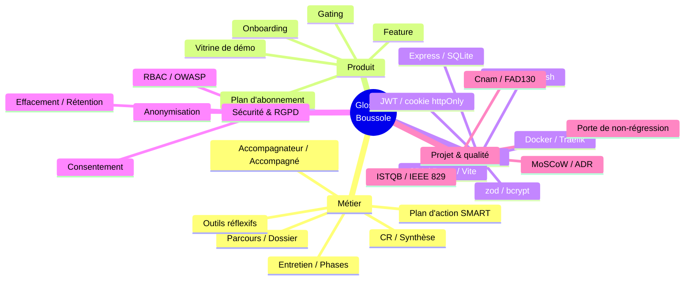
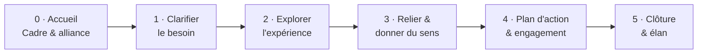
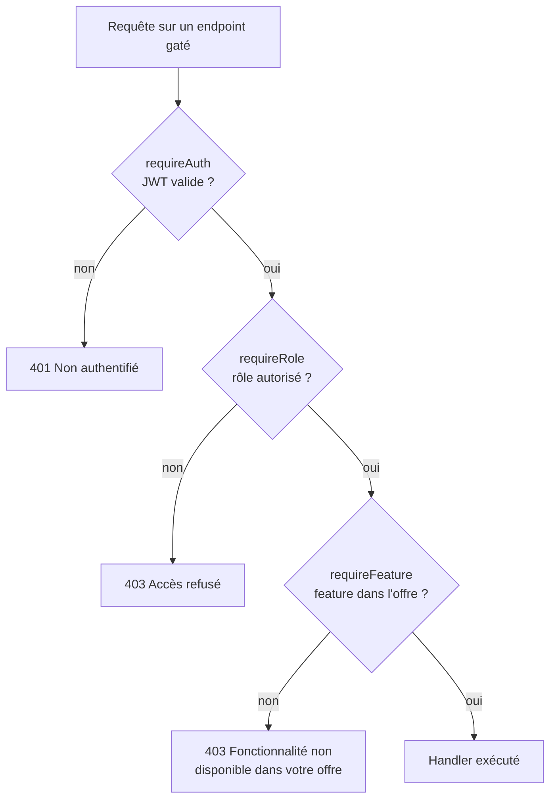
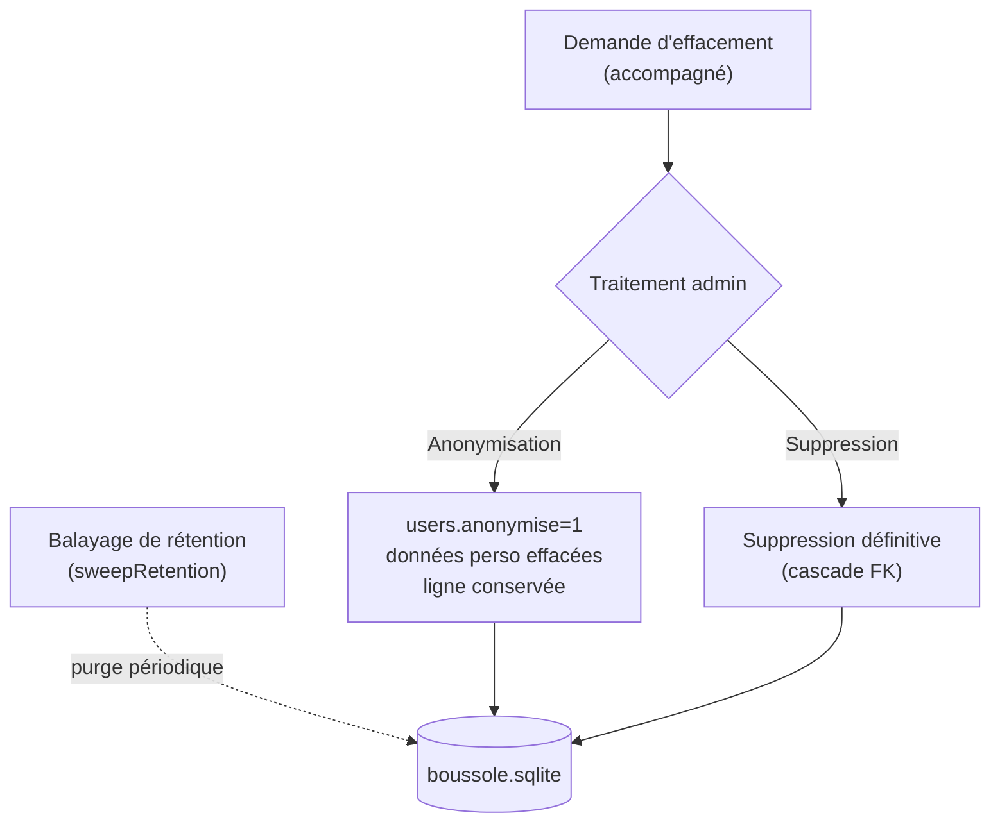

# Glossaire

Ce glossaire rassemble le vocabulaire de référence du projet **Boussole** (application web d'accompagnement à la rédaction de mémoires, UE FAD130, Cnam). Il sert de **source terminologique unique** pour lever les ambiguïtés entre les acteurs (jury, repreneur, développeur, accompagnateur) et garantir que les mêmes mots désignent partout les mêmes objets. Les termes sont classés par domaine — **métier**, **produit**, **technique**, **sécurité / RGPD**, **projet & qualité** — et, lorsque c'est pertinent, reliés à l'objet de données, à la fonctionnalité ou à la page de référence qui les définit en détail. Le détail des objets persistés est traité dans [Architecture des données](data-architecture), celui des fonctionnalités dans [Spécifications fonctionnelles](functional-specifications).

## Objectifs de la page

| # | Objectif | Public visé |
|---|----------|-------------|
| 1 | Fournir une définition stable et non ambiguë de chaque terme du projet | Tous |
| 2 | Distinguer le vocabulaire métier, produit, technique, sécurité et projet | Jury, repreneur |
| 3 | Relier chaque terme à l'objet de données, la feature ou la page qui le porte | Développeur, architecte |
| 4 | Aligner accompagnateurs et accompagnés sur un langage commun | Utilisateurs |
| 5 | Servir de point d'entrée terminologique pour la lecture de tout le wiki | Tous |

## Comment lire ce glossaire

Chaque section liste les termes par ordre alphabétique sous forme de tableau **Terme / Définition / Contexte**. La colonne *Contexte* précise où le terme s'incarne concrètement (table SQLite, clé de fonctionnalité, endpoint, fichier, ou page liée) et, le cas échéant, son statut d'implémentation. Les conventions de statut reprennent celles du wiki :

| Statut | Signification |
|--------|---------------|
| Développé | Implémenté et couvert par la batterie de tests |
| Partiel | Implémenté en partie ou sans couverture complète |
| Prévu | Décidé / spécifié mais non développé |
| Absent | Cité mais hors périmètre actuel |

Cette carte mentale donne la structure d'ensemble : cinq familles de vocabulaire, chacune détaillée dans une section dédiée ci-dessous. Elle sert de table des matières visuelle pour naviguer entre les domaines.

## 1. Termes métier

Le vocabulaire métier décrit les acteurs, les objets et les rituels de l'accompagnement. Il fait foi dans toute conversation fonctionnelle et structure le modèle de données.

| Terme | Définition | Contexte |
|-------|------------|----------|
| **Accompagnateur** | Professionnel (enseignant, tuteur, encadrant) qui mène les entretiens, produit les comptes rendus et pilote le suivi. Un des trois rôles applicatifs. | Rôle `accompagnateur` (table `users`, contrainte CHECK) ; clé pivot de `liens_accompagnement` et `dossiers` |
| **Accompagné** | Étudiant ou alternant de master rédigeant son mémoire, qui démarre des parcours et bénéficie de l'accompagnement. Un des trois rôles. | Rôle `accompagne` ; `accompagne_id` dans `dossiers` |
| **Lien d'accompagnement** | Relation N–N reliant un accompagnateur à un accompagné, créée au démarrage d'un parcours ou par l'admin. | Table `liens_accompagnement` |
| **Parcours / Dossier** | Un parcours de mémoire complet : titre, contexte, statut (`en_cours` / `cloture`) et synthèse. « Dossier » est le nom technique du parcours. Un accompagné peut en avoir plusieurs (**multi-parcours**). | Table `dossiers` ; feature `multi_parcours` ; endpoints `/api/dossiers` |
| **Entretien** | Une séance d'accompagnement rattachée à un dossier, guidée en 6 phases, avec capture des réponses, suggestions IA et moments-clés. | Table `sessions` (`phase_atteinte` 0–5) ; feature `entretien` ; `/api/entretien` |
| **Phase (d'entretien)** | Étape du déroulé d'un entretien (0 à 5), de l'accueil à la clôture. Cadre la posture et les questions proposées. | `app/api/src/phases.ts` ; voir tableau §1.1 |
| **Questionnaire initial** | Recueil de cadrage assisté par IA, réalisé en amont, produisant un récapitulatif du contexte du parcours. | Table `questionnaires_initiaux` ; feature `questionnaire` ; `/api/questionnaire` |
| **Co-pilote (d'entretien)** | Assistance IA temps réel suggérant à l'accompagnateur la question ou la relance pertinente selon la phase. | Feature `copilote` ; `claudeSuggest.ts` ; repli déterministe |
| **Miroir réflexif** | Analyse IA de la **posture** de l'accompagnateur (écoute, ouverture des questions, équilibre de parole) renvoyée comme un miroir. | Feature `miroir` ; table `analyses_posture` ; `/api/miroir` |
| **Compte rendu (CR)** | Document HTML structuré d'un entretien, généré par IA, versionné, éditable (TipTap) et publiable ; support d'un échange accompagné ↔ accompagnateur. | Tables `comptes_rendus`, `cr_messages`, `cr_notes_privees` ; feature `comptes_rendus` ; `/api/cr` |
| **Synthèse (de parcours)** | Document de synthèse d'un dossier entier, généré par IA, versionné et publiable. À distinguer du CR (qui porte sur une seule séance). | Tables `syntheses`, `synthese_messages` ; feature `synthese` ; `/api/synthese` |
| **Plan d'action SMART** | Liste d'actions du dossier — chacune avec libellé, échéance, critère SMART, priorité, ordre (glisser-déposer) et rappels par email. | Table `actions` ; feature `plan_action` ; `/api/actions` |
| **SMART** | Critère de qualité d'une action : **S**pécifique, **M**esurable, **A**tteignable, **R**éaliste, **T**emporellement défini. | Champ `critere` de `actions` |
| **Auto-évaluation** | Grille permettant à l'accompagné de s'auto-positionner ; scores stockés et exploitables, avec appui IA. | Tables `auto_evaluations`, `auto_evaluation_scores` ; feature `auto_evaluation` ; `/api/autoeval` |
| **Fil rouge (du mémoire)** | Ligne directrice qui relie les séances et fait émerger la cohérence du mémoire dans la durée. | Feature `fil_rouge` ; `/api/emergence` |
| **Problématisation** | Aide à la formulation et à l'affinage de la problématique de recherche du mémoire. | Table `problematisations` ; feature `problematisation` |
| **Moments-clés** | Instants saillants capturés pendant un entretien (prise de conscience, blocage levé, décision). | Table `moments_cles` ; feature `moments_cles` |
| **Nuage de thèmes** | Visualisation des thèmes récurrents du parcours, agrégés à partir des échanges. | Table `nuages_themes` ; feature `nuage_themes` ; `/api/viz` |
| **Résumé « où j'en suis »** | Synthèse courte et à jour de l'état d'avancement, à destination de l'accompagné. | Table `resumes_parcours` ; feature `resume_parcours` |
| **Météo intérieure** | Auto-déclaration d'humeur (échelle 1–5 + un mot) suivie dans le temps pour ouvrir le dialogue émotionnel. | Tables `meteo_humeur`, `signaux_etat` ; feature `meteo` ; `/api/relationnel` |
| **Roue des émotions** | Outil visuel d'identification fine des émotions ressenties par l'accompagné. | Table `emotions_roue` ; feature `roue_emotions` |
| **Micro-journal** | Journal de bord léger où l'accompagné consigne notes et ressentis entre les séances. | Table `journal_entrees` ; feature `journal` |
| **Débriefing (à chaud)** | Retour réflexif court de l'accompagnateur juste après une séance, pour ancrer les apprentissages. | Table `debriefings` ; feature `debriefing` ; `/api/reflexivite` |
| **Replay annoté** | Auto-confrontation : relecture annotée du déroulé d'un entretien pour analyser sa propre pratique. | Table `replays` ; feature `replay_annote` |
| **Bilan de pratique** | Bilan global et transverse de la posture et de la progression de l'accompagnateur sur l'ensemble de ses suivis. | Table `bilans_pratique` ; feature `bilan_pratique` |
| **Signaux faibles** | Détection automatique de décrochage (inactivité, météo dégradée) matérialisée par un voyant et une alerte. | Tables `signaux_etat`, `digest_envois` ; feature `signaux_faibles` ; `/api/pilotage` |
| **Tableau d'impact** | Vue de pilotage agrégeant l'effet de l'accompagnement (progression, jalons franchis). | Feature `tableau_impact` |
| **Digest hebdomadaire** | Email récapitulatif périodique envoyé à l'accompagnateur (tâche planifiée). | Feature `digest_email` ; table `digest_envois` |
| **Mutualisation** | Partage de ressources entre pairs accompagnés, via un lien public, pour capitaliser collectivement. | Table `ressources_partagees` ; feature `mutualisation` ; `/api/collab` |
| **Attestation de fin** | Document attestant l'achèvement d'un parcours d'accompagnement. | Feature `attestation` ; `/api/ethique` |
| **Carte du parcours** | Représentation cartographique de l'avancement et des étapes franchies dans un dossier. | Feature `carte_parcours` |
| **Boussole (du parcours)** | Jauge / boussole visuelle de progression du parcours (d'où le nom de l'application). | Feature `boussole` ; table `dossiers` |
| **FALC** | « Facile À Lire et à Comprendre » : mode d'affichage simplifié visant l'accessibilité cognitive. | Feature `falc` ; `/api/adoption` |

### 1.1 Les 6 phases de l'entretien

| Phase | Intitulé | Visée |
|-------|----------|-------|
| 0 | Accueil et mise en confiance | Cadre & alliance |
| 1 | Clarifier le besoin | Demande & besoin |
| 2 | Explorer l'expérience | Mise au jour du vécu |
| 3 | Relier et donner du sens | Mise en sens & structuration |
| 4 | Plan d'action & engagement | Décisions et SMART |
| 5 | Clôture et élan | Clôture & repositionnement |

Le déroulé est **séquentiel** : une session progresse de la phase 0 (alliance) vers la phase 5 (clôture), le champ `phase_atteinte` (0–5) mémorisant le point atteint. Le co-pilote IA adapte ses suggestions de questions à la phase courante. La source de vérité est `app/api/src/phases.ts`.

## 2. Termes produit

Ce vocabulaire décrit comment l'offre est packagée et modulée. Il sous-tend la démonstration commerciale (gating par plan) sans paiement réel.

| Terme | Définition | Contexte |
|-------|------------|----------|
| **Feature (fonctionnalité)** | Unité fonctionnelle activable, identifiée par une **clé stable** (ex. `entretien`, `miroir`). 38 features réparties en catégories. | `app/api/src/features.ts` (`FEATURES`) |
| **Clé de feature** | Identifiant technique stable d'une feature, utilisé pour le filtrage serveur et client. | Champ `key` de `Feature` |
| **Catégorie de feature** | Regroupement éditorial des features : Socle, Visuel, IA & posture, Relationnel, Émergence, Pilotage, Collaboration, Éthique, Confort, Adoption. | Champ `categorie` de `Feature` |
| **Plan d'abonnement (offre)** | Ensemble nommé de features (tableau JSON de clés) attaché à un utilisateur. Trois plans de démonstration : Découverte, Essentiel, Pro. | Table `plans` (`features`) ; `/api/admin` |
| **Découverte / Essentiel / Pro** | Les trois offres : Découverte ≈ 8 features (socle), Essentiel ≈ 17, Pro = les 38. | Table `plans` |
| **Plan NULL (accès maximal)** | `plan_id` non renseigné ⇒ **toutes** les features activées. C'est le réglage par défaut. | `userFeatures()` : `if (!row) return new Set(ALL_FEATURE_KEYS)` |
| **Gating (feature-gating)** | Mécanisme qui restreint l'accès à une fonctionnalité selon l'offre de l'utilisateur. | Middleware `requireFeature(key)` → 403 « Fonctionnalité non disponible dans votre offre » |
| **Socle** | Catégorie des 8 features de base disponibles dès l'offre Découverte (questionnaire, entretien, CR, RDV, plan d'action, synthèse, auto-évaluation, multi-parcours). | `features.ts` |
| **Vitrine de démo** | Jeu de données de référence (Mohamed / Amine, dossier D1) jamais altéré par les tests destructeurs ; sert la soutenance. | Base de démo ; voir [Stratégie de tests](testing-strategy) |
| **Comptes jetables** | Comptes `@boussole.test` créés/détruits par les tests destructeurs, isolés de la vitrine. | [Stratégie de tests](testing-strategy) |
| **Onboarding** | Tour guidé d'accueil présentant l'application à la première connexion. | Feature `onboarding` |
| **Repli déterministe (fallback)** | Comportement de secours déterministe d'une feature IA quand l'API Claude est indisponible : jamais de 500, on dégrade. | `claude.ts`, `claudeSuggest.ts` |

Ce diagramme illustre la **chaîne de contrôle d'accès** : authentification (JWT), puis rôle (RBAC), puis offre (gating). Le gating fait foi côté serveur ; côté client, le masquage de l'UI n'est qu'une commodité. Un `plan_id` NULL court-circuite favorablement le dernier test (toutes features actives).

## 3. Termes techniques

Vocabulaire de la pile logicielle. Le détail architectural est dans [Architecture technique](technical-architecture).

| Terme | Définition | Contexte |
|-------|------------|----------|
| **SPA (Single-Page Application)** | Application web monopage : le navigateur charge un bundle JS et le routage se fait côté client, sans rechargement de page. | Front Vite/React, `react-router-dom` 6 |
| **React** | Bibliothèque d'interface à composants (v18) ; état transverse via React Context. | `app/web/src` ; `AuthContext`, `FeaturesContext` |
| **Vite** | Outil de build et serveur de dev rapide (v5) qui produit le bundle de la SPA. | Build du conteneur web |
| **TypeScript** | Sur-couche typée de JavaScript (v5) utilisée côté front et back. | Tout le monorepo |
| **Express** | Framework HTTP minimaliste (Node 20) ; l'API expose ~145 endpoints sous `/api` via 24 routeurs. | `app/api/src/index.ts` |
| **Node.js** | Environnement d'exécution JavaScript serveur (v20). | Image `node:20-bookworm-slim` |
| **SQLite** | Moteur de base de données relationnel embarqué, mono-fichier, sans serveur. | `./data/boussole.sqlite` |
| **better-sqlite3** | Pilote SQLite **synchrone** pour Node (module natif) ; accès direct sans ORM ni pool. | `app/api/src/db.ts` |
| **WAL (Write-Ahead Logging)** | Mode de journalisation SQLite améliorant la concurrence lecture/écriture. | Activé sur la base |
| **foreign_keys = ON** | Pragma activant l'application des contraintes de clés étrangères dans SQLite. | Init de la base |
| **zod** | Bibliothèque de validation de schémas ; valide chaque corps de requête (`safeParse` → 400). | Par routeur API |
| **JWT (JSON Web Token)** | Jeton signé portant l'identité de l'utilisateur, vérifié à chaque requête (auth stateless). | `jsonwebtoken` ; `requireAuth` |
| **Cookie httpOnly** | Cookie inaccessible au JavaScript de page (anti-XSS) ; porte le JWT (`boussole_token`, `sameSite=lax`, `secure` en prod, 7 j). | `auth.ts` (`setAuthCookie`) |
| **bcrypt (bcryptjs)** | Fonction de hachage de mots de passe à coût ajustable (10 rounds ici). | `users` ; `auth.ts` |
| **helmet** | Middleware Express posant des en-têtes HTTP de sécurité par défaut. | `index.ts` |
| **CORS** | Politique de partage de ressources entre origines ; configurée avec `credentials`. | `cors`, `index.ts` |
| **React Context** | Mécanisme React de partage d'état sans prop-drilling. | `AuthContext`, `FeaturesContext` |
| **TipTap** | Éditeur de texte riche (sur ProseMirror) pour rédiger CR et synthèses en HTML. | `@tiptap/react` + starter-kit |
| **DOMPurify** | Bibliothèque de sanitisation du HTML avant rendu (anti-XSS). | Rendu du HTML IA/édité |
| **Mermaid** | Langage de description de diagrammes en texte, rendu dans le wiki (et cette page). | Wiki, rendu front |
| **react-markdown** | Composant React de rendu Markdown ; affiche le contenu du wiki. | Rendu des pages wiki |
| **Traefik** | Reverse proxy / terminaison TLS prévu en production (façade devant les conteneurs). | Voir hypothèse §Hypothèses |
| **Docker / Docker Compose** | Conteneurisation et orchestration locale (`docker-compose.local.yml`) et prod. | Images web + API |
| **Nginx** | Serveur statique du conteneur web : sert le build Vite et proxifie `/api/`. | `app/web/nginx.conf` |
| **PWA (Progressive Web App)** | Application web installable, avec service worker, fonctionnant hors-ligne partiellement. | `sw.js` ; `main.tsx` |
| **web-push** | Protocole d'envoi de notifications push aux navigateurs abonnés. | Table `push_subscriptions` ; feature `pwa_push` |
| **Brevo** | Service d'email transactionnel (vérification, reset, rappels, digest). | `app/api/src/mailer.ts` |
| **Monorepo** | Dépôt unique hébergeant plusieurs paquets : `app/api`, `app/web`, `app/tests`. | Racine du projet |
| **Tâche planifiée** | Travail périodique interne (`setInterval`/`setTimeout`) : rappels, signaux, digest, rétention. | `index.ts` |

## 4. Termes sécurité & RGPD

Vocabulaire de la protection des données et du contrôle d'accès. Détails dans [Sécurité](security).

| Terme | Définition | Contexte |
|-------|------------|----------|
| **RBAC (Role-Based Access Control)** | Contrôle d'accès par rôle : 3 rôles (`admin`, `accompagnateur`, `accompagne`) ; `requireRole(...)` → 403 si rôle non autorisé. | `auth.ts` ; contrainte CHECK sur `users.role` |
| **Consentement** | Acceptation versionnée des CGU / Politique de confidentialité, horodatée avec l'IP. | Table `consentements` |
| **Anonymisation** | Traitement RGPD qui efface les données personnelles sur place et marque le compte (`users.anonymise=1`) sans supprimer la ligne. | Table `users`, `demandes_effacement` ; `/api/admin` |
| **Effacement (droit à l'oubli)** | Demande de l'accompagné de supprimer ses données ; l'admin traite par anonymisation ou suppression. | Table `demandes_effacement` |
| **Rétention** | Politique de conservation limitée ; un balayage périodique purge les données échues. | `sweepRetention` (tâche planifiée) |
| **Journal d'accès** | Trace des accès aux données, à des fins d'audit et de transparence. | Table `journal_acces` |
| **Transparence (RGPD)** | Fonctionnalité donnant à l'accompagné la visibilité sur ses données et ses droits. | Feature `transparence` ; `/api/transparence` |
| **Vérification d'email** | Étape obligatoire post-inscription : un jeton envoyé par email active le compte. | Table `tokens` ; `/api/auth/verify-email` |
| **Réinitialisation de mot de passe** | Parcours sécurisé par jeton (`reset_mdp`) pour redéfinir un mot de passe oublié. | Table `tokens` ; `/api/auth/reset` |
| **Changement d'email** | Modification de l'adresse avec re-validation (jeton ciblant le nouvel email). | `tokens` (`email_pending`, `email_cible`) |
| **OWASP** | Référentiel des risques de sécurité applicative (ex. Top 10), utilisé comme grille d'analyse. | Matrice dans [Sécurité](security) |
| **XSS / CSRF** | Familles d'attaques web (injection de script / requête forgée) contrées par DOMPurify, cookie httpOnly et `sameSite`. | Front + `auth.ts` |
| **Dégradation gracieuse** | Principe : une dépendance externe indisponible déclenche un repli local, jamais une 500. | `claude.ts`, `mailer.ts` |

Ce diagramme résume le cycle RGPD côté effacement : l'accompagné dépose une **demande d'effacement**, que l'admin traite soit par **anonymisation** (conservation de la ligne, données personnelles purgées, marqueur `anonymise=1`), soit par **suppression** définitive en cascade. En parallèle, le **balayage de rétention** purge automatiquement les données dont la durée de conservation est échue.

## 5. Termes projet & qualité

Vocabulaire de cadrage académique, de gestion de projet et d'assurance qualité.

| Terme | Définition | Contexte |
|-------|------------|----------|
| **Cnam** | Conservatoire national des arts et métiers, établissement où est conduite la formation. | Cadre académique du projet |
| **FAD130** | Code de l'UE (unité d'enseignement) dans laquelle s'inscrit le projet Boussole. | Cadre académique |
| **Soutenance / Dépôt** | Jalons académiques : soutenance orale le 12 juin 2026, dépôt du livrable le 19 juin 2026. | Voir [Charte projet](project-charter) |
| **ISTQB** | Référentiel international de certification du test logiciel ; structure la batterie de tests. | [Stratégie de tests](testing-strategy) |
| **IEEE 829** | Standard de documentation des tests (Plan, catalogue de cas, rapport) suivi pour les livrables qualité. | Documentation de test |
| **Porte de non-régression** | Commande unique `run-all` rejouée avant chaque livraison : reseed → unit → API → UI → rapport. | [Stratégie de tests](testing-strategy) |
| **Vitest** | Framework de tests unitaires et d'intégration API utilisé dans `app/tests`. | Tests unitaires + API |
| **Playwright** | Framework de tests end-to-end (UI) jouant les parcours des 3 rôles dans un navigateur. | Tests UI E2E |
| **MoSCoW** | Méthode de priorisation des exigences : Must / Should / Could / Won't. | [Roadmap produit](roadmap), [Cahier des charges](requirements) |
| **SMART** | Critère de qualité d'un objectif (voir §1) ; appliqué aussi aux objectifs de la charte. | `actions.critere` ; [Charte projet](project-charter) |
| **ADR (Architecture Decision Record)** | Fiche traçant une décision d'architecture structurante (contexte, choix, conséquences). | [Décisions d'architecture (ADR)](adr) |
| **SWOT / PESTEL** | Grilles d'analyse stratégique (forces/faiblesses/opportunités/menaces ; macro-environnement). | [Étude d'opportunité](opportunity-study) |
| **Go / No Go** | Verdict de décision conditionnant la poursuite, issu de l'étude de faisabilité. | [Étude de faisabilité](feasibility-study) |
| **Matrice de traçabilité** | Tableau reliant besoin → exigence → fonctionnalité → code → test → statut. | [Matrice de traçabilité](traceability-matrix) |
| **Registre des risques** | Inventaire coté (impact × probabilité) des risques projet et de leurs mitigations. | [Registre des risques](risk-register) |
| **Dette technique** | Compromis d'implémentation assumés à résorber, suivis par domaine et priorité. | [Dette technique](technical-debt) |

## Hypothèses

> **Hypothèse — confiance : élevée** — Les définitions métier, les clés de features (38), les rôles (3), les tables (33) et les 6 phases proviennent du contexte projet et ont été recoupées avec `app/api/src/features.ts` et l'arborescence `app/api/src/wiki`. Elles sont considérées comme fiables.

> **Hypothèse — confiance : moyenne** — Le reverse proxy de production est décrit comme **Traefik** dans le contexte projet, mais [Architecture technique](technical-architecture) indique que le code livré s'appuie en réalité sur **Caddy + Nginx**. Le terme « Traefik » est conservé ici tel que nommé dans le cadrage, mais le glossaire renvoie à la page d'architecture qui fait foi sur l'implémentation réelle.

> **Hypothèse — confiance : moyenne** — Les seuils chiffrés des plans (Découverte ≈ 8, Essentiel ≈ 17, Pro = 38) reflètent le contexte projet ; le contenu exact du champ `features` de chaque ligne de la table `plans` n'a pas été relu enregistrement par enregistrement dans cette page.

> **Hypothèse — confiance : moyenne** — Le mécanisme `seedWiki()` qui doit injecter ce contenu au démarrage est référencé dans `seedData.ts` mais son implémentation effective n'a pas été vérifiée. *Information à confirmer côté `db.ts`.*

## Risques & points d'attention

| # | Risque / point | Probabilité | Impact | Atténuation |
|---|----------------|-------------|--------|-------------|
| 1 | Dérive terminologique entre pages du wiki (mêmes mots, sens divergents) | Moyenne | Moyen | Ce glossaire fait référence ; lier les termes plutôt que les redéfinir |
| 2 | Confusion « CR » (une séance) vs « synthèse » (tout le dossier) | Moyenne | Faible | Définitions distinctes et croisées ci-dessus |
| 3 | Confusion « dossier » (objet technique) vs « parcours » (terme métier) | Moyenne | Faible | Les deux pointent vers la table `dossiers` ; équivalence explicitée |
| 4 | Incohérence Traefik vs Caddy entre cadrage et code | Avérée | Faible | Renvoi explicite à [Architecture technique](technical-architecture) |
| 5 | Glossaire qui se désynchronise du code (features renommées, tables ajoutées) | Moyenne | Moyen | Revue à chaque évolution de `features.ts` / schéma ; lier au lieu de copier |
| 6 | Amalgame anonymisation / suppression dans les échanges RGPD | Faible | Moyen | Distinction posée et schématisée en §4 |

## Recommandations

| # | Recommandation | Priorité | Justification |
|---|----------------|----------|---------------|
| 1 | Traiter ce glossaire comme la **source terminologique unique** et y renvoyer depuis les autres pages | Haute | Évite la redéfinition divergente des termes |
| 2 | Synchroniser la section « features » à chaque modification de `app/api/src/features.ts` | Haute | Garantir l'alignement glossaire ↔ code |
| 3 | Trancher et harmoniser le terme du reverse proxy (Traefik vs Caddy) dans tout le wiki | Moyenne | Lever l'ambiguïté de cadrage |
| 4 | Conserver la distinction stricte CR / synthèse / dossier dans toute la documentation et l'UI | Moyenne | Réduire les contresens utilisateurs |
| 5 | Compléter le glossaire au fil de l'ajout de fonctionnalités ou de tables | Basse | Maintenir la couverture dans le temps |

## Pages liées

- [Résumé exécutif](executive-summary) — synthèse décisionnelle du projet
- [Charte projet](project-charter) — objectifs, jalons, gouvernance
- [Cahier des charges détaillé](requirements) — besoins et exigences
- [Spécifications fonctionnelles](functional-specifications) — cas d'utilisation et flux
- [Architecture technique](technical-architecture) — pile, vues C4, déploiement (fait foi sur Traefik/Caddy)
- [Architecture de données](data-architecture) — les 33 tables et le dictionnaire de données
- [Documentation API](api-documentation) — les 145 endpoints et 24 routeurs
- [Sécurité](security) — RBAC, RGPD, OWASP, durcissement
- [Stratégie de tests](testing-strategy) — ISTQB, IEEE 829, porte de non-régression
- [Roadmap produit](roadmap) — priorisation MoSCoW
- [Décisions d'architecture (ADR)](adr) — décisions structurantes tracées
- [Matrice de traçabilité](traceability-matrix) — besoin → exigence → code → tests
- [Guide utilisateur](user-guide) — prise en main accompagnateur / accompagné
- [Guide administrateur](admin-guide) — utilisateurs, rôles, plans, RGPD
