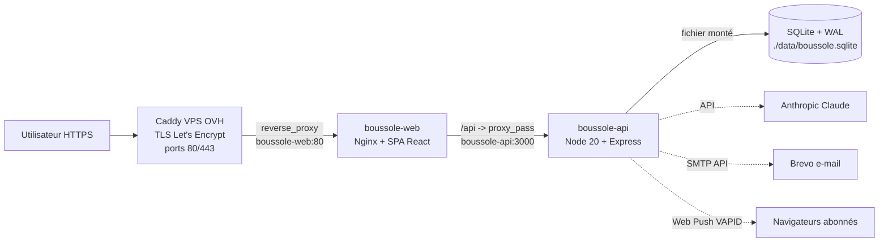
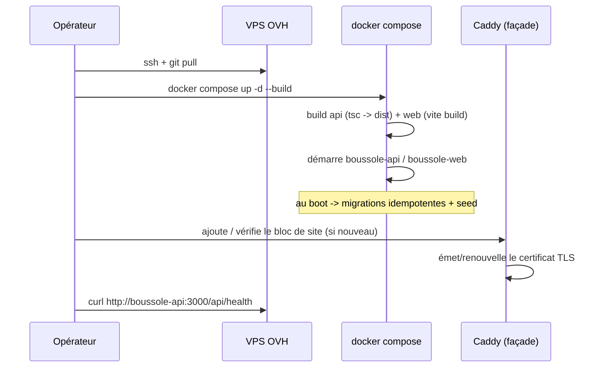
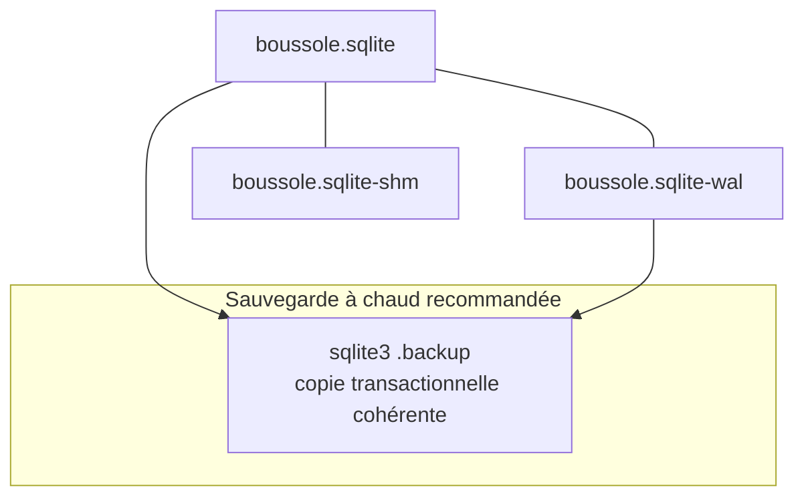
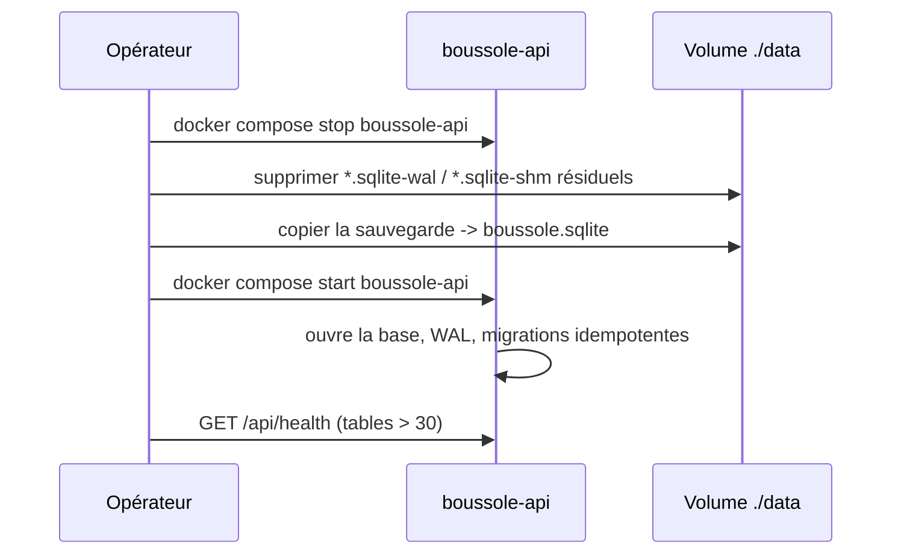
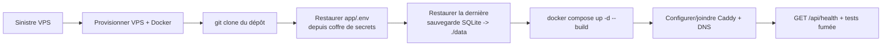
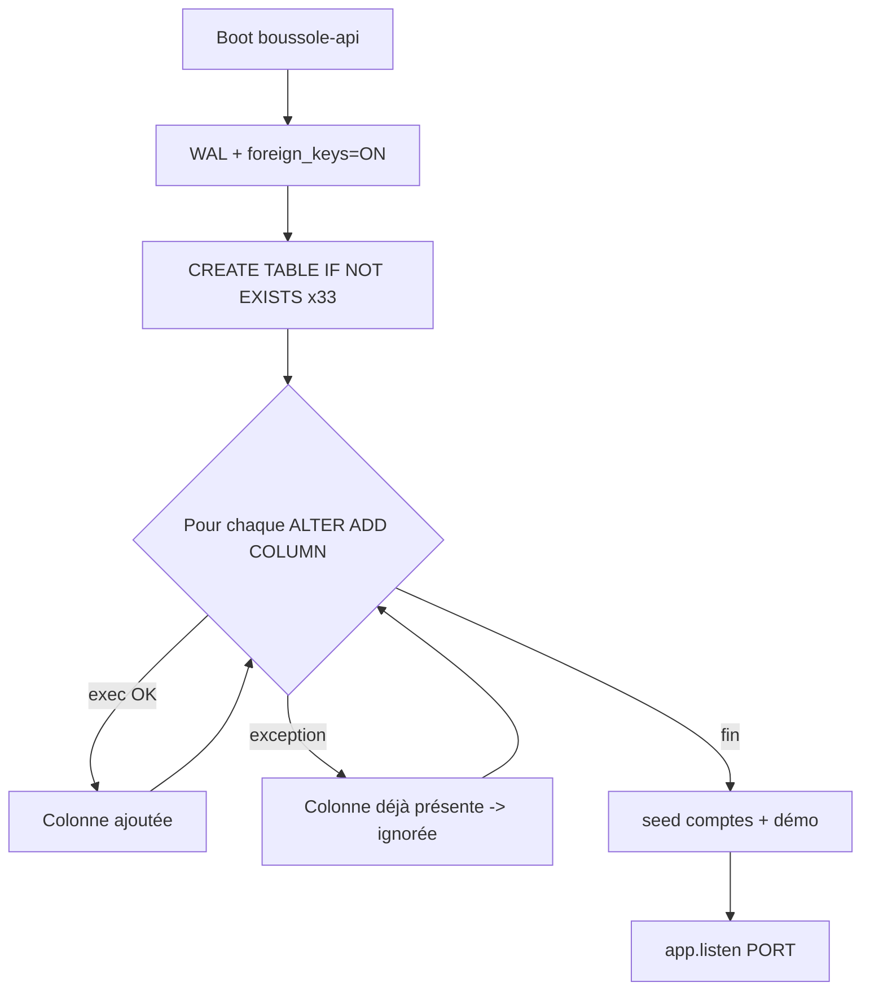
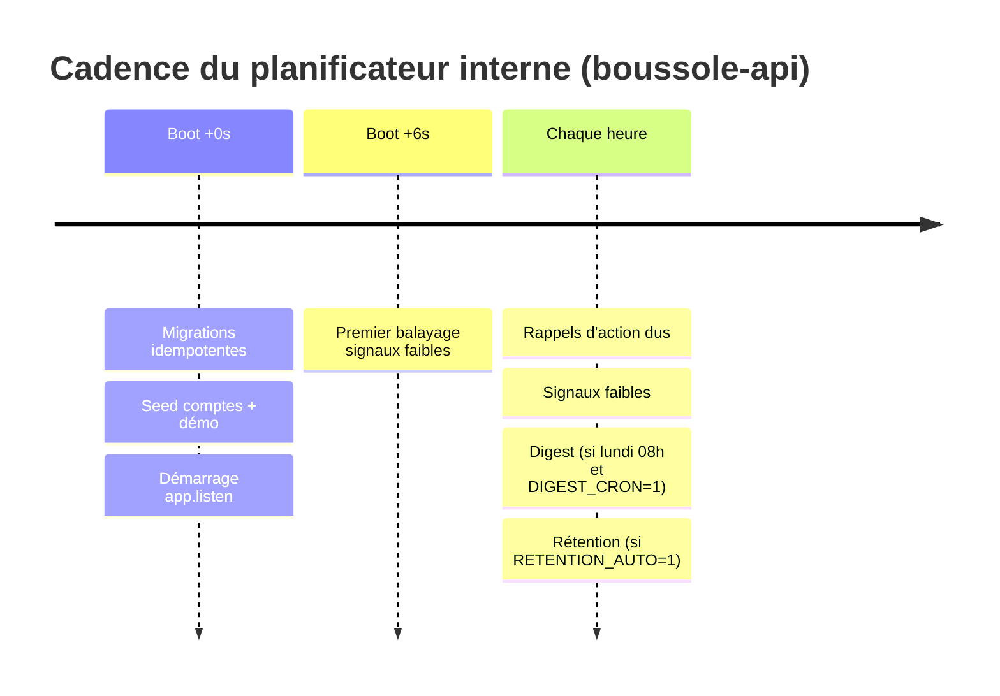
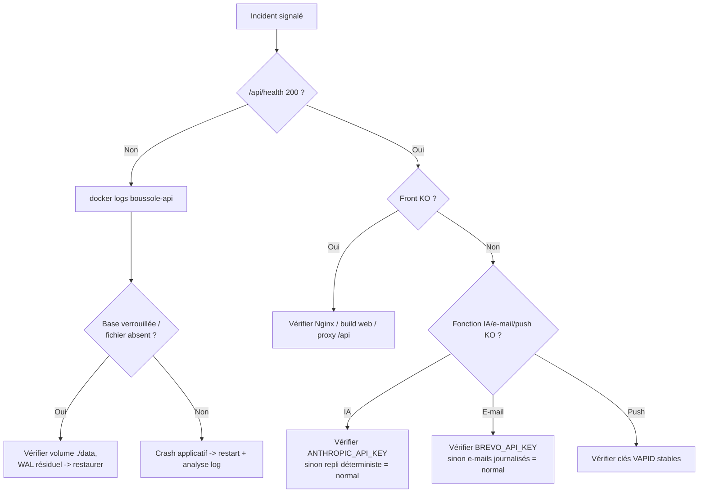

# Dossier d'exploitation (runbook)

Ce dossier décrit l'exploitation de l'application **Boussole** : prérequis, installation, configuration, variables d'environnement, build et lancement (local et production), supervision, sauvegardes, restauration, maintenance, gestion des incidents, reprise après sinistre et tâches planifiées. Il vise une exploitation reproductible par un opérateur disposant des accès, sans recours à la connaissance implicite de l'auteur. Boussole est une application mono-instance (Node 20 + Express, SQLite via `better-sqlite3`, front React/Vite servi par Nginx) conteneurisée avec Docker. La production est hébergée sur un VPS OVH derrière un reverse-proxy **Caddy** mutualisé, et publiée sur `boussole.elafrit.com`.

> **Correction de contexte — confiance : élevée** — La fiche projet mentionne « Traefik » comme reverse-proxy de production. Le code réel (`app/docker-compose.yml`) montre un reverse-proxy **Caddy** préexistant sur le VPS (container `formaplanner-caddy-1`), auquel le front Boussole se rattache via un réseau Docker externe. Ce dossier décrit la réalité du code. Le terme « Traefik » est traité comme obsolète.

## Objectifs de la page

- Fournir le **runbook complet** des opérations courantes : démarrage, arrêt, redéploiement, migration de schéma.
- Documenter de façon exhaustive les **variables d'environnement** (noms et rôles, **jamais de valeurs réelles**).
- Définir les procédures de **sauvegarde, restauration et reprise après sinistre** adaptées à SQLite + WAL.
- Décrire la **supervision** (santé applicative, logs) et les **tâches planifiées** internes au serveur.
- Outiller la **gestion des incidents** et le **support de premier niveau**.

---

## 1. Architecture de déploiement (rappel opérationnel)

Boussole se compose de deux conteneurs applicatifs et d'un reverse-proxy de façade externe au périmètre Boussole.



Le proxy Caddy termine TLS et route `boussole.elafrit.com` vers `boussole-web:80`. Nginx sert le bundle React statique et proxifie tout `/api/` vers `boussole-api:3000` sur le réseau Docker interne. L'API détient l'unique source de vérité : le fichier SQLite monté en volume. Anthropic, Brevo et le Web Push sont des dépendances externes **dégradables** (chaque appel IA possède un repli déterministe ; sans clé e-mail, les messages sont journalisés au lieu d'être envoyés).

| Composant | Image | Port exposé | Réseau | Persistance |
|---|---|---|---|---|
| `boussole-api` | `node:20-bookworm-slim` (build natif `better-sqlite3`) | `3000` (interne) | `interne` | volume `./data` |
| `boussole-web` | build Vite -> `nginx:alpine` | `80` (interne) ; `8080` en local | `interne` (+ `edge` en prod) | sans état |
| Caddy (prod, externe) | géré hors périmètre Boussole | `80/443` (publics) | `edge` (`${EDGE_NETWORK}`) | Caddyfile + cert. |

---

## 2. Prérequis

| Élément | Exigence | Statut |
|---|---|---|
| Docker Engine | requis (build + run des conteneurs) | déjà utilisé |
| Docker Compose v2 | requis (`docker compose ...`) | déjà utilisé |
| Node 20 | requis pour build natif `better-sqlite3` (fourni par l'image) ; utile en dev hors conteneur | déjà utilisé |
| Réseau Docker `edge` (prod) | externe, fourni par le Caddy de façade (`${EDGE_NETWORK}` = `formaplanner_formaplanner`) | prod uniquement |
| Accès SSH au VPS OVH (prod) | requis pour exploitation | prod |
| Outils de build C (`python3 make g++`) | requis pour `better-sqlite3` ; installés dans le Dockerfile API | automatique |

> **Hypothèse — confiance : moyenne** — Versions minimales exactes (Docker Engine ≥ 24, Compose ≥ 2.20) non figées dans le code ; recommandées par cohérence avec `node:20`. À valider en pré-production.

---

## 3. Configuration : variables d'environnement

Les variables sont injectées par Compose : en **local** via `docker-compose.local.yml` (avec substitution depuis un éventuel `app/.env`), en **production** via `env_file: .env` (`app/.env`, jamais commité). Le chargeur `app/api/src/env.ts` lit `../.env` puis `.env` en dev ; dotonv **n'écrase jamais** une variable déjà définie par le conteneur.

> Aucune valeur réelle n'est reproduite ici : seuls les noms et rôles sont documentés.

| Variable | Rôle | Obligatoire | Défaut / repli si absente |
|---|---|---|---|
| `PORT` | Port d'écoute de l'API | Non | `3000` |
| `DB_PATH` | Chemin du fichier SQLite | Non | `./data/boussole.sqlite` ; en conteneur `/app/data/boussole.sqlite` |
| `JWT_SECRET` | Clé de signature des JWT (cookie `boussole_token`) **et** dérivation des noms de salle visio Jitsi | **Oui en prod** | `dev_secret_change_me` (dev uniquement — à ne **jamais** laisser en prod) |
| `NODE_ENV` | Mode d'exécution ; `production` active `secure` sur le cookie | Recommandée | non défini = cookie non `secure` |
| `APP_URL` | URL publique utilisée dans les liens e-mail (vérif., reset, etc.) | Oui (prod) | — |
| `ANTHROPIC_API_KEY` | Clé API Claude (toutes fonctionnalités IA) | Non | sans clé, **repli déterministe** pour chaque fonction IA |
| `ANTHROPIC_MODEL_REALTIME` | Modèle Claude pour les usages temps réel (questionnaire, suggestions d'entretien) | Non | `claude-sonnet-4-6` |
| `ANTHROPIC_MODEL_REPORT` | Modèle Claude pour les productions longues (CR, synthèse, bilans, etc.) | Non | défaut interne au module |
| `BREVO_API_KEY` | Clé API e-mail transactionnel Brevo | Non | sans clé, e-mails **journalisés** dans les logs (non envoyés) |
| `MAIL_FROM` | Adresse expéditrice des e-mails | Non | `contact@elafrit.com` |
| `VAPID_PUBLIC_KEY` | Clé publique Web Push (PWA) | Non | clés **éphémères** générées au démarrage (push instables entre redémarrages) |
| `VAPID_PRIVATE_KEY` | Clé privée Web Push | Non | idem ci-dessus |
| `DIGEST_CRON` | Active l'envoi automatique du digest hebdomadaire (`1` = activé) | Non | désactivé (pas d'envoi auto) |
| `RETENTION_MONTHS` | Seuil de rétention RGPD (mois d'inactivité avant éligibilité) | Non | `36` |
| `RETENTION_AUTO` | Active l'anonymisation automatique des comptes éligibles (`1` = activé) | Non | désactivé (anonymisation manuelle par l'admin) |
| `ADMIN_EMAIL` | E-mail du compte admin créé au seed | Au seed | — |
| `ACCOMPAGNATEUR_EMAIL` | E-mail de l'accompagnateur de démonstration | Au seed | — |
| `SEED_PASSWORD` | Mot de passe des comptes de démonstration (**local uniquement**) | Local | — |
| `EDGE_NETWORK` | Nom du réseau Docker externe du Caddy de façade (prod) | Prod | — |

> **Hypothèse — confiance : élevée** — En production, `JWT_SECRET`, `ANTHROPIC_API_KEY`, `BREVO_API_KEY`, `VAPID_PUBLIC_KEY` et `VAPID_PRIVATE_KEY` doivent être définies et stables. Si l'un manque, le service **ne tombe pas** (dégradation contrôlée) mais perd une garantie : un `JWT_SECRET` faible compromet l'auth et les salles visio ; des clés VAPID éphémères invalident les abonnements push à chaque redémarrage.

---

## 4. Build et lancement

### 4.1 Local (`docker-compose.local.yml`, port 8080)

```bash
cd app
docker compose -f docker-compose.local.yml up --build
# -> Front sur http://localhost:8080 ; API interne (proxifiée par Nginx)
```

Le profil local publie uniquement le front sur `8080:80`, monte `./data`, et sème des comptes de démonstration (`SEED_PASSWORD`). Sans `ANTHROPIC_API_KEY` ni `BREVO_API_KEY`, l'IA bascule sur ses replis et les e-mails sont journalisés : l'application reste pleinement utilisable hors-ligne pour la démonstration.

### 4.2 Production (`docker-compose.yml`, derrière Caddy)

```bash
# Sur le VPS, dans app/ (avec app/.env renseigné et le réseau edge présent)
docker compose up -d --build
```

Boussole ne prend **pas** les ports 80/443 : le front s'attache au réseau `edge` du Caddy existant. Le routage HTTPS s'active en ajoutant un bloc de site au Caddyfile de façade, qui déclenche l'émission automatique du certificat Let's Encrypt :

```
boussole.elafrit.com {
    reverse_proxy boussole-web:80
}
```



Le diagramme montre la chaîne de redéploiement : récupération du code, build des deux images, démarrage, migrations et seed automatiques au boot de l'API, puis vérification de santé. La configuration TLS n'est touchée qu'à la première mise en service ou en cas de changement de domaine.

---

## 5. Supervision

### 5.1 Santé applicative

`GET /api/health` renvoie un JSON `{ status: "ok", service, version, tables, time }`. Le champ `tables` (nombre de tables SQLite) confirme que la base est ouverte et le schéma initialisé. C'est la **sonde de vivacité** de référence.

```bash
# Depuis le réseau interne / le conteneur web
curl -s http://boussole-api:3000/api/health
# Depuis l'extérieur (via Caddy + Nginx)
curl -s https://boussole.elafrit.com/api/health
```

| Sonde | Cible | Indicateur sain | Action si KO |
|---|---|---|---|
| Vivacité | `GET /api/health` | HTTP 200, `status:"ok"`, `tables` > 30 | Redémarrer `boussole-api`, inspecter logs |
| Front | `GET /` | HTTP 200, `index.html` | Vérifier Nginx, build web |
| Contexte public | `GET /api/context` | HTTP 200 | Diagnostic chaîne proxy |
| TLS | certificat `boussole.elafrit.com` | valide > 15 j | Vérifier logs Caddy / renouvellement |

> **Hypothèse — confiance : moyenne** — Aucun healthcheck Docker (`HEALTHCHECK` / `healthcheck:` Compose) ni supervision externe (Uptime Kuma, cron de monitoring) n'est présent dans le code. *Information non identifiée dans le code* : recommandation de l'ajouter (cf. Recommandations).

### 5.2 Logs

L'application journalise sur **stdout/stderr** (pas de fichier de log applicatif), donc via `docker logs`.

```bash
docker logs -f --tail 200 boussole-api   # prod ; -local pour le profil local
docker logs -f --tail 200 boussole-web
```

Préfixes de logs utiles : `[Boussole]` (démarrage), `[seed]`, `[rappels]`, `[signaux]`, `[digest]`, `[rétention]`, `[push]`. Une erreur de tâche planifiée est journalisée sans interrompre le service.

---

## 6. Sauvegardes et restauration

### 6.1 Modèle de persistance

La base est un **fichier unique** (`boussole.sqlite`) en mode **WAL**, accompagné de `boussole.sqlite-wal` et `boussole.sqlite-shm`. Une sauvegarde cohérente **doit** capturer un état où le WAL est intégré, sinon des transactions récentes peuvent manquer.



### 6.2 Stratégies

| Stratégie | Procédure | Cohérence | Interruption |
|---|---|---|---|
| **À chaud (recommandée)** | `sqlite3 <db> ".backup '/backup/boussole-YYYYMMDD-HHMM.sqlite'"` (intègre le WAL, copie atomique) | Forte | Aucune |
| **À froid** | Arrêter `boussole-api`, copier `*.sqlite` + `*.sqlite-wal` + `*.sqlite-shm`, redémarrer | Forte | Quelques secondes |
| **Copie naïve (déconseillée)** | `cp boussole.sqlite ...` sans le WAL | Faible (perte possible) | Aucune |

Sauvegarde à chaud type, sans arrêt de service :

```bash
docker exec boussole-api sh -c \
  "sqlite3 /app/data/boussole.sqlite \".backup '/app/data/backup-$(date +%F-%H%M).sqlite'\""
# puis exfiltrer le fichier hors du conteneur / du VPS
```

> **Hypothèse — confiance : moyenne** — Aucun script de sauvegarde planifié n'existe dans le dépôt. *Information non identifiée dans le code.* La cadence proposée ci-dessous est une recommandation, pas un fait du code.

| Niveau | Cadence proposée | Rétention proposée |
|---|---|---|
| Sauvegarde quotidienne (à chaud) | 1×/jour (creux d'activité) | 14 jours glissants |
| Sauvegarde hebdomadaire | 1×/semaine | 8 semaines |
| Copie hors-site (VPS distinct / stockage objet) | 1×/jour | 30 jours |

### 6.3 Restauration



La restauration est un remplacement de fichier : arrêter l'API (pour libérer le verrou et le WAL), retirer les fichiers `-wal`/`-shm` résiduels, déposer la sauvegarde sous le nom attendu, redémarrer, puis valider via `/api/health`. Les migrations idempotentes (cf. §8.3) s'exécutent sans risque sur une base plus ancienne.

---

## 7. Reprise après sinistre (PRA)

| Indicateur | Cible proposée | Justification |
|---|---|---|
| **RPO** (perte de données max.) | ≤ 24 h | Aligné sur une sauvegarde quotidienne hors-site |
| **RTO** (délai de remise en service) | ≤ 2 h | Rebuild Compose + restauration d'un fichier SQLite |

> **Hypothèse — confiance : faible** — RPO/RTO ne sont **pas** définis dans le code ni les livrables ; ce sont des cibles proposées pour un projet académique mono-instance. Pour un RPO plus strict, mettre en place une réplication continue du fichier (ex. Litestream) — non implémentée à ce jour.

Procédure de reconstruction complète sur un VPS neuf :



Les éléments **hors dépôt** indispensables à la reprise sont : le fichier `app/.env` (secrets), la dernière sauvegarde SQLite, l'enregistrement DNS `boussole.elafrit.com`, et la configuration du Caddy de façade. Le code et le schéma se reconstruisent depuis Git ; seuls les données et les secrets nécessitent une source de récupération externe.

---

## 8. Runbook des opérations courantes

### 8.1 Démarrage / arrêt / redémarrage

| Opération | Commande (prod) | Effet de bord |
|---|---|---|
| Démarrer | `docker compose up -d` | Seed + migrations au boot ; planificateurs internes démarrent |
| Arrêter | `docker compose stop` | Interrompt les tâches planifiées en cours |
| Redémarrer l'API | `docker compose restart boussole-api` | Régénère les clés VAPID **si** elles ne sont pas fixées par env |
| Tout arrêter et nettoyer | `docker compose down` | Conteneurs supprimés ; **volume `./data` conservé** |
| Voir l'état | `docker compose ps` | — |

### 8.2 Redéploiement (nouvelle version)

```bash
git pull
docker compose up -d --build          # rebuild images, redémarre, migrations + seed au boot
curl -s http://boussole-api:3000/api/health
```

Le redéploiement est **sans migration manuelle** : les migrations s'appliquent au démarrage. Effectuer une sauvegarde à chaud **avant** tout redéploiement de version (filet de sécurité).

### 8.3 Migration de schéma (ALTER idempotents)

Le schéma est créé/maintenu **au démarrage de l'API**, sans outil de migration externe :

- `CREATE TABLE IF NOT EXISTS ...` pour chaque table (création naturellement idempotente).
- Une liste d'`ALTER TABLE ... ADD COLUMN ...` enveloppée dans un `try/catch` : si la colonne existe déjà, l'erreur est avalée silencieusement (« colonne déjà présente »). Le mécanisme est donc **idempotent et rejouable** à chaque boot.



Pour **ajouter** une évolution de schéma : ajouter un `CREATE TABLE IF NOT EXISTS` et/ou une ligne `ALTER TABLE ... ADD COLUMN ...` dans la liste de migrations de `app/api/src/db.ts`. **Ne jamais** modifier ou supprimer une migration déjà déployée (l'historique doit rester rejouable). SQLite ne supporte pas `DROP COLUMN` / `ALTER COLUMN` aisément : tout remaniement lourd se fait par table de remplacement + copie, hors du mécanisme idempotent.

> **Hypothèse — confiance : élevée** — Il n'existe pas de table `schema_version` ni de numérotation des migrations : l'idempotence repose entièrement sur `IF NOT EXISTS` et le `try/catch`. Acceptable pour mono-instance ; insuffisant pour des migrations destructives ou un déploiement multi-instance.

---

## 9. Tâches planifiées (planificateur interne)

Boussole n'utilise **pas** de cron système : les tâches sont des `setInterval`/`setTimeout` **en mémoire du processus API** (`app/api/src/index.ts`). Elles tournent indépendamment des clients connectés et s'arrêtent avec le conteneur.

| Tâche | Fonction | Fréquence | Condition d'activation | Repli si erreur |
|---|---|---|---|---|
| Rappels d'action | `sweepDueReminders` | toutes les 60 min (+ à la consultation des notifications) | Plan incluant `plan_action` | log `[rappels]`, service continue |
| Signaux faibles | `sweepSignauxAlertes` | au boot (+6 s), puis toutes les 60 min | Feature `signaux_faibles` par accompagnateur | log `[signaux]` |
| Digest hebdomadaire | `sweepDigestsHebdo` | évalué toutes les 60 min ; n'envoie que **lundi 08h** | `DIGEST_CRON=1` **et** feature `digest_email` | log `[digest]` |
| Rétention RGPD | `sweepRetention` | toutes les 60 min | `RETENTION_AUTO=1` ; seuil `RETENTION_MONTHS` (déf. 36) | log `[rétention]` |



Le digest est **anti-doublon** : un envoi unique par accompagnateur et par semaine ISO (table `digest_envois`). La rétention n'anonymise que les comptes `accompagne` dont **tous** les parcours sont clôturés et inactifs au-delà du seuil ; l'anonymisation efface l'identité et les contenus libres (journal, météo, émotions) tout en conservant les parcours anonymisés.

> **Point d'attention — confiance : élevée** — Comme le planificateur vit dans le processus, **deux instances de l'API enverraient les tâches en double**. Le déploiement doit rester **mono-instance** (ou il faut externaliser ces jobs). Un redémarrage à 08h05 un lundi peut faire **sauter** le créneau d'envoi du digest de la semaine (fenêtre stricte « lundi 08h »).

---

## 10. Gestion des incidents et support

### 10.1 Arbre de décision incident



### 10.2 Catalogue d'incidents

| Symptôme | Cause probable | Diagnostic | Remédiation |
|---|---|---|---|
| `/api/health` KO | API arrêtée / base verrouillée | `docker logs`, `docker compose ps` | `restart boussole-api` ; vérifier volume |
| 502 via le domaine | Nginx ne joint pas l'API, ou Caddy ne joint pas le web | logs Nginx + Caddy ; réseau `edge` | Vérifier réseaux Docker, redémarrer |
| IA renvoie un contenu générique | `ANTHROPIC_API_KEY` absente/invalide | log au démarrage | Comportement **attendu** (repli) ; corriger la clé si IA souhaitée |
| Aucun e-mail reçu | `BREVO_API_KEY` absente | e-mail dans les logs | Renseigner la clé ; vérifier `MAIL_FROM` |
| Push perdus après redémarrage | clés VAPID éphémères | log `[push] ... éphémères` | Fixer `VAPID_PUBLIC_KEY`/`VAPID_PRIVATE_KEY` |
| Déconnexions massives | `JWT_SECRET` changé/instable | comparer env | Restaurer le secret stable |
| Digest non envoyé | `DIGEST_CRON≠1` ou hors fenêtre lundi 08h | logs `[digest]` | Activer la var ; envoyer manuellement via `POST /api/pilotage/digest/envoyer` |

### 10.3 Support de premier niveau

Pour les opérations métier de support (réinitialisation d'accès, RGPD, gestion des plans), privilégier la **console d'administration** plutôt que des écritures directes en base. Voir [Guide administrateur](admin-guide). Les demandes d'effacement RGPD se traitent par anonymisation ou suppression depuis l'espace admin (cf. [Sécurité](security)).

---

## Hypothèses

> **Hypothèse — confiance : élevée** — Le service est conçu et exploité en **mono-instance** ; le planificateur interne et SQLite mono-fichier l'imposent. Aucune montée en charge horizontale n'est prévue ni supportée en l'état.

> **Hypothèse — confiance : moyenne** — La supervision repose sur des contrôles manuels (`curl /api/health`, `docker logs`). Aucun outil de monitoring/alerting automatisé n'est présent dans le code.

> **Hypothèse — confiance : moyenne** — La politique de sauvegarde (cadence, rétention, hors-site) est **recommandée** et non implémentée : *information non identifiée dans le code*. Les RPO/RTO (§7) sont des cibles proposées.

> **Hypothèse — confiance : faible** — Versions minimales exactes de Docker/Compose et procédure précise du Caddy de façade (hors périmètre Boussole) à confirmer avec le `Guide_deploiement_Boussole.md` des livrables.

---

## Risques & points d'attention

| Risque | Gravité | Probabilité | Mitigation |
|---|---|---|---|
| Perte du fichier SQLite (pas de sauvegarde planifiée par défaut) | Élevée | Moyenne | Mettre en place la sauvegarde à chaud quotidienne hors-site (§6) |
| Sauvegarde incohérente (WAL ignoré) | Élevée | Moyenne | Utiliser exclusivement `.backup` ou l'arrêt à froid |
| `JWT_SECRET` faible/instable en prod | Critique | Faible | Secret long, stocké en coffre, jamais le défaut dev |
| Double exécution des tâches si 2 instances | Moyenne | Faible | Garantir le mono-instance ; documenter la contrainte |
| Clés VAPID éphémères (push cassés au redémarrage) | Faible | Élevée si non fixées | Définir `VAPID_*` stables |
| Dépendance au Caddy de façade externe (hors périmètre) | Moyenne | Faible | Documenter le bloc de site et le réseau `edge` ; tester après MEP |
| Absence de healthcheck/monitoring automatisé | Moyenne | Élevée | Ajouter sonde externe + `HEALTHCHECK` Docker |
| Migration destructive non outillée (pas de `schema_version`) | Moyenne | Faible | Procéder par table de remplacement + sauvegarde préalable |

---

## Recommandations

1. **Industrialiser la sauvegarde** : script `sqlite3 .backup` quotidien + copie hors-site, rétention 14/30 jours (§6.2). Tester la restauration trimestriellement.
2. **Ajouter une supervision automatisée** : `HEALTHCHECK` Docker sur `/api/health` + sonde externe (Uptime Kuma ou cron d'alerte) ; alerte sur expiration TLS.
3. **Fixer tous les secrets de production** dans un coffre : `JWT_SECRET`, clés Anthropic, Brevo, et **VAPID stables** pour des push durables.
4. **Documenter et versionner `app/.env`** (modèle `.env.example` sans valeurs) pour accélérer la reprise après sinistre.
5. **Filet de sécurité avant chaque redéploiement** : sauvegarde à chaud systématique, puis `up -d --build`, puis `GET /api/health` (porte de validation).
6. **Préserver l'idempotence des migrations** : n'ajouter que des `CREATE TABLE IF NOT EXISTS` / `ALTER ... ADD COLUMN` ; ne jamais réécrire une migration déployée.
7. **Surveiller la fenêtre du digest** (lundi 08h) : éviter les redémarrages le lundi matin, ou prévoir un déclenchement manuel via `POST /api/pilotage/digest/envoyer`.
8. **Envisager une réplication continue** (ex. Litestream) si le RPO de 24 h devient insuffisant.

---

## Pages liées

- [Architecture technique](technical-architecture) — composants, conteneurs, dépendances.
- [Déploiement](deployment) — détail du pipeline de mise en production et du Caddy de façade.
- [Architecture des données](data-architecture) — schéma SQLite, WAL, 33 tables.
- [Sécurité](security) — JWT, secrets, RGPD, anonymisation.
- [Guide administrateur](admin-guide) — console d'admin, plans, effacements RGPD.
- [Stratégie de tests](testing-strategy) — porte de non-régression, reseed, `run-all`.
- [Registre des risques](risk-register) — risques projet consolidés.
- [Dette technique](technical-debt) — limites mono-instance, absence de `schema_version`.
- [Décisions d'architecture (ADR)](adr) — SQLite, planificateur in-process, dégradation IA.
