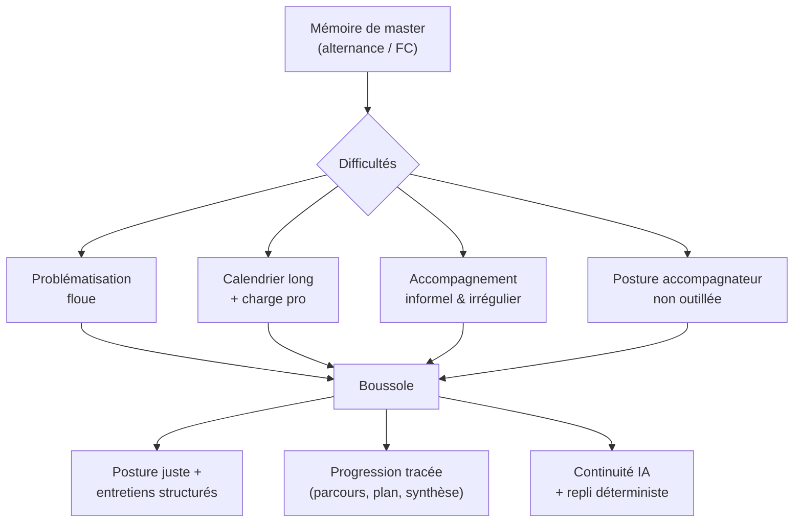
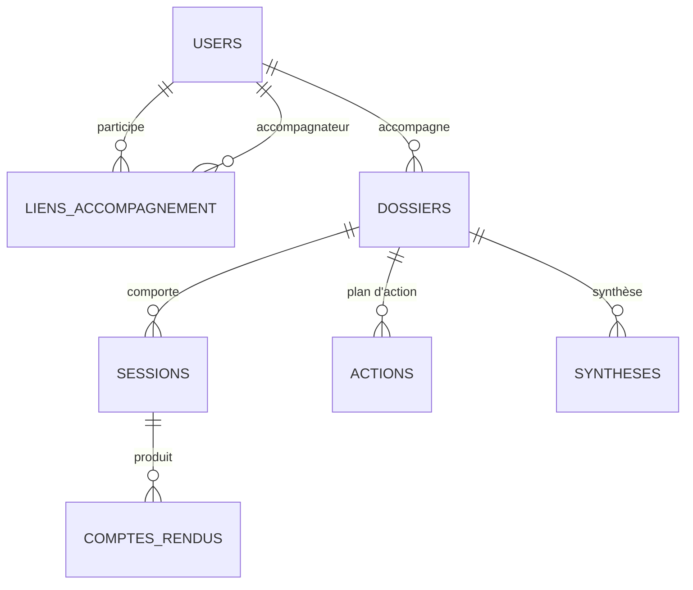
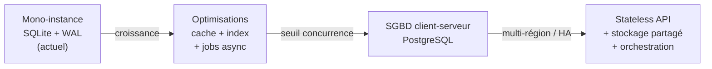
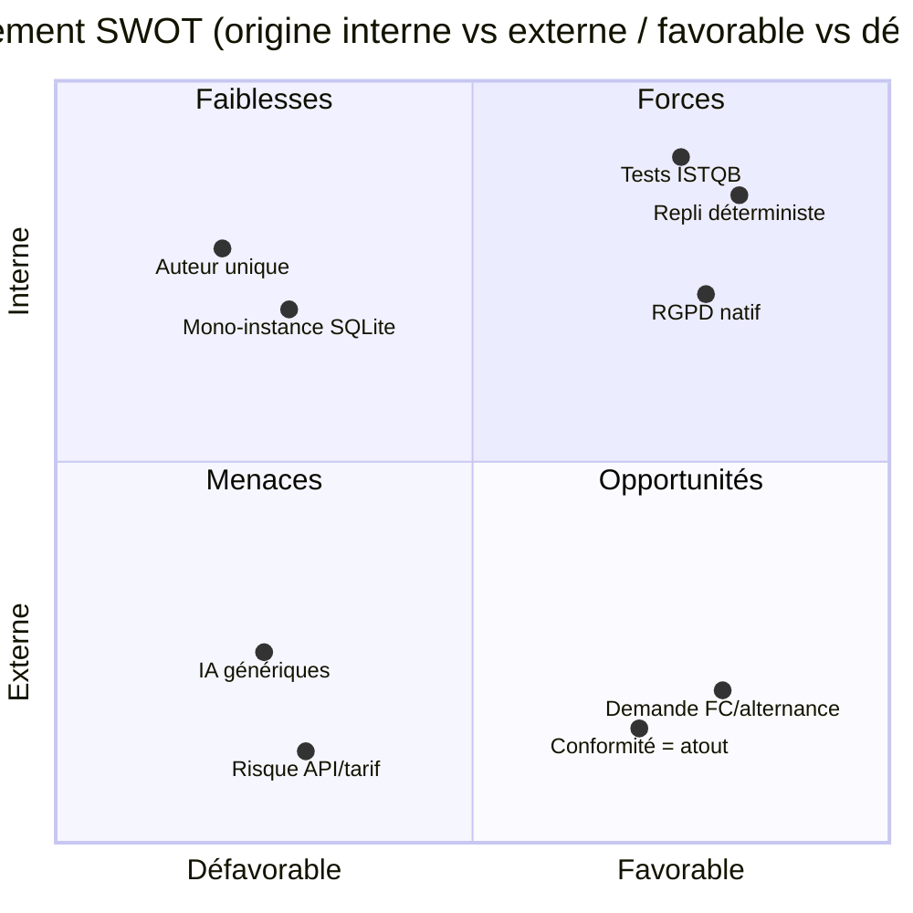
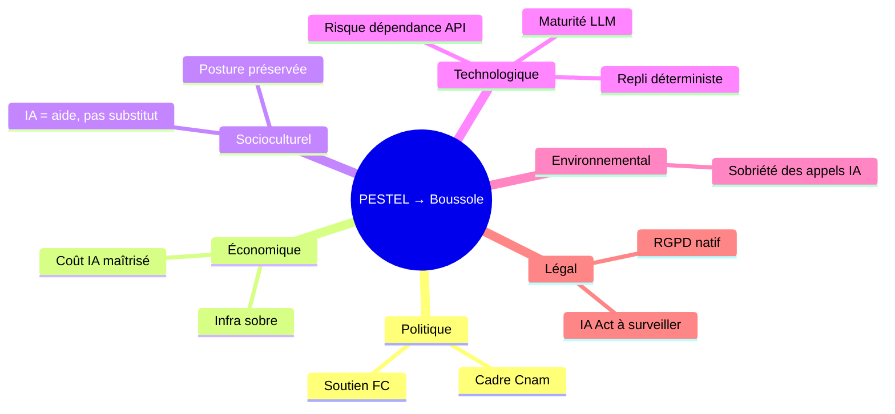

# Étude d'opportunité

Cette page formalise l'étude d'opportunité du projet **Boussole** : faut-il, et pourquoi, investir dans une application d'accompagnement structuré à la rédaction de mémoires dans le cadre du Cnam et de la formation continue ? Elle qualifie le besoin, la population cible, les bénéfices attendus et les risques d'inaction, puis cadre l'environnement par une analyse **SWOT** et une analyse **PESTEL**. Elle se distingue de l'[Étude de faisabilité](feasibility-study) (le projet est-il *réalisable* ?) et du [Cas d'affaire](business-case) (le projet est-il *rentable* ?) : ici la question est celle de l'**opportunité** — l'alignement entre un besoin réel, une fenêtre favorable et la capacité du porteur à y répondre. Le contexte est académique (UE FAD130, auteur unique Mohamed EL AFRIT) ; les éléments de marché et de volumétrie qui dépassent le périmètre fourni sont explicitement signalés comme hypothèses.

## Objectifs de la page

- Établir le **contexte** et la **problématique** justifiant l'existence du produit.
- Caractériser la **population cible** et les **besoins non couverts** par l'existant.
- Quantifier (ou, à défaut, hypothéser) les **bénéfices attendus** et les **risques d'inaction**.
- Positionner les **avantages concurrentiels / organisationnels** et la **capacité de passage à l'échelle**.
- Fournir une lecture **SWOT** et **PESTEL** exploitable pour la décision de poursuite.
- Tracer les **opportunités d'évolution produit** pour alimenter la [Feuille de route](roadmap).

---

## 1. Contexte

### 1.1 Le besoin d'accompagnement structuré des mémoires

La rédaction d'un mémoire de master (notamment en alternance) est un exercice exigeant qui combine plusieurs difficultés simultanées : formuler une **problématique**, structurer une démarche, articuler théorie et expérience professionnelle, et tenir un calendrier long sur fond de charge de travail élevée. L'accompagnement de cette production est aujourd'hui largement **informel, irrégulier et dépendant de la disponibilité individuelle** de l'enseignant ou du tuteur.

Côté **accompagnateur**, la difficulté n'est pas seulement disciplinaire : elle est **posturale**. Bien accompagner suppose de poser les bonnes questions au bon moment, d'éviter de « faire à la place de », de structurer un entretien et d'en produire une trace exploitable. Ces compétences relèvent de la maïeutique et de la conduite d'entretien plus que de l'expertise de contenu.

Boussole répond à ce double besoin : **outiller la posture de l'accompagnateur** (co-pilote d'entretien en 6 phases, miroir réflexif, banque de questions) et **soutenir la progression de l'accompagné** (multi-parcours, plan d'action SMART, synthèse « où j'en suis »), avec un appui IA systématiquement **doublé d'un repli déterministe** pour garantir la continuité de service.

### 1.2 Contexte Cnam / formation continue

> **Hypothèse — confiance : élevée** — Le Cnam et la formation continue accueillent un public **adulte, salarié et en alternance**, dont les contraintes de temps et d'asynchronie sont structurellement fortes. Cette population valorise les outils qui **respectent son autonomie** et **rationalisent les rares créneaux** d'échange avec l'accompagnateur.

> **Hypothèse — confiance : moyenne** — La volumétrie d'étudiants concernés, le nombre d'accompagnateurs mobilisables et les taux d'abandon de mémoire ne sont **pas** documentés dans le périmètre fourni. *Information non identifiée dans le code ou la conversation.* Tout dimensionnement de marché ci-dessous est à traiter comme hypothèse.

Le projet est porté dans un **cadre académique solo** (UE FAD130) : la finalité première est démonstrative et pédagogique (oral du 12 juin 2026, dépôt du 19 juin 2026), avec un produit néanmoins **complet et déployé** (domaine de production `boussole.elafrit.com`).

*Le diagramme relie les quatre tensions du besoin (problématisation, temps, irrégularité de l'accompagnement, posture non outillée) à la réponse produit, et à ses trois effets attendus : structuration des entretiens, traçabilité de la progression et robustesse de service.*

---

## 2. Problématique

> **Comment rendre l'accompagnement à la rédaction de mémoires structuré, traçable et reproductible — en soutenant à la fois la posture de l'accompagnateur et l'autonomie de l'accompagné — sans dépendre de la seule disponibilité humaine ni d'une connexion IA permanente ?**

Cette problématique se décline en trois tensions à arbitrer :

| Tension | Pôle A | Pôle B | Arbitrage Boussole |
|---|---|---|---|
| Structuration vs. liberté | Cadre imposé | Échange libre | Trame en 6 phases **non bloquante** + co-pilote suggérant, jamais imposant |
| Appui IA vs. fiabilité | IA générative | Service garanti | **Chaque feature IA possède un repli déterministe** (jamais de 500) |
| Outiller vs. déresponsabiliser | Automatiser | Faire grandir | L'IA aide à *poser les questions*, pas à *produire le mémoire* |

---

## 3. Opportunités identifiées

| # | Opportunité | Nature | Statut produit |
|---|---|---|---|
| O1 | Standardiser la conduite d'entretien d'accompagnement (6 phases) | Méthodologique | **Développé** (`phases.ts`, /entretien) |
| O2 | Produire automatiquement une trace exploitable (CR versionné + plan SMART) | Productivité | **Développé** (/cr, /actions) |
| O3 | Soutenir la posture par un miroir réflexif et une banque de questions | Différenciant | **Développé** (/miroir, /emergence) |
| O4 | Détecter le décrochage (signaux faibles) avant l'abandon | Préventif | **Développé** (/pilotage) |
| O5 | Gérer plusieurs parcours par accompagné (multi-parcours) | Couverture | **Développé** (/dossiers) |
| O6 | Modulariser l'offre par plans d'abonnement (feature-gating) | Modèle | **Développé** (38 features, 3 plans) |
| O7 | Industrialiser la qualité (batterie ISTQB 959/961) | Confiance | **Développé** (app/tests) |
| O8 | Ouvrir à la mutualisation entre pairs (ressources partagées) | Réseau | **Partiel** (/collab livré, dynamique d'usage à valider) |

---

## 4. Population cible

| Segment | Rôle applicatif | Volume estimé | Besoin dominant |
|---|---|---|---|
| Étudiant·e / alternant·e de master rédigeant un mémoire | `accompagne` | *Non identifié* | Avancer, ne pas décrocher, savoir « où j'en suis » |
| Enseignant·e / tuteur·rice / accompagnateur·rice | `accompagnateur` | *Non identifié* | Tenir une posture juste, structurer, tracer, suivre N accompagnés |
| Responsable de dispositif / administrateur | `admin` | Faible (1–quelques) | Gérer comptes, offres, RGPD, rétention |

> **Hypothèse — confiance : faible** — Les volumes par segment ne sont pas connus dans le périmètre fourni. Le modèle de données (`liens_accompagnement` N–N, multi-parcours) **supporte techniquement** un ratio « 1 accompagnateur ↔ plusieurs accompagnés, chacun à plusieurs parcours », ce qui oriente le dimensionnement réel.

*Vue simplifiée des pivots métier : un compte `users` (un rôle) ; le lien d'accompagnement est N–N ; chaque dossier est un parcours de mémoire portant sessions, comptes rendus, actions et synthèses. Cette structure conditionne directement la capacité de couverture multi-accompagnés / multi-parcours.*

---

## 5. Besoins non couverts par l'existant

| Besoin | Solution informelle actuelle | Limite | Couverture Boussole |
|---|---|---|---|
| Conduire un entretien structuré | Notes manuscrites, fil libre | Hétérogène, non reproductible | **Oui** — 6 phases + co-pilote |
| Garder une trace exploitable | Mail, document épars | Perte, pas de versionnage | **Oui** — CR HTML versionné, publiable |
| Suivre la progression dans le temps | Mémoire de l'accompagnateur | Fragile, non partagée | **Oui** — dossiers, statuts, signaux faibles |
| Travailler la posture d'accompagnement | Expérience tacite | Non transmissible | **Oui** — miroir, coach posture, débriefing |
| Donner de l'autonomie à l'accompagné | RDV ponctuels | Faible entre deux séances | **Oui** — journal, météo, résumé « où j'en suis » |
| Garantir la disponibilité de l'aide IA | Outils IA grand public | Coupure = service indisponible | **Oui** — repli déterministe systématique |
| Respecter le RGPD nativement | Variable | Risque de non-conformité | **Oui** — consentement versionné, effacement, rétention |

---

## 6. Bénéfices attendus

| Partie prenante | Bénéfice | Indicateur de réussite proposé |
|---|---|---|
| Accompagné | Moins d'abandons, progression visible | Taux de parcours clôturés ; délai inter-RDV |
| Accompagnateur | Gain de temps, posture outillée | Temps de production d'un CR ; nb d'accompagnés suivis |
| Accompagnateur | Détection précoce du décrochage | Délai alerte signal faible → relance |
| Dispositif / Cnam | Qualité homogène, traçabilité | Couverture CR par session ; conformité RGPD |
| Porteur (académique) | Démonstration complète et soutenable | Couverture de tests (959/961 vert) |

> **Hypothèse — confiance : faible** — Les cibles chiffrées (ex. « −X % d'abandons ») ne peuvent être établies sans données d'usage réelles. Les indicateurs ci-dessus sont **mesurables par le modèle de données existant** (dossiers, sessions, signaux), mais leurs valeurs cibles restent à instrumenter. Voir [Tableau d'impact](functional-specifications) (feature `tableau_impact`).

---

## 7. Risques d'inaction

| Risque si le projet n'est pas mené | Effet | Gravité |
|---|---|---|
| Accompagnement reste informel et hétérogène | Qualité non maîtrisée, inéquité entre étudiants | Élevée |
| Décrochages non détectés | Abandons de mémoire évitables | Élevée |
| Posture d'accompagnement non transmise | Dépendance aux individus, non-reproductibilité | Moyenne |
| Pas de trace structurée | Perte de mémoire pédagogique, audits difficiles | Moyenne |
| Recours à des outils IA grand public non cadrés | Risque RGPD, absence de repli, fuite de données | Élevée |
| *Cadre académique* : livrable insuffisant | Objectif FAD130 non atteint | Élevée (porteur) |

L'inaction n'est pas neutre : elle **maintient un coût caché** (temps perdu, abandons, non-conformité potentielle) que le projet vise précisément à résorber. Voir le chiffrage dans le [Cas d'affaire](business-case).

---

## 8. Avantages concurrentiels et organisationnels

| Avantage | Description | Preuve dans le produit |
|---|---|---|
| Spécialisation métier | Pensé pour l'accompagnement *de mémoires*, pas un chat générique | 6 phases, miroir, banque de questions |
| Robustesse de service | Repli déterministe sur **chaque** feature IA | `claude.ts` + fallbacks ; jamais de 500 |
| Conformité native | RGPD intégré dès la conception | Consentement versionné, effacement, rétention, journal d'accès |
| Modularité commerciale | Offre activable par plan | 38 features, gating `requireFeature` |
| Qualité industrialisée | Batterie ISTQB rejouable | 959/961 vert, porte de non-régression |
| Simplicité d'exploitation | Mono-fichier SQLite, Docker/Traefik | Faible coût d'infra, mono-instance |
| Souveraineté des données | Données maîtrisées, pas d'éparpillement | SQLite local, déploiement contrôlé |

> **Information non identifiée dans le code ou la conversation** : aucune **analyse concurrentielle nominative** (produits du marché) n'est fournie. Les avantages ci-dessus sont des **atouts intrinsèques** vérifiables dans le code, non un positionnement face à des concurrents identifiés. Une veille est à mener dans la [Note de cadrage](project-charter) si l'on vise un débouché hors cadre académique.

---

## 9. Capacité de passage à l'échelle

L'architecture actuelle est **délibérément mono-instance** (SQLite via better-sqlite3, accès synchrone, un fichier `boussole.sqlite`). C'est un **choix optimal pour le cadre académique et un usage de petite/moyenne échelle**, mais il définit un plafond.

| Niveau d'échelle | Faisabilité avec l'archi actuelle | Levier requis |
|---|---|---|
| Pilote / cadre FAD130 | **Native** | Aucun |
| Quelques dizaines d'utilisateurs concurrents | **Bonne** (SQLite + WAL) | Surveillance simple |
| Centaines d'utilisateurs concurrents | **Limite** | Pooling, cache, file d'attente écritures |
| Milliers / multi-instances | **Refonte ciblée** | Migration vers SGBD client-serveur (PostgreSQL), externalisation session/IA |

*Trajectoire de scalabilité : la rupture structurante se situe entre B et C (passage d'un moteur embarqué mono-écrivain à un SGBD client-serveur). Tant que la concurrence d'écriture reste modérée, SQLite + WAL est suffisant et économique. Détails et arbitrages dans l'[Architecture technique](technical-architecture) et l'[Architecture des données](data-architecture).*

> **Hypothèse — confiance : moyenne** — Les seuils chiffrés (dizaines / centaines / milliers) sont indicatifs et dépendent du ratio lecture/écriture réel ; ils n'ont pas été mesurés par un test de charge dans le périmètre fourni.

---

## 10. Opportunités d'évolution produit

| Piste | Description | Effort estimé | Lien |
|---|---|---|---|
| Mutualisation enrichie | Approfondir le partage de ressources entre pairs (feature `mutualisation` déjà livrée) | Moyen | [Spéc. fonctionnelles](functional-specifications) |
| Analytique d'impact | Outiller des cibles chiffrées sur `tableau_impact` / `signaux_faibles` | Moyen | [Feuille de route](roadmap) |
| Multi-tenant | Cloisonnement par établissement/promotion | Élevé | [Architecture technique](technical-architecture) |
| Migration SGBD | PostgreSQL pour la montée en charge | Élevé | [Architecture des données](data-architecture) |
| Interop. établissement | Connexion SSO / annuaire | Élevé (hors périmètre actuel) | [Sécurité](security) |
| Accessibilité étendue | Approfondir FALC (`falc`) et audio (`audio`) | Faible–Moyen | [UX / UI](ux-ui) |

> **Hypothèse — confiance : faible** — Les efforts indiqués sont des ordres de grandeur relatifs, non des estimations chiffrées en jours-homme. À consolider dans la [Feuille de route](roadmap).

---

## 11. Analyse SWOT

Lecture interne (Forces / Faiblesses) puis externe (Opportunités / Menaces).

### 11.1 Forces / Faiblesses (interne)

| Forces | Faiblesses |
|---|---|
| Couverture fonctionnelle large (38 features) et cohérente avec le métier | Mono-instance SQLite : plafond de concurrence en écriture |
| Repli déterministe sur chaque feature IA → service jamais indisponible | Dépendance à l'API Anthropic pour la **qualité** (le repli garantit la dispo, pas la finesse) |
| RGPD natif (consentement, effacement, rétention, journal) | Auteur unique → bus factor, capacité de support limitée |
| Qualité industrialisée (ISTQB 959/961, porte de non-régression) | Pas de paiement réel implémenté (gating démonstratif) |
| Architecture simple à exploiter (Docker, Traefik, un fichier de base) | Volumétrie et adoption réelles non mesurées |
| Modularité par plans (gating propre, `requireFeature`) | Personnalisation par établissement (multi-tenant) absente |

### 11.2 Opportunités / Menaces (externe)

| Opportunités | Menaces |
|---|---|
| Demande structurelle d'accompagnement en FC / alternance | Banalisation des assistants IA génériques (substituts perçus) |
| Maturité des LLM → assistance de plus en plus pertinente | Évolutions tarifaires / d'API du fournisseur IA |
| Exigence croissante de conformité RGPD (atout différenciant) | Durcissement réglementaire (IA Act, données de mineurs/étudiants) |
| Besoin institutionnel de traçabilité et d'équité pédagogique | Réticence à l'outillage de la relation d'accompagnement (posture) |
| Extension possible à d'autres productions longues (thèses, projets) | Dépendance à un acteur unique côté porteur |

*Le quadrant synthétise le SWOT : les atouts robustesse/conformité/qualité (haut-droite) sont les leviers à mettre en avant ; le risque dominant côté externe est la substitution par des IA génériques, à contrer par la spécialisation métier et la conformité.*

---

## 12. Analyse PESTEL

Analyse des facteurs macro-environnementaux et de leur impact sur le projet.

| Facteur | Analyse | Impact projet | Sens |
|---|---|---|---|
| **Politique** | Politiques publiques de soutien à la formation continue et à la réussite des adultes en reprise d'études. | Légitime le besoin ; cadre institutionnel porteur. | **+** |
| **Économique** | Contrainte budgétaire des établissements ; coût marginal de l'IA à l'usage. | Architecture sobre (SQLite, mono-instance) = atout coût ; coût IA maîtrisé par le repli. | **+ / −** |
| **Socioculturel** | Acceptation croissante de l'IA d'assistance, mais sensibilité forte sur la relation humaine d'accompagnement. | L'IA *aide à questionner* sans *se substituer* → positionnement éthique aligné. | **+** |
| **Technologique** | Maturité des LLM et des stacks web (React/Node) ; rythme rapide d'évolution des API. | Bénéfice de l'IA, mais **risque de dépendance** au fournisseur → atténué par le repli déterministe. | **+ / −** |
| **Environnemental** | Empreinte du calcul IA ; attentes de sobriété numérique. | Mono-instance et repli local limitent les appels ; impact faible mais à documenter. | **− (faible)** |
| **Légal** | RGPD, et cadres émergents sur l'IA (transparence, données d'étudiants potentiellement mineurs). | **Conformité native = avantage** ; vigilance sur l'évolution réglementaire IA. | **+ / −** |

*La carte mentale relie chaque facteur PESTEL à sa traduction concrète dans le produit. Les deux axes à surveiller activement sont **Technologique** (dépendance fournisseur) et **Légal** (évolution du cadre IA) ; les autres jouent majoritairement en faveur du projet.*

---

## Hypothèses

| # | Hypothèse | Confiance | À valider par |
|---|---|---|---|
| H1 | Le public FC/alternance valorise l'autonomie et la rationalisation des créneaux | Élevée | Retours utilisateurs |
| H2 | Volumétrie d'étudiants/accompagnateurs et taux d'abandon | Faible | Données du dispositif |
| H3 | SQLite mono-instance suffit jusqu'à quelques dizaines d'utilisateurs concurrents | Moyenne | Test de charge |
| H4 | La conformité RGPD native constitue un avantage différenciant durable | Moyenne | Veille réglementaire |
| H5 | Les bénéfices (abandons, temps CR) sont instrumentables par le modèle existant | Moyenne | Instrumentation `tableau_impact` |
| H6 | Aucune analyse concurrentielle nominative disponible | — (fait) | Veille marché si débouché hors FAD130 |

---

## Risques & points d'attention

| Risque | Probabilité | Impact | Atténuation | Détail |
|---|---|---|---|---|
| Substitution par IA génériques | Moyenne | Élevé | Spécialisation métier + conformité + posture | SWOT §11.2 |
| Dépendance API Anthropic (qualité/tarif) | Moyenne | Moyen | Repli déterministe garantit la **dispo** ; surveiller la **qualité** | PESTEL Technologique |
| Plafond de scalabilité mono-instance | Faible (cadre actuel) | Élevé (à l'échelle) | Trajectoire PostgreSQL documentée | §9 |
| Bus factor (auteur unique) | Élevée | Moyen | Documentation wiki, tests, code lisible | [Note de cadrage](project-charter) |
| Évolution réglementaire IA / données étudiants | Moyenne | Moyen | Transparence, minimisation, veille | [Sécurité](security) |
| Absence de cibles chiffrées de bénéfices | Élevée | Faible | Instrumenter les indicateurs existants | §6 |

---

## Recommandations

1. **Poursuivre le projet** : le besoin est réel et structurel, la fenêtre technologique est favorable et le produit est déjà **largement réalisé et industrialisé** ; l'opportunité est confirmée pour le cadre académique et soutenable au-delà.
2. **Capitaliser sur les atouts différenciants** — repli déterministe, RGPD natif, qualité ISTQB — comme **réponse explicite** à la menace de substitution par les IA génériques.
3. **Instrumenter les bénéfices** : activer des cibles mesurables sur `tableau_impact` et `signaux_faibles` pour transformer les hypothèses §6 en preuves.
4. **Documenter la trajectoire de scalabilité** (SQLite → PostgreSQL) sans la déclencher prématurément : conserver la sobriété tant que la concurrence d'écriture reste modérée.
5. **Mettre en place une veille** réglementaire (IA Act, données étudiants) et, si un débouché hors FAD130 est visé, une veille concurrentielle nominative.
6. **Réduire le bus factor** par la documentation (ce wiki) et la non-régression automatisée déjà en place.

---

## Pages liées

- [Synthèse exécutive](executive-summary)
- [Note de cadrage](project-charter)
- [Cas d'affaire](business-case)
- [Étude de faisabilité](feasibility-study)
- [Expression des besoins](requirements)
- [Spécifications fonctionnelles](functional-specifications)
- [Architecture technique](technical-architecture)
- [Architecture des données](data-architecture)
- [Sécurité](security)
- [Feuille de route](roadmap)
- [Registre des risques](risk-register)
