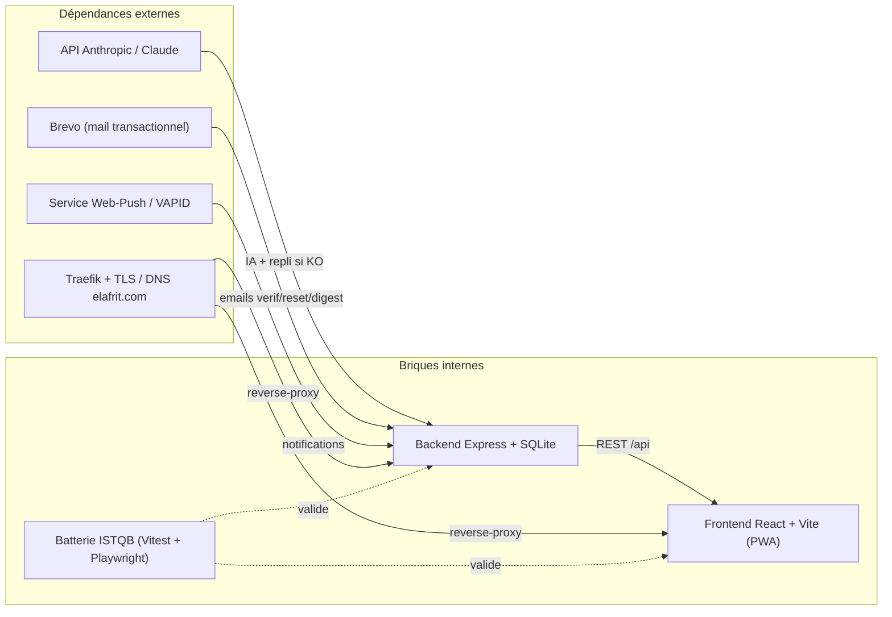
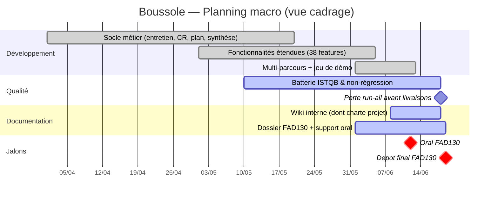

# Charte projet — Boussole

La présente charte autorise et cadre le projet **Boussole**, une application web d'aide à l'accompagnement à la rédaction de mémoires de master, réalisée dans le cadre académique du Cnam (UE FAD130). Elle fixe le **pourquoi** (mission, justification), le **quoi** (objectifs SMART, périmètre, livrables), le **comment** (gouvernance, rôles, jalons) et les **garde-fous** (contraintes, hypothèses, risques, critères de succès). Document de référence du cadrage, il prévaut en cas de divergence sur le périmètre tant qu'aucune version postérieure n'est validée par le sponsor.

> **Contexte de validation** — Projet académique solo : le sponsor et le porteur sont la même personne (Mohamed EL AFRIT). La « validation » s'entend ici comme arbitrage personnel documenté, sous la contrainte externe de l'évaluation Cnam (jury FAD130). Cette singularité est explicitée pour ne pas surdimensionner la gouvernance.

## Objectifs de la page

- Donner une **vision partagée et opposable** du projet : mission, périmètre, livrables, jalons.
- Servir de **référentiel de cadrage** pour arbitrer les demandes de changement d'ici l'oral et le dépôt.
- Documenter les **objectifs SMART**, les **critères de succès** et la **gouvernance** réelle (et non théorique).
- Expliciter **contraintes, hypothèses, dépendances et risques majeurs** avec leur niveau de confiance.
- Fournir un **planning macro** (Gantt Mermaid) et un **RACI synthétique** exploitables.

---

## 1. Identification du projet

| Attribut | Valeur |
|---|---|
| Nom du projet | **Boussole** |
| Cadre | Cnam — UE **FAD130** (projet de fin d'unité) |
| Sponsor / commanditaire | **Mohamed EL AFRIT** (cadre académique : jury FAD130 comme commanditaire externe de fait) |
| Chef de projet / porteur | **Mohamed EL AFRIT** (auteur unique, projet solo) |
| Bénéficiaires (utilisateurs cibles) | **Accompagnateurs** de mémoire et **accompagnés** (étudiants/alternants de master) |
| Domaine de production | `boussole.elafrit.com` |
| Type de projet | Développement applicatif web full-stack + dossier documentaire académique |
| Statut de la charte | Rédigée — référentiel actif jusqu'au dépôt |

## 2. Contexte et justification

L'accompagnement à la rédaction de mémoire est une relation **asymétrique et exigeante en posture** : l'accompagnateur doit poser les bonnes questions et tenir une juste distance, sans induire ni faire à la place ; l'accompagné doit clarifier sa pensée et avancer concrètement. Les outils génériques (visioconférence, traitement de texte, messagerie) ne soutiennent ni la **structuration de l'entretien**, ni la **production d'un compte rendu exploitable**, ni le **suivi d'un plan d'action**.

**Justification.** Boussole comble ce manque en outillant le **processus** d'accompagnement (entretien guidé en 6 phases, compte rendu structuré, plan d'action SMART, synthèse de parcours) et en l'**augmentant par l'IA Claude** — toujours avec un **repli déterministe** garantissant la continuité de service. Le projet répond simultanément à un **objectif pédagogique** (démontrer la maîtrise d'une chaîne logicielle complète et d'une démarche qualité ISTQB dans le cadre FAD130) et à un **objectif d'usage** (un produit réellement utilisable, déployé en production).

> **Hypothèse — confiance : élevée** — La valeur différenciante réside dans l'outillage du *processus* relationnel et réflexif, non dans la génération de texte brute. Cette hypothèse oriente tout le périmètre.

## 3. Objectifs SMART

| # | Objectif | Spécifique | Mesurable | Atteignable | Réaliste | Échéance |
|---|---|---|---|---|---|---|
| O1 | **Livrer l'application en production** | App full-stack déployée sur `boussole.elafrit.com` (Traefik + TLS) | Endpoint `GET /api/health` à 200 ; parcours des 3 rôles jouable | Stack maîtrisée (Node/React/SQLite/Docker) | Déjà déployée | Dépôt 19/06/2026 |
| O2 | **Couvrir le parcours métier de bout en bout** | Inscription → parcours → RDV → entretien → CR → plan d'action → synthèse | 7 étapes franchissables sans blocage | Workflow implémenté | Validé en démo | Oral 12/06/2026 |
| O3 | **Garantir la non-régression** | Batterie de tests ISTQB rejouée avant livraison | **≥ 959/961** cas au vert (réf. actuelle) | Suite automatisée existante (Vitest + Playwright) | Atteint | Avant chaque livraison |
| O4 | **Démontrer la robustesse IA** | Chaque feature IA dispose d'un repli déterministe | 0 réponse 500 sur indisponibilité IA (dégradation) | Pattern systématisé dans `claude.ts` | Atteint | Continu |
| O5 | **Soutenir l'évaluation FAD130** | Dossier + oral conformes aux attendus de l'UE | Soutenance tenue ; dossier déposé | Dossier en cours | Sous contrôle | Oral 12/06 ; dépôt 19/06 |

> **Hypothèse — confiance : moyenne** — Le seuil « ≥ 959/961 » est repris de l'état de référence connu (88 unitaires +2 ignorés, 781 API, 90 UI). Tout ajout de fonctionnalité postérieur doit reconduire ce niveau, pas un chiffre figé.

## 4. Périmètre

### 4.1 Inclus

- **Socle métier** : questionnaire initial, entretien guidé 6 phases, comptes rendus versionnés (HTML/TipTap), prise de RDV, plan d'action SMART, synthèse de parcours, auto-évaluation, **multi-parcours**.
- **38 fonctionnalités** activables par **plan d'abonnement** (gating) — socle, visuel, IA & posture, relationnel, émergence, pilotage, collaboration, éthique, confort, adoption.
- **3 rôles** (admin, accompagnateur, accompagné) avec contrôle d'accès front (`Protected`) et back (`requireAuth` / `requireRole` / `requireFeature`).
- **IA Claude** avec **repli déterministe systématique** sur chaque fonctionnalité IA.
- **RGPD** : consentement versionné, demande d'effacement (anonymisation ou suppression), rétention, journal d'accès.
- **Déploiement Docker** (local + prod Traefik/TLS) et **PWA + web-push**.
- **Démarche qualité ISTQB** (Vitest, Playwright, documentation IEEE 829, porte de non-régression `run-all`).
- **Wiki documentaire interne** (admin-only, Markdown éditable, table `wiki_pages`).

### 4.2 Exclu (hors périmètre)

| Élément exclu | Justification |
|---|---|
| **Paiement réel** des abonnements | Les plans démontrent le *gating* ; aucune passerelle de paiement (la mention « pas de paiement réel implémenté » est assumée). |
| **Multi-tenant / multi-établissements** | Mono-instance SQLite, projet académique solo ; non requis. |
| **Application mobile native** | Couvert fonctionnellement par la **PWA** ; pas de build iOS/Android natif. |
| **Édition collaborative temps réel** du CR (type CRDT) | CR versionné + discussion asynchrone suffisent au besoin. |
| **Internationalisation (i18n)** | Produit **en français** uniquement (public cible francophone). |
| **Haute disponibilité / scaling horizontal** | Mono-instance assumée (cf. décision SQLite). |

> **Hypothèse — confiance : élevée** — Ces exclusions sont des **décisions structurantes assumées**, pas des oublis. Toute réintroduction relèverait d'un projet ultérieur, hors charte actuelle.

## 5. Livrables principaux

| # | Livrable | Nature | État |
|---|---|---|---|
| L1 | Application **Boussole** déployée (`boussole.elafrit.com`) | Logiciel en production | Développé |
| L2 | Code source monorepo (`app/api`, `app/web`, `app/tests`) | Code + IaC Docker | Développé |
| L3 | **Batterie de tests ISTQB** + documentation IEEE 829 (Plan, Catalogue ~1204 cas, Matrice de traçabilité, Rapport) | Qualité | Développé / maintenu |
| L4 | **Jeu de données de démonstration** (vitrine Mohamed/Amine, dossiers) | Données seed | Développé |
| L5 | **Wiki documentaire interne** (dont la présente charte) | Documentation | En cours |
| L6 | **Dossier académique FAD130** + support d'**oral** | Livrable pédagogique | En cours |

## 6. Jalons

| Jalon | Date | Nature | Critère de franchissement |
|---|---|---|---|
| Gel fonctionnel (*feature freeze*) | *Information non identifiée dans le code ou la conversation.* | Interne | Plus d'ajout de feature ; stabilisation |
| **Oral FAD130** | **12/06/2026** | Externe (jury) | Soutenance tenue ; démo des 3 rôles |
| Gel documentaire / relecture finale | Entre le 12 et le 19/06 | Interne | Dossier figé, wiki complet, `run-all` au vert |
| **Dépôt final FAD130** | **19/06/2026** | Externe (jury) | Dossier + code déposés |

> **Hypothèse — confiance : moyenne** — La date de *feature freeze* n'est pas formalisée dans le contexte. Recommandation : la fixer au **plus tard à l'oral (12/06)** pour réserver la dernière semaine à la documentation et à la non-régression.

## 7. Contraintes

| Catégorie | Contrainte | Impact |
|---|---|---|
| **Délai** | Oral 12/06, dépôt 19/06/2026 — dates **non négociables** (calendrier Cnam) | Pilotage par le délai ; arbitrage du périmètre, pas de l'échéance |
| **Ressource** | **Auteur unique** (solo) — pas de parallélisation possible | Limite le volume de fonctionnalités matures simultanées |
| **Technique** | **SQLite mono-instance**, `better-sqlite3` synchrone, **sans ORM** | Pas de scaling horizontal ; simplicité assumée |
| **Architecture** | Auth **cookie httpOnly JWT** ; sécurité helmet/cors ; feature-gating par plan | Cadre fixé, non rediscuté |
| **Dépendance externe** | **API Anthropic (Claude)** pour l'IA | Mitigée par **repli déterministe** obligatoire |
| **Conformité** | **RGPD** (consentement, effacement, rétention, journal) | Obligatoire ; déjà implémenté |
| **Budget** | Coût marginal proche de zéro (cf. §11) | Pas de financement dédié |

## 8. Hypothèses de cadrage

> **Hypothèse — confiance : élevée** — L'environnement de production (`boussole.elafrit.com`, Traefik, TLS) reste disponible et stable jusqu'au dépôt.

> **Hypothèse — confiance : élevée** — Le périmètre fonctionnel (38 features) est **gelé** : la fin de projet est consacrée à la **stabilisation et la documentation**, non à de nouvelles fonctionnalités.

> **Hypothèse — confiance : moyenne** — La consommation d'API Anthropic reste dans une enveloppe gratuite ou marginale ; le repli déterministe absorbe tout dépassement ou indisponibilité.

> **Hypothèse — confiance : moyenne** — Les attendus du jury FAD130 sont couverts par le triptyque *application déployée + démarche qualité ISTQB + dossier documentaire*.

## 9. Dépendances

*Lecture.* Les dépendances externes critiques (Anthropic, Brevo, Traefik/DNS, Web-Push) sont toutes **dégradables** : l'IA bascule sur son repli déterministe, l'email et le push sont **non bloquants** pour le parcours principal, et l'indisponibilité du reverse-proxy n'affecte que l'accès production (le développement local via `docker-compose.local.yml` reste autonome). Aucune dépendance ne constitue un **point de défaillance unique** du cœur métier.

## 10. Gouvernance, rôles et responsabilités

### 10.1 Instances de pilotage

Le projet étant **solo**, la gouvernance est volontairement **légère** : un **journal de décisions** (ADR — voir [Journal des décisions d'architecture](adr)) tient lieu d'instance de validation, et la **porte de non-régression** `run-all` joue le rôle de comité qualité automatisé avant chaque livraison.

### 10.2 RACI synthétique

Rôles : **MEA** = Mohamed EL AFRIT (sponsor/CP/dev) · **Jury** = jury FAD130 (évaluateur externe) · **CI** = chaîne CI/tests automatisée.

| Activité | MEA | Jury | CI |
|---|:---:|:---:|:---:|
| Décision de périmètre / charte | **R/A** | C | – |
| Développement (front/back/IA) | **R/A** | I | – |
| Tests & non-régression (`run-all`) | A | I | **R** |
| Déploiement production | **R/A** | I | C |
| Conformité RGPD | **R/A** | C | C |
| Rédaction du dossier & wiki | **R/A** | C | – |
| Soutenance orale | **R/A** | **C/I** | – |
| Évaluation finale | I | **R/A** | – |

*Légende : **R** = Réalise · **A** = Approuve · **C** = Consulté · **I** = Informé.*

> **Hypothèse — confiance : moyenne** — Le jury FAD130 est modélisé comme « Approbateur » de l'évaluation finale et « Consulté » pour les choix structurants (via le dossier et l'oral). Ce mapping reflète une relation académique, non un comité de pilotage classique.

## 11. Budget estimatif

> **Toutes les valeurs ci-dessous sont des hypothèses.** Aucun budget formel n'est documenté dans le contexte (*Information non identifiée dans le code ou la conversation*). Projet académique sans financement dédié ; le coût réel est dominé par le **temps personnel** et quelques frais d'infrastructure.

| Poste | Hypothèse de coût | Base de l'hypothèse | Confiance |
|---|---|---|---|
| Charge humaine (porteur) | Non valorisée (temps étudiant) | Projet solo, hors marché | Élevée |
| Nom de domaine `elafrit.com` | ~10–15 €/an (quote-part) | Tarif registrar courant ; domaine mutualisé | Moyenne |
| Hébergement / VPS (Docker, Traefik) | ~5–20 €/mois | VPS entrée de gamme | Moyenne |
| API Anthropic (Claude) | ~0–20 € sur la durée du projet | Usage faible + repli déterministe limitant les appels | Faible |
| Email transactionnel (Brevo) | 0 € | Palier gratuit suffisant au volume académique | Moyenne |
| TLS (Let's Encrypt via Traefik) | 0 € | Certificats gratuits | Élevée |
| **Total monétaire estimé** | **≈ 50–120 €** sur la durée | Somme des postes ci-dessus | **Faible à moyenne** |

*Conclusion budgétaire.* Le projet est **quasi gratuit en monétaire** ; la ressource rare et structurante est le **temps d'une seule personne** sur un calendrier court — ce qui justifie un pilotage **par le délai et le périmètre**, non par le coût.

## 12. Critères de succès

| Dimension | Critère de succès | Mesure / preuve |
|---|---|---|
| **Académique** | Oral tenu et dossier déposé dans les délais | Soutenance 12/06 ; dépôt 19/06 |
| **Fonctionnel** | Parcours métier complet jouable par les 3 rôles | Démo de bout en bout sans blocage |
| **Qualité** | Non-régression tenue | `run-all` **≥ 959/961** au vert avant livraison |
| **Robustesse** | Aucune erreur 500 sur indisponibilité IA | Dégradation vers repli déterministe vérifiée |
| **Conformité** | RGPD opérationnel | Consentement, effacement, rétention, journal d'accès actifs |
| **Production** | Service en ligne et sain | `GET /api/health` à 200 sur `boussole.elafrit.com` |

## 13. Risques majeurs

| ID | Risque | P | I | Criticité | Réponse | Lien |
|---|---|:--:|:--:|:--:|---|---|
| R1 | Indisponibilité / coût API Anthropic | M | M | Moyenne | **Repli déterministe** systématique (déjà en place) | [Registre des risques](risk-register) |
| R2 | Glissement du périmètre en fin de projet | M | É | **Élevée** | Gel fonctionnel à l'oral ; arbitrage par la charte | [Feuille de route](roadmap) |
| R3 | Régression introduite tardivement | M | É | **Élevée** | Porte `run-all` obligatoire avant chaque livraison | [Stratégie de test](testing-strategy) |
| R4 | Charge concentrée sur une seule personne (aléa santé/disponibilité) | F | É | Moyenne | Marge sur le périmètre ; documentation à jour ; pas de tâche critique non documentée | [Registre des risques](risk-register) |
| R5 | Corruption / perte de la base SQLite mono-fichier | F | É | Moyenne | Sauvegarde du fichier `boussole.sqlite` ; WAL ; reseed démo reproductible | [Architecture des données](data-architecture) |
| R6 | Non-conformité RGPD à l'évaluation | F | M | Faible | Conformité déjà implémentée et testée | [Sécurité & conformité](security) |
| R7 | Dérive du planning documentaire (dossier/wiki) | M | M | Moyenne | Réserver la dernière semaine à la rédaction ; wiki incrémental | [Feuille de route](roadmap) |

*P = Probabilité, I = Impact (F/M/É = Faible/Moyen/Élevé).*

## 14. Planning macro (Gantt simplifié)

*Lecture.* Le développement du **socle** et des **38 fonctionnalités** est achevé (`done`) ; la phase courante (`active`) est désormais à dominante **qualité et documentation**. Les deux jalons critiques (oral 12/06, dépôt 19/06) encadrent une dernière fenêtre dédiée à la stabilisation. Le chevauchement volontaire qualité/documentation reflète le pilotage par le délai d'un projet solo.

> **Hypothèse — confiance : faible** — Les dates de *début* des phases de développement (avril–mai) sont **reconstituées** pour donner une vue macro cohérente ; elles ne sont pas attestées par le contexte. Seules les échéances 12/06 et 19/06 sont des faits.

## Hypothèses

- **Périmètre gelé** : la fin de projet stabilise et documente, sans nouvelle fonctionnalité (confiance élevée).
- **Infrastructure stable** jusqu'au dépôt (`boussole.elafrit.com`, Traefik, TLS) (confiance élevée).
- **Coût IA marginal**, absorbé par le repli déterministe (confiance moyenne).
- **Gouvernance solo** : sponsor = porteur ; le jury FAD130 est le commanditaire/évaluateur externe de fait (confiance élevée).
- **Budget monétaire faible** (≈ 50–120 €), entièrement hypothétique ; la ressource rare est le temps (confiance faible à moyenne).
- **Dates internes** (feature freeze, débuts de phases) non formalisées dans le contexte ; reconstituées pour la vue macro.

## Risques & points d'attention

- **R2 — Glissement de périmètre** et **R3 — régression tardive** sont les deux risques de criticité élevée : la discipline de **gel fonctionnel** et la **porte `run-all`** sont les contre-mesures non négociables.
- **R4 — concentration sur une personne** : maintenir la documentation à jour (wiki + dossier) est la principale assurance ; toute tâche critique non documentée augmente le risque.
- **Point d'attention planning** : la dernière semaine (12→19/06) doit rester majoritairement **documentaire**, sous peine de comprimer la relecture du dossier.
- **Point d'attention budget** : le total chiffré est une **estimation à confiance faible** ; ne pas le présenter comme un engagement.

## Recommandations

1. **Formaliser le gel fonctionnel** au plus tard à l'oral (12/06) et le tracer dans le [Journal des décisions d'architecture](adr).
2. **Conditionner toute livraison** à un `run-all` vert (`≥ 959/961`) — en faire un critère de sortie explicite, déjà aligné avec O3.
3. **Sauvegarder le fichier SQLite** avant toute opération sensible et juste avant l'oral/dépôt (mitigation R5).
4. **Prioriser le wiki et le dossier** sur les dernières fonctionnalités « nice-to-have » : à ce stade, la valeur d'évaluation marginale de la documentation dépasse celle d'une feature supplémentaire.
5. **Présenter le budget comme une fourchette hypothétique** assumée, en valorisant la sobriété (coût quasi nul, dégradation gracieuse) comme un choix d'architecture.

## Pages liées

- [Synthèse exécutive](executive-summary) — vision condensée pour décideurs.
- [Exigences](requirements) et [Spécifications fonctionnelles](functional-specifications) — le détail du *quoi*.
- [Étude d'opportunité](opportunity-study), [Étude de faisabilité](feasibility-study), [Analyse de la valeur (business case)](business-case) — la justification amont.
- [Architecture technique](technical-architecture) et [Architecture des données](data-architecture) — le *comment* technique.
- [Sécurité & conformité](security) — RGPD, auth, gating.
- [Stratégie de test](testing-strategy) — la démarche ISTQB et la porte de non-régression.
- [Feuille de route](roadmap), [Registre des risques](risk-register), [Journal des décisions d'architecture](adr) — pilotage et décisions.
- [Matrice de traçabilité](traceability-matrix) — du besoin au test.
- [Glossaire](glossary) — terminologie Boussole.
