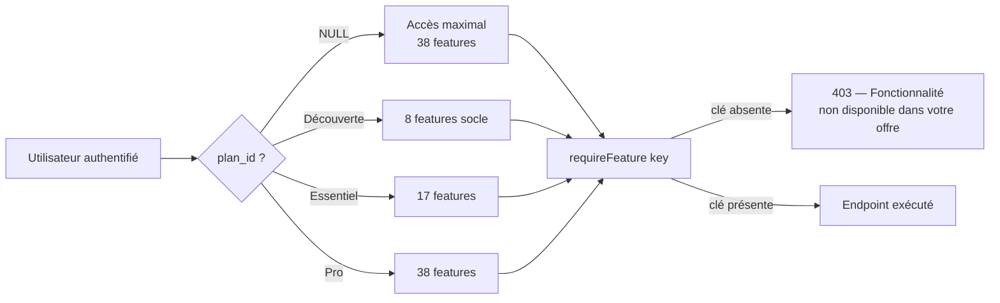
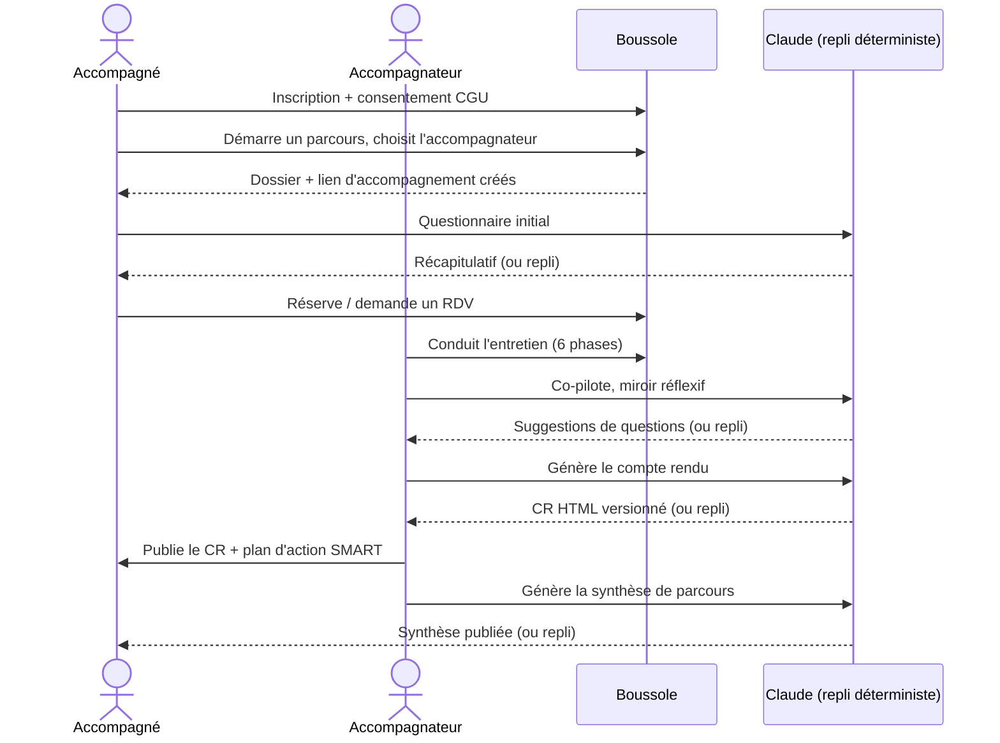
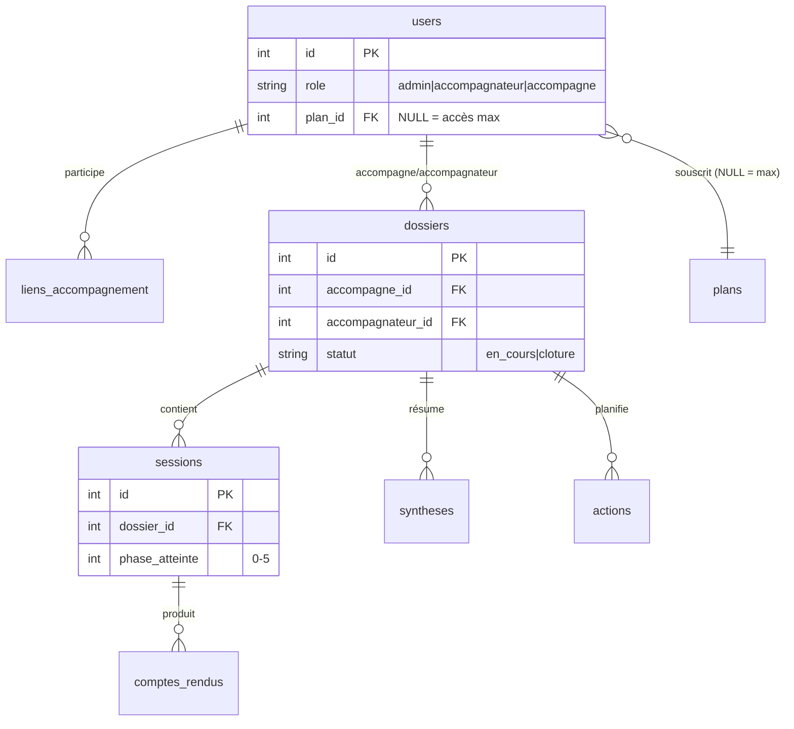

# Cahier des charges détaillé

Ce document constitue la **référence d'ingénierie des exigences** du projet Boussole : il formalise les besoins métier, les exigences fonctionnelles couvrant les 38 fonctionnalités réellement implémentées, les exigences non fonctionnelles, et un échantillon de user stories assorties de critères d'acceptation. Chaque exigence porte un **statut réel** (développé / partiel / absent) afin de distinguer sans ambiguïté ce qui est livré de ce qui est projeté. Le périmètre est celui d'un projet académique solo (Cnam, UE FAD130), dont la finalité est de démontrer une chaîne complète d'accompagnement à la rédaction de mémoires, outillée par l'IA et conçue selon les standards d'un produit professionnel.

## Objectifs de la page

- Fournir une **source de vérité contractuelle** des besoins et exigences, traçable et exploitable pour la conception, le développement, le test et la recette.
- Couvrir **l'intégralité du périmètre fonctionnel** (38 features) et le rattacher aux acteurs, règles métier et scénarios.
- Spécifier les **exigences non fonctionnelles** mesurables (sécurité, RGPD, performance, accessibilité, etc.).
- Servir de **point d'entrée de la matrice de traçabilité** ([Matrice de traçabilité](traceability-matrix)) reliant besoins → exigences → tests.

---

## 1. Présentation générale

### 1.1 Contexte

Boussole est une application web d'**accompagnement à la rédaction de mémoires** pour étudiants et alternants de master. Elle s'inscrit dans le cadre de l'UE FAD130 du Cnam, en tant que projet académique mené par un auteur unique (Mohamed EL AFRIT). Le produit instrumente la relation entre un **accompagnateur** (qui doit poser les bonnes questions et tenir une posture juste) et un **accompagné** (qui doit avancer sur son mémoire), avec l'appui de l'IA Claude et un repli déterministe systématique.

### 1.2 Enjeux

| Enjeu | Description | Indicateur de réussite |
|---|---|---|
| Qualité de la posture | Aider l'accompagnateur à questionner sans imposer ses solutions | Co-pilote + miroir réflexif opérationnels sur les 6 phases |
| Progression de l'accompagné | Rendre tangible l'avancée du mémoire | Boussole de progression, synthèse de parcours, plan d'action SMART |
| Continuité du suivi | Tracer chaque entretien, CR et action dans la durée | Multi-parcours, historique versionné, digest hebdomadaire |
| Conformité | Respecter le RGPD by design | Consentement versionné, effacement, anonymisation, journal d'accès |
| Robustesse | Ne jamais bloquer l'usage si l'IA est indisponible | Repli déterministe sur 100 % des fonctions IA |

### 1.3 Vision

> *« Une boussole, pas un pilote automatique. »* L'outil augmente le jugement humain de l'accompagnateur et l'autonomie de l'accompagné ; il ne se substitue ni à l'un ni à l'autre. L'IA propose, l'humain décide, le système trace.

### 1.4 Objectifs

- **O1** — Couvrir le workflow métier de bout en bout : inscription → parcours → questionnaire → RDV → entretien guidé → compte rendu → plan d'action → synthèse.
- **O2** — Outiller la posture de l'accompagnateur (co-pilote, miroir, banque de questions, coach de posture, débriefing, replay).
- **O3** — Soutenir l'émergence du mémoire chez l'accompagné (fil rouge, moments-clés, nuage de thèmes, problématisation, résumé).
- **O4** — Garantir la conformité RGPD et la sécurité applicative.
- **O5** — Démontrer la modularité commerciale par un feature-gating piloté par plan d'abonnement.

### 1.5 Périmètre

**Périmètre fonctionnel inclus** : les 38 fonctionnalités du registre (`app/api/src/features.ts`), regroupées en 9 catégories (Socle, Visuel, IA & posture, Relationnel, Émergence, Pilotage, Collaboration, Éthique, Confort, Adoption).

**Périmètre technique inclus** : frontend React 18 / Vite / TypeScript ; backend Node 20 / Express / TypeScript ; SQLite (better-sqlite3) ; IA Anthropic Claude ; déploiement Docker + Traefik. Voir [Architecture technique](technical-architecture).

**Hors périmètre** : paiement réel des abonnements (les plans démontrent le gating sans transaction) ; application mobile native ; internationalisation au-delà du français ; multi-tenant.

### 1.6 Contraintes

| Type | Contrainte |
|---|---|
| Académique | Échéances fermes : oral le 12/06/2026, dépôt le 19/06/2026 ; auteur unique |
| Technique | Mono-instance SQLite (pas d'ORM, accès synchrone) ; pas de file d'attente ni de cache distribué |
| IA | Dépendance externe Anthropic → repli déterministe obligatoire, jamais de 500 fonctionnel |
| Sécurité | Auth par cookie httpOnly JWT ; helmet ; CORS credentials ; bcrypt 10 rounds |
| Conformité | RGPD by design (consentement versionné, effacement, rétention) |
| Budget | Projet académique solo, hors budget commercial (voir [Étude d'opportunité](opportunity-study)) |

---

## 2. Besoins métier (MoSCoW)

Les besoins métier expriment le **pourquoi**, indépendamment de la solution. Priorisation MoSCoW : **M** = Must, **S** = Should, **C** = Could, **W** = Won't (this time).

| ID | Besoin | Description | Justification | Valeur | MoSCoW | Statut |
|---|---|---|---|---|---|---|
| BM-01 | Cadrer l'entretien | L'accompagnateur dispose d'une trame d'entretien en 6 phases | Évite la dérive et le conseil prématuré | Élevée | Must | Développé |
| BM-02 | Assister le questionnement | Suggestions de questions adaptées au contexte | Cœur de la posture d'accompagnement | Élevée | Must | Développé |
| BM-03 | Tracer chaque entretien | Sessions horodatées, rattachées à un parcours | Continuité et preuve du suivi | Élevée | Must | Développé |
| BM-04 | Produire un compte rendu | CR structuré, versionné, partageable | Restitution et engagement mutuel | Élevée | Must | Développé |
| BM-05 | Planifier l'action | Plan d'action SMART priorisé | Transformer l'échange en progrès concret | Élevée | Must | Développé |
| BM-06 | Synthétiser le parcours | Vue d'ensemble de la progression du mémoire | Capitaliser, préparer la soutenance | Élevée | Must | Développé |
| BM-07 | Gérer les RDV | Créneaux, réservation, demande, .ics | Fluidifier la logistique relationnelle | Moyenne | Must | Développé |
| BM-08 | Suivre plusieurs parcours | Un accompagné peut mener plusieurs mémoires/sujets | Réalité des cursus, réutilisation | Moyenne | Must | Développé |
| BM-09 | Soutenir la posture réflexive | Miroir, débriefing, replay, bilan de pratique | Montée en compétence de l'accompagnateur | Élevée | Should | Développé |
| BM-10 | Soutenir l'émergence | Fil rouge, moments-clés, problématisation, nuage | Faire émerger le propos du mémoire | Élevée | Should | Développé |
| BM-11 | Suivre l'état émotionnel | Météo intérieure, roue des émotions, micro-journal | Détecter fatigue/découragement | Moyenne | Should | Développé |
| BM-12 | Piloter l'accompagnement | Signaux faibles, tableau d'impact, digest | Anticiper le décrochage, prioriser | Moyenne | Should | Développé |
| BM-13 | Respecter le RGPD | Consentement, effacement, transparence | Obligation légale et éthique | Élevée | Must | Développé |
| BM-14 | Moduler l'offre | Feature-gating par plan d'abonnement | Démontrer un modèle commercial | Moyenne | Should | Développé |
| BM-15 | Faciliter l'adoption | Onboarding, FALC, mode sombre, audio | Accessibilité et prise en main | Faible | Could | Développé |
| BM-16 | Mutualiser entre pairs | Partage de ressources entre accompagnés | Entraide, capitalisation collective | Faible | Could | Partiel |
| BM-17 | Encaisser des paiements | Abonnement payant réel | Monétisation | Faible | Won't | Absent |

---

## 3. Exigences fonctionnelles

Les exigences fonctionnelles expriment le **quoi**. Elles couvrent les 38 features. Acteurs : **AG** = accompagnateur, **AC** = accompagné, **AD** = admin, **SYS** = système. Statut : Développé / Partiel / Absent.

### 3.1 Socle (8 features)

| ID | Fonctionnalité | Acteur | Description | Préconditions | Scénario nominal | Cas alternatifs | Règles métier | Prio | Statut |
|---|---|---|---|---|---|---|---|---|---|
| EF-01 | Questionnaire initial | AC | Questionnaire d'amorçage assisté IA avec récap | Parcours créé, lien actif | AC répond → IA propose la question suivante → récapitulatif sauvegardé | IA indisponible → questions déterministes de repli | 1 questionnaire par dossier | Must | Développé |
| EF-02 | Entretien guidé | AG | Conduite d'entretien en 6 phases (0→5) | Session ouverte sur un dossier | AG progresse phase par phase, capture réponses | Phase sautée autorisée mais tracée | `phase_atteinte` 0–5 | Must | Développé |
| EF-03 | Comptes rendus | AG/AC | CR HTML versionné, éditable (TipTap), publiable | Session existante | Génération IA → édition → publication → discussion | Édition manuelle si source `manuel` | Versions immuables, notes privées AG | Must | Développé |
| EF-04 | Rendez-vous | AG/AC | Créneaux, réservation, demande, export .ics | Lien d'accompagnement actif | AG publie créneaux → AC réserve | Aucun créneau → AC demande un RDV | 1 réservation par créneau | Must | Développé |
| EF-05 | Plan d'action | AG/AC | Actions SMART priorisées, glisser-déposer, rappels | Dossier ouvert | Créer action (libellé, échéance, critère, priorité) → réordonner | Rappel email à l'échéance | `ordre` pour drag-and-drop | Must | Développé |
| EF-06 | Synthèse du parcours | AG | Synthèse IA versionnée, publiable | Dossier avec sessions | Génération IA → édition → publication | IA indisponible → synthèse de repli | 1 synthèse courante par dossier | Must | Développé |
| EF-07 | Auto-évaluation | AC | Grille d'auto-évaluation IA, scores, validation | Dossier ouvert | AC remplit la grille → scores → validation | IA indisponible → grille déterministe | Scores rattachés au dossier | Must | Développé |
| EF-08 | Multi-parcours | AC | Démarrage et suivi de plusieurs parcours | Compte AC | AC démarre un parcours, choisit l'AG → dossier + lien créés | — | 1 dossier = 1 parcours | Must | Développé |

### 3.2 Visuel & confort de lecture (3 features)

| ID | Fonctionnalité | Acteur | Description | Préconditions | Règles métier | Prio | Statut |
|---|---|---|---|---|---|---|---|
| EF-09 | Boussole du parcours | AC | Jauge/boussole de progression du parcours | Dossier ouvert | Progression dérivée des phases atteintes | Should | Développé |
| EF-10 | Lecture audio | AC | Synthèse vocale des CR/synthèses | CR ou synthèse publiée | Lecture côté client | Could | Développé |
| EF-11 | Mode sombre | AC/AG | Thème sombre de l'interface | Authentifié | Préférence persistée | Could | Développé |

### 3.3 IA & posture (7 features)

| ID | Fonctionnalité | Acteur | Description | Préconditions | Cas alternatif (repli) | Prio | Statut |
|---|---|---|---|---|---|---|---|
| EF-12 | Miroir réflexif | AG | Analyse IA de la posture de l'accompagnateur | Session avec réponses | Analyse déterministe de repli | Should | Développé |
| EF-13 | Co-pilote d'entretien | AG | Suggestions de questions en temps réel | Session ouverte | Banque de questions des phases | Must | Développé |
| EF-14 | Banque de questions | AG | Questions personnalisées par contexte | Dossier qualifié | Questions par défaut des phases | Should | Développé |
| EF-15 | Coach de posture | AG | Conseils contextuels de posture | Entretien en cours | Conseils statiques de repli | Should | Développé |
| EF-16 | Débriefing à chaud | AG | Débriefing réflexif post-entretien | Session clôturée | Trame de débriefing fixe | Should | Développé |
| EF-17 | Replay annoté | AG | Auto-confrontation / replay annoté | Session clôturée | Lecture brute des échanges | Could | Développé |
| EF-18 | Bilan de pratique | AG | Bilan global de la pratique d'accompagnement | Plusieurs sessions | Agrégation déterministe | Could | Développé |

### 3.4 Relationnel & émotionnel (3 features)

| ID | Fonctionnalité | Acteur | Description | Règles métier | Prio | Statut |
|---|---|---|---|---|---|---|
| EF-19 | Météo intérieure | AC | Humeur 1–5 + mot du jour | 1 saisie horodatée | Should | Développé |
| EF-20 | Roue des émotions | AC | Sélection d'émotions sur une roue | Stockage `emotions_roue` | Could | Développé |
| EF-21 | Micro-journal | AC | Journal personnel d'entrées courtes | Entrées privées à l'AC | Should | Développé |

### 3.5 Émergence (5 features)

| ID | Fonctionnalité | Acteur | Description | Cas alternatif (repli) | Prio | Statut |
|---|---|---|---|---|---|---|
| EF-22 | Fil rouge du mémoire | AC | Fil conducteur du mémoire dans la durée | Synthèse déterministe | Should | Développé |
| EF-23 | Moments-clés | AC/AG | Capture des moments marquants | Liste chronologique brute | Should | Développé |
| EF-24 | Nuage de thèmes | AC | Visualisation des thèmes récurrents | Comptage de fréquence local | Could | Développé |
| EF-25 | Problématisation | AC | Assistant à la formulation de la problématique | Trame déterministe | Should | Développé |
| EF-26 | Résumé « où j'en suis » | AC | Synthèse courte de l'état d'avancement | Résumé déterministe | Should | Développé |

### 3.6 Pilotage & alertes (3 features)

| ID | Fonctionnalité | Acteur | Description | Règles métier | Prio | Statut |
|---|---|---|---|---|---|---|
| EF-27 | Signaux faibles | AG | Détection de décrochage (voyant + alerte) | Seuils sur inactivité/humeur | Should | Développé |
| EF-28 | Tableau d'impact | AG | Indicateurs d'impact de l'accompagnement | Agrégation par accompagné | Could | Développé |
| EF-29 | Digest hebdomadaire | AG | Email récapitulatif hebdomadaire | Envoi périodique (`digest_envois`) | Could | Développé |

### 3.7 Collaboration, Éthique, Confort, Adoption (9 features)

| ID | Fonctionnalité | Acteur | Description | Préconditions | Prio | Statut |
|---|---|---|---|---|---|---|
| EF-30 | Mutualisation entre pairs | AC | Partage de ressources entre pairs, lien public | Ressource créée | Could | Partiel |
| EF-31 | Transparence RGPD | AC | Accès aux données, export, demande d'effacement | Authentifié | Must | Développé |
| EF-32 | Carte du parcours | AC | Représentation cartographique du parcours | Dossier avec sessions | Could | Développé |
| EF-33 | Attestation de fin | AC | Attestation d'accompagnement en fin de parcours | Dossier clôturé | Could | Développé |
| EF-34 | Visio aux RDV | AG/AC | Lien de visioconférence sur les RDV | RDV confirmé | Could | Développé |
| EF-35 | PWA & push | AC/AG | Installation PWA + notifications push (web-push) | Abonnement push | Could | Développé |
| EF-36 | Export PDF complet | AC | Export PDF du parcours/CR/synthèse | Contenu publié | Could | Développé |
| EF-37 | Onboarding | AC/AG | Tour guidé d'accueil | Première connexion | Could | Développé |
| EF-38 | FALC | AC | Mode « facile à lire et à comprendre » | Authentifié | Could | Développé |

> **Hypothèse — confiance : moyenne** — EF-30 (mutualisation) est marquée *partiel* : les tables `ressources_partagees` et le routeur `/api/collab` existent, mais l'étendue réelle de l'UI de partage public n'a pas été vérifiée ligne à ligne dans cette analyse. À confirmer en recette.

### 3.8 Gating fonctionnel par plan

Le périmètre accessible dépend du **plan d'abonnement** (table `plans`, `features` = tableau JSON de clés). `plan_id = NULL` ⇒ accès maximal (défaut). Mapping réel (source `app/api/src/seed.ts` et `features.ts`) :

| Plan | Nb features | Contenu |
|---|---|---|
| Découverte | 8 | Socle uniquement (EF-01 → EF-08) |
| Essentiel | 17 | Socle + `boussole`, `audio`, `dark_mode`, `meteo`, `journal`, `fil_rouge`, `moments_cles`, `resume_parcours`, `transparence` |
| Pro | 38 | Toutes les fonctionnalités |



Ce diagramme illustre le contrôle d'accès fonctionnel : le middleware `requireFeature(key)` lit l'ensemble des features de l'utilisateur (via son plan) et renvoie un **403** si la clé demandée n'y figure pas. L'absence de plan ouvre l'accès complet, ce qui est le comportement par défaut.

---

## 4. Workflow métier (vue d'ensemble)



Ce diagramme retrace le parcours type de bout en bout. Le point d'architecture clé est le **repli systématique** : à chaque appel IA, si l'API Anthropic est indisponible, une version déterministe est servie, garantissant qu'aucune étape ne bloque l'utilisateur.

---

## 5. Exigences non fonctionnelles

| ID | Catégorie | Exigence | Cible / critère | Statut |
|---|---|---|---|---|
| ENF-01 | Performance | Temps de réponse API hors IA | < 200 ms p95 (SQLite synchrone) | Développé (non mesuré formellement) |
| ENF-02 | Performance | Dégradation IA | Repli déterministe < 50 ms, jamais de 500 | Développé |
| ENF-03 | Disponibilité | Mono-instance, redémarrage Docker | Best-effort ; pas de HA | Partiel |
| ENF-04 | Sécurité | Auth | JWT cookie httpOnly, sameSite=lax, secure en prod, 7 j | Développé |
| ENF-05 | Sécurité | Mots de passe | bcrypt 10 rounds, jamais en clair | Développé |
| ENF-06 | Sécurité | En-têtes HTTP | helmet, CORS credentials, cookie-parser | Développé |
| ENF-07 | Sécurité | Contrôle d'accès | requireAuth + requireRole + requireFeature | Développé |
| ENF-08 | Sécurité | Validation des entrées | zod sur tous les payloads | Développé |
| ENF-09 | Confidentialité/RGPD | Consentement versionné | Table `consentements` + IP | Développé |
| ENF-10 | Confidentialité/RGPD | Droit à l'effacement | Anonymisation ou suppression par admin | Développé |
| ENF-11 | Confidentialité/RGPD | Rétention | Balayage périodique `sweepRetention` | Développé |
| ENF-12 | Confidentialité/RGPD | Journalisation des accès | Table `journal_acces` | Développé |
| ENF-13 | Sécurité contenu | Sanitisation HTML | DOMPurify côté front (CR/synthèses TipTap) | Développé |
| ENF-14 | Accessibilité | FALC, mode sombre, audio | Mode « facile à lire », thème sombre, TTS | Développé |
| ENF-15 | Accessibilité | Conformité WCAG 2.1 AA | Non audité formellement | Partiel |
| ENF-16 | Compatibilité | Navigateurs modernes | Chrome/Edge/Firefox/Safari récents (build Vite) | Développé (non testé exhaustivement) |
| ENF-17 | Scalabilité | Montée en charge | Limitée par SQLite mono-fichier mono-instance | Partiel (par conception) |
| ENF-18 | Maintenabilité | TypeScript strict, monorepo | api / web / tests séparés | Développé |
| ENF-19 | Observabilité | Endpoint santé | GET /api/health | Développé |
| ENF-20 | Observabilité | Métriques/alerting | Pas d'APM ni de métriques exportées | Absent |
| ENF-21 | Sauvegarde | Sauvegarde du fichier SQLite | Procédure non automatisée dans le code | Partiel |
| ENF-22 | Reprise (PRA) | Restauration après incident | Restauration manuelle du fichier `.sqlite` | Partiel |
| ENF-23 | Ergonomie | UI cohérente, onboarding | CSS maison, tour guidé, framer-motion | Développé |
| ENF-24 | i18n | Internationalisation | Français uniquement, pas d'i18n | Absent (hors périmètre) |
| ENF-25 | Qualité | Couverture de tests | 959/961 verts (unit + API + UI E2E) | Développé |

> **Hypothèse — confiance : moyenne** — ENF-01 (p95 < 200 ms) est une cible raisonnable pour un accès SQLite synchrone local, mais aucun test de charge formel n'a été identifié dans le code. À traiter comme objectif, non comme mesure.

> **Hypothèse — confiance : faible** — ENF-21/22 (sauvegarde/reprise) : aucune tâche planifiée de sauvegarde n'a été repérée dans la base de code analysée. *Information non identifiée dans le code ou la conversation* au-delà du fait que SQLite est un mono-fichier copiable à chaud (WAL).

---

## 6. User stories & critères d'acceptation

### US-01 — Conduire un entretien guidé

> **En tant qu'**accompagnateur, **je souhaite** être guidé phase par phase avec des suggestions de questions, **afin de** tenir une posture juste sans imposer mes solutions.

```gherkin
Fonctionnalité: Entretien guidé en 6 phases
  Scénario: Progression nominale avec co-pilote
    Étant donné une session ouverte sur un dossier en cours
    Et que je suis authentifié comme accompagnateur du dossier
    Quand j'avance de la phase 0 (Accueil) à la phase 1 (Clarifier le besoin)
    Alors le co-pilote me propose des questions adaptées à la phase 1
    Et la phase_atteinte du dossier est mise à jour

  Scénario: IA indisponible
    Étant donné que l'API Anthropic est injoignable
    Quand je demande des suggestions de questions
    Alors les questions de repli de la phase courante me sont proposées
    Et aucune erreur 500 n'est renvoyée
```

### US-02 — Générer et publier un compte rendu

> **En tant qu'**accompagnateur, **je souhaite** générer un compte rendu structuré et le publier, **afin que** l'accompagné dispose d'une restitution claire et d'un plan d'action.

```gherkin
Fonctionnalité: Compte rendu versionné
  Scénario: Génération puis publication
    Étant donné une session clôturée avec des réponses capturées
    Quand je génère le compte rendu
    Alors un CR HTML de source "ia" est créé en version 1
    Et je peux l'éditer puis le publier
    Quand je publie le CR
    Alors l'accompagné peut le consulter et ouvrir une discussion

  Scénario: Repli déterministe
    Étant donné que l'IA est indisponible
    Quand je génère le compte rendu
    Alors un CR déterministe est produit à partir des réponses de la session
```

### US-03 — Démarrer un nouveau parcours

> **En tant qu'**accompagné, **je souhaite** démarrer un parcours et choisir mon accompagnateur, **afin de** suivre plusieurs sujets de mémoire indépendamment.

```gherkin
Fonctionnalité: Multi-parcours
  Scénario: Création d'un parcours
    Étant donné que je suis authentifié comme accompagné
    Quand je démarre un parcours en choisissant un accompagnateur
    Alors un dossier (statut "en_cours") est créé
    Et un lien d'accompagnement est établi avec cet accompagnateur
    Et ce parcours apparaît dans ma liste de parcours
```

### US-04 — Exercer mes droits RGPD

> **En tant qu'**accompagné, **je souhaite** demander l'effacement de mes données, **afin de** maîtriser mes informations personnelles.

```gherkin
Fonctionnalité: Droit à l'effacement
  Scénario: Demande d'effacement
    Étant donné que je suis authentifié comme accompagné
    Quand je soumets une demande d'effacement
    Alors une entrée est créée dans demandes_effacement
    Et l'admin peut la traiter par anonymisation ou suppression
    Et l'accès à mes données est journalisé dans journal_acces
```

---

## 7. Modèle conceptuel des entités pivots



Ce diagramme entité-relation cible les **pivots** du modèle (33 tables au total) : `users`, `liens_accompagnement` (N–N accompagnateur/accompagné), `dossiers` (= 1 parcours), `sessions` (= 1 entretien), `comptes_rendus`, `syntheses`, `actions` et `plans`. Le détail complet figure dans [Architecture des données](data-architecture).

---

## Hypothèses

> **Hypothèse — confiance : élevée** — Les 38 features, leurs catégories et le mapping de plans reflètent fidèlement `app/api/src/features.ts` et `app/api/src/seed.ts` (vérifiés). Le plan « Essentiel » contient bien 17 clés (8 socle + 9 ajouts).

> **Hypothèse — confiance : élevée** — Les statuts « Développé » des features socle, IA & posture, émergence, relationnel et pilotage s'appuient sur l'existence des routeurs (`/api/entretien`, `/api/cr`, `/api/synthese`, `/api/miroir`, `/api/emergence`, `/api/pilotage`, etc.) et des tables associées décrites dans le contexte projet.

> **Hypothèse — confiance : moyenne** — La granularité fine de certaines features de confort/adoption (EF-30 mutualisation, EF-34 visio) n'a pas été vérifiée endpoint par endpoint ; les statuts reposent sur la présence des routeurs `/api/collab` et `/api/confort`.

> **Information non identifiée dans le code ou la conversation** — Aucune cible chiffrée de SLA, de RTO/RPO ou de volumétrie cible n'est définie ; les valeurs de performance sont des objectifs d'ingénierie, non des engagements mesurés.

## Risques & points d'attention

| Risque | Cause | Impact | Mitigation |
|---|---|---|---|
| Indisponibilité de l'IA | Dépendance API Anthropic | Dégradation de la valeur perçue | Repli déterministe systématique (déjà en place) |
| Point unique de défaillance | SQLite mono-instance | Perte de service / de données | Sauvegarde régulière du fichier, healthcheck — voir [Exploitation](operations) |
| Absence de sauvegarde automatisée | Non identifiée dans le code | Perte de données en cas d'incident | Définir une procédure de backup (ENF-21) |
| Accessibilité non auditée | WCAG non vérifié formellement | Exclusion d'utilisateurs | Audit WCAG 2.1 AA — voir [UX/UI](ux-ui) |
| Scalabilité limitée | Conception mono-instance | Plafond de charge | Acceptable pour le périmètre académique ; documenter la limite |
| Drift exigences ↔ code | Évolution rapide en solo | Spécifications obsolètes | Maintenir la [Matrice de traçabilité](traceability-matrix) |

## Recommandations

1. **Formaliser les ENF mesurables** : ajouter un test de charge léger (ENF-01) et une procédure de sauvegarde/restauration documentée (ENF-21/22) pour passer ces exigences de *partiel* à *développé*.
2. **Auditer l'accessibilité** (ENF-15) selon WCAG 2.1 AA, en capitalisant sur FALC et le mode sombre déjà présents.
3. **Clarifier le statut de la mutualisation** (EF-30) en recette : confirmer la portée du partage public et ajuster le statut.
4. **Lier chaque exigence à un cas de test** dans la [Matrice de traçabilité](traceability-matrix) pour garantir une couverture vérifiable avant le dépôt du 19/06/2026.
5. **Documenter explicitement les hors-périmètre** (paiement réel, i18n, HA) dans le [Cadre de projet](project-charter) pour éviter toute attente non satisfaite à l'oral.

## Pages liées

- [Synthèse exécutive](executive-summary)
- [Cadre de projet](project-charter)
- [Spécifications fonctionnelles](functional-specifications)
- [Architecture technique](technical-architecture)
- [Architecture des données](data-architecture)
- [Documentation de l'API](api-documentation)
- [Sécurité](security)
- [Stratégie de test](testing-strategy)
- [Matrice de traçabilité](traceability-matrix)
- [Registre des risques](risk-register)
- [Glossaire](glossary)
