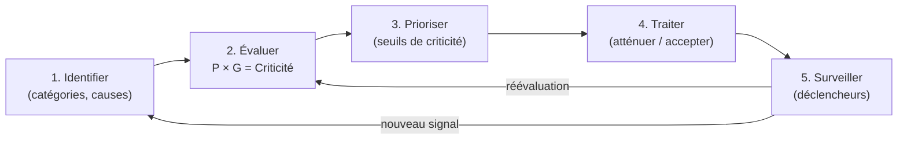
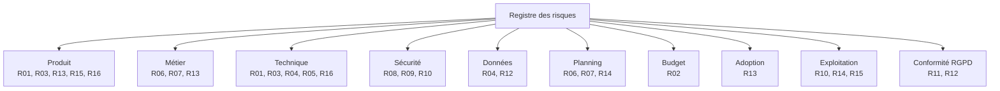
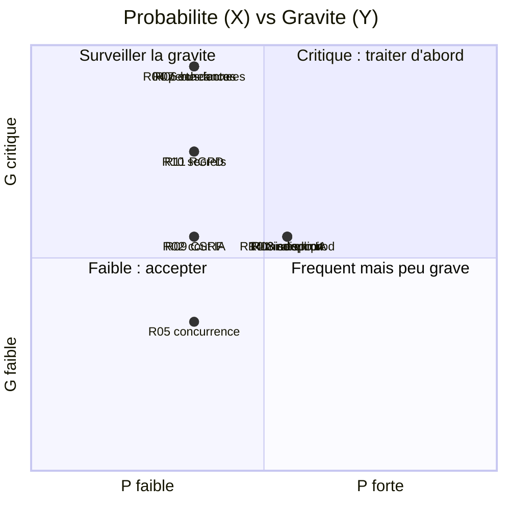

# Registre des risques — Boussole

Ce registre recense, qualifie et priorise les risques du projet Boussole (plateforme d'accompagnement à la rédaction de mémoires, UE FAD130, Cnam). Il couvre dix catégories — produit, métier, technique, sécurité, données, planning, budget, adoption utilisateur, exploitation et conformité (RGPD) — selon une démarche de management des risques : identification, cause, impact, cotation probabilité × gravité, criticité, déclencheur (signal d'alerte), mitigation et responsable. Le contexte est singulier : **projet académique solo** (auteur unique : Mohamed EL AFRIT), à **échéances courtes** (oral 12 juin 2026, dépôt 19 juin 2026), reposant sur une **IA externe** (Claude / Anthropic) et une **base SQLite mono-instance**. Le registre vise un usage décisionnel : il distingue ce qui est **déjà atténué dans le code**, ce qui est **partiellement couvert** et ce qui reste **ouvert**.

## Objectifs de la page

- Fournir un registre des risques **exhaustif et coté**, exploitable comme outil de pilotage et soutenable à l'oral FAD130.
- Rendre explicites les **échelles de cotation** (probabilité, gravité, criticité) pour que chaque note soit justifiable.
- Distinguer sans ambiguïté les risques **atténués** (mécanisme présent dans le code), **partiels** et **ouverts**.
- Relier chaque risque à sa **mitigation** et à la page d'instruction concernée (architecture, sécurité, exploitation, RGPD).
- Donner une **vue priorisée** (top risques) orientée décision pour la fin de projet et l'éventuelle mise en production.

---

## 1. Méthode & échelles de cotation

La criticité d'un risque est le produit de sa **probabilité** d'occurrence par sa **gravité** d'impact, mesurées chacune sur une échelle ordinale de 1 à 5. La criticité résultante (1 à 25) est classée en quatre niveaux d'action.

### Échelle de probabilité (P)

| Note | Niveau | Interprétation |
| --- | --- | --- |
| 1 | Rare | Peu plausible sur la durée du projet. |
| 2 | Peu probable | Possible mais sans signal actuel. |
| 3 | Possible | Plausible au moins une fois sur la période. |
| 4 | Probable | Attendu si rien n'est fait. |
| 5 | Quasi certain | Déjà observé ou structurellement inévitable. |

### Échelle de gravité (G)

| Note | Niveau | Interprétation (impact sur projet / produit / utilisateur) |
| --- | --- | --- |
| 1 | Mineur | Gêne ponctuelle, contournable, sans perte. |
| 2 | Modéré | Dégradation de service ou de qualité, récupérable. |
| 3 | Sérieux | Fonctionnalité indisponible ou jalon décalé. |
| 4 | Majeur | Perte de données, indisponibilité prolongée, ou non-conformité. |
| 5 | Critique | Échec de livraison / dépôt, ou atteinte grave aux données personnelles. |

### Échelle de criticité (C = P × G)

| Plage | Niveau | Posture de traitement |
| --- | --- | --- |
| 1–4 | **Faible** | Accepter / surveiller. |
| 5–9 | **Modéré** | Atténuer (action planifiée). |
| 10–14 | **Élevé** | Atténuer en priorité, suivi rapproché. |
| 15–25 | **Critique** | Traiter immédiatement, plan dédié. |

> **Hypothèse — confiance : moyenne** — Les échelles ci-dessus sont une convention de cotation introduite pour ce registre ; elles ne proviennent pas d'un référentiel de risques préexistant dans le code ou la documentation du projet. Les notes P et G attribuées plus bas relèvent d'un **jugement d'expert** au regard du contexte académique solo, non d'une mesure quantitative.

---

## 2. Processus de gestion des risques

Ce diagramme décrit la boucle de gestion appliquée à Boussole : on identifie les risques par catégorie, on les cote, on les priorise selon les seuils du §1, on choisit un traitement (atténuer ou accepter en connaissance de cause), puis on surveille les **déclencheurs** — les signaux observables qui annoncent la matérialisation du risque. Tout nouveau signal réenclenche la boucle. Dans un projet solo, la phase « surveiller » repose surtout sur l'auteur et sur l'instrumentation automatique (tests, signaux faibles applicatifs, logs).

---

## 3. Registre principal (risques cotés)

Légende du champ « État de mitigation » : **Atténué** = mécanisme présent et vérifiable dans le code ; **Partiel** = couverture incomplète ou conditionnelle ; **Ouvert** = pas de mitigation implémentée à ce jour.

| ID | Risque | Catégorie | Cause | Impact | P | G | C | Niveau | Déclencheur | Mitigation | État | Resp. |
| --- | --- | --- | --- | --- | --- | --- | --- | --- | --- | --- | --- | --- |
| R01 | Indisponibilité de l'API Claude pendant un usage | Technique / Produit | Panne, quota ou latence côté Anthropic | Fonctions IA muettes | 3 | 3 | 9 | Modéré | Timeout / erreur sur appel `claude.ts` | **Repli déterministe systématique** sur chaque fonction IA : jamais de 500, dégradation maîtrisée | **Atténué** | Auteur |
| R02 | Dérive du coût d'usage de l'API à l'échelle | Budget | Volumétrie de tokens non bornée, montée en usage | Coût mensuel non maîtrisé | 2 | 3 | 6 | Modéré | Hausse anormale de la facture / du volume d'appels | Suivre le coût, cadrer les prompts, plafonds ; le repli rend l'IA optionnelle | **Partiel** | Auteur |
| R03 | Baisse de qualité / changement de comportement du modèle | Technique / Produit | Évolution du modèle, prompt fragile | Sorties IA moins pertinentes | 2 | 2 | 4 | Faible | Régression perçue sur CR / suggestions | Repli déterministe + tests ; figer la version de modèle si possible | **Partiel** | Auteur |
| R04 | Perte de données SQLite (corruption / suppression fichier) | Données | Mono-fichier `boussole.sqlite`, pas de sauvegarde automatique identifiée | Perte irréversible des parcours | 2 | 5 | 10 | Élevé | Erreur d'I/O, volume Docker perdu, restauration impossible | Mode **WAL** activé ; mettre en place **sauvegardes planifiées** + test de restauration | **Ouvert** | Auteur |
| R05 | Goulot de concurrence (mono-instance, écritures sérialisées) | Technique / Exploitation | `better-sqlite3` synchrone, une seule instance API | Latence sous charge concurrente | 2 | 2 | 4 | Faible | Temps de réponse qui grimpe en charge | Acceptable au périmètre académique ; réévaluer pour multi-établissement | **Partiel** | Auteur |
| R06 | Projet à acteur unique (bus factor = 1) | Métier / Planning | Auteur unique, aucune redondance humaine | Arrêt total en cas d'indisponibilité | 2 | 5 | 10 | Élevé | Indisponibilité de l'auteur avant le dépôt | **Documentation** (ce wiki), **tests automatisés** (959/961), ADR, commits | **Partiel** | Auteur |
| R07 | Échéances serrées non tenues (oral / dépôt) | Planning | Périmètre large (38 features), fenêtre courte | Livrable incomplet à la date | 2 | 5 | 10 | Élevé | Retard sur un jalon, reste-à-faire qui croît | Périmètre déjà gelé en **MVP testé** ; arbitrer toute nouveauté vs. consolidation | **Partiel** | Auteur |
| R08 | Absence de limitation de débit (rate limiting) | Sécurité | Aucun middleware de *rate limit* dans l'API | Force brute login, abus, sur-coût IA | 3 | 3 | 9 | Modéré | Pics de requêtes, tentatives de connexion répétées | Ajouter un *rate limiting* (login, endpoints IA) ; durcir avant ouverture externe | **Ouvert** | Auteur |
| R09 | Exposition CSRF (cookie de session) | Sécurité | Auth par cookie ; protection limitée à `sameSite=lax`, pas de jeton anti-CSRF | Action non sollicitée au nom de l'utilisateur | 2 | 3 | 6 | Modéré | Requête cross-site authentifiée inattendue | `sameSite=lax` + cookie `httpOnly`/`secure` ; ajouter un **jeton anti-CSRF** | **Partiel** | Auteur |
| R10 | Coût / fuite des secrets (clé API, JWT, SMTP) | Sécurité / Exploitation | Secrets en variables d'environnement | Usurpation, sur-coût, compromission | 2 | 4 | 8 | Modéré | Secret commité, variable exposée | Garder les secrets hors dépôt, rotation, scopes minimaux | **Partiel** | Auteur |
| R11 | Non-conformité RGPD dans le traitement des demandes | Conformité | Effacement / anonymisation / rétention dépendants d'actions manuelles ou de config | Manquement légal, perte de confiance | 2 | 4 | 8 | Modéré | Demande d'effacement non traitée dans les délais | Outils RGPD natifs (effacement, anonymisation, journal d'accès) ; activer la rétention | **Partiel** | Auteur |
| R12 | Balayage de rétention inactif par défaut | Conformité / Données | `sweepRetention` ne s'exécute que si `RETENTION_AUTO=1` | Données conservées au-delà du nécessaire | 3 | 3 | 9 | Modéré | Comptes inactifs > seuil non anonymisés | Activer `RETENTION_AUTO=1` en prod ou traiter via l'écran admin de rétention | **Partiel** | Admin |
| R13 | Adoption faible côté accompagnateurs / accompagnés | Adoption utilisateur / Métier | Pas de pilote terrain réalisé, valeur non éprouvée en usage | Produit non utilisé, KPI non mesurés | 3 | 3 | 9 | Modéré | Peu de comptes actifs hors démo après ouverture | Onboarding, FALC, signaux faibles ; lancer un **pilote restreint** | **Partiel** | Auteur |
| R14 | Mise en production non finalisée | Exploitation / Planning | Déploiement Traefik/TLS sur `boussole.elafrit.com` partiel | Indisponibilité ou config non sûre en prod | 3 | 3 | 9 | Modéré | Échec de déploiement, certificat / proxy mal réglé | Durcir le déploiement (TLS, supervision, sauvegardes) avant ouverture | **Partiel** | Auteur |
| R15 | Échec de délivrabilité des emails (Brevo) | Exploitation / Produit | Dépendance externe (vérif. email, reset, rappels, digest) | Inscription / reset bloqués, rappels perdus | 2 | 3 | 6 | Modéré | Bounces, emails en spam, erreurs API Brevo | Surveiller la délivrabilité, SPF/DKIM ; dégrader proprement si l'envoi échoue | **Partiel** | Auteur |
| R16 | Régression fonctionnelle non détectée | Produit / Technique | Évolutions sans rejouer la porte de non-régression | Bug livré, vitrine de démo abîmée | 2 | 3 | 6 | Modéré | Tests rouges ou vitrine Mohamed/Amine altérée | **Batterie ISTQB 959/961** rejouée via `run-all` avant chaque livraison | **Atténué** | Auteur |

> **Hypothèse — confiance : moyenne** — Les notes P/G/C sont des estimations de l'auteur. Les **niveaux Élevé (C = 10)** concentrent les risques structurels du contexte (perte de données, acteur unique, échéances) : leur probabilité est jugée basse mais leur gravité maximale, d'où une criticité à surveiller en priorité.

---

## 4. Couverture par catégorie

Ce diagramme cartographie les dix catégories exigées et les risques rattachés (un risque peut relever de plusieurs catégories). Il montre que les concentrations principales sont **technique/produit** (dépendance IA, mono-instance, régression) et **sécurité/conformité** (rate limit, CSRF, RGPD), cohérentes avec un produit riche mais porté par une seule personne sur une stack volontairement simple.

---

## 5. Cartographie probabilité × gravité (matrice de criticité)

Cette matrice positionne chaque risque selon sa probabilité (axe X) et sa gravité (axe Y). Les risques R04, R06 et R07 se situent **haut à gauche** (gravité critique, probabilité modérée) : peu probables mais à conséquence maximale, ils justifient une vigilance dédiée même si leur criticité chiffrée reste à 10. Les risques R01, R08, R13, R14 occupent le **centre** (criticité modérée la plus active) et constituent le cœur du plan de traitement courant.

---

## 6. Top risques & plan de traitement priorisé

| Rang | ID | Risque | C | Action prioritaire | Échéance suggérée | Page liée |
| --- | --- | --- | --- | --- | --- | --- |
| 1 | R04 | Perte de données SQLite | 10 | Mettre en place sauvegardes planifiées + test de restauration | Avant ouverture externe | [Exploitation](operations), [Architecture des données](data-architecture) |
| 2 | R06 | Acteur unique (bus factor) | 10 | Capitaliser doc/ADR/tests, prévoir transfert | Continu | [ADR](adr), [Matrice de traçabilité](traceability-matrix) |
| 3 | R07 | Échéances serrées | 10 | Geler le périmètre, prioriser la consolidation | Jusqu'au dépôt | [Feuille de route](roadmap) |
| 4 | R08 | Absence de rate limiting | 9 | Ajouter un *rate limit* (login + endpoints IA) | Avant ouverture externe | [Sécurité](security) |
| 5 | R12 | Rétention inactive par défaut | 9 | Activer `RETENTION_AUTO=1` ou traiter via admin | Avant ouverture externe | [Sécurité](security), [Admin](admin-guide) |
| 6 | R14 | Mise en production partielle | 9 | Durcir Traefik/TLS, supervision | Avant ouverture externe | [Déploiement](deployment), [Exploitation](operations) |
| 7 | R13 | Adoption non éprouvée | 9 | Lancer un pilote terrain restreint | Post-MVP | [Feuille de route](roadmap) |
| 8 | R01 | Indisponibilité IA | 9 | Déjà atténué ; surveiller le repli | Continu | [Architecture technique](technical-architecture) |

Ce tableau ordonne le traitement : les trois premiers risques (criticité 10) sont structurels et appellent une posture continue de réduction ; les suivants (criticité 9) sont des **prérequis concrets de mise en production** et un **pilote** pour lever l'incertitude d'adoption. Plusieurs partagent une même échéance — « avant ouverture externe » — ce qui en fait un lot de durcissement cohérent à traiter ensemble.

---

## 7. Risques déjà atténués par conception

Tous les risques ne sont pas ouverts : plusieurs mécanismes sont **présents et vérifiables dans le code**, ce qui distingue Boussole d'un simple prototype.

| Risque maîtrisé | Mécanisme en place | Preuve |
| --- | --- | --- |
| Panne IA bloquante | Repli déterministe sur chaque fonction IA | `claude.ts` + fallbacks par fonctionnalité, jamais de 500 |
| Régression silencieuse | Porte de non-régression `run-all` | Batterie ISTQB 959/961 (unit 88+2, API 781/781, UI 90/90) |
| Accès non autorisé | Auth JWT cookie `httpOnly` + `requireAuth`/`requireRole` | Middleware back + composant `Protected` front |
| Atteinte aux données personnelles | RGPD natif : effacement, anonymisation, journal d'accès, consentement versionné | Tables `demandes_effacement`, `journal_acces`, `consentements` |
| Corruption fichier de base | Mode WAL + `foreign_keys ON` | Configuration `better-sqlite3` |

Ce tableau sert de **contrepoint** au registre principal : il montre que les risques les plus probables au quotidien (panne IA, régression, accès) sont déjà couverts, et que l'essentiel du reste-à-faire concerne le **durcissement de production** et la **gouvernance** (sauvegardes, rate limit, pilote).

---

## Hypothèses

> **Hypothèse — confiance : élevée** — L'absence de *rate limiting* (R08) et de jeton anti-CSRF (R09), ainsi que le caractère opt-in du balayage de rétention (R12, conditionné à `RETENTION_AUTO=1`), sont **vérifiés dans le code** (aucun middleware de *rate limit* ni de CSRF dans `app/api/src`, `sweepRetention` court uniquement si la variable d'environnement est activée).

> **Hypothèse — confiance : moyenne** — Les cotations P/G/C relèvent d'un jugement d'expert dans le contexte académique solo, non d'une mesure. Elles seraient à recalibrer pour un usage de production à plusieurs établissements.

> **Hypothèse — confiance : faible** — Aucun **montant budgétaire** (coût mensuel d'API Claude, coût d'hébergement) n'est défini dans les sources ; le risque budget R02 est donc qualifié sans chiffrage. *Information non identifiée dans le code ou la conversation.* L'instruction chiffrée relève du [Business case](business-case).

> **Hypothèse — confiance : faible** — L'existence ou non d'une **sauvegarde automatique** de `boussole.sqlite` n'est pas attestée dans le code fourni (aucun mécanisme de backup identifié) ; R04 est donc classé « Ouvert » par prudence. *Information non identifiée dans le code ou la conversation.*

---

## Risques & points d'attention

- **Concentration sur un acteur unique** : le bus factor de 1 (R06) amplifie tous les autres risques, car la surveillance des déclencheurs et le traitement reposent sur la même personne. La documentation (ce wiki), les tests et les ADR sont les seuls amortisseurs.
- **Lot « durcissement avant ouverture »** : R04, R08, R12 et R14 partagent une même fenêtre. Ouvrir le service à des utilisateurs externes **avant** de traiter ce lot relèverait la criticité de plusieurs risques d'un cran.
- **Risque budgétaire non instrumenté** : sans suivi du coût d'API Claude (R02), une montée en usage pourrait surprendre. Le repli déterministe protège la disponibilité, pas la facture.
- **Limite du registre** : ce document est une **photographie** à la date du dossier. Il n'inclut pas de suivi temporel (historique des révisions, dates de revue), faute de processus de revue formalisé dans un projet solo.

---

## Recommandations

1. **Traiter le lot de durcissement de production** (R04 sauvegardes, R08 rate limiting, R12 rétention, R14 déploiement) comme un prérequis unique avant toute ouverture externe. Voir [Sécurité](security), [Déploiement](deployment) et [Exploitation](operations).
2. **Mettre en place une sauvegarde planifiée et testée** de `boussole.sqlite` (avec restauration éprouvée) : c'est l'action au meilleur rapport gravité/effort du registre. Voir [Architecture des données](data-architecture).
3. **Réduire le bus factor** en maintenant à jour ce wiki, les ADR et la matrice de traçabilité, afin qu'un tiers puisse reprendre le projet. Voir [ADR](adr) et [Matrice de traçabilité](traceability-matrix).
4. **Ajouter les protections HTTP manquantes** (rate limiting sur le login et les endpoints IA, jeton anti-CSRF) avant l'ouverture, sans dégrader le repli déterministe. Voir [Sécurité](security).
5. **Lancer un pilote terrain restreint** pour lever l'incertitude d'adoption (R13) et instrumenter les KPI d'usage aujourd'hui non mesurés. Voir [Feuille de route](roadmap) et [Résumé exécutif](executive-summary).
6. **Instrumenter le coût d'usage de l'IA** (R02) avant toute montée en charge, pour transformer un risque budgétaire diffus en variable suivie. Voir [Business case](business-case).

---

## Pages liées

- [Résumé exécutif](executive-summary)
- [Charte de projet](project-charter)
- [Architecture technique](technical-architecture)
- [Architecture des données](data-architecture)
- [Sécurité](security)
- [Stratégie de test](testing-strategy)
- [Exploitation](operations)
- [Déploiement](deployment)
- [Feuille de route](roadmap)
- [Dette technique](technical-debt)
- [ADR](adr)
- [Étude de faisabilité](feasibility-study)
- [Business case](business-case)
- [Matrice de traçabilité](traceability-matrix)
- [Guide administrateur](admin-guide)
