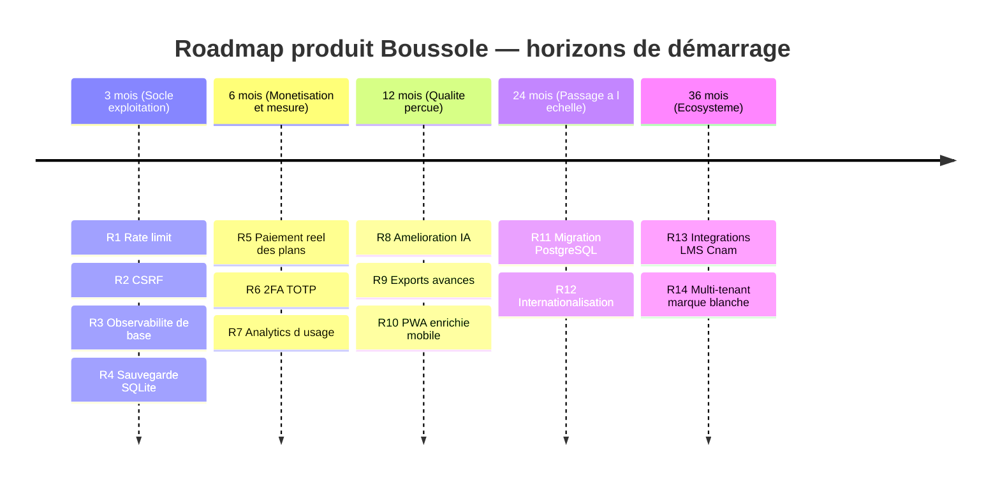
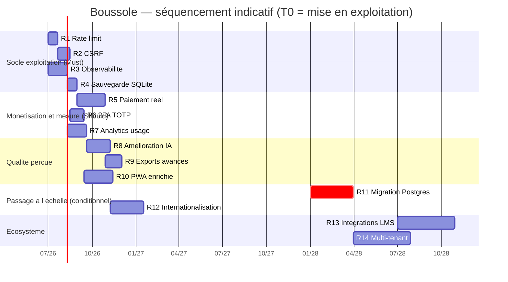
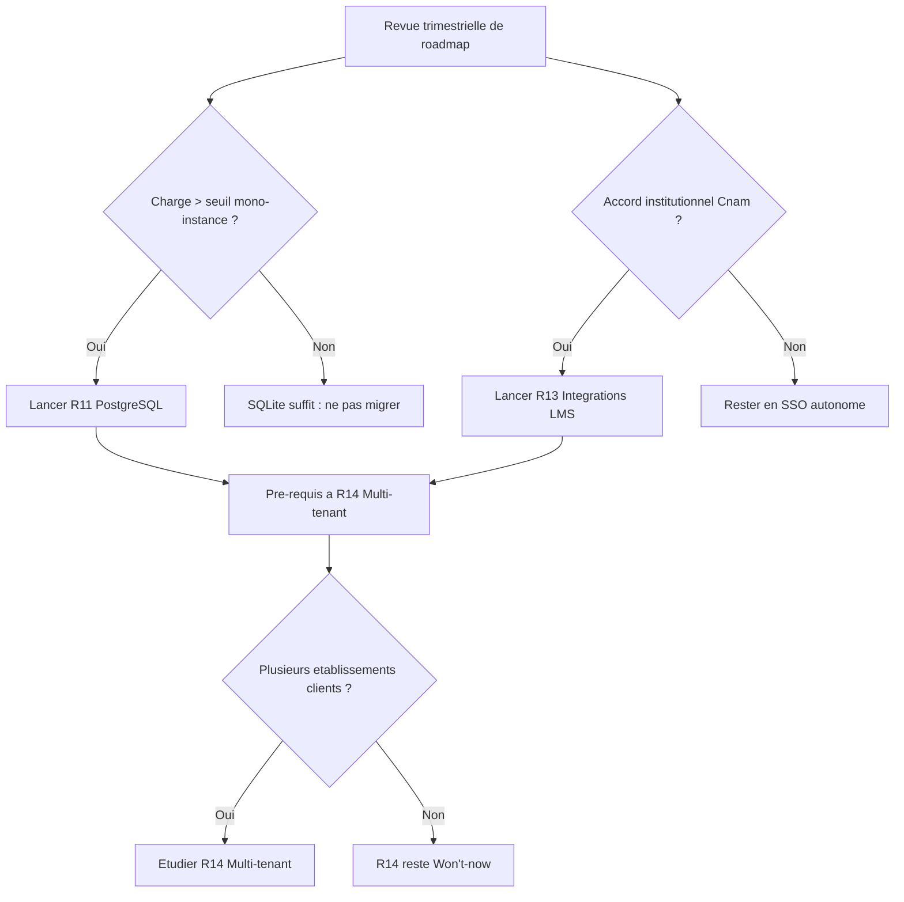

# Roadmap produit

Cette page présente la trajectoire produit de **Boussole** sur cinq horizons (3, 6, 12, 24 et 36 mois), priorisée selon la méthode **MoSCoW** (Must / Should / Could / Won't-for-now). Elle part de l'état réel du produit livré pour le jury FAD130 — une application mono-instance Node/Express + SQLite, 38 fonctionnalités, IA Claude avec replis déterministes, déployée derrière un reverse-proxy en TLS — et trace les initiatives qui transformeraient cette base académique en produit exploitable au-delà de la soutenance. Chaque initiative est ancrée sur une capacité existante, partielle ou absente, et reliée à sa dette technique. Cette roadmap est un **artefact de pilotage** : elle ne décrit pas un engagement de livraison (le projet est solo et académique), mais une séquence raisonnée de décisions, avec leurs dépendances et leurs déclencheurs.

## Objectifs de la page

- Donner une **vue priorisée et bornée dans le temps** des évolutions produit, lisible par un comité de pilotage.
- **Distinguer sans ambiguïté** ce qui est déjà développé, partiel, prévu ou absent, afin que la priorisation reste honnête.
- Relier chaque initiative à sa **valeur**, son **effort**, ses **dépendances** et au **risque** ou à la **dette** qu'elle adresse (voir [Dette technique](technical-debt) et [Registre des risques](risk-register)).
- Fournir des **critères de déclenchement** (« quand activer telle initiative ») plutôt que des dates absolues, le produit n'ayant pas encore de trafic réel.
- Servir de **point d'entrée décisionnel** vers les pages de spécification, d'architecture et de sécurité concernées.

## Cadre de priorisation

### Conventions

- **Valeur** : impact attendu pour les utilisateurs (accompagnateur / accompagné) ou pour l'exploitabilité, noté Faible / Moyenne / Élevée / Critique.
- **Effort** : charge de réalisation pour un développeur solo, en jours-homme (j·h) indicatifs. Toute valeur chiffrée est une **estimation**, pas un relevé.
- **Priorité MoSCoW** : **M**ust (indispensable pour passer en exploitation réelle), **S**hould (fort levier de valeur), **C**ould (souhaitable, opportuniste), **W**on't-now (volontairement hors périmètre court terme).
- **Horizon** : fenêtre cible de démarrage (3 / 6 / 12 / 24 / 36 mois) à partir d'un T0 = mise en exploitation post-soutenance.

> **Hypothèse — confiance : moyenne** — Le T0 retenu est la première mise en service avec des utilisateurs réels (au-delà des comptes de démonstration Mohamed / Amine). Le projet étant académique et solo, les horizons expriment une **séquence et des dépendances**, pas un calendrier contractuel.

### État de référence (ce qui existe réellement)

| Capacité | État | Constat dans le code |
| --- | --- | --- |
| Auth JWT cookie httpOnly + bcrypt | **Développé** | `auth.ts` — cookie `boussole_token`, `sameSite='lax'`, `secure` en prod |
| Feature-gating par plan | **Développé** | `features.ts` — `requireFeature`, 38 clés, plans JSON |
| Plans d'abonnement | **Partiel** | Plans et gating présents ; **aucun paiement réel** (pas de Stripe/Paddle/checkout dans le code) |
| Persistance | **Développé (mono-instance)** | SQLite `better-sqlite3`, 1 conteneur API, volume bind-mount `./data` |
| IA Claude + replis | **Développé** | `claude.ts` + fallback déterministe par fonctionnalité |
| Rate limiting | **Absent** | aucun `express-rate-limit` ni équivalent |
| Protection CSRF | **Absente (partielle via SameSite)** | seul `sameSite='lax'` ; pas de jeton anti-CSRF |
| 2FA / TOTP | **Absent** | aucun `totp`/`otp`/`speakeasy` |
| Observabilité (logs/metrics/traces) | **Absente** | pas de Sentry/Prometheus/OpenTelemetry/winston/pino |
| Internationalisation | **Absente** | français en dur ; pas de `i18n`/`react-intl` |
| PWA + web-push | **Partiel** | PWA et push présents (feature `pwa_push`) ; pas d'app native |

> **Note de cohérence — confiance : élevée** — Le `docker-compose.yml` de production montre que le reverse-proxy de façade est **Caddy** (`formaplanner-caddy-1`, réseau `edge` externe), et non Traefik comme l'indiquaient certaines notes de cadrage. Le présent document retient **Caddy** comme fait vérifié. Voir [Déploiement](deployment).

## Roadmap priorisée (MoSCoW)

Tableau de synthèse des initiatives. Les détails par horizon suivent.

| # | Initiative | Description | Valeur | Effort (j·h) | Priorité | Horizon | Dépendances |
| --- | --- | --- | --- | --- | --- | --- | --- |
| R1 | Durcissement sécurité — rate limit | Limitation de débit sur `/api/auth/*` et endpoints IA | Critique | 2–3 | **Must** | 3 mois | aucune |
| R2 | Durcissement sécurité — CSRF | Jeton anti-CSRF (double-submit) en complément de SameSite | Élevée | 3–4 | **Must** | 3 mois | R1 (même chantier sécu) |
| R3 | Observabilité de base | Logs structurés, `/metrics`, alerte sur erreurs et santé | Élevée | 4–6 | **Must** | 3 mois | aucune |
| R4 | Sauvegarde & restauration SQLite | Snapshot WAL planifié + procédure de restauration testée | Critique | 2–3 | **Must** | 3 mois | R3 (alerting) |
| R5 | Paiement réel des plans | Intégration prestataire (Stripe/Paddle), webhooks, cycle de vie abonnement | Élevée | 10–15 | **Should** | 6 mois | R1, R3, cadre juridique |
| R6 | 2FA (TOTP) optionnel | Second facteur pour comptes accompagnateur/admin | Moyenne | 4–6 | **Should** | 6 mois | R1, R2 |
| R7 | Analytics d'usage produit | Événements anonymisés, tableau d'adoption des 38 features | Moyenne | 5–8 | **Should** | 6 mois | R3, conformité RGPD |
| R8 | Amélioration IA | Cache de prompts, streaming, qualité des replis, garde-fous coût | Élevée | 6–10 | **Should** | 12 mois | R3 (observabilité coût/latence) |
| R9 | Exports avancés | Export PDF enrichi, export Word (pandoc), archivage de parcours | Moyenne | 5–8 | **Could** | 12 mois | `export_pdf` existant |
| R10 | PWA enrichie / app mobile | Mode hors-ligne, push affinées, packaging store éventuel | Moyenne | 8–14 | **Could** | 12 mois | `pwa_push` existant |
| R11 | Passage PostgreSQL | Migration SQLite → Postgres si besoin multi-instance / concurrence | Élevée (conditionnelle) | 12–20 | **Should (conditionnel)** | 24 mois | R3, R4, seuil de charge atteint |
| R12 | Internationalisation (i18n) | Externalisation des chaînes, EN d'abord, IA multilingue | Moyenne | 10–16 | **Could** | 24 mois | refonte front, R8 |
| R13 | Intégrations LMS Cnam | SSO + interop (LTI 1.3 / API Cnam) avec la plateforme pédagogique | Élevée (conditionnelle) | 15–25 | **Could** | 24–36 mois | accord institutionnel, R6 |
| R14 | Multi-tenant / marque blanche | Isolation par établissement, personnalisation | Moyenne | 20–30 | **Won't-now** | 36 mois | R11, R13 |

> **Hypothèse — confiance : faible** — Les efforts en j·h sont des **ordres de grandeur** pour un développeur solo connaissant le code ; ils n'intègrent ni recette formelle étendue ni reprise de données. À recadrer dès qu'un trafic réel ou un partenaire institutionnel existe.

### Horizon 3 mois — « Exploitable sans rougir » (socle d'exploitation)

Objectif : rendre l'application **sûre à exposer** à de vrais utilisateurs et **survivable** en cas d'incident. Ce sont les prérequis non négociables au passage en production réelle.

| Initiative | Pourquoi maintenant | Dette adressée |
| --- | --- | --- |
| **R1 — Rate limit** | Endpoints d'auth et IA exposés sans plafond : risque de bourrage de mot de passe et d'explosion de coût IA | Absence totale de limitation |
| **R2 — CSRF** | Cookie `sameSite='lax'` atténue mais ne couvre pas tous les cas (navigations top-level) | Pas de jeton anti-CSRF |
| **R3 — Observabilité de base** | Aucun moyen actuel de savoir qu'un incident a lieu ; les replis IA masquent les pannes | Aucun log structuré ni métrique |
| **R4 — Sauvegarde SQLite** | Base mono-fichier sur volume bind-mount : une corruption WAL = perte totale | Pas de stratégie de restauration testée |

Voir [Sécurité](security) pour R1/R2/R6 et [Exploitation](operations) pour R3/R4.

### Horizon 6 mois — « Monétisable et mesurable »

Objectif : transformer le gating de plans (déjà présent) en **modèle économique réel** et instrumenter l'adoption.

- **R5 — Paiement réel** : le code possède déjà les plans et le `requireFeature` ; il manque le rattachement à un prestataire de paiement, la gestion des webhooks (paiement réussi/échoué/annulé) et le cycle de vie (essai, renouvellement, résiliation). C'est un chantier **conformité + technique** (facturation, TVA, mentions légales).
- **R6 — 2FA (TOTP)** : second facteur optionnel, prioritairement pour les rôles `accompagnateur` et `admin` qui voient des données d'autrui.
- **R7 — Analytics d'usage** : mesurer quelles features parmi les 38 sont réellement utilisées, pour arbitrer les évolutions suivantes — sous réserve d'anonymisation conforme RGPD (voir [Architecture des données](data-architecture)).

### Horizon 12 mois — « Qualité perçue »

Objectif : améliorer la valeur ressentie sur le cœur du produit (l'IA et les livrables).

- **R8 — Amélioration IA** : cache de prompts, réponses en streaming pour l'entretien et la génération de CR, renforcement des replis déterministes, garde-fous de coût (budget par utilisateur/jour). Dépend de R3 pour mesurer latence et coût.
- **R9 — Exports avancés** : la feature `export_pdf` existe ; l'enrichir (mise en page, export Word via pandoc, archive complète d'un parcours).
- **R10 — PWA enrichie / mobile** : `pwa_push` est livré ; étape suivante = mode hors-ligne (consultation CR/synthèses) et, éventuellement, packaging store.

### Horizon 24 mois — « Passage à l'échelle (conditionnel) »

Objectif : lever les limites d'architecture **uniquement si la charge le justifie**.

- **R11 — PostgreSQL** : SQLite + `better-sqlite3` synchrone est parfait en mono-instance, mais bloque l'horizontalité (un seul writer, fichier local). À déclencher **seulement** au franchissement d'un seuil de concurrence (voir critères ci-dessous). Voir [Architecture technique](technical-architecture).
- **R12 — Internationalisation** : externaliser les chaînes (français en dur aujourd'hui), commencer par l'anglais, étendre les prompts IA au multilingue.

### Horizon 36 mois — « Écosystème »

- **R13 — Intégrations LMS Cnam** : SSO et interopérabilité (LTI 1.3 ou API Cnam) pour insérer Boussole dans le parcours pédagogique officiel. Fortement **conditionné à un accord institutionnel**.
- **R14 — Multi-tenant / marque blanche** : isolation par établissement. Classé **Won't-now** : ne se justifie qu'avec plusieurs établissements clients, et présuppose R11 + R13.

## Diagramme de timeline

Le diagramme ci-dessous positionne les initiatives sur les cinq horizons. Il se lit comme une **séquence de déclenchement** : chaque colonne suppose la précédente largement traitée, et les initiatives conditionnelles (R11, R13) n'avancent que si leur critère est atteint.

### Vue Gantt (séquencement et dépendances)

La vue Gantt explicite les recouvrements et les jalons. Les sections « conditionnelles » sont marquées et leur démarrage dépend d'un critère (charge, partenariat) plutôt que d'une date.

> **Hypothèse — confiance : faible** — Les dates du Gantt sont **purement illustratives** d'un séquencement possible ; elles ne valent pas engagement. Seuls comptent l'ordre et les dépendances `after`.

### Carte de décision des initiatives conditionnelles

Deux initiatives lourdes (R11 Postgres, R13 LMS) ne doivent **pas** être lancées par défaut : elles répondent à un déclencheur. Le diagramme formalise la règle de décision.

Ce diagramme est la garde anti-sur-ingénierie de la roadmap : il empêche d'engager une migration de base ou une intégration tierce coûteuse tant que le besoin réel (concurrence d'écriture, partenariat signé) n'est pas matérialisé.

## Critères de déclenchement (au lieu de dates fixes)

| Initiative | Déclencheur recommandé |
| --- | --- |
| R1–R4 (Socle) | Toute ouverture à des utilisateurs réels, **avant** le premier compte non-démo |
| R5 Paiement | Décision de monétiser + cadre juridique (CGV, facturation) prêt |
| R6 2FA | Première donnée sensible d'un tiers réel manipulée par un accompagnateur |
| R7 Analytics | Besoin d'arbitrer entre features faute de retour d'usage |
| R8 IA | Coût IA mensuel ou latence devenus visibles via R3 |
| R11 Postgres | Apparition de contention d'écriture, besoin de >1 instance API, ou volumétrie SQLite problématique |
| R12 i18n | Premier utilisateur ou établissement non francophone |
| R13 LMS | Accord institutionnel Cnam matérialisé |
| R14 Multi-tenant | ≥ 2 établissements clients distincts |

> **Hypothèse — confiance : moyenne** — « Seuil mono-instance » : ordre de grandeur de quelques dizaines d'écritures concurrentes soutenues ou de besoin de redondance applicative. À calibrer une fois R3 (observabilité) en place ; *valeur précise non identifiée dans le code ou la conversation*.

## Hypothèses

> **Hypothèse — confiance : élevée** — Le produit reste, à T0, une application **mono-instance** SQLite : aucune contrainte de scale n'existe tant qu'il n'y a pas de trafic réel. La roadmap reflète cette réalité (Postgres en horizon 24 mois, conditionnel).

> **Hypothèse — confiance : élevée** — Les **plans d'abonnement existent sans paiement** : R5 est un ajout, pas une refonte ; le gating (`requireFeature`) est déjà en place.

> **Hypothèse — confiance : moyenne** — Le projet reste piloté par **un développeur solo** ; les efforts et le séquencement supposent l'absence d'équipe. Un renfort changerait les horizons mais pas l'ordre des dépendances.

> **Hypothèse — confiance : faible** — Une intégration **LMS Cnam (R13)** suppose un accord institutionnel et une interface (LTI 1.3 ou API) dont *l'existence et les modalités ne sont pas identifiées dans le code ou la conversation*.

> **Hypothèse — confiance : faible** — Les montants d'effort (j·h) et toutes les dates des diagrammes sont **estimés** et fournis à titre d'illustration de séquencement.

## Risques & points d'attention

| Risque / point d'attention | Effet | Atténuation |
| --- | --- | --- |
| **Mise en production avant le socle sécurité (R1–R2)** | Bourrage d'auth, abus d'API IA, vol de session | Traiter R1–R4 comme bloquants ; voir [Sécurité](security) |
| **Absence d'observabilité (R3) masquée par les replis IA** | Les pannes IA passent inaperçues (dégradation silencieuse) | Loguer chaque bascule en repli + métrique dédiée |
| **Perte de données SQLite (mono-fichier)** | Perte totale de parcours | R4 prioritaire : sauvegarde WAL + restauration testée |
| **Sur-ingénierie (Postgres/multi-tenant lancés trop tôt)** | Coût et complexité sans besoin réel | Carte de décision conditionnelle ; ne lancer qu'au déclencheur |
| **Coût IA non plafonné** | Dérive budgétaire avec l'usage réel | Garde-fous de coût dans R8 ; rate limit R1 sur endpoints IA |
| **Paiement réel = charge juridique** | CGV, TVA, facturation, RGPD financier | Cadrer R5 avec un volet conformité, pas seulement technique |
| **i18n tardive = chaînes en dur partout** | Refonte front lourde si reportée trop loin | Externaliser les chaînes au fil des nouveaux écrans dès que possible |
| **Dépendance institutionnelle (R13)** | Initiative non maîtrisée en interne | Garder un SSO autonome ; LMS en option, pas en chemin critique |

Voir le [Registre des risques](risk-register) pour le suivi détaillé et la [Dette technique](technical-debt) pour l'inventaire des manques.

## Recommandations

1. **Geler le périmètre fonctionnel et traiter d'abord le socle d'exploitation (R1–R4).** Les 38 features suffisent à la valeur ; ce qui manque pour exister en production, c'est la sécurité de base, l'observabilité et la sauvegarde. Aucune ouverture à un utilisateur réel avant ces quatre points.
2. **Brancher le paiement (R5) seulement quand la décision de monétiser est prise et le cadre juridique prêt.** Le gating étant déjà là, l'effort est circonscrit ; ne pas le démarrer « pour voir ».
3. **Instrumenter avant d'optimiser.** R3 (observabilité) puis R7 (analytics) doivent précéder R8 (IA) : on n'optimise ni coût ni adoption qu'on ne mesure pas.
4. **Tenir les initiatives lourdes (R11 Postgres, R13 LMS, R14 multi-tenant) en mode conditionnel.** Les piloter par la carte de décision, jamais par défaut. SQLite mono-instance reste un choix valide tant que le déclencheur de charge n'est pas atteint.
5. **Réaligner la documentation sur la réalité d'infrastructure.** Le reverse-proxy de production est **Caddy**, pas Traefik : corriger les pages d'architecture et de déploiement concernées pour éviter une dette documentaire.
6. **Réviser cette roadmap chaque trimestre** à l'aune des données d'usage réelles ; remplacer les estimations (j·h, dates) par des relevés dès qu'ils existent.

## Pages liées

- [Synthèse exécutive](executive-summary)
- [Note de cadrage](project-charter)
- [Étude d'opportunité](opportunity-study)
- [Étude de faisabilité](feasibility-study)
- [Cas d'affaires](business-case)
- [Architecture technique](technical-architecture)
- [Architecture des données](data-architecture)
- [Sécurité](security)
- [Exploitation](operations)
- [Déploiement](deployment)
- [Dette technique](technical-debt)
- [Registre des risques](risk-register)
- [Décisions d'architecture (ADR)](adr)
- [Spécifications fonctionnelles](functional-specifications)
