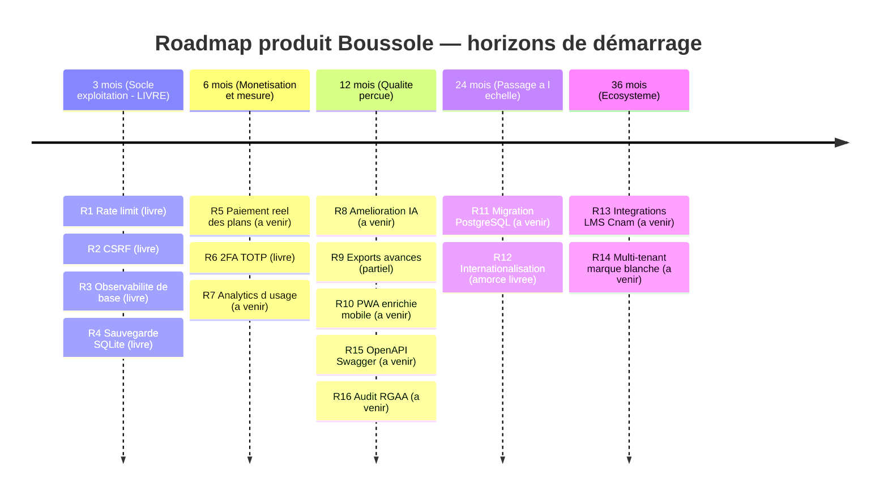
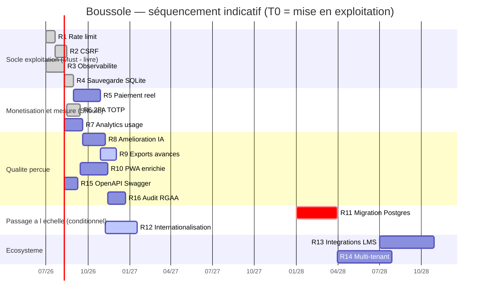
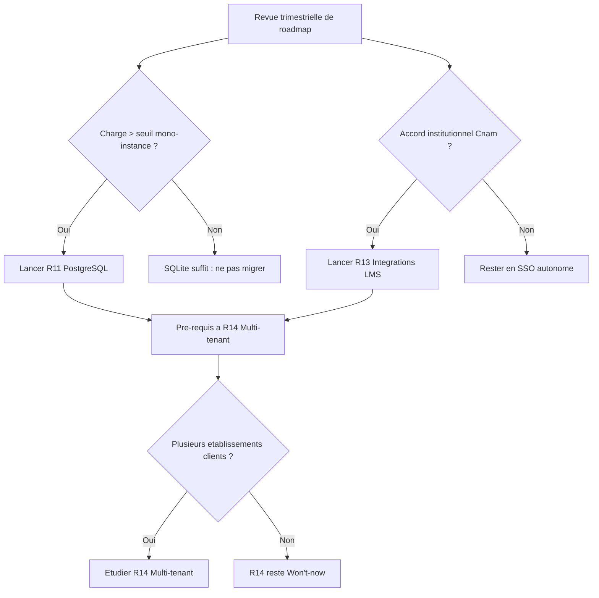

# Roadmap produit

Cette page présente la trajectoire produit de **Boussole** sur cinq horizons (3, 6, 12, 24 et 36 mois), priorisée selon la méthode **MoSCoW** (Must / Should / Could / Won't-for-now). Elle part de l'état réel du produit livré pour le jury FAD130 — une application mono-instance Node/Express + SQLite, 38 fonctionnalités, IA Claude avec replis déterministes, déployée derrière un reverse-proxy en TLS — et trace les initiatives qui transformeraient cette base académique en produit exploitable au-delà de la soutenance. Depuis la rédaction initiale, **le socle d'exploitation a été effectivement livré** : durcissement sécurité (rate-limiting, CSP/Helmet, 2FA TOTP, CSRF double-submit), sauvegardes SQLite horodatées, observabilité auto-hébergée (logs pino, table `error_log`, `/api/metrics`) et intégration continue (GitHub Actions). Le projet est par ailleurs passé en **open source** (dépôt GitHub public, double licence AGPL-3.0 + CC BY-NC-SA 4.0), le **wiki** a gagné le partage public tokenisé, l'historique de versions et l'export global, et une amorce d'**internationalisation** (react-i18next, FR/EN) est en place. Chaque initiative est ancrée sur une capacité existante, partielle ou absente, et reliée à sa dette technique. Cette roadmap est un **artefact de pilotage** : elle ne décrit pas un engagement de livraison (le projet est solo et académique), mais une séquence raisonnée de décisions, avec leurs dépendances et leurs déclencheurs.

## Objectifs de la page

- Donner une **vue priorisée et bornée dans le temps** des évolutions produit, lisible par un comité de pilotage.
- **Distinguer sans ambiguïté** ce qui est déjà développé, partiel, prévu ou absent, afin que la priorisation reste honnête.
- Relier chaque initiative à sa **valeur**, son **effort**, ses **dépendances** et au **risque** ou à la **dette** qu'elle adresse (voir [Dette technique](technical-debt) et [Registre des risques](risk-register)).
- Fournir des **critères de déclenchement** (« quand activer telle initiative ») plutôt que des dates absolues, le produit n'ayant pas encore de trafic réel.
- Servir de **point d'entrée décisionnel** vers les pages de spécification, d'architecture et de sécurité concernées.

## Cadre de priorisation

### Conventions

- **Valeur** : impact attendu pour les utilisateurs (accompagnateur / accompagné) ou pour l'exploitabilité, noté Faible / Moyenne / Élevée / Critique.
- **Effort** : charge de réalisation pour un développeur solo, en jours-homme (j·h) indicatifs. Toute valeur chiffrée est une **estimation**, pas un relevé.
- **Priorité MoSCoW** : **M**ust (indispensable pour passer en exploitation réelle), **S**hould (fort levier de valeur), **C**ould (souhaitable, opportuniste), **W**on't-now (volontairement hors périmètre court terme).
- **Horizon** : fenêtre cible de démarrage (3 / 6 / 12 / 24 / 36 mois) à partir d'un T0 = mise en exploitation post-soutenance.

> **Hypothèse — confiance : moyenne** — Le T0 retenu est la première mise en service avec des utilisateurs réels (au-delà des comptes de démonstration Mohamed / Amine). Le projet étant académique et solo, les horizons expriment une **séquence et des dépendances**, pas un calendrier contractuel.

### État de référence (ce qui existe réellement)

Le tableau ci-dessous reflète l'état **après livraison du socle d'exploitation**. Les capacités qui figuraient comme « Absentes » dans la version initiale de cette roadmap et qui ont depuis été développées sont signalées **(livré)**.

| Capacité | État | Constat dans le code |
| --- | --- | --- |
| Auth JWT cookie httpOnly + bcrypt | **Développé** | `auth.ts` — cookie `boussole_token`, `sameSite='lax'`, `secure` en prod |
| Feature-gating par plan | **Développé** | `features.ts` — `requireFeature`, 38 clés, plans JSON |
| Plans d'abonnement | **Partiel** | Plans et gating présents ; **aucun paiement réel** (pas de Stripe/Paddle/checkout dans le code) |
| Persistance | **Développé (mono-instance)** | SQLite `better-sqlite3`, 1 conteneur API, volume bind-mount `./data` |
| IA Claude + replis | **Développé** | `claude.ts` + fallback déterministe par fonctionnalité |
| Rate limiting | **Développé (livré)** | `express-rate-limit` : limiteur global + limiteur strict sur `/api/auth` ; désactivable en local/test via `RATE_LIMIT_DISABLED=1` |
| Protection CSRF | **Développé (livré)** | Double-submit : cookie `csrf_token` lisible par JS + en-tête `X-CSRF-Token` sur les mutations ; désactivable via `CSRF_DISABLED=1` |
| Durcissement en-têtes / CSP | **Développé (livré)** | Helmet côté API ; CSP + `X-Frame-Options` / `X-Content-Type-Options` / `Referrer-Policy` posés par nginx sur le document HTML de la SPA |
| 2FA / TOTP | **Développé (livré)** | `otplib` ; colonnes `users.totp_secret` / `totp_enabled` ; endpoints `/api/auth/2fa/{status,setup,enable,disable}` ; challenge `{ twofa:true }` au login + QR code |
| Sauvegardes SQLite | **Développé (livré)** | Sauvegardes « online » horodatées quotidiennes + rétention (`backups.ts`) |
| Observabilité (logs/metrics) | **Développé (livré)** | Logs structurés pino ; table `error_log` + `reportError()` (point unique, adaptateur Sentry brançable) ; middleware d'erreur centralisé ; endpoint admin `GET /api/metrics` (uptime, compteurs 2xx/3xx/4xx/5xx, erreurs, comptes de tables) |
| Intégration continue (CI) | **Développé (livré)** | GitHub Actions (`.github/workflows/ci.yml`) : unitaires + intégration API + UI Playwright sur base fraîche, sans clé Anthropic (repli déterministe) ; `CI_SKIP_IA` neutralise 2 scénarios E2E de génération IA |
| Open source / dépôt public | **Développé (livré)** | Dépôt GitHub public `melafrit/FAD130_accompagnement_pro` ; double licence AGPL-3.0 (code) + CC BY-NC-SA 4.0 (doc) ; README / CONTRIBUTING / SECURITY |
| Wiki — partage public, historique, export | **Développé (livré)** | Partage opt-in par lien tokenisé (`GET /api/wiki/public/:token`, page `/wiki/p/:token`, colonne `wiki_pages.public_token`, révocable) ; historique de versions (`wiki_page_versions`, instantané avant modification, restauration) ; export global (`GET /api/wiki/export-all.{md,docx,pdf}`) |
| Internationalisation | **Partiel (amorce livrée)** | Infrastructure react-i18next : français par défaut + amorce anglaise, sélecteur FR/EN ; chaînes pas encore toutes externalisées |
| PWA + web-push | **Partiel** | PWA et push présents (feature `pwa_push`) ; pas d'app native |

> **Note de cohérence — confiance : élevée** — La façade de production est **Caddy** (cf. `app/.env.example`, `EDGE_NETWORK` / « Caddy de façade »), et non Traefik comme l'indiquaient certaines notes de cadrage. Le présent document retient **Caddy** comme fait vérifié. Voir [Déploiement](deployment).

> **Apport vérifié de la CI — confiance : élevée** — L'intégration continue (rejouée sur base fraîche, sans clé IA) a déjà détecté **deux bugs invisibles en local** : (1) anonymisation RGPD en 500 sur base neuve (colonnes `demandes_effacement.action` / `traite_le` ajoutées seulement par `ALTER` s'exécutant avant le `CREATE`) ; (2) un middleware d'erreur qui forçait un 500 sur les 400 de parsing. C'est l'argument concret en faveur du caractère bloquant du socle d'exploitation.

## Roadmap priorisée (MoSCoW)

Tableau de synthèse des initiatives. La colonne **Statut** distingue ce qui est **livré** de ce qui reste **à venir**. Les détails par horizon suivent.

| # | Initiative | Description | Valeur | Effort (j·h) | Priorité | Horizon | Statut | Dépendances |
| --- | --- | --- | --- | --- | --- | --- | --- | --- |
| R1 | Durcissement sécurité — rate limit | Limitation de débit (global + strict sur `/api/auth`) | Critique | 2–3 | **Must** | 3 mois | **Livré** | aucune |
| R2 | Durcissement sécurité — CSRF | Jeton anti-CSRF (double-submit) en complément de SameSite | Élevée | 3–4 | **Must** | 3 mois | **Livré** | R1 (même chantier sécu) |
| R3 | Observabilité de base | Logs pino structurés, table `error_log`, `/api/metrics`, middleware d'erreur centralisé | Élevée | 4–6 | **Must** | 3 mois | **Livré** | aucune |
| R4 | Sauvegarde & restauration SQLite | Sauvegardes « online » horodatées quotidiennes + rétention | Critique | 2–3 | **Must** | 3 mois | **Livré** | R3 (alerting) |
| R5 | Paiement réel des plans | Intégration prestataire (Stripe/Paddle), webhooks, cycle de vie abonnement | Élevée | 10–15 | **Should** | 6 mois | **À venir** | R1, R3, cadre juridique |
| R6 | 2FA (TOTP) optionnel | Second facteur opt-in pour comptes accompagnateur/admin (`otplib`, QR code) | Moyenne | 4–6 | **Should** | 6 mois | **Livré** | R1, R2 |
| R7 | Analytics d'usage produit | Événements anonymisés, tableau d'adoption des 38 features | Moyenne | 5–8 | **Should** | 6 mois | **À venir** | R3, conformité RGPD |
| R8 | Amélioration IA | Cache de prompts, streaming, qualité des replis, garde-fous coût | Élevée | 6–10 | **Should** | 12 mois | **À venir** | R3 (observabilité coût/latence) |
| R9 | Exports avancés | Export PDF enrichi, export Word, archivage de parcours | Moyenne | 5–8 | **Could** | 12 mois | **Partiel** | export wiki `{md,docx,pdf}` livré |
| R10 | PWA enrichie / app mobile | Mode hors-ligne, push affinées, packaging store éventuel | Moyenne | 8–14 | **Could** | 12 mois | **À venir** | `pwa_push` existant |
| R11 | Passage PostgreSQL | Migration SQLite → Postgres si besoin multi-instance / concurrence | Élevée (conditionnelle) | 12–20 | **Should (conditionnel)** | 24 mois | **À venir** | R3, R4, seuil de charge atteint |
| R12 | Internationalisation (i18n) | Externalisation des chaînes, EN d'abord, IA multilingue | Moyenne | 10–16 | **Could** | 24 mois | **Partiel (amorce livrée)** | refonte front, R8 |
| R13 | Intégrations LMS Cnam | SSO + interop (LTI 1.3 / API Cnam) avec la plateforme pédagogique | Élevée (conditionnelle) | 15–25 | **Could** | 24–36 mois | **À venir** | accord institutionnel, R6 |
| R14 | Multi-tenant / marque blanche | Isolation par établissement, personnalisation | Moyenne | 20–30 | **Won't-now** | 36 mois | **À venir** | R11, R13 |
| R15 | Documentation API (OpenAPI/Swagger) | Spécification OpenAPI + UI Swagger interactive | Moyenne | 4–6 | **Should** | 12 mois | **À venir** | R3 |
| R16 | Audit accessibilité (RGAA) | Audit RGAA et corrections de conformité du front | Élevée | 8–12 | **Should** | 12 mois | **À venir** | refonte front partielle |

> **Hypothèse — confiance : faible** — Les efforts en j·h sont des **ordres de grandeur** pour un développeur solo connaissant le code ; ils n'intègrent ni recette formelle étendue ni reprise de données. À recadrer dès qu'un trafic réel ou un partenaire institutionnel existe.

### Horizon 3 mois — « Exploitable sans rougir » (socle d'exploitation) — **LIVRÉ**

Objectif : rendre l'application **sûre à exposer** à de vrais utilisateurs et **survivable** en cas d'incident. Ce sont les prérequis non négociables au passage en production réelle. **Cet horizon est désormais traité : R1, R2, R3 et R4 sont livrés**, et complétés par le durcissement des en-têtes (Helmet/CSP) et l'intégration continue.

| Initiative | Pourquoi maintenant | Statut | Dette adressée |
| --- | --- | --- | --- |
| **R1 — Rate limit** | Endpoints d'auth et IA exposés sans plafond : risque de bourrage de mot de passe et d'explosion de coût IA | **Livré** (`express-rate-limit`, global + `/api/auth`) | Absence totale de limitation comblée |
| **R2 — CSRF** | Cookie `sameSite='lax'` atténue mais ne couvre pas tous les cas | **Livré** (double-submit `csrf_token` + `X-CSRF-Token`) | Jeton anti-CSRF désormais présent |
| **R3 — Observabilité de base** | Aucun moyen actuel de savoir qu'un incident a lieu ; les replis IA masquent les pannes | **Livré** (pino, `error_log`, `reportError()`, `/api/metrics`) | Logs structurés et métriques en place |
| **R4 — Sauvegarde SQLite** | Base mono-fichier sur volume bind-mount : une corruption WAL = perte totale | **Livré** (sauvegardes online horodatées + rétention, `backups.ts`) | Stratégie de sauvegarde opérationnelle |

> **Durcissement complémentaire livré** — En plus de R1–R4 : **Helmet** côté API et **CSP / X-Frame-Options / X-Content-Type-Options / Referrer-Policy** posés par nginx sur le document HTML de la SPA ; **2FA TOTP** (cf. R6, avancé depuis l'horizon 6 mois) ; **CI GitHub Actions** rejouant unitaires + intégration API + UI Playwright sur base fraîche sans clé Anthropic. Rate-limit et CSRF sont désactivables en local/test (`RATE_LIMIT_DISABLED=1` / `CSRF_DISABLED=1`) et activés en production.

Voir [Sécurité](security) pour R1/R2/R6 et [Exploitation](operations) pour R3/R4.

### Horizon 6 mois — « Monétisable et mesurable »

Objectif : transformer le gating de plans (déjà présent) en **modèle économique réel** et instrumenter l'adoption. **R6 (2FA) est livré par anticipation** ; R5 (paiement) et R7 (analytics) restent à venir.

- **R5 — Paiement réel** *(à venir)* : le code possède déjà les plans et le `requireFeature` ; il manque le rattachement à un prestataire de paiement, la gestion des webhooks (paiement réussi/échoué/annulé) et le cycle de vie (essai, renouvellement, résiliation). C'est un chantier **conformité + technique** (facturation, TVA, mentions légales). Volontairement **préparé pour plus tard**.
- **R6 — 2FA (TOTP)** *(livré)* : second facteur **opt-in** via `otplib` (colonnes `users.totp_secret` / `totp_enabled`, endpoints `/api/auth/2fa/{status,setup,enable,disable}`, challenge `{ twofa:true }` au login, QR code). Prioritairement pour les rôles `accompagnateur` et `admin` qui voient des données d'autrui.
- **R7 — Analytics d'usage** *(à venir)* : mesurer quelles features parmi les 38 sont réellement utilisées, pour arbitrer les évolutions suivantes — sous réserve d'anonymisation conforme RGPD (voir [Architecture des données](data-architecture)). Note : l'endpoint `GET /api/metrics` (livré avec R3) fournit déjà des compteurs techniques, mais **pas** d'analytics produit par feature.

### Horizon 12 mois — « Qualité perçue »

Objectif : améliorer la valeur ressentie sur le cœur du produit (l'IA et les livrables) et combler les manques de qualité transverse (API documentée, accessibilité).

- **R8 — Amélioration IA** *(à venir)* : cache de prompts, réponses en streaming pour l'entretien et la génération de CR, renforcement des replis déterministes, garde-fous de coût (budget par utilisateur/jour). Dépend de R3 (livré) pour mesurer latence et coût.
- **R9 — Exports avancés** *(partiel)* : l'**export global du wiki** en `{md,docx,pdf}` est livré (`GET /api/wiki/export-all.*`), de même que la feature `export_pdf`. Reste à enrichir le périmètre **parcours** (mise en page, archive complète d'un parcours).
- **R10 — PWA enrichie / mobile** *(à venir)* : `pwa_push` est livré ; étape suivante = mode hors-ligne (consultation CR/synthèses) et, éventuellement, packaging store.
- **R15 — Documentation API (OpenAPI/Swagger)** *(à venir)* : exposer une spécification OpenAPI et une UI Swagger interactive. **Non encore livré.**
- **R16 — Audit accessibilité (RGAA)** *(à venir)* : audit RGAA du front et corrections de conformité. **Non encore livré.**

### Horizon 24 mois — « Passage à l'échelle (conditionnel) »

Objectif : lever les limites d'architecture **uniquement si la charge le justifie**.

- **R11 — PostgreSQL** *(à venir)* : SQLite + `better-sqlite3` synchrone est parfait en mono-instance, mais bloque l'horizontalité (un seul writer, fichier local). À déclencher **seulement** au franchissement d'un seuil de concurrence (voir critères ci-dessous). Voir [Architecture technique](technical-architecture).
- **R12 — Internationalisation** *(partiel — amorce livrée)* : l'infrastructure **react-i18next** est en place (français par défaut, amorce anglaise, sélecteur FR/EN). Reste à **externaliser l'ensemble des chaînes** et à étendre les prompts IA au multilingue.

### Horizon 36 mois — « Écosystème »

- **R13 — Intégrations LMS Cnam** *(à venir)* : SSO et interopérabilité (LTI 1.3 ou API Cnam) pour insérer Boussole dans le parcours pédagogique officiel. Fortement **conditionné à un accord institutionnel**.
- **R14 — Multi-tenant / marque blanche** *(à venir)* : isolation par établissement. Classé **Won't-now** : ne se justifie qu'avec plusieurs établissements clients, et présuppose R11 + R13.

## Diagramme de timeline

Le diagramme ci-dessous positionne les initiatives sur les cinq horizons. L'horizon 3 mois (socle d'exploitation) est **livré** ; il se lit comme une **séquence de déclenchement** : chaque colonne suppose la précédente largement traitée, et les initiatives conditionnelles (R11, R13) n'avancent que si leur critère est atteint.

### Vue Gantt (séquencement et dépendances)

La vue Gantt explicite les recouvrements et les jalons. Le **socle d'exploitation** est marqué `done` (livré). Les sections « conditionnelles » sont marquées et leur démarrage dépend d'un critère (charge, partenariat) plutôt que d'une date.

> **Hypothèse — confiance : faible** — Les dates du Gantt sont **purement illustratives** d'un séquencement possible ; elles ne valent pas engagement. Seuls comptent l'ordre, les dépendances `after` et les statuts `done` / `active`.

### Carte de décision des initiatives conditionnelles

Deux initiatives lourdes (R11 Postgres, R13 LMS) ne doivent **pas** être lancées par défaut : elles répondent à un déclencheur. Le diagramme formalise la règle de décision.

Ce diagramme est la garde anti-sur-ingénierie de la roadmap : il empêche d'engager une migration de base ou une intégration tierce coûteuse tant que le besoin réel (concurrence d'écriture, partenariat signé) n'est pas matérialisé.

## Critères de déclenchement (au lieu de dates fixes)

| Initiative | Statut | Déclencheur recommandé |
| --- | --- | --- |
| R1–R4 (Socle) | **Livré** | Toute ouverture à des utilisateurs réels, **avant** le premier compte non-démo — *prérequis désormais satisfait* |
| R5 Paiement | À venir | Décision de monétiser + cadre juridique (CGV, facturation) prêt |
| R6 2FA | **Livré** | Première donnée sensible d'un tiers réel manipulée par un accompagnateur — *capacité disponible (opt-in)* |
| R7 Analytics | À venir | Besoin d'arbitrer entre features faute de retour d'usage |
| R8 IA | À venir | Coût IA mensuel ou latence devenus visibles via R3 (observabilité en place) |
| R11 Postgres | À venir | Apparition de contention d'écriture, besoin de >1 instance API, ou volumétrie SQLite problématique |
| R12 i18n | Amorce livrée | Premier utilisateur ou établissement non francophone — *infrastructure prête, chaînes à externaliser* |
| R13 LMS | À venir | Accord institutionnel Cnam matérialisé |
| R14 Multi-tenant | À venir | ≥ 2 établissements clients distincts |
| R15 OpenAPI | À venir | Premier intégrateur tiers ou besoin de contrat d'API stable |
| R16 RGAA | À venir | Engagement de conformité accessibilité (obligation légale ou marché public) |

> **Hypothèse — confiance : moyenne** — « Seuil mono-instance » : ordre de grandeur de quelques dizaines d'écritures concurrentes soutenues ou de besoin de redondance applicative. Désormais **calibrable** grâce à R3 (observabilité livrée) ; *valeur précise non encore relevée faute de trafic réel*.

## Hypothèses

> **Hypothèse — confiance : élevée** — Le produit reste, à T0, une application **mono-instance** SQLite : aucune contrainte de scale n'existe tant qu'il n'y a pas de trafic réel. La roadmap reflète cette réalité (Postgres en horizon 24 mois, conditionnel et **non livré**).

> **Hypothèse — confiance : élevée** — Les **plans d'abonnement existent sans paiement** : R5 est un ajout, pas une refonte ; le gating (`requireFeature`) est déjà en place. Le paiement est **explicitement non livré** (préparé pour plus tard).

> **Hypothèse — confiance : élevée** — Le **socle d'exploitation (R1–R4) est livré**, complété par le durcissement des en-têtes (Helmet/CSP), la 2FA TOTP (R6), l'open source du dépôt et la CI GitHub Actions. La roadmap passe donc d'un état « à sécuriser » à un état « exploitable », et le centre de gravité des priorités glisse vers la monétisation (R5), la mesure d'usage (R7) et la qualité perçue (R8, R15, R16).

> **Hypothèse — confiance : moyenne** — Le projet reste piloté par **un développeur solo** ; les efforts et le séquencement supposent l'absence d'équipe. Un renfort changerait les horizons mais pas l'ordre des dépendances.

> **Hypothèse — confiance : faible** — Une intégration **LMS Cnam (R13)** suppose un accord institutionnel et une interface (LTI 1.3 ou API) dont *l'existence et les modalités ne sont pas identifiées dans le code ou la conversation*.

> **Hypothèse — confiance : faible** — Les montants d'effort (j·h) et toutes les dates des diagrammes sont **estimés** et fournis à titre d'illustration de séquencement.

## Risques & points d'attention

Le tableau distingue les risques **résorbés** par la livraison du socle de ceux qui **demeurent**.

| Risque / point d'attention | Effet | Statut | Atténuation |
| --- | --- | --- | --- |
| **Mise en production avant le socle sécurité (R1–R2)** | Bourrage d'auth, abus d'API IA, vol de session | **Résorbé** | R1 (rate limit) + R2 (CSRF) livrés ; voir [Sécurité](security) |
| **Absence d'observabilité (R3) masquée par les replis IA** | Les pannes IA passent inaperçues (dégradation silencieuse) | **Résorbé** | R3 livré (pino, `error_log`, `/api/metrics`) ; loguer chaque bascule en repli reste à affiner |
| **Perte de données SQLite (mono-fichier)** | Perte totale de parcours | **Résorbé** | R4 livré : sauvegardes online horodatées + rétention ; *restauration à tester périodiquement* |
| **Sur-ingénierie (Postgres/multi-tenant lancés trop tôt)** | Coût et complexité sans besoin réel | **Actif** | Carte de décision conditionnelle ; ne lancer qu'au déclencheur (R11/R14 non lancés) |
| **Coût IA non plafonné** | Dérive budgétaire avec l'usage réel | **Actif** | Garde-fous de coût dans R8 (à venir) ; rate limit R1 (livré) atténue déjà l'abus d'endpoints IA |
| **Paiement réel = charge juridique** | CGV, TVA, facturation, RGPD financier | **Actif** | Cadrer R5 avec un volet conformité, pas seulement technique |
| **i18n incomplète = chaînes en dur résiduelles** | Refonte front partielle si reportée trop loin | **Atténué** | Infrastructure react-i18next livrée ; externaliser les chaînes restantes au fil des écrans |
| **Dépendance institutionnelle (R13)** | Initiative non maîtrisée en interne | **Actif** | Garder un SSO autonome ; LMS en option, pas en chemin critique |
| **API non documentée / accessibilité non auditée** | Frein à l'intégration tierce et à la conformité légale | **Actif** | R15 (OpenAPI/Swagger) et R16 (audit RGAA) à planifier ; *non encore livrés* |

Voir le [Registre des risques](risk-register) pour le suivi détaillé et la [Dette technique](technical-debt) pour l'inventaire des manques.

## Recommandations

1. **Le socle d'exploitation (R1–R4) est livré : capitaliser dessus plutôt que le re-questionner.** Sécurité de base (rate-limit, CSRF, CSP/Helmet, 2FA), observabilité (pino, `error_log`, `/api/metrics`) et sauvegardes SQLite sont en place, et la CI a déjà prouvé sa valeur en détectant deux bugs invisibles en local. L'ouverture à des utilisateurs réels n'est plus bloquée par ces prérequis.
2. **Brancher le paiement (R5) seulement quand la décision de monétiser est prise et le cadre juridique prêt.** Le gating étant déjà là, l'effort reste circonscrit ; le paiement est volontairement **non livré** et préparé pour plus tard — ne pas le démarrer « pour voir ».
3. **Instrumenter avant d'optimiser — l'observabilité est désormais disponible.** R3 étant livré, prioriser R7 (analytics produit par feature, distinct des compteurs techniques de `/api/metrics`) avant R8 (IA) : on n'optimise ni coût ni adoption qu'on ne mesure pas.
4. **Achever l'internationalisation et viser la conformité.** L'amorce react-i18next (R12) est posée : externaliser les chaînes restantes au fil des écrans pour éviter une dette de refonte. Planifier R15 (OpenAPI/Swagger) et R16 (audit RGAA), encore **non livrés**, dès qu'un intégrateur tiers ou une exigence de conformité se présente.
5. **Tenir les initiatives lourdes (R11 Postgres, R13 LMS, R14 multi-tenant) en mode conditionnel.** Les piloter par la carte de décision, jamais par défaut. SQLite mono-instance reste un choix valide tant que le déclencheur de charge n'est pas atteint ; le seuil est désormais calibrable grâce à R3.
6. **Réviser cette roadmap chaque trimestre** à l'aune des données d'usage réelles ; remplacer les estimations (j·h, dates) par des relevés dès qu'ils existent, et mettre à jour les statuts (livré / à venir) à chaque jalon.

## Pages liées

- [Synthèse exécutive](executive-summary)
- [Note de cadrage](project-charter)
- [Étude d'opportunité](opportunity-study)
- [Étude de faisabilité](feasibility-study)
- [Cas d'affaires](business-case)
- [Architecture technique](technical-architecture)
- [Architecture des données](data-architecture)
- [Sécurité](security)
- [Exploitation](operations)
- [Déploiement](deployment)
- [Dette technique](technical-debt)
- [Registre des risques](risk-register)
- [Décisions d'architecture (ADR)](adr)
- [Spécifications fonctionnelles](functional-specifications)
