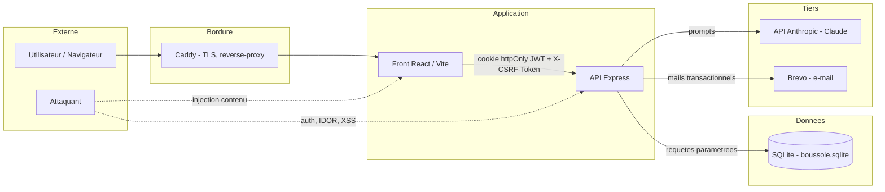
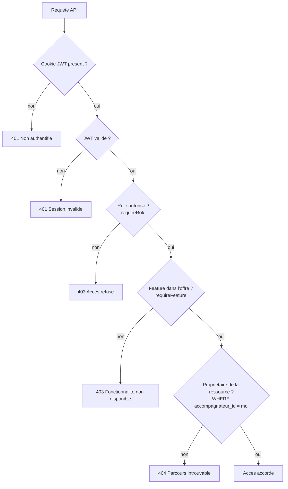
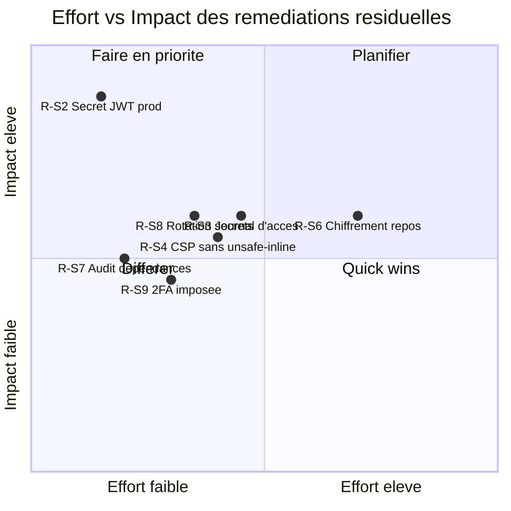

# Sécurité

Ce dossier consolide la posture de sécurité applicative de **Boussole**. Il décrit les actifs sensibles, les surfaces d'attaque, les contrôles **effectivement implémentés** dans le code, ceux qui sont **partiels** ou **absents**, et propose une priorisation des remédiations. Boussole héberge des données personnelles d'accompagnés (étudiants/alternants de master) et des contenus de mémoire en cours de rédaction : la confidentialité et l'intégrité de ces données priment, dans un cadre académique (Cnam, UE FAD130) mono-instance, sans paiement réel ni traitement à grande échelle. L'objectif n'est pas une certification, mais une **maîtrise documentée et honnête** du risque, distinguant clairement le « fait » du « à faire ».

## Objectifs de la page

- Établir le **modèle de menace** : actifs sensibles, acteurs, surfaces d'attaque.
- Inventorier les **contrôles existants** au niveau code (authentification, autorisation, cloisonnement, durcissement HTTP, validation, rendu, rate-limiting, CSRF, 2FA, observabilité, sauvegardes).
- Cartographier l'exposition au regard de l'**OWASP Top 10 (2021)**.
- Tenir un **registre des risques** sécurité avec criticité et recommandation.
- **Prioriser** les remédiations résiduelles dans une logique effort/impact, exploitable pour la suite du projet.

---

## 1. Périmètre et hypothèses de déploiement

| Élément | Réalité (vérifiée dans le code) |
|---|---|
| Modèle d'hébergement | Mono-instance, conteneurs Docker, base **SQLite mono-fichier** (`./data/boussole.sqlite`, WAL, `foreign_keys ON`) |
| Exposition réseau | Front Vite + API Express derrière **Caddy** (reverse-proxy de façade + TLS) en prod ; `boussole.elafrit.com` (cf. `EDGE_NETWORK` dans `.env.example`) |
| Session | **JWT** signé, stocké en **cookie httpOnly** `boussole_token` (`sameSite=lax`, `secure` en prod, expiration 7 j) |
| Volumétrie | Faible (projet académique solo, jeu de démo : 2 accompagnateurs, 3 accompagnés, 6 dossiers) |
| Paiement | Aucun (les plans démontrent le *gating*, sans transaction réelle ; paiement préparé pour plus tard) |
| Sauvegardes | **Sauvegardes SQLite « online » horodatées quotidiennes + rétention** (`backups.ts`) |

> **Hypothèse — confiance : élevée** — La terminaison TLS et la redirection HTTPS sont assurées par **Caddy** en production ; l'application Express ne gère pas le TLS elle-même. La SPA reçoit en plus, posés par nginx sur le document HTML, des en-têtes CSP / `X-Frame-Options` / `X-Content-Type-Options` / `Referrer-Policy`. *La configuration exacte du `docker-compose` de prod (façade Caddy, HSTS) n'a pas été inspectée dans cette page.*

---

## 2. Modèle de menace

### 2.1 Actifs sensibles

| Actif | Sensibilité | Localisation |
|---|---|---|
| Données personnelles des accompagnés (identité, e-mail, IP de consentement) | Élevée (RGPD) | Tables `users`, `consentements`, `journal_acces` |
| Contenus de mémoire (réponses d'entretien, comptes rendus, synthèses, journal intime) | Élevée (confidentialité forte, données potentiellement intimes) | `reponses`, `comptes_rendus`, `syntheses`, `journal_entrees`, `meteo_humeur`, `emotions_roue` |
| Contenus de wiki et partages publics | Moyenne | `wiki_pages` (+ `public_token`), `wiki_page_versions` |
| Comptes & secrets d'authentification | Critique | `users.password_hash` (bcrypt), `users.totp_secret`, `tokens`, cookie JWT, `JWT_SECRET` |
| Relations d'accompagnement | Moyenne | `liens_accompagnement`, `dossiers` (cloisonnement métier) |
| Notes privées de l'accompagnateur | Moyenne à élevée | `cr_notes_privees`, `auto_evaluations` |
| Configuration & clés tierces | Critique | `JWT_SECRET`, clé API Anthropic, clé Brevo, clés VAPID push (variables d'environnement) |

### 2.2 Acteurs de menace

| Acteur | Motivation | Vecteur principal |
|---|---|---|
| Utilisateur authentifié malveillant (accompagnateur ou accompagné) | Accéder aux dossiers d'autrui, élévation de rôle | API (IDOR, *broken access control*) |
| Attaquant non authentifié | Prise de compte, énumération, déni de service | Endpoints d'auth, `/api/context`, `/api/health` |
| Attaquant via contenu (XSS stocké) | Exécuter du script dans le navigateur d'un autre rôle | Contenus HTML (CR, synthèses) rendus côté front |
| Compromission d'un service tiers / fuite de secret | Usurpation, accès aux e-mails ou à l'IA | Anthropic, Brevo, variables d'environnement |

### 2.3 Surfaces d'attaque

Ce schéma situe les quatre surfaces principales : (1) la **bordure** (Caddy/TLS), (2) l'**API Express** — surface majeure, qui porte l'authentification, l'autorisation, le cloisonnement métier, le rate-limiting et la protection CSRF, (3) le **rendu de contenu HTML** dans le front (risque XSS stocké via CR/synthèses), et (4) les **dépendances tierces** (Anthropic, Brevo) auxquelles transitent des contenus et des e-mails. La base SQLite n'est pas exposée au réseau : elle n'est atteignable que via le processus API.

---

## 3. Contrôles existants (vérifiés dans le code)

### 3.1 Authentification

| Contrôle | Implémentation | Fichier |
|---|---|---|
| Hachage des mots de passe | **bcrypt**, 10 rounds (`bcrypt.hash(..., 10)`) | `auth.ts` |
| Politique de mot de passe | Minimum **8 caractères** (zod `min(8)`) à l'inscription, au reset et au changement | `auth.ts` |
| Session sans état | **JWT** signé HS256, expiration **7 jours**, vérifié à chaque requête (`requireAuth`) | `auth.ts` |
| Transport du jeton | Cookie **httpOnly**, `sameSite=lax`, `secure` en prod, `maxAge` 7 j | `auth.ts` (`setAuthCookie`) |
| Vérification d'e-mail obligatoire | Login refusé si `email_verifie = 0` (jeton `verif_email`, expiration 48 h) | `auth.ts` |
| Compte désactivable | Login refusé si `actif = 0` | `auth.ts` |
| Réinitialisation de mot de passe | Jeton `reset_mdp` à usage unique, **expiration 2 h** | `auth.ts` |
| Anti-énumération (reset) | Réponse identique que le compte existe ou non (« Si un compte existe… ») | `auth.ts` |
| Changement d'e-mail sécurisé | Re-validation par lien envoyé à la **nouvelle** adresse, jeton portant l'adresse cible, anti-collision | `auth.ts` |
| Changement de mot de passe | Exige le mot de passe **actuel** (re-vérification bcrypt) | `auth.ts` |
| **Rate-limiting d'authentification** | **express-rate-limit** : limiteur global + **limiteur strict sur `/api/auth`** ; désactivable en local/test via `RATE_LIMIT_DISABLED=1`, **actif en prod** | `index.ts` |
| **2FA TOTP (opt-in)** | **otplib** ; colonnes `users.totp_secret` / `totp_enabled` ; endpoints `/api/auth/2fa/{status,setup,enable,disable}` ; au login, **challenge `{ twofa:true }` sans cookie** tant que le code n'est pas fourni ; **QR code** à l'enrôlement | `auth.ts` |

### 3.2 Autorisation et cloisonnement

Le contrôle d'accès est appliqué en **cascade** côté serveur, à chaque endpoint : authentification (`requireAuth`) → rôle (`requireRole`) → fonctionnalité activée par le plan (`requireFeature`) → **propriété de la ressource**. Le dernier maillon est le plus important contre les IDOR : l'appartenance d'un dossier est revérifiée en base par une clause `WHERE id=? AND accompagnateur_id=?` (fonction `owns` dans `dossier.ts`) ; un dossier non possédé renvoie **404** (et non 403), ce qui évite de divulguer son existence.

| Contrôle | Implémentation | Fichier |
|---|---|---|
| 3 rôles en base | Contrainte `CHECK` (`admin`, `accompagnateur`, `accompagne`) | `db.ts` |
| Garde d'authentification | `requireAuth` (vérifie le JWT du cookie) → 401 | `auth.ts` |
| Garde de rôle | `requireRole(...roles)` → 403 | `auth.ts` |
| *Gating* fonctionnel | `requireFeature(key)` → 403 si la feature n'est pas dans le plan | `features.ts` |
| Cloisonnement par propriétaire | Requête bornée au propriétaire (`owns`), **404** sinon | `dossier.ts` |
| Front défensif (non substitut) | `<Protected role>` redirige les non-autorisés vers `/espace` ou `/connexion` | `Protected.tsx` |

> Le contrôle front (`Protected`) est une **commodité d'expérience**, pas une frontière de sécurité : toute décision d'accès reste tranchée côté API.

### 3.3 Durcissement HTTP, validation et rendu

| Contrôle | Implémentation | Fichier |
|---|---|---|
| En-têtes de sécurité | **helmet()** côté API ; CSP + `X-Frame-Options` / `X-Content-Type-Options` / `Referrer-Policy` posés par **nginx** sur le document HTML de la SPA | `index.ts`, conf nginx |
| **Protection CSRF** | **Double-submit** : cookie `csrf_token` lisible par JS + en-tête **`X-CSRF-Token`** exigé sur les mutations ; désactivable en local/test via `CSRF_DISABLED=1`, **actif en prod** | `index.ts` |
| CORS avec credentials | `cors({ origin: true, credentials: true })` | `index.ts` |
| Limite de charge utile | `express.json({ limit: '1mb' })` (anti-DoS basique) | `index.ts` |
| Validation d'entrée | **zod** (`safeParse`) sur les corps de requête, retours 400 explicites | tous les routeurs |
| Requêtes paramétrées | `better-sqlite3` avec *prepared statements* → pas de concaténation SQL | tous les routeurs |
| Sanitisation du rendu HTML | **DOMPurify** sur tout contenu HTML affiché (CR, synthèses) | `web/src/components/HtmlContent.tsx` |
| Dégradation IA sans 500 | Repli déterministe systématique si l'IA est indisponible | `claude.ts` |

### 3.4 Observabilité et journalisation

| Contrôle | Statut | Détail |
|---|---|---|
| Logs structurés | **Fait** | **pino** (journaux structurés) |
| Journal d'erreurs | **Fait** | Table `error_log` + fonction **`reportError()`** (point d'entrée unique, adaptateur Sentry brançable plus tard) |
| Middleware d'erreur centralisé | **Fait** | Respecte le **statut porté par l'erreur** (corrige l'ancien comportement qui forçait 500 sur les 400 de parsing) |
| Endpoint de métriques | **Fait** | `GET /api/metrics` (admin) : uptime, compteurs de requêtes 2xx/3xx/4xx/5xx, nombre d'erreurs, comptes de tables |
| Journal d'accès métier | **Partiel** | La table `journal_acces` existe mais n'est **écrite nulle part** dans le code (voir §6) |

### 3.5 RGPD et traçabilité

| Contrôle | Statut | Détail |
|---|---|---|
| Consentement versionné | **Fait** | Table `consentements` (versions CGU/PC + IP), enregistré à l'inscription |
| Droit à l'effacement | **Fait** | `demandes_effacement` (+ colonnes `action`, `traite_le`) → admin traite par **anonymisation** (`users.anonymise=1`) ou **suppression** |
| Rétention automatique | **Fait** | Balayage périodique `sweepRetention` (anonymise les comptes éligibles) |
| Journal d'accès | **Partiel** | La table `journal_acces` existe mais n'est **écrite nulle part** dans le code (voir §6) |

### 3.6 Disponibilité et reprise

| Contrôle | Statut | Détail |
|---|---|---|
| Sauvegardes SQLite | **Fait** | Sauvegardes **« online » horodatées quotidiennes** + **rétention** automatique | `backups.ts` |
| Intégration continue | **Fait** | GitHub Actions (`.github/workflows/ci.yml`) rejoue à chaque push unitaires + intégration API + UI (Playwright) sur **base fraîche, sans clé Anthropic** (repli IA déterministe ⇒ reproductible) ; `CI_SKIP_IA` neutralise 2 scénarios E2E de génération IA |

> La CI a déjà détecté **deux bugs invisibles en local** : une anonymisation RGPD renvoyant 500 sur base neuve (colonnes `demandes_effacement.action`/`traite_le` ajoutées par `ALTER` s'exécutant avant le `CREATE`), et un middleware d'erreur qui forçait 500 sur les 400 de parsing.

---

## 4. Matrice OWASP Top 10 (2021)

| # | Risque | Exposition Boussole | Contrôle en place | Statut |
|---|---|---|---|---|
| A01 | Broken Access Control | IDOR sur dossiers/sessions/CR | `requireAuth`/`requireRole`/`requireFeature` + cloisonnement propriétaire (404) | **Fait** |
| A02 | Cryptographic Failures | Mots de passe, jetons, données au repos | bcrypt(10), TLS via Caddy ; SQLite **non chiffré au repos** | **Partiel** |
| A03 | Injection | SQL, XSS stocké | *Prepared statements* + zod ; DOMPurify au rendu | **Fait** |
| A04 | Insecure Design | Conception des flux d'auth/accès | Flux register→verify→login, reset à usage unique, repli IA | **Fait** |
| A05 | Security Misconfiguration | En-têtes, CORS, secrets | helmet (API) + CSP/en-têtes nginx (SPA) ; **CSP `scriptSrc` encore en `'unsafe-inline'`** ; `JWT_SECRET` à défaut faible en dev | **Partiel** |
| A06 | Vulnerable Components | Dépendances npm | Stack récente (Node 20, React 18) ; **pas d'audit automatisé documenté** | **Partiel** |
| A07 | Identification & Auth Failures | Brute force, énumération | Anti-énumération sur reset ; **rate-limiting** (strict sur `/api/auth`) ; **2FA TOTP opt-in** | **Fait** |
| A08 | Software & Data Integrity | Chaîne de build, intégrité | Build Docker reproductible ; **CI sur base fraîche** à chaque push | **Partiel** |
| A09 | Logging & Monitoring Failures | Détection d'incident | **pino**, `error_log` + `reportError()`, `GET /api/metrics` ; `journal_acces` **non alimenté** | **Partiel** |
| A10 | SSRF | Appels sortants (Anthropic, Brevo) | Destinations fixes, pas d'URL fournie par l'utilisateur | **Fait** |

> **Hypothèse — confiance : moyenne** — A10/SSRF est jugé maîtrisé car les seuls appels sortants visent des endpoints tiers codés en dur ; *aucune fonctionnalité de fetch d'URL arbitraire n'a été identifiée dans le code.*

---

## 5. Contrôles résiduels à renforcer

Les contrôles de rate-limiting, CSP/en-têtes, CSRF, 2FA TOTP et sauvegardes sont désormais **livrés** (voir §3). Restent les durcissements suivants.

| Contrôle | État | Pourquoi c'est attendu |
|---|---|---|
| **CSP `scriptSrc` sans `'unsafe-inline'`** | **Partiel** | La CSP est posée (helmet + nginx) mais `scriptSrc` autorise encore `'unsafe-inline'` : la durcir (nonces/hashes) renforcerait l'anti-XSS en défense en profondeur |
| **Rotation des secrets** | **Absent** | `JWT_SECRET` a un défaut faible (`dev_secret_change_me`) en dev ; pas de procédure de rotation ni d'invalidation de session documentée |
| **2FA imposée (vs opt-in)** | **Partiel** | La 2FA TOTP est livrée mais **opt-in** ; l'imposer (au moins aux accompagnateurs) en production réelle réduirait le risque de prise de compte |
| **Chiffrement au repos (SQLite)** | **Absent** | Le fichier `.sqlite` est en clair ; un chiffrement (ex. SQLCipher) protégerait en cas de fuite du volume |
| **Rate-limit / CSRF en test** | **Par conception** | Désactivés en local/test (`RATE_LIMIT_DISABLED=1` / `CSRF_DISABLED=1`) pour la reproductibilité, **activés en prod** : veiller à ne jamais déployer avec ces drapeaux |
| **Audit log applicatif** | **Prévu** | Table `journal_acces` présente mais non écrite : à câbler sur les actions sensibles (login, accès dossier, actions admin RGPD) |
| **Audit des dépendances** | **Absent** | Pas d'`npm audit` / Dependabot automatisé documenté dans la CI |

> **Hypothèse — confiance : élevée** — `JWT_SECRET` doit impérativement être surchargé en production via variable d'environnement ; le défaut `dev_secret_change_me` du code ne doit jamais être utilisé en prod. *La présence effective d'un secret fort dans l'environnement de prod n'est pas vérifiable depuis le code source.*

---

## 6. Registre des risques sécurité

Criticité = Impact × Probabilité (échelle qualitative Faible / Moyen / Élevé / Critique).

| Risque | Description | Impact | Probabilité | Criticité | Contrôle existant | Recommandation |
|---|---|---|---|---|---|---|
| R-S1 Brute force / énumération | Rate-limiting **livré** (strict sur `/api/auth`) ; risque résiduel si désactivé en prod | Élevé | Faible | **Moyen** | `express-rate-limit` (global + `/api/auth`), bcrypt(10), anti-énumération reset | Maintenir le rate-limit actif en prod ; surveiller les pics de 429 |
| R-S2 Secret JWT faible en prod | Défaut `dev_secret_change_me` si non surchargé | Critique | Faible | **Élevé** | Lecture via `process.env.JWT_SECRET` | Imposer un secret fort à l'amorçage ; refuser le démarrage prod si défaut |
| R-S3 Absence de journal d'accès | `journal_acces` non alimenté → traçabilité métier incomplète | Moyen | Élevée | **Moyen** | `error_log` + `reportError()`, `GET /api/metrics`, logs pino | Câbler l'écriture sur actions sensibles (auth, accès dossier, RGPD admin) |
| R-S4 XSS stocké via CR/synthèses | HTML éditable (TipTap) rendu dans d'autres comptes | Élevé | Faible | **Moyen** | DOMPurify au rendu, CSP (helmet + nginx) | Conserver DOMPurify ; retirer `'unsafe-inline'` de `scriptSrc` |
| R-S5 CSRF sur mutations | Cookie d'auth + mutations | Moyen | Faible | **Faible** | **CSRF double-submit** (`csrf_token` + `X-CSRF-Token`), `sameSite=lax` | Maintenir le contrôle actif en prod (`CSRF_DISABLED` non posé) |
| R-S6 SQLite non chiffré au repos | Fuite du volume = lecture intégrale des données | Élevé | Faible | **Moyen** | Isolation conteneur, accès via process API, sauvegardes horodatées | Chiffrement au repos (SQLCipher) ou chiffrement du volume |
| R-S7 Dépendances vulnérables | Pas d'audit automatisé des dépendances npm | Moyen | Moyenne | **Moyen** | Stack récente, CI sur base fraîche | Intégrer `npm audit` / Dependabot à la CI |
| R-S8 Fuite de secrets tiers | Clés Anthropic/Brevo/VAPID en variables d'env | Élevé | Faible | **Moyen** | Secrets hors code, injectés par l'environnement | Procédure de rotation ; ne jamais committer de `.env` |
| R-S9 2FA opt-in (non imposée) | Compte sans 2FA compromis = accès direct | Moyen | Faible | **Faible** | **2FA TOTP opt-in** (otplib), vérification e-mail, mot de passe fort | Imposer la 2FA aux accompagnateurs en exploitation réelle |

---

## 7. Priorisation des remédiations

Lecture : le rate-limiting, la protection CSRF, la 2FA TOTP, la CSP/en-têtes et les sauvegardes étant **déjà livrés**, les remédiations restantes se concentrent sur le durcissement. Les **quick wins** (effort faible, impact élevé) — verrouiller `JWT_SECRET` en prod (R-S2), brancher `npm audit` (R-S7), imposer la 2FA aux accompagnateurs (R-S9) — sont à traiter en premier. Le **journal d'accès** (R-S3) et le retrait de `'unsafe-inline'` dans la CSP (R-S4) viennent ensuite. Le **chiffrement au repos** (R-S6), plus coûteux, est à planifier au-delà du cadre académique.

### Séquencement proposé

| Vague | Remédiations | Justification |
|---|---|---|
| **Immédiate** (avant prod réelle) | R-S2 (secret fort imposé), vérifier `RATE_LIMIT_DISABLED`/`CSRF_DISABLED` non posés en prod | Empêchent les abus d'auth les plus probables, effort minime |
| **Court terme** | R-S3 (journal d'accès câblé), R-S7 (audit dépendances), R-S9 (2FA imposée aux accompagnateurs) | Traçabilité, hygiène de chaîne et durcissement d'auth, faciles à intégrer |
| **Moyen terme** | R-S4 (CSP sans `'unsafe-inline'`), R-S8 (rotation secrets) | Défense en profondeur sur le front et les secrets |
| **Long terme / hors cadre** | R-S6 (chiffrement repos) | Pertinent pour une exploitation réelle à plus grande échelle |

---

## Hypothèses

> **Hypothèse — confiance : élevée** — La terminaison TLS, la redirection HTTPS et d'éventuels en-têtes HSTS sont gérés par **Caddy** en production, hors du code applicatif inspecté ; nginx pose en complément la CSP et les en-têtes de durcissement sur le document HTML de la SPA.

> **Hypothèse — confiance : élevée** — `JWT_SECRET` est surchargé par une valeur forte en production ; le défaut du code (`dev_secret_change_me`) n'est destiné qu'au développement local.

> **Hypothèse — confiance : élevée** — Le rate-limiting et la protection CSRF sont **actifs en production** ; les drapeaux `RATE_LIMIT_DISABLED` / `CSRF_DISABLED` ne servent qu'en local et en test pour la reproductibilité.

> **Hypothèse — confiance : moyenne** — Les seuls appels réseau sortants visent des destinations tierces fixes (Anthropic, Brevo) ; aucune fonctionnalité de récupération d'URL arbitraire n'a été repérée, d'où une exposition SSRF jugée faible.

> **Hypothèse — confiance : moyenne** — La gestion des secrets (Anthropic, Brevo, VAPID) suit une hygiène raisonnable côté exploitation. Les **sauvegardes SQLite horodatées quotidiennes** sont en revanche **codées** (`backups.ts`). *Procédure de rotation des secrets non documentée dans le code.*

*Information non identifiée dans le code ou la conversation : configuration exacte de la façade Caddy en prod, politique de restauration des sauvegardes, et présence d'un WAF en bordure.*

## Risques & points d'attention

- **Le cloisonnement par propriétaire est la frontière critique** : toute nouvelle route manipulant un dossier/une session/un CR doit impérativement rejouer la vérification de propriété (`owns`) côté API. Une route oubliant ce contrôle rouvrirait un IDOR (A01).
- **Le journal d'accès métier est inactif** : `journal_acces` n'est pas alimenté. L'observabilité repose pour l'instant sur pino, `error_log`/`reportError()` et `GET /api/metrics` ; câbler le journal d'accès reste nécessaire pour reconstituer un incident d'accès (A09).
- **Rate-limit et CSRF désactivables en test** : ils sont **actifs en prod**, mais un déploiement qui laisserait `RATE_LIMIT_DISABLED`/`CSRF_DISABLED` posés rouvrirait le brute force et la CSRF — à vérifier au déploiement.
- **CSP encore permissive sur les scripts** : `scriptSrc` autorise `'unsafe-inline'` ; la sécurité anti-XSS repose donc principalement sur DOMPurify au rendu. Toute nouvelle surface affichant du HTML utilisateur doit réutiliser `HtmlContent` (jamais de `dangerouslySetInnerHTML` brut).
- **Secret par défaut** : un déploiement qui oublierait de surcharger `JWT_SECRET` exposerait toutes les sessions à la falsification — risque à fort impact, à verrouiller par un contrôle au démarrage.
- **2FA opt-in** : la 2FA TOTP est livrée mais facultative ; un compte accompagnateur sans 2FA reste protégé par le seul mot de passe.

## Recommandations

1. **Verrouiller le secret en prod** (R-S2) : refuser le démarrage en `NODE_ENV=production` si `JWT_SECRET` vaut le défaut ou est absent.
2. **Vérifier au déploiement** que `RATE_LIMIT_DISABLED` et `CSRF_DISABLED` ne sont **pas** posés en production (rate-limiting et CSRF déjà livrés et actifs par défaut en prod).
3. **Câbler `journal_acces`** (R-S3) sur les actions sensibles : connexion, accès à un dossier, traitements RGPD admin, changements d'e-mail/mot de passe — en complément des logs pino et de `error_log`.
4. **Automatiser l'audit des dépendances** (R-S7) via `npm audit` / Dependabot dans la CI.
5. **Durcir la CSP** (R-S4) en retirant `'unsafe-inline'` de `scriptSrc` (nonces/hashes) pour la défense en profondeur du front.
6. **Imposer la 2FA** (R-S9) aux comptes accompagnateur en exploitation réelle, et documenter la **rotation des secrets** (R-S8).
7. **Planifier** le chiffrement au repos (R-S6) pour une exploitation au-delà du cadre académique.
8. **Maintenir l'invariant de cloisonnement** : intégrer un cas de test de non-régression « accès cross-tenant → 404 » à la batterie ISTQB pour chaque nouvelle ressource.

## Pages liées

- [Architecture technique](technical-architecture) — stack, conteneurs, frontières de déploiement
- [Architecture des données](data-architecture) — modèle de données, actifs sensibles, RGPD
- [Documentation de l'API](api-documentation) — endpoints, gardes d'accès par route, 2FA, CSRF
- [Stratégie de test](testing-strategy) — couverture ISTQB, tests d'accès par rôle, CI
- [Opérations](operations) — exploitation, secrets, sauvegardes, rétention, observabilité
- [Déploiement](deployment) — Caddy, TLS, conteneurs
- [Registre des risques](risk-register) — risques projet (dont sécurité)
- [Dette technique](technical-debt) — éléments partiels à consolider
- [Décisions d'architecture (ADR)](adr) — choix structurants (SQLite, cookie JWT, repli IA)
- [Matrice de traçabilité](traceability-matrix) — couverture exigences/contrôles
