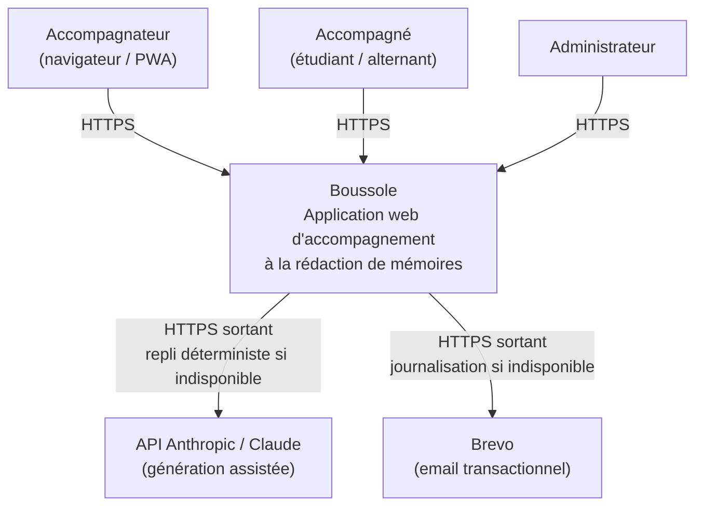
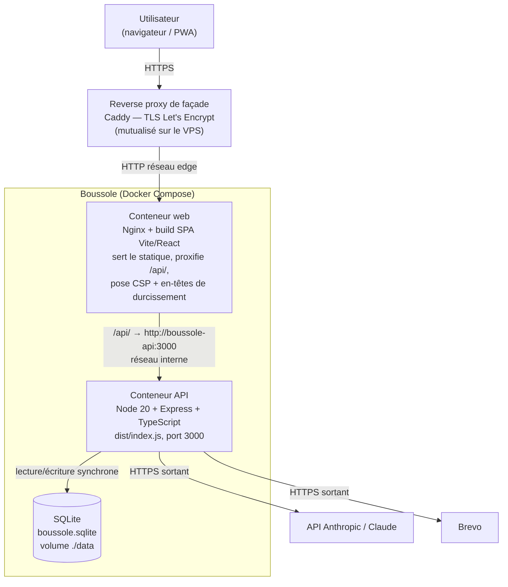
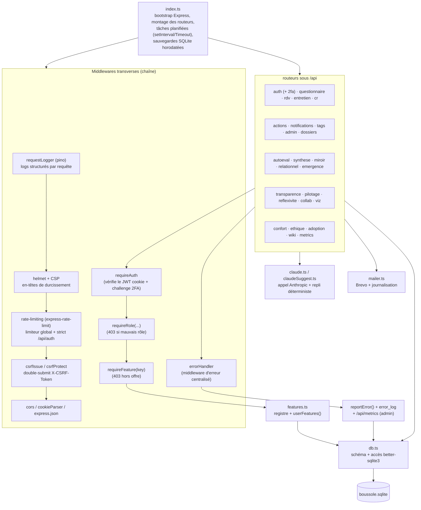
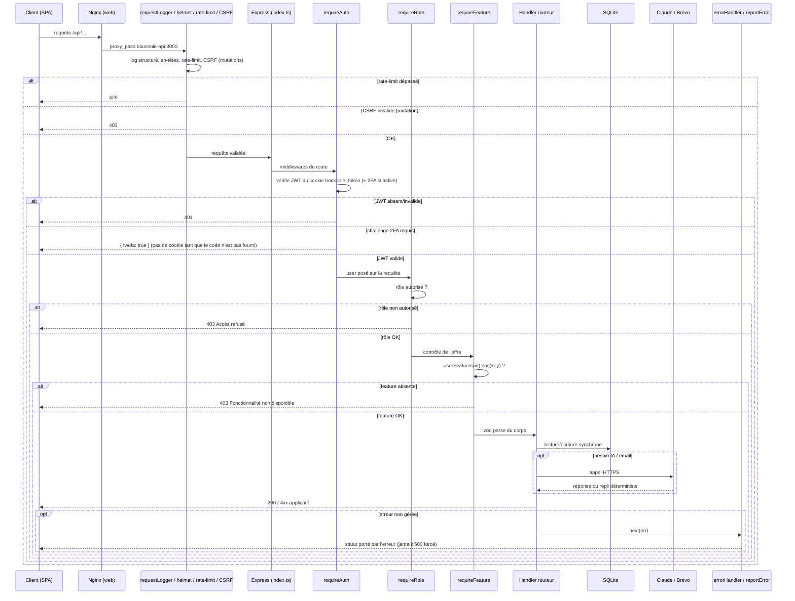
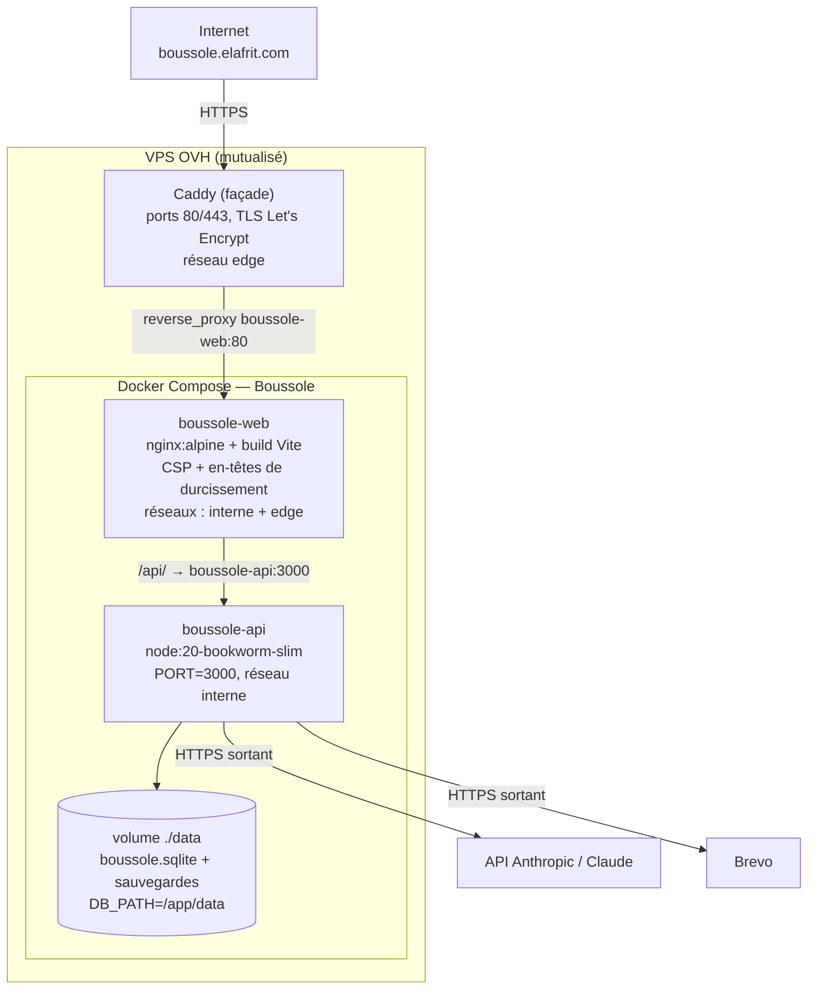

# Architecture technique

Ce dossier décrit l'architecture technique de l'application **Boussole** (UE FAD130, Cnam) : contexte technique, pile logicielle, vues C4 (contexte / conteneurs / composants), architecture applicative front et back, et topologie de déploiement. Il sert de référence d'entrée pour comprendre comment le système est structuré et où trouver le détail. Le détail des données est traité dans [Architecture des données](data-architecture), celui des endpoints dans [Documentation API](api-documentation), et les mécanismes de protection dans [Sécurité](security).

## Objectifs de la page

| # | Objectif | Public visé |
|---|----------|-------------|
| 1 | Donner une vue d'ensemble exploitable de la pile et des principes structurants | Jury, repreneur, architecte |
| 2 | Documenter l'architecture par les vues C4 (contexte, conteneurs, composants) | Architecte, développeur |
| 3 | Décrire l'architecture applicative front (SPA) et back (Express), ses middlewares transverses et ses frontières | Développeur |
| 4 | Décrire la topologie de déploiement (Docker + reverse proxy de façade Caddy) | Ops, repreneur |
| 5 | Tracer les contraintes, hypothèses, risques et recommandations techniques | PMO, décideur |

## 1. Contexte technique

Boussole est une **application web mono-instance** déployée en conteneurs sur un VPS OVH mutualisé. Le périmètre est volontairement resserré : un seul nœud applicatif, une base de données embarquée fichier, des dépendances externes minimales (IA et email transactionnel), chacune avec un **mode dégradé déterministe**. Ce choix répond au cadre académique (auteur unique, soutenance le 12 juin 2026, dépôt le 19 juin 2026) en privilégiant la **simplicité opérationnelle et la testabilité** sur la scalabilité horizontale.

| Caractéristique | Valeur | Conséquence d'architecture |
|-----------------|--------|----------------------------|
| Topologie | Mono-instance, 2 conteneurs applicatifs | Pas de coordination inter-nœuds, pas de session distribuée |
| Persistance | SQLite fichier unique (`better-sqlite3`, synchrone) | Accès direct, pas d'ORM, pas de pool de connexions |
| Auth | JWT en cookie httpOnly, stateless côté serveur ; 2FA TOTP opt-in | Pas de store de sessions à répliquer |
| IA | API Anthropic (Claude), appel HTTP sortant | Latence réseau isolée par un repli déterministe |
| Email | Brevo (API HTTP) | Journalisation des emails si clé absente |
| Hébergement | VPS OVH, reverse proxy de façade Caddy mutualisé | Boussole ne tient pas les ports 80/443 |
| Observabilité | Logs structurés pino, table `error_log`, endpoint `/api/metrics` | Auto-hébergée, sans tiers, adaptateur Sentry brançable |

## 2. Pile logicielle

| Couche | Technologie | Version cible | Rôle |
|--------|-------------|---------------|------|
| Frontend | React + Vite + TypeScript | 18 / 5 / 5 | SPA, routage `react-router-dom` 6 |
| État front | React Context | — | `AuthContext`, `FeaturesContext` |
| i18n front | `react-i18next` | — | Français par défaut + amorce anglaise, sélecteur FR/EN |
| UI front | CSS maison + TipTap + DOMPurify + framer-motion | — | Éditeur riche (CR/synthèses), sanitisation HTML, animations |
| Service statique | Nginx (Alpine) | — | Sert le build Vite, proxifie `/api/`, pose CSP + en-têtes de durcissement sur le HTML de la SPA |
| Backend | Node + Express + TypeScript | 20 / — / 5 | API REST sous `/api` |
| Validation | Zod | — | Schémas d'entrée par endpoint |
| Persistance | `better-sqlite3` (SQLite) | — | Accès synchrone, WAL, `foreign_keys=ON` |
| Auth | `jsonwebtoken` + `bcryptjs` | — | JWT cookie httpOnly, hash 10 rounds |
| 2FA | `otplib` (TOTP) | — | Second facteur opt-in, QR code, challenge au login |
| Sécurité HTTP | `helmet`, `cors`, `cookie-parser`, `express-rate-limit` | — | En-têtes + CSP, CORS credentials, parsing cookie, rate-limiting, CSRF double-submit |
| Observabilité | `pino` | — | Logs structurés, `reportError()`, table `error_log`, `/api/metrics` |
| IA | API Anthropic / Claude (`claude.ts`) | modèle `claude-sonnet-4-6` par défaut | Génération adaptative + repli |
| Email | Brevo (`mailer.ts`) | — | Email transactionnel |
| Conteneurs | Docker / Docker Compose | — | Build et orchestration |

> **Hypothèse — confiance : moyenne** — Les versions « cible » des frameworks reflètent le contexte projet et les images de base (`node:20-bookworm-slim` pour l'API, `node:20-alpine` pour le build front). Les versions exactes des dépendances npm n'ont pas été relues paquet par paquet dans cette page.

## 3. Vues C4

### 3.1 Niveau 1 — Contexte système

Le système central **Boussole** est consommé par trois profils d'utilisateurs (accompagnateur, accompagné, administrateur) via un navigateur ou la PWA installée. Boussole dépend de deux systèmes externes : **Claude** (génération de questions, comptes rendus, synthèses, posture) et **Brevo** (emails de vérification, réinitialisation, rappels, digest). Chaque dépendance externe est non bloquante : son indisponibilité déclenche un repli déterministe (IA) ou une journalisation locale (email), jamais d'erreur 500 propagée à l'utilisateur.

### 3.2 Niveau 2 — Conteneurs

Quatre conteneurs interviennent. Le **reverse proxy de façade** (Caddy) est mutualisé avec d'autres applications du VPS ; il tient les ports 80/443 et génère les certificats TLS Let's Encrypt. Le **conteneur web** (Nginx) sert le build statique de la SPA, reverse-proxifie tout `/api/` vers le **conteneur API**, et pose la **CSP** ainsi que les en-têtes de durcissement (`X-Frame-Options`, `X-Content-Type-Options`, `Referrer-Policy`) sur le document HTML de la SPA. L'API n'est joignable que sur le réseau Docker interne (`boussole-api:3000`). L'API lit et écrit la **base SQLite** via un volume monté (`./data`), et appelle Claude et Brevo en HTTPS sortant.

> **Correction du contexte projet — confiance : élevée** — Le reverse proxy de façade de production est **Caddy** (PAS Traefik). Le code réel (`app/docker-compose.yml`, `app/.env.example` : `EDGE_NETWORK`, « Caddy de façade ») s'appuie sur **Caddy** (réseau `EDGE_NETWORK`, certificats Let's Encrypt automatiques). Le service de la SPA et le proxy `/api/` sont assurés par **Nginx** dans le conteneur web (`app/web/nginx.conf`), qui pose également la CSP côté SPA. La présente page documente l'état réel du dépôt.

### 3.3 Niveau 3 — Composants de l'API

L'API est structurée en **routeurs Express** montés sous `/api` par `index.ts`, qui exécute aussi le bootstrap et la **chaîne de middlewares transverses** : `requestLogger` (logs structurés pino par requête), `helmet` + CSP et en-têtes de durcissement, `rate-limiting` (`express-rate-limit` : limiteur global + limiteur strict sur `/api/auth`), `csrfIssue`/`csrfProtect` (protection CSRF double-submit, cookie `csrf_token` + en-tête `X-CSRF-Token` sur les mutations), puis `cors`, `cookie-parser` et le parsing JSON (1 Mo). Il lance le `seed()` initial, les **tâches planifiées** internes (rappels d'action, signaux faibles, digest hebdomadaire, balayage de rétention RGPD, sauvegardes SQLite « online » horodatées quotidiennes avec rétention) via `setInterval`/`setTimeout`. Trois middlewares de contrôle d'accès se composent en chaîne : `requireAuth` (JWT du cookie, avec challenge 2FA TOTP si activé), `requireRole(...)` (rôle), `requireFeature(key)` (offre/plan). Un **`errorHandler` centralisé** clôt la chaîne : il respecte le statut porté par l'erreur (pas de 500 forcé sur un 400 de parsing) et route les erreurs vers la couche d'observabilité (`reportError()`, table `error_log`). Les routeurs s'appuient sur des modules transverses : `claude.ts`/`claudeSuggest.ts` (IA + repli), `mailer.ts` (Brevo), `features.ts` (gating) et `db.ts` (accès SQLite).

> **Note — rate-limiting et CSRF sont désactivables en local/test** via `RATE_LIMIT_DISABLED=1` / `CSRF_DISABLED=1` (activés en production), afin de garantir la reproductibilité de la batterie de tests et de la CI.

## 4. Architecture applicative

### 4.1 Frontend (SPA)

| Élément | Implémentation | Emplacement |
|---------|----------------|-------------|
| Point d'entrée | `ReactDOM.createRoot` + `BrowserRouter` | `app/web/src/main.tsx` |
| Enregistrement PWA | `serviceWorker.register('/sw.js')` au `load` | `app/web/src/main.tsx` |
| Internationalisation | `react-i18next` (FR par défaut + EN, sélecteur FR/EN) | `app/web/src/i18n` |
| Contexte d'authentification | `AuthContext` | `app/web/src/auth/AuthContext.tsx` |
| Contexte de fonctionnalités | `FeaturesContext` | `app/web/src/features/FeaturesContext.tsx` |
| Garde de route | `Protected` (`role="..."`, redirige vers `/espace` ou `/connexion`) | `app/web/src/components/Protected.tsx` |
| Jeton CSRF | Cookie `csrf_token` lisible par JS, renvoyé en en-tête `X-CSRF-Token` sur les mutations | client API |
| Éditeur riche | TipTap (`@tiptap/react` + starter-kit) | CR & synthèses |
| Sanitisation | DOMPurify | Rendu du HTML IA/édité |
| Style | CSS maison (`index.css`, classes `.page/.card/.btn/.nav`) | `app/web/src/index.css` |

La SPA est mono-page (routage client `react-router-dom` 6). L'état applicatif transverse est porté par deux contextes React : `AuthContext` (utilisateur courant, état de connexion) et `FeaturesContext` (fonctionnalités activées de l'offre). Le composant `Protected` réalise le gating d'accès côté client par rôle ; le gating fait foi **côté serveur** (le front n'est qu'une commodité d'UX). Les mutations renvoient le jeton CSRF lu dans le cookie `csrf_token` via l'en-tête `X-CSRF-Token`. Le détail des écrans est traité dans [UX / UI](ux-ui).

### 4.2 Backend (Express)

**Chaîne de traitement d'une requête authentifiée et gatée :**

| Préoccupation | Mécanisme | Référence code |
|---------------|-----------|----------------|
| Journalisation | `requestLogger` pino (logs structurés par requête) | `index.ts`, logger pino |
| En-têtes / CSP | `helmet` + CSP et en-têtes de durcissement côté API (CSP SPA posée par Nginx) | `index.ts`, `app/web/nginx.conf` |
| Rate-limiting | `express-rate-limit` : limiteur global + limiteur strict sur `/api/auth` (désactivable `RATE_LIMIT_DISABLED=1`) | `index.ts` |
| Protection CSRF | Double-submit : `csrfIssue` (cookie `csrf_token`) + `csrfProtect` (en-tête `X-CSRF-Token` sur mutations ; désactivable `CSRF_DISABLED=1`) | middleware CSRF |
| Authentification | JWT signé (`jsonwebtoken`), cookie httpOnly `boussole_token`, `sameSite=lax`, `secure` en prod, 7 jours | `auth.ts` (`requireAuth`, `setAuthCookie`) |
| 2FA (opt-in) | TOTP `otplib` ; `users.totp_secret`/`totp_enabled` ; `/api/auth/2fa/{status,setup,enable,disable}` ; challenge `{ twofa: true }` au login | `auth.ts`, endpoints 2FA |
| Autorisation rôle | `requireRole(...roles)` → 403 | `auth.ts` |
| Autorisation offre | `requireFeature(key)` → 403 ; `userFeatures()` (plan NULL = tout activé) | `features.ts` |
| Validation d'entrée | Schémas Zod par endpoint (`safeParse` → 400) | par routeur (ex. `auth.ts`) |
| Gestion d'erreurs | `errorHandler` centralisé respectant le statut porté ; dégradation systématique (repli IA / journalisation email), jamais de 500 sur indisponibilité externe | `errorHandler`, `claude.ts`, `mailer.ts` |
| Observabilité | `reportError()` (point unique, adaptateur Sentry brançable), table `error_log`, `GET /api/metrics` (admin) | `reportError()`, `index.ts` |
| IA + repli | Clé `ANTHROPIC_API_KEY` absente → `fallback*` déterministe | `claude.ts`, `claudeSuggest.ts` |
| Configuration | `dotenv` charge `app/.env` puis `.env` ; variables déjà injectées en conteneur | `env.ts` |
| Tâches planifiées | `setInterval`/`setTimeout` : rappels, signaux, digest, rétention, sauvegardes SQLite horodatées | `index.ts`, `backups.ts` |

Le principe directeur du backend est la **non-régression de service** : toute dépendance externe a un repli local. L'absence de clé Claude bascule sur des parcours déterministes (`FALLBACK_STEPS`, `fallbackNext`) ; l'absence de clé Brevo journalise l'email. Les préoccupations transverses (logs, durcissement, rate-limiting, CSRF, gestion d'erreurs, observabilité) sont posées en chaîne de middlewares plutôt que dispersées dans les handlers. Le détail exhaustif des endpoints figure dans [Documentation API](api-documentation), et le modèle des tables dans [Architecture des données](data-architecture).

## 5. Principes structurants

| Principe | Énoncé | Justification |
|----------|--------|---------------|
| Simplicité opérationnelle | Mono-instance, SQLite fichier, pas d'ORM | Cadre académique, auteur unique, time-to-deliver |
| Dégradation gracieuse | Chaque feature IA a un repli déterministe | Testabilité sans clé, robustesse de démo |
| Sécurité par défaut | JWT httpOnly, 2FA opt-in, helmet+CSP, rate-limiting, CSRF, validation Zod, gating serveur | Surface d'attaque réduite, RGPD |
| Préoccupations transverses centralisées | Logs, durcissement, rate-limit, CSRF, erreurs posés en middlewares | Cohérence, lisibilité, observabilité |
| Gating par offre | `requireFeature` adossé aux plans | Démonstration commerciale du produit |
| Stateless côté serveur | Auth portée par le cookie JWT | Pas de store de sessions à opérer |
| Frontière nette front/back | Le front ne décide rien de sensible | Le serveur fait foi sur droits et données |

## 6. Contraintes & dépendances

| Type | Élément | Impact |
|------|---------|--------|
| Contrainte | Le VPS expose déjà un proxy Caddy mutualisé tenant 80/443 | Boussole ne prend pas ces ports ; rattachement au réseau `edge` |
| Contrainte | `better-sqlite3` est un module natif | L'image API installe `python3/make/g++` pour le build |
| Contrainte | SQLite mono-fichier | Concurrence d'écriture limitée à un seul nœud |
| Contrainte | Rate-limit / CSRF actifs en prod | Tests et CI les neutralisent via `RATE_LIMIT_DISABLED=1` / `CSRF_DISABLED=1` |
| Dépendance | API Anthropic (Claude) | Repli déterministe si indisponible |
| Dépendance | Brevo | Journalisation si indisponible |
| Dépendance | Réseau Docker interne | Le web ne joint l'API que par `boussole-api:3000` |

## 7. Conventions techniques

| Domaine | Convention |
|---------|-----------|
| Base de données | `snake_case`, `id INTEGER PK AUTOINCREMENT`, `datetime('now')`, FK `ON DELETE CASCADE/SET NULL` |
| API | Routeurs Express montés sous `/api/<domaine>`, validation Zod, réponses JSON |
| Code | TypeScript strict, modules par domaine métier (un fichier ≈ un routeur) |
| Sécurité | Cookie `boussole_token`, hash bcrypt 10 rounds, helmet+CSP, rate-limiting, CSRF double-submit, 2FA TOTP opt-in |
| Observabilité | Logs pino structurés, `reportError()` unique, table `error_log`, `/api/metrics` |
| Conteneurs | Image API `node:20-bookworm-slim` (`node dist/index.js`), image web `nginx:alpine` |

## 8. Topologie de déploiement

En production, le routage HTTPS de `boussole.elafrit.com` est ajouté au `Caddyfile` mutualisé (bloc `reverse_proxy boussole-web:80`), Caddy générant le certificat Let's Encrypt automatiquement. Le **conteneur web** est attaché à deux réseaux : `edge` (pour être atteint par Caddy) et `interne` (pour joindre l'API) ; c'est lui qui pose la CSP et les en-têtes de durcissement sur le HTML servi. Le **conteneur API** reste sur le seul réseau `interne` (jamais exposé directement), avec la base SQLite et ses **sauvegardes horodatées** persistées sur un volume `./data`. En local, `docker-compose.local.yml` publie le front sur `http://localhost:8080` sans dépendre du proxy de façade. Le détail des procédures figure dans [Déploiement](deployment) et [Exploitation](operations).

| Conteneur | Image | Réseaux | Port | Persistance |
|-----------|-------|---------|------|-------------|
| `boussole-web` | `nginx:alpine` (multi-stage Vite) | interne + edge | 80 (interne) | — |
| `boussole-api` | `node:20-bookworm-slim` | interne | 3000 (interne) | volume `./data` (base + sauvegardes) |
| Façade | Caddy (mutualisé) | edge | 80/443 | certificats TLS |

## Hypothèses

> **Hypothèse — confiance : élevée** — Le reverse proxy de façade en production est **Caddy** et non Traefik : confirmé par `app/docker-compose.yml`, `app/.env.example` (`EDGE_NETWORK`, « Caddy de façade ») et `app/web/nginx.conf`. Toute mention de « Traefik » dans des documents antérieurs est considérée comme une imprécision documentaire à corriger.

> **Hypothèse — confiance : moyenne** — Le modèle Claude par défaut est `claude-sonnet-4-6` (valeur de repli dans `claude.ts` via `ANTHROPIC_MODEL_REALTIME`). Le modèle réellement servi en production dépend de la variable d'environnement et n'a pas été vérifié sur l'instance déployée.

> **Hypothèse — confiance : moyenne** — Les comptages structurels (tables, endpoints, routeurs, fonctionnalités) proviennent du contexte projet et ont évolué avec l'ajout des domaines wiki, 2FA, sécurité, CSRF et observabilité. Ils n'ont pas tous été recomptés ligne par ligne dans cette page.

> **Hypothèse — confiance : moyenne** — La couche observabilité est volontairement **auto-hébergée et sans tiers** ; `reportError()` constitue un point d'extension unique vers un adaptateur Sentry, qui n'est pas encore branché.

## Risques & points d'attention

| # | Risque / point | Probabilité | Impact | Atténuation |
|---|----------------|-------------|--------|-------------|
| 1 | Mono-instance SQLite : pas de scalabilité horizontale ni de bascule | Faible (cadre académique) | Élevé en prod réelle | Sauvegardes SQLite horodatées du volume `./data` ; documenter la limite |
| 2 | SPOF reverse proxy mutualisé Caddy partagé avec d'autres applis | Moyenne | Moyen | Surveillance du conteneur de façade ; isolement réseau |
| 3 | Module natif `better-sqlite3` : build cassé si image de base change | Faible | Moyen | Épingler `node:20-bookworm-slim` ; tests d'image |
| 4 | Concurrence d'écriture SQLite (WAL) sous charge | Faible | Moyen | Mono-nœud assumé ; transactions courtes |
| 5 | Fuite de feature côté front si le gating serveur est omis sur un endpoint | Moyenne | Moyen | Revue systématique : tout endpoint sensible passe `requireFeature` |
| 6 | Coût/latence/quotas de l'API Anthropic | Moyenne | Faible | Repli déterministe systématique ; `max_tokens` borné |
| 7 | Rate-limit / CSRF désactivés par erreur en prod (variables mal posées) | Faible | Élevé | Valeurs par défaut sécurisées ; activation explicite en prod, neutralisation réservée aux tests/CI |
| 8 | Adaptateur d'alerting non branché (observabilité locale uniquement) | Moyenne | Faible | `reportError()` + `error_log` + `/api/metrics` ; brancher Sentry ultérieurement |

## Recommandations

| # | Recommandation | Priorité | Justification |
|---|----------------|----------|---------------|
| 1 | Maintenir la cohérence documentaire « Caddy + Nginx » (jamais « Traefik ») | Haute | Cohérence avec le code livré |
| 2 | Documenter et superviser les sauvegardes SQLite horodatées du volume `./data` | Haute | SQLite mono-fichier = point de perte unique |
| 3 | Ajouter un test d'intégration vérifiant `requireFeature` sur chaque endpoint gaté | Moyenne | Empêcher les régressions de gating |
| 4 | Expliciter le modèle Claude et la variable `ANTHROPIC_MODEL_REALTIME` en doc d'exploitation | Moyenne | Traçabilité du comportement IA |
| 5 | Conserver l'API strictement sur le réseau `interne` (jamais publiée) | Haute | Réduction de surface d'attaque |
| 6 | Brancher l'adaptateur Sentry sur `reportError()` quand un service d'alerting sera retenu | Basse | Observabilité proactive au-delà du local |
| 7 | Exposer une documentation OpenAPI/Swagger interactive (non encore livrée) | Moyenne | Découvrabilité de l'API pour repreneur |

## Pages liées

- [Résumé exécutif](executive-summary) — synthèse décisionnelle du projet
- [Architecture des données](data-architecture) — modèle des tables, conventions SQLite
- [Documentation API](api-documentation) — détail des endpoints et des routeurs
- [Sécurité](security) — JWT, 2FA, rate-limiting, CSRF, CSP, RGPD, contrôle d'accès, durcissement
- [Déploiement](deployment) — procédures Docker et Caddy
- [Exploitation](operations) — supervision, observabilité, sauvegardes, tâches planifiées
- [Stratégie de tests](testing-strategy) — batterie ISTQB, porte de non-régression, CI
- [UX / UI](ux-ui) — architecture du frontend et des écrans
- [Décisions d'architecture (ADR)](adr) — décisions structurantes tracées
- [Dette technique](technical-debt) — limites assumées et chantiers
