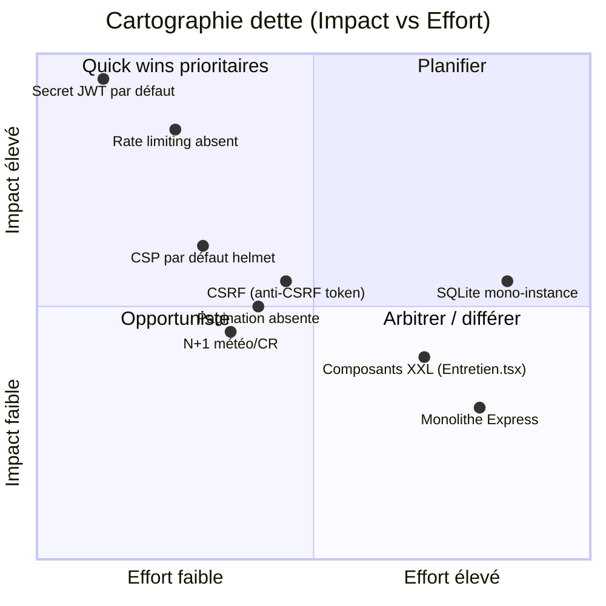
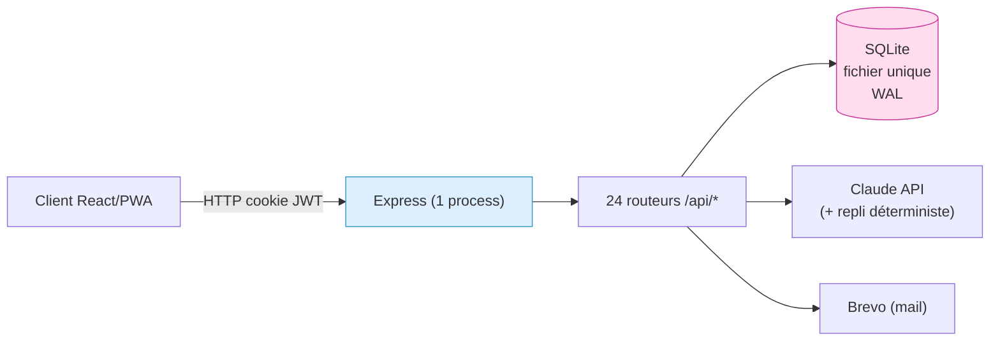
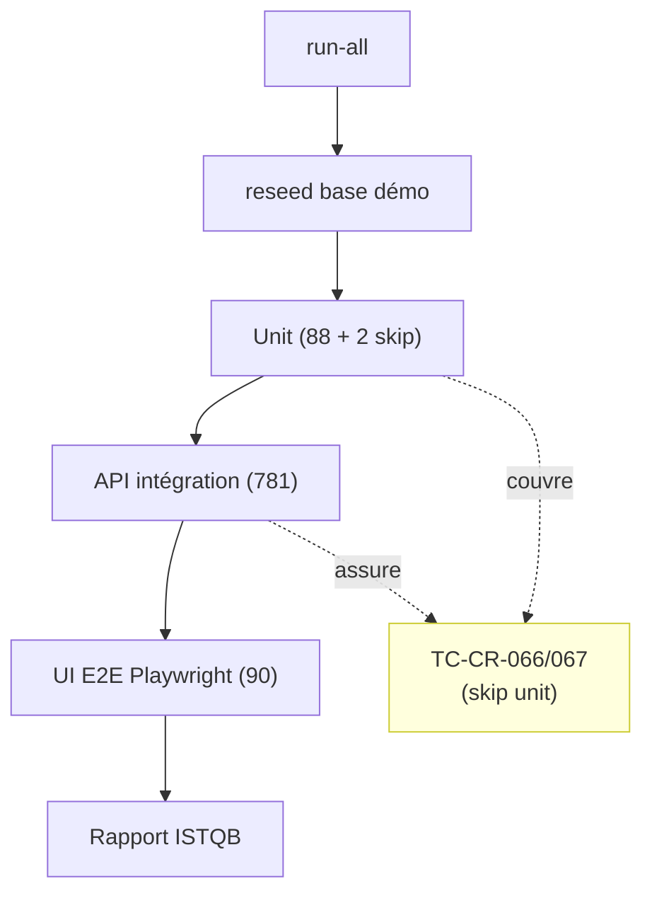
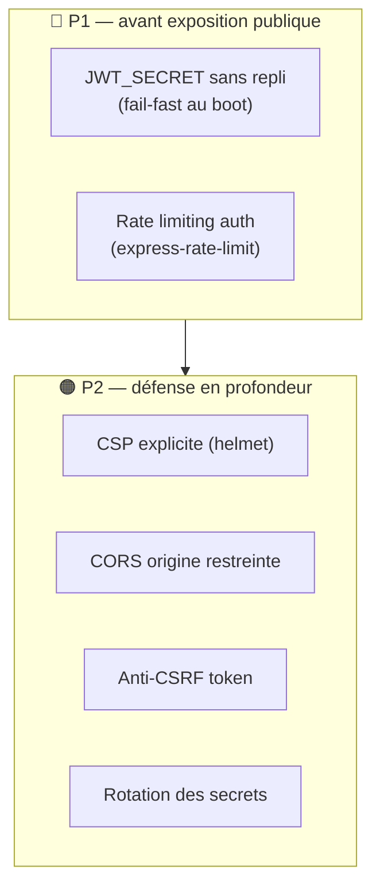

# Dette technique

Cette page dresse un **inventaire honnête et priorisé** de la dette technique de **Boussole**, ancré sur le code réel (backend Express + better-sqlite3, frontend React/Vite, batterie de tests ISTQB). Elle vise un usage décisionnel : pour chaque sujet, on qualifie l'**impact**, la **priorité**, l'**effort** et une **recommandation** actionnable. Le cadre est académique (UE FAD130, auteur unique, mono-instance) : certaines « dettes » sont des **arbitrages assumés et documentés** plutôt que des défauts — la page distingue systématiquement *dette subie* (à résorber) de *choix de conception* (à conserver tant que l'échelle ne change pas). Les évaluations d'effort sont des estimations explicitement marquées comme hypothèses ; aucune métrique de charge réelle n'a été relevée dans le périmètre fourni.

## Objectifs de la page

- Recenser la dette par **domaine** (architecture, code, tests, sécurité, performance, maintenabilité, documentation, dépendances, UX) avec un format uniforme.
- **Prioriser** selon impact × probabilité × proximité d'échéance (oral 12 juin, dépôt 19 juin 2026), pas selon la seule difficulté technique.
- Séparer nettement ce qui est **dette réelle** de ce qui est **arbitrage de conception** légitime au regard du contexte mono-instance solo.
- Fournir un **plan de résorption** séquencé (quick wins → structurant) exploitable pour la [Feuille de route](roadmap) et le [Registre des risques](risk-register).
- Tracer les liens avec l'[Architecture technique](technical-architecture), la [Sécurité](security) et la [Stratégie de test](testing-strategy).

---

## 1. Vue d'ensemble et méthode de cotation

La dette est cotée sur trois axes. La **priorité** est dérivée de l'impact et de la proximité de l'échéance, non de l'effort.

| Axe | Échelle | Définition |
|---|---|---|
| **Impact** | Faible / Moyen / Élevé / Critique | Conséquence si la dette se matérialise (sécurité, indispo, blocage d'évolution). |
| **Priorité** | P1 / P2 / P3 | P1 = à traiter avant mise à l'échelle ou exposition publique ; P2 = à planifier ; P3 = opportuniste. |
| **Effort** | XS / S / M / L | XS ≈ < 0,5 j, S ≈ 0,5–1 j, M ≈ 2–4 j, L ≈ > 5 j. *Hypothèse — confiance : moyenne* — estimations indicatives, non chiffrées par mesure réelle. |

> **Hypothèse — confiance : moyenne** — Les efforts ci-dessous sont des ordres de grandeur pour un développeur unique connaissant le code. Ils ne reposent sur aucune métrique d'historique de tickets (*information non identifiée dans le code ou la conversation*).

*Le quadrant situe chaque dette par effort de résorption et impact. Le coin haut-gauche (secret JWT, rate limiting) concentre les quick wins prioritaires : impact élevé, effort faible — à traiter en premier. SQLite mono-instance et le monolithe sont à fort effort mais relèvent d'arbitrages assumés (section 9), pas de dette subie : ils ne sont à reconsidérer que si l'échelle change.*

---

## 2. Architecture

| Sujet | Description | Impact | Priorité | Recommandation | Effort |
|---|---|---|---|---|---|
| Monolithe Express | 24 routeurs montés dans un seul process (`app/api/src/index.ts`), pas de découpage en services. | Faible | P3 | **Conserver** : adapté au solo mono-instance. Documenter la frontière des modules comme préparation à une éventuelle extraction. | — |
| SQLite mono-instance | `better-sqlite3` synchrone, fichier unique `./data/boussole.sqlite`, WAL. Pas de réplication ni de scale horizontal. | Moyen | P2 | **Conserver tant que mono-instance.** Documenter le point de bascule (concurrence d'écriture, > 1 réplique) vers Postgres dans un [ADR](adr). | — |
| Migrations additives maison | `db.ts` applique une liste d'`ALTER TABLE ADD COLUMN` idempotents ; pas de versionnage (`user_version`), pas de rollback, pas de migration descendante. | Moyen | P2 | Introduire un compteur `PRAGMA user_version` + table de migrations horodatée pour tracer l'état du schéma et éviter les ALTER ré-exécutés. | S |
| Couplage accès données ↔ routeurs | Requêtes SQL inline dans les routeurs (pas de couche repository). | Faible | P3 | Acceptable à cette taille. Extraire une fine couche d'accès **seulement** si la duplication de requêtes augmente. | M |

*Le schéma montre le point de contention structurel : un process Express unique et un fichier SQLite unique. C'est une simplicité voulue (déploiement trivial, transactions synchrones), mais cela fixe le plafond de montée en charge. La dette n'est pas l'architecture elle-même — c'est l'**absence de seuil documenté** au-delà duquel elle doit évoluer (traité en P2).* 

---

## 3. Code

| Sujet | Description | Impact | Priorité | Recommandation | Effort |
|---|---|---|---|---|---|
| Couverture des replis IA | Chaque fonction IA possède un `fallback` (ex. `claude.ts` : `fallbackNext` appelé si clé absente, parse échoué ou exception). Robuste **par conception**. | Faible | P3 | **Aucune action requise.** S'assurer que tout nouvel appel IA suit le même patron `try → parse → fallback`. Documenter le patron comme règle d'équipe. | XS |
| Composants front XXL | `Entretien.tsx` ≈ 20 Ko, `Methode.tsx` ≈ 15,5 Ko, `Dossier.tsx` ≈ 13,5 Ko : logique + état + rendu mêlés dans un seul fichier. | Moyen | P2 | Découper `Entretien.tsx` en sous-composants (phase, co-pilote, miroir) + hooks dédiés. Améliore testabilité et relecture. | M |
| CSS monolithique | `index.css` ≈ 68 Ko, classes globales `.page/.card/.btn`. Pas de scoping (CSS Modules / utilitaires). | Faible | P3 | Conserver ; risque de collision faible à ce volume. Envisager un découpage par domaine si le fichier dépasse ~100 Ko. | M |
| Gestion d'erreurs IA homogène mais silencieuse | Le repli renvoie un résultat dégradé sans toujours signaler à l'utilisateur que l'IA était indisponible. | Faible | P3 | Ajouter un indicateur discret « généré sans IA » côté UX pour la transparence (lié à la feature `transparence`). | S |

> **Hypothèse — confiance : élevée** — La taille des composants front est mesurée sur disque (octets), pas en lignes ; `Entretien.tsx` reste le plus volumineux et le plus prioritaire à découper.

---

## 4. Tests

La batterie ISTQB est l'**actif fort** du projet (référence 959/961 vert). La dette y est résiduelle et **documentée**.

| Sujet | Description | Impact | Priorité | Recommandation | Effort |
|---|---|---|---|---|---|
| 2 cas unitaires ignorés | `compteRendu.test.ts` : `TC-CR-066` et `TC-CR-067` sont `it.skip(...)`, annotés *« couvert par intégration API »* (parse JSON entouré de prose ; repli template sur erreur). | Faible | P3 | **Arbitrage assumé.** La couverture existe au niveau API. Conserver l'annotation explicite ; vérifier en revue que l'équivalent API reste vert. | XS |
| Tests IA non déterministes | Certains tests IA sont relâchés en **contrat** (forme de la réponse) plutôt qu'en valeur exacte, l'IA n'étant pas reproductible. | Moyen | P2 | Conserver la stratégie *contract testing* ; isoler explicitement les cas IA dans une suite taguée pour distinguer flakiness attendu vs régression réelle. | S |
| Dépendance à la stack Docker (:8080) | Les tests API/UI requièrent la stack démarrée ; pas de mode unitaire « pur » pour ces couches. | Faible | P3 | Acceptable (fidélité au réel). Documenter le prérequis dans le runbook de la porte de non-régression. | XS |

*Le pipeline `run-all` est la porte de non-régression. Les deux cas ignorés au niveau unitaire (jaune) ne sont pas un trou de couverture : ils sont **rattrapés** par l'intégration API. La dette de test réelle est donc nulle sur la fonctionnalité, et purement organisationnelle (traçabilité de l'annotation).*

---

## 5. Sécurité

Domaine prioritaire : c'est là que la dette présente le plus fort ratio impact/effort. Voir [Sécurité](security) pour le détail des contrôles.

| Sujet | Description | Impact | Priorité | Recommandation | Effort |
|---|---|---|---|---|---|
| Secret JWT par défaut | `auth.ts` : `JWT_SECRET = process.env.JWT_SECRET \|\| 'dev_secret_change_me'`. Si la variable n'est pas définie en prod, les jetons sont **forgeables**. | **Critique** | **P1** | Faire **échouer le démarrage** si `JWT_SECRET` absent en production (pas de valeur de repli). Quick win. | XS |
| Rate limiting absent | Aucune dépendance `express-rate-limit` ni middleware équivalent. Endpoints `login`, `register`, `request-reset` exposés au bruteforce/abus. | Élevé | **P1** | Ajouter un rate-limiter (IP + compte) au minimum sur l'authentification et l'envoi d'emails. | S |
| Anti-CSRF | Protection reposant uniquement sur le cookie `sameSite: 'lax'` ; pas de jeton anti-CSRF synchronizer. | Moyen | P2 | `lax` couvre l'essentiel des cas ; ajouter un jeton anti-CSRF (ou `sameSite: 'strict'` sur les mutations sensibles) pour défense en profondeur. | M |
| CSP par défaut | `helmet()` est appelé **sans configuration** : la Content-Security-Policy par défaut peut ne pas couvrir les sources réelles (Claude, Brevo, web-push). | Moyen | P2 | Définir une CSP explicite (`script-src`, `connect-src` whitelistant les domaines réels). Tester en staging pour éviter de casser le front. | S |
| CORS permissif | `cors({ origin: true, credentials: true })` reflète toute origine. | Moyen | P2 | Restreindre `origin` à la liste blanche de prod (`boussole.elafrit.com`) plutôt que `true`. | XS |
| Gestion des secrets | Secrets (clé Anthropic, Brevo, JWT) via variables d'environnement ; pas de gestionnaire de secrets ni de rotation. | Moyen | P2 | Acceptable en mono-instance Docker. Documenter la procédure de rotation et exclure tout secret du dépôt. | S |

*La séquence sécurité est claire : les deux items P1 (secret forgeable, absence de rate limiting) sont à coût quasi nul et impact critique/élevé — ils doivent précéder toute exposition publique réelle. Les items P2 relèvent de la défense en profondeur et peuvent suivre. Cette priorisation alimente directement le [Registre des risques](risk-register).*

---

## 6. Performance

| Sujet | Description | Impact | Priorité | Recommandation | Effort |
|---|---|---|---|---|---|
| Pagination absente | Listes renvoyées sans `LIMIT`/`OFFSET` (sauf `notifications` plafonné à 30, et des `LIMIT 1` de lookup). Listes de dossiers, actions, sessions non paginées. | Faible (aujourd'hui) → Moyen (à l'échelle) | P2 | Ajouter une pagination (cursor ou offset) sur les listes susceptibles de croître (dossiers admin, actions, journal d'accès). | S |
| N+1 météo (pilotage) | `pilotage.ts` `computeImpact` : boucle `for (const d of rows)` exécutant une requête `meteo_humeur` **par dossier**. | Faible | P2 | Remplacer par une seule requête agrégée (fenêtre/`GROUP BY`) joignant tous les dossiers. SQLite synchrone limite l'effet, mais le patron est à corriger. | S |
| N+1 comptes rendus (dossier) | `dossier.ts` : `sessions.map(s => db.prepare(...CR WHERE session_id=?).all(s.id))` — une requête CR **par session**. | Faible | P2 | Charger les CR de toutes les sessions en une requête `WHERE session_id IN (...)` puis regrouper en mémoire. | S |
| Absence d'index explicites documentés | *Information non identifiée dans le code ou la conversation* — les index au-delà des PK/FK ne sont pas inventoriés ici. | Moyen | P2 | Auditer les colonnes de filtre fréquentes (`dossier_id`, `session_id`, `user_id`, `cree_le`) et ajouter les index manquants. Voir [Architecture des données](data-architecture). | S |

> **Hypothèse — confiance : élevée** — En mono-instance SQLite synchrone avec la volumétrie de démo (2 accompagnateurs, 3 accompagnés, 6 dossiers), ces N+1 sont **sans impact perceptible**. La dette est *préventive* : elle se matérialise si la base grossit. À traiter avant toute ouverture multi-établissement.

---

## 7. Maintenabilité

| Sujet | Description | Impact | Priorité | Recommandation | Effort |
|---|---|---|---|---|---|
| Découplage front/état | État via React Context (`AuthContext`, `FeaturesContext`) sans store global ; logique métier parfois dans les composants. | Faible | P3 | Acceptable. Externaliser la logique répétée des gros composants vers des hooks (`useEntretien`, `useDossier`). | M |
| Typage des retours SQL | Nombreux casts manuels (`as { id: number } \| undefined`) sur les résultats `better-sqlite3`. | Faible | P3 | Centraliser les types de lignes par table pour réduire la duplication de casts et les écarts schéma/type. | S |
| Cohérence des messages d'erreur | Messages d'erreur en clair (FR) dispersés dans les routeurs. | Faible | P3 | Centraliser les libellés d'erreur API pour cohérence et i18n future. | S |

---

## 8. Documentation & dépendances

| Sujet | Description | Impact | Priorité | Recommandation | Effort |
|---|---|---|---|---|---|
| Documentation produit | Wiki admin riche (ce document, architecture, sécurité, tests) + doc ISTQB/IEEE 829. **Actif fort.** | Faible | P3 | Maintenir à jour à chaque évolution structurante via un [ADR](adr). | — |
| Versions de dépendances en `^` | `package.json` épingle en plages caret (`express ^4.21`, `better-sqlite3 ^11.3`, `react ^18.3`, `vite ^5.4`, `helmet ^7.1`, `jsonwebtoken ^9.0`, `zod ^3.23`). | Moyen | P2 | Lock-file présent assure le déterministe ; planifier un cycle de mise à jour + `npm audit` régulier. Surveiller `better-sqlite3` (build natif) lors des montées de Node. | S |
| Absence de Dependabot/veille auto | *Information non identifiée dans le code ou la conversation* — pas de mécanisme de veille de vulnérabilités détecté. | Moyen | P2 | Activer une veille (Dependabot/`npm audit` en CI) pour les CVE des dépendances exposées (Express, jsonwebtoken, web-push). | XS |

> **Hypothèse — confiance : moyenne** — Aucune CVE connue n'est affirmée ici faute d'exécution d'`npm audit` dans le périmètre fourni. La recommandation est d'**instrumenter** la veille, pas de corriger une vulnérabilité identifiée.

---

## 9. Dette UX (états & feedback)

| Sujet | Description | Impact | Priorité | Recommandation | Effort |
|---|---|---|---|---|---|
| Transparence du repli IA | Quand l'IA est indisponible, le contenu dégradé n'est pas toujours signalé visuellement à l'utilisateur. | Faible | P2 | Afficher un badge « rédigé sans assistance IA » (cohérent avec la feature `transparence`). | S |
| États de chargement / erreur | *Information partielle* — la couverture systématique des états *loading / empty / error* sur tous les écrans n'est pas vérifiable ici. | Faible | P3 | Auditer écran par écran la présence des trois états ; standardiser via un composant `<State>`. Voir [UX / UI](ux-ui). | M |
| FALC & onboarding | Features `falc` et `onboarding` existent (adoption). | Faible | P3 | Vérifier la couverture FALC sur les parcours critiques (inscription, RGPD). | S |

---

## Hypothèses

> **Hypothèse — confiance : moyenne** — Tous les efforts (XS/S/M/L) sont des estimations pour un développeur unique connaissant le code, sans données d'historique de tickets. *Information non identifiée dans le code ou la conversation.*

> **Hypothèse — confiance : élevée** — Les N+1 (pilotage, dossier) et l'absence de pagination n'ont **aucun impact mesurable** à la volumétrie actuelle de démo ; ils constituent une dette *préventive* conditionnée à la montée en charge.

> **Hypothèse — confiance : élevée** — Le secret JWT par défaut (`'dev_secret_change_me'`) est destiné au développement ; le risque ne se matérialise **que si** `JWT_SECRET` n'est pas défini en production. La recommandation est de rendre ce cas impossible (fail-fast), indépendamment de l'état réel de la prod.

> **Hypothèse — confiance : faible** — L'inventaire des index SQLite au-delà des PK/FK et l'existence d'une veille de vulnérabilités ne sont pas documentés dans le périmètre fourni.

## Risques & points d'attention

| Risque | Domaine | Gravité | Atténuation | Lien |
|---|---|---|---|---|
| Jetons forgeables si `JWT_SECRET` non défini en prod | Sécurité | Critique | Fail-fast au démarrage (P1) | [Sécurité](security) |
| Abus/bruteforce sur l'authentification | Sécurité | Élevée | Rate limiting auth + email (P1) | [Registre des risques](risk-register) |
| Plafond de charge SQLite mono-instance | Architecture | Moyenne | Seuil de bascule Postgres documenté en [ADR](adr) | [Architecture technique](technical-architecture) |
| Dégradation perf si la base grossit (N+1, pagination) | Performance | Moyenne | Requêtes agrégées + pagination (P2) | [Architecture des données](data-architecture) |
| CVE sur dépendances exposées non surveillées | Dépendances | Moyenne | Veille `npm audit`/Dependabot en CI (P2) | — |
| Flakiness des tests IA confondu avec régression | Tests | Faible | Suite IA taguée, contract testing isolé | [Stratégie de test](testing-strategy) |

## Recommandations

**Vague 1 — Quick wins sécurité (P1, à faire avant toute exposition publique).** Impact maximal, effort minimal.

1. Supprimer le repli du secret JWT et **échouer le démarrage** si `JWT_SECRET` est absent en production (XS).
2. Ajouter un **rate limiter** sur `login`, `register`, `request-reset` et l'envoi d'emails (S).
3. Restreindre **CORS** à l'origine de production au lieu de `origin: true` (XS).

**Vague 2 — Durcissement & performance préventive (P2).**

4. Définir une **CSP explicite** dans `helmet` (whitelist Claude/Brevo/web-push) et ajouter un **jeton anti-CSRF** sur les mutations sensibles (S+M).
5. Corriger les **N+1** (météo pilotage, CR par session) par requêtes agrégées et introduire la **pagination** sur les listes croissantes (S).
6. Versionner le **schéma** (`PRAGMA user_version` + table de migrations) et activer la **veille de dépendances** (`npm audit`/Dependabot) (S + XS).

**Vague 3 — Maintenabilité (P3, opportuniste).**

7. **Découper `Entretien.tsx`** et les autres composants XXL en sous-composants + hooks (M).
8. Documenter dans un [ADR](adr) le **seuil de bascule** SQLite → Postgres et la frontière des modules du monolithe.
9. Améliorer la **transparence UX du repli IA** (badge) et standardiser les états *loading/empty/error*.

**Principe directeur.** Conserver explicitement les arbitrages assumés (monolithe, SQLite mono-instance, 2 skips unitaires couverts par l'API, contract testing IA) : ce ne sont pas des dettes à rembourser tant que l'échelle reste mono-instance solo, mais des **décisions à réévaluer à un seuil documenté**.

## Pages liées

- [Architecture technique](technical-architecture) — monolithe Express, SQLite, déploiement.
- [Architecture des données](data-architecture) — schéma, index, requêtes.
- [Sécurité](security) — contrôles d'authentification, JWT, en-têtes HTTP.
- [Stratégie de test](testing-strategy) — batterie ISTQB, skips documentés, contract testing IA.
- [Registre des risques](risk-register) — risques projet et produit.
- [Feuille de route](roadmap) — séquencement des vagues de résorption.
- [Décisions d'architecture (ADR)](adr) — arbitrages structurants à formaliser.
- [Opérations](operations) — runbook, sauvegarde, rotation des secrets.
