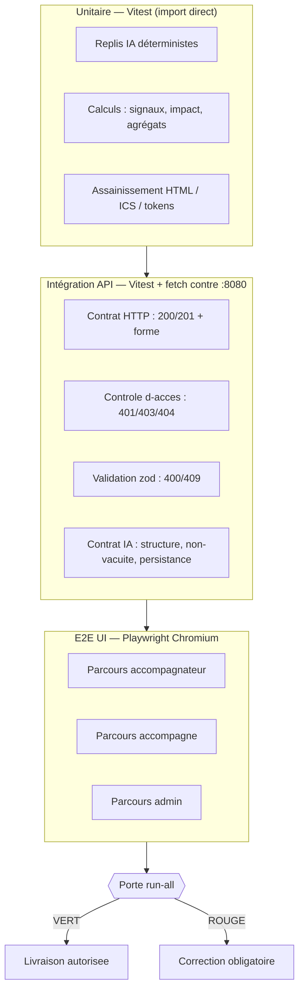
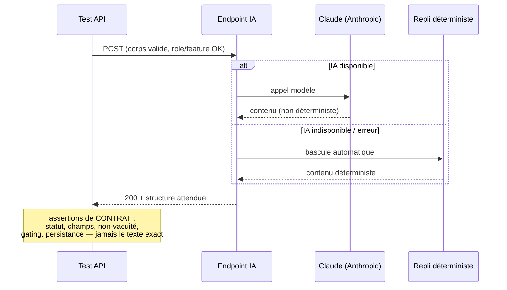
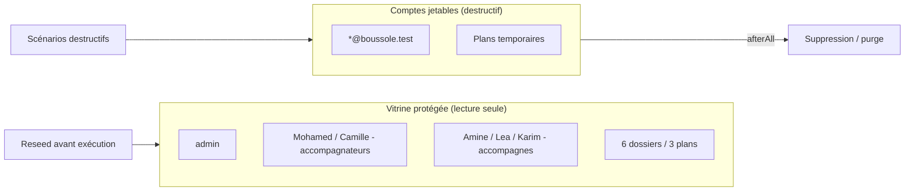
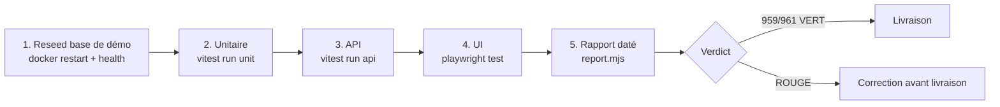

# Stratégie de tests

La qualité de Boussole repose sur une **batterie de non-régression réelle, automatisée et reproductible**, conçue selon la terminologie ISTQB et la structure documentaire IEEE 829. Elle couvre trois niveaux (unitaire, intégration API, E2E UI), traite spécifiquement le non-déterminisme de l'IA Claude par **test de contrat + couverture unitaire du repli déterministe**, et constitue une **porte de non-régression** : aucune évolution n'est livrée sans que l'intégralité de la suite soit au vert. L'état de référence est de **959/961 tests au vert** (exécution du 13/06/2026), pour un catalogue conçu de **1204 cas** dont **1009 automatisés (84 %)**. Cette page décrit les objectifs, le périmètre, les niveaux, les jeux de données, l'environnement, l'automatisation et l'état chiffré ; le détail cas-par-cas est tenu dans la [matrice de traçabilité](traceability-matrix).

## Objectifs de la page

- Donner une **vision décisionnelle** de la stratégie de tests : quoi tester, à quel niveau, avec quel critère de sortie.
- Distinguer nettement ce qui est **couvert / partiellement couvert / hors périmètre**, sans surévaluer la couverture.
- Documenter la **gestion du non-déterminisme IA** et la **protection de la vitrine de démonstration**.
- Servir de référence pour le **rejeu avant livraison** (oral du 12/06, dépôt du 19/06/2026) et de point d'entrée vers la [matrice de traçabilité](traceability-matrix) et la [documentation API](api-documentation).

## 1. Objectifs et principes directeurs

| Objectif | Traduction concrète | Statut |
|---|---|---|
| Non-régression systématique | Suite intégrale rejouée à chaque évolution, base reseedée à neuf | Déjà livré |
| Couverture du contrôle d'accès | 401 / 403 / 404 testés sur chaque endpoint sensible (rôle, offre, propriété) | Déjà livré |
| Robustesse de l'IA | Jamais de 500 : repli déterministe testé par contrat **et** au texte près | Déjà livré |
| Reproductibilité | Jeu de démo idempotent, identifiants découverts dynamiquement | Déjà livré |
| Protection de la vitrine | Comptes jetables `@boussole.test` pour les scénarios destructifs | Déjà livré |
| Traçabilité | Chaque cas relie une fonctionnalité, un endpoint (ou composant UI) et un test | Déjà livré |

Principe transverse : **on teste le contrat, pas l'implémentation littérale de l'IA**. La sortie textuelle de Claude n'est jamais vérifiée mot pour mot ; on contrôle le statut, la structure, la non-vacuité, le gating et la persistance. La logique de repli, elle, est déterministe et testée à l'identique.

## 2. Périmètre

### 2.1 Inclus

- **Tous les endpoints** de l'API (145 endpoints, 24 routeurs sous `/api`) : méthode, chemin, rôle requis, fonctionnalité requise (`requireFeature`), validation `zod`, propriété de la ressource.
- **Les 38 fonctionnalités** du registre `features.ts`, socle compris, avec leur **contrôle d'accès par abonnement** (plans Découverte / Essentiel / Pro, `plan_id NULL` = accès maximal).
- **Le cycle d'authentification complet** : inscription → vérification e-mail → connexion ; mot de passe oublié → réinitialisation ; changement d'e-mail → re-confirmation. Le jeton est lu en base réelle.
- **Un scénario UI bout-en-bout par fonctionnalité**, pour les **3 rôles** (accompagnateur, accompagné, admin) plus l'anonyme.
- **La logique déterministe** : replis IA, calculs de signaux faibles, agrégats du tableau d'impact, assainissement HTML, génération ICS — en tests unitaires.

### 2.2 Exclus (hors périmètre assumé)

| Exclusion | Raison | Compensation |
|---|---|---|
| Exactitude **textuelle** des sorties IA | Non déterministe | Test de contrat + units du repli |
| Envoi **réel** d'e-mails (Brevo) et de **push** | Effets de bord externes | Journalisés en local, jamais émis en test |
| Tests de **charge / performance** | Hors objectif académique mono-instance | Voir §7 (hypothèses) |
| **Compatibilité multi-navigateurs** étendue | Coût/bénéfice | Playwright cible Chromium |

## 3. Niveaux de test

La pyramide est respectée dans l'esprit : une base d'unitaires rapides sur la logique pure, un cœur d'intégration API très dense (couche la plus volumineuse, car c'est là que vit le contrôle d'accès), et un sommet E2E ciblé sur les parcours des 3 rôles. Le flux ci-dessus est strictement séquentiel dans le runner : un échec à n'importe quelle étape fait basculer la porte au rouge.

### 3.1 Unitaire — repli déterministe

Cible : fonctions pures importées directement depuis le code API (`claude.ts`, `claudeSuggest.ts`, `compteRendu.ts`, `rdv.ts`, `features.ts`, calculs de pilotage et d'émergence). On y vérifie au **texte près** le comportement de repli activé quand l'IA est indisponible, ainsi que les fonctions techniques (génération/échappement ICS, `makeToken`, `sanitizeKeys`, `userFeatures`).

> **Hypothèse — confiance : élevée** — 2 cas unitaires (`TC-CR-066`, `TC-CR-067`) sont marqués `it.skip` et explicitement documentés « couvert par intégration API » : la génération IA de compte rendu parsant du JSON entouré de prose est validée au niveau API plutôt qu'unitaire. C'est la source des « +2 ignorés » de l'état de référence.

### 3.2 Intégration API — contrat HTTP, contrôle d'accès, validation

C'est le niveau le plus volumineux. Les suites (`auth`, `quest`, `rdv`, `entr`, `cr`, `actnotif`, `dossier`, `relemerg`, `lot1`, `pilot`, `reflex`, `collab`, `viz`, `confort`, `ethique`, `adopt`, `viz`) appellent l'API HTTP réelle via `fetch` contre la stack Docker. Une suite **smoke** (`smoke.test.ts`) valide d'abord la plomberie : santé, connexion + cookie, gating 401/403, cycle complet d'un compte jetable.

| Catégorie de contrôle | Statut attendu | Exemple |
|---|---|---|
| Cas nominal | 200 / 201 + forme correcte | inscription valide → 201 |
| Non authentifié | 401 | `GET /api/admin/users` sans cookie |
| Mauvais rôle **ou** offre sans la feature | 403 | accompagné sur route admin ; feature hors plan |
| Non-propriétaire d'une ressource | 404 | accès à un dossier d'autrui |
| Entrée invalide (`zod`) | 400 | mot de passe < 8 caractères |
| Conflit | 409 | e-mail déjà utilisé |

### 3.3 E2E UI — Playwright, 3 rôles

Trois specs couvrent les parcours métier (`accompagnateur.spec.ts`, `accompagne.spec.ts`, `admin.spec.ts`) plus un `smoke.spec.ts`. Les sélecteurs s'appuient sur des **attributs stables** (`data-tour`, rôles ARIA) et des attentes explicites pour éviter la fragilité. La cible est Chromium.

### 3.4 Tests IA — contrat + units du repli

Le test ne sait pas, et n'a pas besoin de savoir, si la réponse vient de Claude ou du repli : dans les deux cas le **contrat** (statut 200, structure, non-vacuité, persistance en base) doit tenir. La garantie « jamais de 500 » est ainsi vérifiée de bout en bout, et la logique de repli est doublée d'une couverture unitaire au texte près.

### 3.5 Sécurité, performance, accessibilité

| Type | Couverture actuelle | Détail |
|---|---|---|
| **Sécurité (contrôle d'accès)** | Déjà livré | 401/403/404 systématiques ; anti-énumération sur `request-reset` ; propriété des ressources ; isolation par rôle |
| **Sécurité (assainissement)** | Déjà livré (unitaire) | Sanitisation HTML des CR/synthèses (dompurify côté front, esc/contentToHtml côté API) testée |
| **Performance / charge** | Hors périmètre | *Information non identifiée dans le code ou la conversation.* Voir Recommandations |
| **Accessibilité** | Partiel | Sélecteurs ARIA exploités par Playwright ; pas d'audit a11y dédié (axe-core) identifié |
| **Non-régression** | Déjà livré | Porte `run-all` rejouée avant chaque livraison |

> **Hypothèse — confiance : moyenne** — l'accessibilité est *exercée indirectement* (rôles ARIA utilisés comme sélecteurs E2E) mais ne fait pas l'objet d'une suite d'audit dédiée. À ne pas présenter comme une couverture a11y formelle.

## 4. Jeux de données

- **Base de démo reseedée** : (ré)initialisée avant chaque exécution pour repartir d'un état propre et reproductible — **6 comptes** (1 admin, 2 accompagnateurs, 3 accompagnés), **3 plans**, **6 dossiers**. Mot de passe commun de démo : `BoussoleDemo2026`.
- **Comptes jetables** `@boussole.test` : créés à la volée pour tout scénario **destructif** (anonymisation RGPD, suppression, affectation de plan), puis nettoyés en `afterAll`.
- **Vitrine protégée** : le couple **Mohamed / Amine, dossier D1** n'est **jamais** altéré durablement — c'est l'état présenté à l'oral.
- **Identifiants dynamiques** : dossiers, sessions, RDV sont découverts via l'API, jamais codés en dur.
- **Extraction de jeton** : pour les flux d'authentification, le jeton (`verif_email`, `reset_mdp`) est lu dans la base du conteneur via `docker exec`.

## 5. Environnement

| Élément | Valeur |
|---|---|
| Cible | Stack Docker locale `docker-compose.local.yml` |
| URL | `http://localhost:8080` (front + API + SQLite) |
| Conteneur API | `boussole-api-local` (reseed par `docker restart`) |
| Pré-requis d'entrée | typecheck API + web au vert ; `GET /api/health` → `ok` |
| Lecture de jeton | `docker exec boussole-api-local` |

L'environnement de test est **identique à la cible de déploiement** (mêmes images, même SQLite), ce qui élimine les écarts de comportement entre test et production décrits dans la page [déploiement](deployment).

## 6. Automatisation et porte de non-régression

| Besoin | Outil |
|---|---|
| Unitaire & intégration API | **Vitest** |
| Appels HTTP | `fetch` natif (Node 18+) |
| E2E UI | **Playwright** (Chromium) |
| Orchestration | Script unique **`run-all`** (`run-all.ps1` Windows + `run-all.sh`) |
| Rapport | `scripts/report.mjs` (rapport daté) + rapport HTML Playwright |

Le runner `run-all` enchaîne : **reseed → unitaire → API → UI → rapport**. C'est la **porte de non-régression** : rejouée avant chaque livraison, elle bloque toute évolution tant que la suite n'est pas au vert. Le processus normatif est : (1) implémenter, (2) mettre à jour le catalogue + l'automatisation, (3) lancer `run-all`, (4) corriger **tout** échec, (5) archiver le rapport daté.

## 7. État chiffré (référence)

| Couche | Total exécuté | Réussis | Échecs | Commentaire |
|---|---|---|---|---|
| Unitaire | 90 | 88 | 0 | 2 cas `it.skip` documentés (couverts en API) |
| API | 781 | 781 | 0 | Couche la plus dense (contrôle d'accès) |
| UI (Playwright) | 90 | 90 | 0 | 3 rôles, Chromium |
| **Total** | **961** | **959** | **0** | **Verdict : VERT** (exécution du 13/06/2026) |

**Conception vs automatisation** — le catalogue ISTQB conçu est plus large que la suite exécutée : il décrit l'intention de test complète, dont une partie (notamment les cas UI de priorité basse/moyenne) reste à automatiser.

| Indicateur | Valeur |
|---|---|
| Cas de test conçus (catalogue) | **1204** sur 19 domaines |
| Cas automatisés | **1009 (84 %)** |
| Cas non encore automatisés | 195 (16 %) |
| Tests exécutés au vert | **959 / 961** |

Couverture par domaine (extrait des extrêmes, source : matrice) : ENTR 90 %, REFLEX 93 %, UI_ADMIN 94 % en tête ; **PILOT 41 %** en bas de tableau — c'est le principal angle mort de couverture automatisée.

> **Hypothèse — confiance : élevée** — l'écart entre « 1204 cas conçus » et « 961 tests exécutés » n'est pas une régression : un fichier de test (ex. `auth.test.ts`) implémente plusieurs cas du catalogue, et certains cas conçus (UI basse priorité, PILOT) ne sont pas encore câblés. Les deux compteurs mesurent des choses différentes — conception vs exécution — et sont cohérents entre eux.

## 8. Conformité documentaire

La documentation suit la structure **IEEE 829** avec la terminologie **ISTQB**, et se compose de quatre livrables versionnés (`app/tests/docs/`), exportables en **Word via pandoc** :

| Document | Identifiant | Rôle |
|---|---|---|
| Plan de test | BOUSSOLE-PT-001 | Périmètre, niveaux, critères d'entrée/sortie |
| Catalogue de cas | BOUSSOLE-CAT-001 | 1204 cas tracés, 19 domaines |
| Matrice de traçabilité | BOUSSOLE-MAT-001 | Cas ↔ feature/endpoint ↔ test automatisé |
| Rapport d'exécution | BOUSSOLE-RAP-001 | Historique daté des verdicts |

## Hypothèses

> **Hypothèse — confiance : élevée** — les chiffres (959/961, 88+2/90 unit, 781 API, 90 UI, 1204 cas, 1009 automatisés) reflètent l'exécution datée du **13/06/2026 23:18** consignée dans `04-Rapport-execution.md` ; ils évoluent à chaque rejeu de la porte.

> **Hypothèse — confiance : moyenne** — l'absence de tests de performance/charge est un choix assumé lié au contexte mono-instance SQLite et académique, non un oubli. Aucun outil de charge (k6, Artillery) n'est identifié dans le dépôt.

> **Hypothèse — confiance : moyenne** — la couverture E2E vise « un scénario par fonctionnalité » ; les 90 tests UI exécutés ne couvrent donc pas exhaustivement toutes les variantes UI conçues au catalogue (priorités basses non automatisées).

## Risques & points d'attention

| Risque | Impact | Probabilité | Mitigation en place / à prévoir |
|---|---|---|---|
| Couverture PILOT faible (41 %) | Régression non détectée sur signaux/digest | Moyenne | Prioriser l'automatisation des cas PILOT restants |
| Instabilité de l'IA | Tests fragiles | Faible | Test de contrat + units du repli (déjà en place) |
| Fragilité des sélecteurs UI | Faux échecs Playwright | Moyenne | Attributs stables `data-tour` / ARIA, attentes explicites |
| Pollution du jeu de démo | Vitrine abîmée, faux négatifs | Faible | Comptes `@boussole.test` + reseed + nettoyage `afterAll` |
| Dépendance Docker pour le jeton | Couplage du flux auth | Faible | Helper d'extraction isolé, dégradable |
| Mono-navigateur (Chromium) | Bugs spécifiques Firefox/Safari non vus | Faible | Hors périmètre assumé ; PWA testée sur Chromium |
| Absence d'audit a11y formel | Non-conformité WCAG non détectée | Moyenne | Voir [UX / UI](ux-ui) ; recommandation §ci-dessous |

## Recommandations

1. **Combler l'angle mort PILOT** — porter la couverture de PILOT (41 %) vers la cible ~85 % des autres domaines : signaux faibles, tableau d'impact, digest hebdo sont des fonctionnalités de pilotage à enjeu.
2. **Ajouter un audit accessibilité automatisé** — intégrer `axe-core`/`@axe-core/playwright` dans les specs E2E pour transformer la couverture ARIA implicite en vérification WCAG explicite (lien [UX / UI](ux-ui)).
3. **Introduire un palier de performance léger** — un test de fumée de latence sur les endpoints chauds (`/api/health`, login, génération CR) suffirait à détecter une régression grossière sans viser un test de charge complet.
4. **Étendre l'automatisation des cas UI basse priorité** pour réduire l'écart conception/exécution (195 cas restants) et fiabiliser le chiffre de couverture.
5. **Intégrer `run-all` à une CI** — aujourd'hui rejouée manuellement avant livraison ; un déclenchement automatisé sécuriserait la porte de non-régression (lien [déploiement](deployment)).
6. **Surveiller la dérive du jeton Docker** — documenter une bascule si l'auth à jeton évolue, afin de ne pas coupler durablement la suite à `docker exec`.

## Pages liées

- [Matrice de traçabilité](traceability-matrix) — détail cas ↔ fonctionnalité/endpoint ↔ test automatisé
- [Spécifications fonctionnelles](functional-specifications) — les 38 fonctionnalités testées
- [Architecture technique](technical-architecture) — stack et environnement Docker
- [Documentation API](api-documentation) — les 145 endpoints sous contrat de test
- [Sécurité](security) — contrôle d'accès, RGPD, assainissement
- [UX / UI](ux-ui) — accessibilité et parcours E2E
- [Déploiement](deployment) — stack `:8080`, parité test/prod, CI
- [Exploitation](operations) — supervision et rejeu de la porte
- [Dette technique](technical-debt) — angles morts de couverture (PILOT, a11y, perf)
