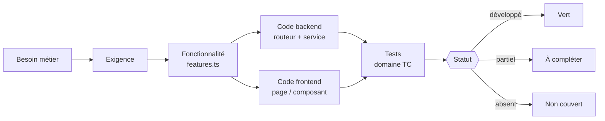
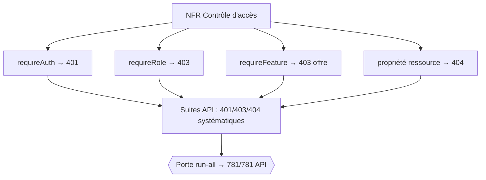

# Matrice de traçabilité

Cette page établit la **chaîne de traçabilité descendante** de Boussole : `Besoin métier → Exigence → Fonctionnalité → Fichiers de code → Tests → Statut`. Elle couvre les **38 fonctionnalités réelles** du registre `features.ts` et les rattache, une à une, à leur(s) route(s) API, leur(s) fichier(s) backend et frontend, et aux **19 domaines de cas** du catalogue ISTQB. L'objectif est de garantir qu'aucun besoin n'est orphelin (sans exigence), qu'aucune exigence n'est non testée, et qu'aucun test n'est sans objet — les trois ruptures classiques de traçabilité. L'état de référence est de **959/961 tests au vert** (exécution du 13/06/2026) pour un catalogue conçu de **1204 cas dont 1009 automatisés (84 %)**. Cette page est le pendant détaillé de la [stratégie de tests](testing-strategy) et le prolongement aval du [cahier des charges](requirements).

## Objectifs de la page

- Fournir la **matrice exploitable** reliant chaque fonctionnalité à son code et à ses tests, sans rupture de chaîne.
- Permettre une **analyse d'impact** immédiate : « si je modifie `cr.ts`, quels besoins, quelles routes et quels domaines de test sont concernés ? ».
- **Distinguer sans ambiguïté** le développé / partiel / absent, et localiser les angles morts de couverture automatisée.
- Servir de **preuve de complétude** pour la recette académique (oral du 12/06, dépôt du 19/06/2026) et de point de jonction entre [requirements](requirements) et [testing-strategy](testing-strategy).

## 1. Modèle de traçabilité

La traçabilité est **bidirectionnelle** : descendante pour vérifier la couverture (chaque besoin aboutit à des tests), ascendante pour l'analyse d'impact (chaque fichier remonte à des besoins). La colonne *Statut* qualifie l'**implémentation** de la fonctionnalité, pas le verdict d'exécution des tests ; le verdict d'exécution est global (959/961) et détaillé en [stratégie de tests](testing-strategy) §7.

### Conventions de lecture

| Élément | Convention |
|---|---|
| **Route API** | Chemin relatif au montage `/api/<routeur>` (cf. `index.ts`) |
| **Gating** | `R` = `requireRole`, `F` = `requireFeature(clé)`, `A` = `requireAuth` seul, `P` = public |
| **Domaine TC** | Préfixe des identifiants de cas du catalogue (ex. `TC-ENTR-###`) |
| **Statut** | **Développé** (livré + testé) · **Partiel** (livré, couverture ou périmètre incomplet) · **Absent** (non implémenté) |

> **Hypothèse — confiance : élevée** — toutes les fonctionnalités du registre sont **implémentées** (aucune n'est « absente »). La nuance *Partiel* signale ici une **couverture de test** ou un **périmètre fonctionnel** incomplet, jamais une absence de code. Aucune feature « absente » n'a été identifiée dans `features.ts`.

## 2. Distinction structurante : gating route vs gating client

Tous les `requireFeature` ne sont **pas** posés au niveau route. Trois régimes coexistent, ce qui conditionne la lecture de la matrice :

| Régime | Fonctionnalités concernées | Implication test |
|---|---|---|
| **Gating route** (`requireFeature`) | miroir, signaux_faibles, tableau_impact, digest_email, bilan_pratique, coach_posture, debriefing, replay_annote, mutualisation, problematisation, resume_parcours, nuage_themes, roue_emotions, visio, pwa_push, export_pdf, transparence, attestation, falc | 403 « offre » testable côté API |
| **Gating rôle seul** (livré via endpoint non *feature-gated*) | questionnaire, entretien, comptes_rendus, rdv, plan_action, synthese, auto_evaluation, multi_parcours, copilote, banque_questions, fil_rouge, moments_cles, meteo, journal | Accès contrôlé par rôle ; le gating « offre » est porté côté client |
| **Client / transverse** (pas de route dédiée) | boussole, audio, dark_mode, carte_parcours, onboarding | Activation lue via `/api/auth/me/features`, appliquée dans l'UI |

> **Hypothèse — confiance : élevée** — `copilote` (route `POST /api/entretien/suggestions`) et `banque_questions` (route `…/banque`) sont **gatés par rôle** (`accompagnateur`) mais **pas** par `requireFeature` au niveau route : leur restriction par offre est portée côté frontend (lecture de `me/features`). Vérifié par absence de `requireFeature('copilote'|'banque_questions')` dans `entretien.ts`/`emergence.ts`.

## 3. Matrice — Socle (8 fonctionnalités)

| Feature | Besoin métier | Exigence | Route(s) API · gating | Code backend | Code frontend | Domaine(s) TC | Statut |
|---|---|---|---|---|---|---|---|
| **questionnaire** | Cadrer le parcours dès l'entrée | Récap IA du besoin initial, avec repli | `POST /questionnaire/next`, `/save` · A | `questionnaire.ts`, `claude.ts` | `Questionnaire.tsx`, `QuestionnaireDetailModal.tsx` | QUEST | Développé |
| **entretien** | Conduire un entretien structuré | 6 phases, sessions, réponses, clôture | `GET /entretien/phases`, `/dashboard`, `POST /sessions…/cloturer` · R(acc) | `entretien.ts`, `phases.ts` | `Entretien.tsx`, `EntretienDetailModal.tsx` | ENTR | Développé |
| **comptes_rendus** | Produire un CR exploitable | CR HTML versionné, éditable, publiable, discussion + notes privées | `POST /cr/generer`, `/version/:id/publier`, `/messages` · R/A | `cr.ts`, `compteRendu.ts`, `claude.ts` | `ComptesRendus.tsx`, `CompteRenduModal.tsx`, `NotesPriveesModal.tsx` | CR | Développé |
| **rdv** | Planifier les rencontres | Créneaux, réservation, demande, export ICS | `POST /rdv/creneaux`, `/reserver`, `/demander`, `GET /:id/ics` · R | `rdv.ts` | `Creneaux.tsx`, `RendezVous.tsx` | RDV | Développé |
| **plan_action** | Engager des actions SMART | Actions priorisées, glisser-déposer, rappels e-mail | `GET/POST/PATCH /actions`, `POST /actions/reorder` · A/R | `actions.ts`, `notifications.ts` | `PlanAction.tsx`, `MonPlanAction.tsx`, `ActionList.tsx`, `ActionDetailModal.tsx` | ACT | Développé |
| **synthese** | Capitaliser le parcours | Synthèse IA versionnée, publiable, discussion | `POST /synthese/generer`, `/version/:id/publier`, `GET /dossier/:id` · R/A | `synthese.ts`, `claude.ts` | `SyntheseModal.tsx` | DOSS | Développé |
| **auto_evaluation** | Évaluer sa pratique | Grille interactive, scoring, appui IA, validation | `GET /autoeval/grille`, `POST /:id`, `/:id/ia`, `/:id/valider` · R(acc) | `autoeval.ts`, `grille.ts`, `claude.ts` | `AutoEvaluation.tsx` | DOSS | Développé |
| **multi_parcours** | Suivre plusieurs mémoires | Démarrage de parcours, choix accompagnateur, RDV par dossier | `POST /dossiers/start`, `GET /dossiers/mine`, `/mine/:id` · R(acp) | `dossier.ts` | `NouveauParcours.tsx`, `MesParcours.tsx`, `ParcoursDetail.tsx` | DOSS | Développé |

Le socle concentre la **valeur métier centrale** (le cycle entretien → CR → plan d'action → synthèse). Ses domaines de test (ENTR 84, CR 75, DOSS 85, RDV 66, ACT/actnotif 74, QUEST 34) sont parmi les plus denses du catalogue, ce qui est cohérent avec leur criticité.

## 4. Matrice — Visuel & confort de lecture (3)

| Feature | Besoin | Exigence | Route(s) · gating | Backend | Frontend | TC | Statut |
|---|---|---|---|---|---|---|---|
| **boussole** | Visualiser la progression | Jauge/boussole de phase du parcours | *(client — me/features)* | — | `BoussoleParcours.tsx` | UI_ACP | **Partiel** |
| **audio** | Lecture vocale CR/synthèse | Synthèse vocale navigateur | *(client — me/features)* | — | `EcouterButton.tsx` | CONFORT, UI | **Partiel** |
| **dark_mode** | Confort visuel | Bascule thème clair/sombre persistée | *(client — me/features)* | — | `ThemeToggle.tsx` | CONFORT, UI | **Partiel** |

> **Hypothèse — confiance : moyenne** — ces trois fonctionnalités sont **purement frontend** (rendu, Web Speech API, CSS variables) sans route dédiée. Leur couverture est donc **E2E uniquement** (présence du composant, bascule), d'où le statut *Partiel* au sens « pas de test d'intégration API possible par nature ». Le code est complet.

## 5. Matrice — IA & posture (7)

| Feature | Besoin | Exigence | Route(s) · gating | Backend | Frontend | TC | Statut |
|---|---|---|---|---|---|---|---|
| **miroir** | Réfléchir sa posture en séance | Analyse IA de posture + repli | `POST/GET /miroir/session/:sid`, `/appliquer` · R+F(miroir) | `miroir.ts`, `claude.ts` | `MiroirReflexifModal.tsx` | ENTR, REFLEX | Développé |
| **copilote** | Suggérer des relances justes | Suggestions de questions IA en phase | `POST /entretien/suggestions` · R(acc) | `entretien.ts`, `claudeSuggest.ts` | `Entretien.tsx` (barre copilote) | ENTR | Développé |
| **banque_questions** | Disposer de questions sur-mesure | Banque IA par dossier, par phase | `POST/GET /emergence/dossier/:did/banque` · R(acc) | `emergence.ts`, `claude.ts` | `Entretien.tsx` | ENTR, REL | Développé |
| **coach_posture** | Être guidé sur sa posture | Coach contextuel par phase + analyse | `GET /reflexivite/coach/phase/:phase`, `POST /coach/analyser` · R+F | `reflexivite.ts`, `claude.ts` | `CoachPosture.tsx` | REFLEX | Développé |
| **debriefing** | Débriefer à chaud | Débriefing par session + suggestions IA | `GET/POST /reflexivite/debriefing/session/:sid`, `/suggerer` · R+F | `reflexivite.ts` | `DebriefingModal.tsx` | REFLEX | Développé |
| **replay_annote** | Revoir l'entretien annoté | Replay par session, initialisation IA | `GET/POST /reflexivite/replay/session/:sid`, `/initialiser` · R+F | `reflexivite.ts` | `ReplayModal.tsx` | REFLEX | Développé |
| **bilan_pratique** | Bilan global de pratique | Bilan accompagnateur, génération IA | `GET/POST /reflexivite/bilan` · R+F | `reflexivite.ts` | `BilanPratique.tsx` | REFLEX | Développé |

Toutes les fonctionnalités IA partagent la garantie **« jamais de 500 » par repli déterministe** (cf. `claude.ts`/`claudeSuggest.ts`). Les tests les valident par **contrat** (statut, structure, non-vacuité, persistance) et doublent le repli d'une couverture unitaire au texte près — détail en [testing-strategy](testing-strategy) §3.4.

## 6. Matrice — Relationnel & émotionnel (3)

| Feature | Besoin | Exigence | Route(s) · gating | Backend | Frontend | TC | Statut |
|---|---|---|---|---|---|---|---|
| **meteo** | Capter l'état émotionnel | Météo intérieure 1–5 + mot, par dossier | `POST /relationnel/meteo`, `GET /meteo/dossier/:id` · A | `relationnel.ts` | `MeteoWidget.tsx`, `GradientSlider.tsx` | REL | Développé |
| **roue_emotions** | Nommer les émotions | Roue d'émotions, catalogue, par dossier | `GET /viz/emotions/catalogue`, `/dossier/:id`, `POST` · F(roue_emotions) | `visualisation.ts` | `RoueEmotions.tsx` | VIZ, REL | Développé |
| **journal** | Tenir un micro-journal | Entrées de journal CRUD par dossier | `POST /relationnel/journal`, `PATCH/DELETE /:id` · A | `relationnel.ts` | `MicroJournal.tsx` | REL | Développé |

## 7. Matrice — Émergence (5)

| Feature | Besoin | Exigence | Route(s) · gating | Backend | Frontend | TC | Statut |
|---|---|---|---|---|---|---|---|
| **fil_rouge** | Garder le cap du mémoire | Fil rouge IA par dossier, partageable | `POST/GET /emergence/dossier/:did/fil-rouge`, `/partage` · R(acc) | `emergence.ts`, `claude.ts` | `FilRougeCard.tsx` | REL, ENTR | Développé |
| **moments_cles** | Repérer les bascules | Capture de moments-clés par session | `POST/GET /emergence/session/:sid/moments`, `/partage` · R(acc) | `emergence.ts` | `EntretienDetailModal.tsx` | ENTR, REL | Développé |
| **nuage_themes** | Visualiser les thèmes | Nuage de thèmes IA par dossier | `GET/POST /viz/nuage/dossier/:id` · F(nuage_themes) | `visualisation.ts`, `claude.ts` | `NuageThemes.tsx` | VIZ | Développé |
| **problematisation** | Construire la problématique | Assistant IA de problématisation | `GET/POST /collab/problematisation/dossier/:id`, `/suggerer` · R(acp)+F | `collaboration.ts`, `claude.ts` | `ProblematisationCard.tsx` | COLLAB | Développé |
| **resume_parcours** | Savoir « où j'en suis » | Résumé IA d'avancement par dossier | `GET/POST /collab/resume/dossier/:id` · R(acp)+F | `collaboration.ts`, `claude.ts` | `ResumeParcoursCard.tsx` | COLLAB | Développé |

## 8. Matrice — Pilotage, Collaboration, Éthique, Confort, Adoption (12)

| Feature | Besoin | Exigence | Route(s) · gating | Backend | Frontend | TC | Statut |
|---|---|---|---|---|---|---|---|
| **signaux_faibles** | Détecter le décrochage | Voyant + alerte e-mail (balayage horaire) | `GET /pilotage/signaux` · R+F | `pilotage.ts`, `mailer.ts` | `PilotageBoard.tsx` | PILOT | **Partiel** |
| **tableau_impact** | Mesurer l'impact | Agrégats d'impact accompagnateur | `GET /pilotage/impact` · R+F | `pilotage.ts` | `PilotageBoard.tsx` | PILOT | **Partiel** |
| **digest_email** | Synthèse hebdo | Digest hebdomadaire (lundi 08h, opt-in) | `GET /pilotage/digest`, `POST /digest/envoyer` · R+F | `pilotage.ts`, `mailer.ts` | `PilotageBoard.tsx` | PILOT | **Partiel** |
| **mutualisation** | Partager entre pairs | Ressources mutualisées + lien public | `GET/POST/PATCH/DELETE /collab/ressources`, `GET /public/:token` · R+F / P | `collaboration.ts` | `Mutualisation.tsx`, `RessourcePublique.tsx`, `EmergencePartage.tsx` | COLLAB | Développé |
| **transparence** | Exercer ses droits RGPD | Vue transparence + demande d'effacement | `GET /transparence/dossier/:id`, `POST /effacement` · R(acp)+F | `transparence.ts` | `TransparenceModal.tsx` | ETHIQUE | Développé |
| **carte_parcours** | Cartographier le parcours | Carte visuelle du parcours | *(client — me/features)* | — | `CarteParcours.tsx` | ETHIQUE, UI | **Partiel** |
| **attestation** | Attester la fin | Attestation de fin par dossier | `GET /ethique/attestation/dossier/:id` · F(attestation) | `ethique.ts` | `AttestationModal.tsx` | ETHIQUE | Développé |
| **visio** | Rencontre à distance | Lien visio par RDV | `GET /confort/visio/rdv/:id` · F(visio) | `confort.ts` | `VisioButton.tsx` | CONFORT | Développé |
| **pwa_push** | Notifications push | Clé VAPID, abonnement, test | `GET /confort/push/cle`, `POST /push/abonnement`, `/test` · F(pwa_push) | `confort.ts` | `PushToggle.tsx` | CONFORT | Développé |
| **export_pdf** | Exporter le dossier | Export PDF complet du dossier | `GET /confort/export/dossier/:id` · R+F | `confort.ts` | `ExportDossierModal.tsx` | CONFORT | Développé |
| **onboarding** | Prendre en main l'outil | Tour guidé d'accueil | *(client — me/features)* | — | `OnboardingTour.tsx`, `OnboardingManager.tsx` | ADOPT, UI | Développé |
| **falc** | Accessibilité cognitive | Reformulation « facile à lire » IA | `POST /adoption/falc` · F(falc) | `adoption.ts`, `claude.ts` | `FalcButton.tsx`, `FalcToggle.tsx` | ADOPT | Développé |

> **Hypothèse — confiance : élevée** — le statut *Partiel* du bloc **Pilotage** (signaux/impact/digest) reflète sa **couverture automatisée la plus basse** (PILOT ~41 %, cf. [testing-strategy](testing-strategy) §7), non un défaut d'implémentation : le code et les routes existent et fonctionnent. C'est l'angle mort de couverture n°1 à résorber.

## 9. Traçabilité besoins transverses (NFR) → code → tests

Au-delà des features, les **exigences non fonctionnelles** sont également tracées.

| Besoin transverse | Exigence | Code | Domaine(s) TC | Statut |
|---|---|---|---|---|
| Authentification sûre | JWT cookie httpOnly, bcrypt, cycle complet | `auth.ts`, `util.ts` | AUTH | Développé |
| Contrôle d'accès | `requireAuth` / `requireRole` / `requireFeature` (401/403/404) | `auth.ts`, `features.ts` | tous domaines | Développé |
| RGPD & rétention | Effacement, anonymisation, balayage, journal d'accès | `transparence.ts`, `ethique.ts`, `admin.ts` | ETHIQUE | Développé |
| Assainissement HTML | Sanitisation CR/synthèses (front + API) | `compteRendu.ts`, front `dompurify`/`HtmlContent.tsx` | CR, unit `compteRendu` | Développé |
| Notifications & rappels | Cloche, rappels d'action, balayage périodique | `notifications.ts` | ACT/actnotif | Développé |
| Administration & plans | CRUD comptes, features, plans, RGPD | `admin.ts` | UI_ADMIN, AUTH | Développé |
| Repli déterministe IA | Aucun 500 : bascule sur repli | `claude.ts`, `claudeSuggest.ts` | unit `claude`/`claudeSuggest` + contrat | Développé |

Le contrôle d'accès est l'exigence la plus **transversalement tracée** : chaque endpoint sensible porte ses cas 401/403/404 dans le domaine de test correspondant, ce qui explique la densité de la couche API (781 tests). C'est aussi la garantie sécurité décrite en [security](security).

## 10. Couverture par domaine de test (synthèse)

19 domaines de cas structurent le catalogue. Les volumes ci-dessous proviennent des fichiers `app/tests/catalog/by-domain/`.

| Domaine | Cas conçus | Périmètre couvert | Bloc de features |
|---|---|---|---|
| AUTH | 69 | Inscription, login, profil, mots de passe, e-mail | NFR auth |
| QUEST | 34 | Questionnaire initial + repli | Socle |
| RDV | 66 | Créneaux, réservation, demande, ICS | Socle |
| ENTR | 84 | 6 phases, sessions, copilote, miroir, moments | Socle + IA |
| CR | 75 | Génération, versions, publication, messages, notes | Socle |
| DOSS | 85 | Multi-parcours, synthèse, auto-éval, clôture | Socle |
| ACT / actnotif | 74 | Plan d'action, reorder, notifications, rappels | Socle |
| REL (relemerg) | 100 | Météo, journal, fil rouge, banque, moments | Relationnel + Émergence |
| REFLEX | 72 | Coach, débriefing, replay, bilan | IA & posture |
| COLLAB | 64 | Mutualisation, problématisation, résumé | Collaboration + Émergence |
| VIZ | 49 | Nuage de thèmes, roue des émotions | Émergence + Relationnel |
| PILOT | 59 | Signaux, impact, digest | Pilotage |
| CONFORT | 50 | Visio, push, export PDF, audio, dark mode | Confort + Visuel |
| ETHIQUE | 50 | Transparence, attestation, carte | Éthique |
| ADOPT | 26 | Onboarding, FALC | Adoption |
| LOT1 | 63 | Lot transverse d'intégration | Socle + transverses |
| UI_ACC | 59 | E2E accompagnateur | tous |
| UI_ACP | 72 | E2E accompagné | tous |
| UI_ADMIN | 53 | E2E admin | admin / plans |

> **Hypothèse — confiance : élevée** — la somme des cas conçus par domaine (≈ 1204) est cohérente avec le total catalogue annoncé. Les pourcentages d'automatisation par domaine (ex. ENTR 90 %, REFLEX 93 %, PILOT 41 %) sont ceux consignés dans la matrice de référence des tests, pas recalculés ici ; voir [testing-strategy](testing-strategy) §7.

## 11. Couverture globale (rappel)

| Indicateur | Valeur | Source |
|---|---|---|
| Fonctionnalités tracées | **38 / 38** | `features.ts` |
| Cas de test conçus | **1204** (19 domaines) | catalogue ISTQB |
| Cas automatisés | **1009 (84 %)** | suites Vitest + Playwright |
| Tests exécutés | **961** | run-all (13/06/2026) |
| Tests au vert | **959 / 961** | unit 88+2 ignorés · API 781 · UI 90 |
| Échecs | **0** | verdict VERT |

L'écart entre 1204 cas conçus et 961 tests exécutés est **structurel et documenté** : un fichier de test couvre plusieurs cas du catalogue, et une partie des cas conçus (UI basse priorité, PILOT) n'est pas encore câblée. Conception et exécution mesurent des choses différentes mais cohérentes — explication détaillée en [testing-strategy](testing-strategy) §7.

## Hypothèses

> **Hypothèse — confiance : élevée** — la colonne *Statut* qualifie l'**implémentation/couverture** de la fonctionnalité et non le verdict d'exécution. Les chiffres globaux (959/961, 1204, 1009) reflètent l'exécution datée du **13/06/2026** et évoluent à chaque rejeu de la porte `run-all`.

> **Hypothèse — confiance : élevée** — les fonctionnalités *boussole, audio, dark_mode, carte_parcours* sont marquées *Partiel* parce qu'elles sont **frontend-only** (pas de route d'intégration testable), pas parce que leur code serait incomplet. Vérifié par absence de routeur dédié côté API.

> **Hypothèse — confiance : moyenne** — l'affectation d'un domaine TC à chaque feature reflète le **rattachement principal** ; certaines features s'exercent aussi indirectement dans `LOT1` et les domaines `UI_*`, non détaillés case-par-case ici.

## Risques & points d'attention

| Risque | Impact | Probabilité | Mitigation |
|---|---|---|---|
| Bloc Pilotage sous-couvert (PILOT ~41 %) | Régression non détectée sur signaux/digest | Moyenne | Prioriser l'automatisation des cas PILOT |
| Features frontend-only non testées en API | Faux sentiment de couverture complète | Faible | Statut *Partiel* explicite + E2E ciblés |
| Gating « offre » de copilote/banque côté client | Contournement possible si l'UI seule protège | Faible | Le rôle reste contrôlé côté route ; documenter le choix |
| Dérive matrice ↔ code | Traçabilité périmée après refactor | Moyenne | Régénérer la matrice depuis `features.ts` et le catalogue à chaque évolution |
| Écart conception/exécution mal interprété | Lecture « 243 cas manquants » erronée | Faible | Note explicative §11 maintenue |

## Recommandations

1. **Résorber l'angle mort PILOT** — porter signaux_faibles / tableau_impact / digest_email de ~41 % vers la cible ~85 % des autres domaines (lien [testing-strategy](testing-strategy)).
2. **Aligner le gating de copilote/banque_questions** — soit ajouter `requireFeature` au niveau route pour une défense en profondeur, soit documenter explicitement le choix d'un gating client (lien [security](security)).
3. **Automatiser la génération de cette matrice** — la dériver mécaniquement de `features.ts` + `app/tests/catalog/by-domain/` pour éliminer la dérive manuelle après refactor.
4. **Compléter l'E2E des features frontend-only** — un test de présence/bascule par feature visuelle (boussole, audio, dark_mode, carte_parcours) transforme leur *Partiel* en couverture explicite.
5. **Publier la couverture par domaine** dans le rapport `run-all` pour suivre l'évolution du chiffre d'automatisation (1009/1204) dans le temps (lien [operations](operations)).

## Pages liées

- [Cahier des charges détaillé](requirements) — besoins et exigences en amont de la matrice
- [Stratégie de tests](testing-strategy) — niveaux, environnement, état chiffré, couverture par domaine
- [Spécifications fonctionnelles](functional-specifications) — détail des 38 fonctionnalités
- [Documentation API](api-documentation) — les 145 endpoints sous contrat de test
- [Sécurité](security) — contrôle d'accès, RGPD, assainissement
- [Architecture technique](technical-architecture) — découpage code backend/frontend
- [Dette technique](technical-debt) — angles morts de couverture (PILOT, a11y, perf)
- [Exploitation](operations) — rejeu de la porte de non-régression
