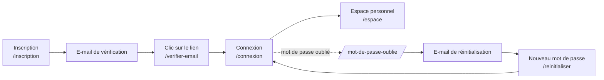
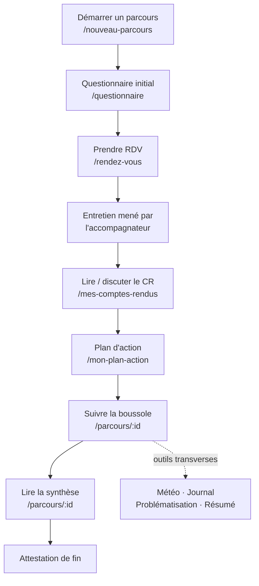
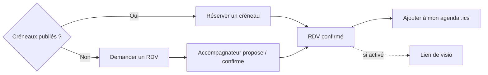
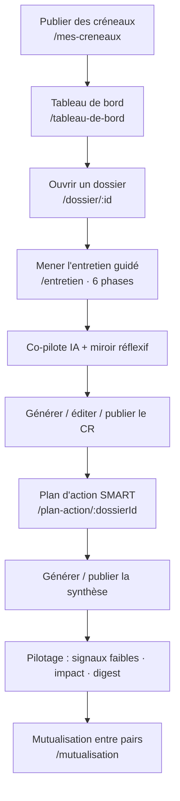
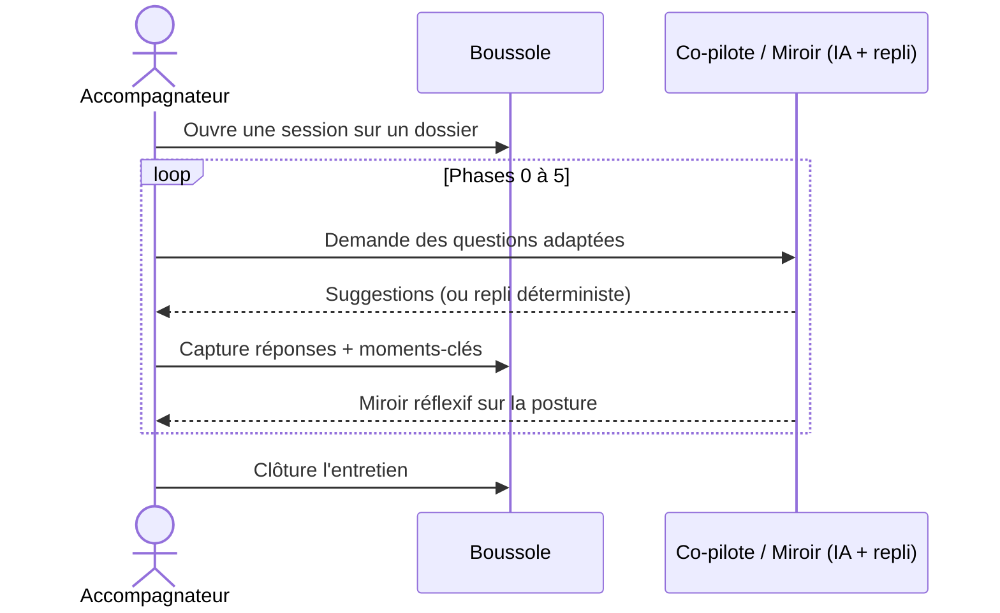
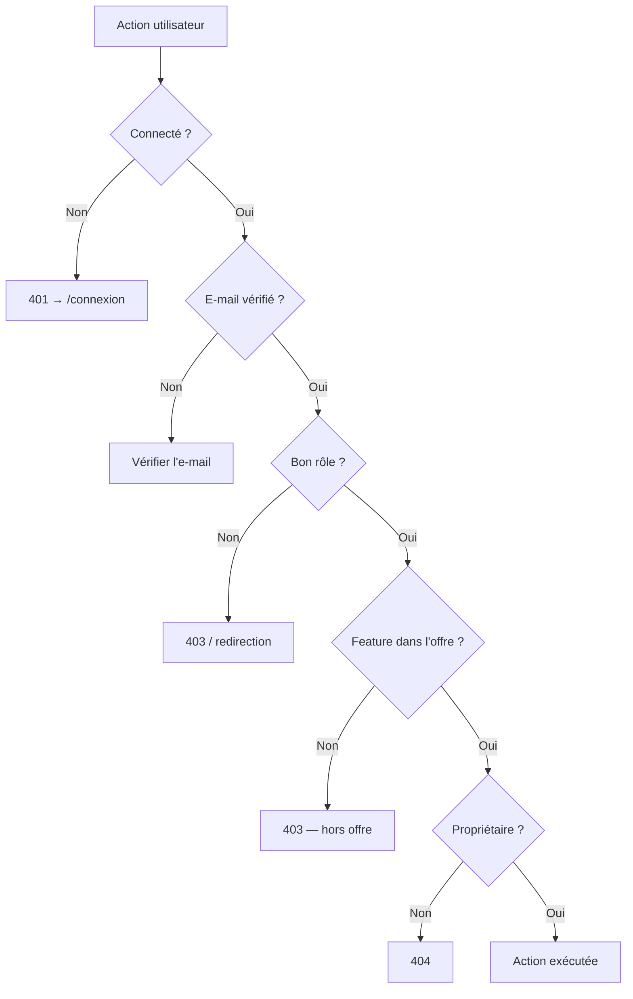

# Guide utilisateur

Ce guide s'adresse aux deux profils opérationnels de Boussole — l'**accompagnateur** (qui conduit les entretiens et tient une posture juste) et l'**accompagné** (étudiant/alternant de master qui avance sur son mémoire). Il couvre la prise en main (inscription, vérification e-mail, connexion, profil), puis détaille les deux parcours d'usage de bout en bout, sous forme de **tutoriels pas à pas numérotés**, complétés d'une FAQ, d'un référentiel des **messages d'erreur fréquents** et des **bonnes pratiques**. Il ne décrit que des fonctionnalités réellement implémentées ; toute zone d'ombre est signalée comme hypothèse ou comme information non identifiée. Le pendant administrateur de ce document est le [Guide administrateur](admin-guide) ; la mécanique du droit d'accès est détaillée dans [Sécurité](security).

## Objectifs de la page

- Permettre à un nouvel utilisateur d'être **autonome** sur Boussole sans formation préalable, par des tutoriels reproductibles.
- Donner à chaque rôle une **carte mentale claire** de son parcours et des écrans associés (routes réelles du front).
- Outiller le **diagnostic des erreurs courantes** (e-mail non vérifié, accès refusé, fonctionnalité hors offre) pour réduire le support.
- Énoncer les **bonnes pratiques** d'accompagnement et d'usage de l'IA (l'IA propose, l'humain décide).
- Servir de point d'entrée vers les [Spécifications fonctionnelles](functional-specifications), l'[UX / UI](ux-ui) et le [Guide administrateur](admin-guide).

---

## 1. Présentation de l'application

Boussole instrumente une relation d'accompagnement à la rédaction de mémoires. Sa promesse tient en une phrase : *« une boussole, pas un pilote automatique »* — l'IA (Claude) propose des questions, des comptes rendus et des synthèses ; l'humain décide ; le système trace. Chaque fonction assistée par IA dispose d'un **repli déterministe** : si l'IA est indisponible, une version dégradée est servie, jamais une erreur bloquante.

| Vous êtes… | Votre objectif principal | Vos écrans clés (routes) |
|---|---|---|
| **Accompagné** | Avancer sur votre mémoire, parcours par parcours | `/espace`, `/nouveau-parcours`, `/parcours/:id`, `/questionnaire`, `/rendez-vous`, `/mes-comptes-rendus`, `/mon-plan-action` |
| **Accompagnateur** | Conduire des entretiens justes et produire des restitutions | `/espace`, `/mes-creneaux`, `/tableau-de-bord`, `/dossier/:id`, `/entretien`, `/plan-action/:dossierId`, `/bilan-pratique`, `/mutualisation` |
| **Administrateur** | Gérer comptes, offres, RGPD | `/admin` — voir [Guide administrateur](admin-guide) |

Quelques notions structurantes valables pour les deux rôles :

- **Parcours = dossier** : un parcours de mémoire est un *dossier* reliant un accompagné, un accompagnateur, un titre et un contexte. Un accompagné peut mener **plusieurs parcours** (multi-parcours).
- **Entretien = session** : chaque entretien est une *session* rattachée à un dossier, conduite en **6 phases** (0 à 5).
- **Offre = plan** : selon votre plan d'abonnement (Découverte / Essentiel / Pro), certaines fonctionnalités sont activées ou non. Le détail est dans les [Spécifications fonctionnelles](functional-specifications).

> **Hypothèse — confiance : élevée** — Les libellés d'écran cités correspondent aux routes réelles déclarées dans `app/web/src/App.tsx` ; les titres exacts affichés à l'écran peuvent différer à la marge des libellés de ce guide.

---

## 2. Prise en main (commune aux deux rôles)

### 2.1 Cycle d'accès

Ce schéma résume le chemin d'accès. Deux points d'attention : la **vérification e-mail est obligatoire** avant de pouvoir se connecter, et l'oubli de mot de passe passe par un lien à usage unique reçu par e-mail (le système ne révèle jamais si une adresse existe, pour éviter l'énumération de comptes — voir [Sécurité](security)).

### 2.2 Tutoriel — S'inscrire et activer son compte

1. Ouvrez **`/inscription`**.
2. Renseignez votre adresse e-mail, un mot de passe (≥ 8 caractères) et votre rôle si demandé.
3. Acceptez les **CGU** et la **Politique de confidentialité** (consentement horodaté et versionné — obligatoire).
4. Validez : un e-mail de vérification vous est envoyé.
5. Ouvrez votre messagerie, cliquez sur le **lien de vérification** (page `/verifier-email`). Votre compte est activé.
6. Rendez-vous sur **`/connexion`**, saisissez vos identifiants. Une session sécurisée (cookie) est ouverte et vous arrivez sur **`/espace`**.

> **Hypothèse — confiance : moyenne** — L'attribution du rôle à l'inscription (choix par l'utilisateur vs affectation par l'admin) n'a pas été vérifiée écran par écran ; en cas de doute, l'admin peut ajuster le rôle (voir [Guide administrateur](admin-guide)).

### 2.3 Tutoriel — Gérer son profil

1. Depuis `/espace`, ouvrez **`/profil`**.
2. Mettez à jour vos informations personnelles.
3. **Changer de mot de passe** : saisissez l'ancien puis le nouveau.
4. **Changer d'e-mail** : la nouvelle adresse n'est active qu'après **re-validation** (un lien de confirmation est envoyé à la nouvelle adresse).
5. Depuis le profil ou l'espace, vous accédez aux préférences de confort (mode sombre, FALC, lecture audio) selon votre offre.

### 2.4 Préférences de confort et accessibilité

| Préférence | Effet | Disponibilité |
|---|---|---|
| Mode sombre (`dark_mode`) | Thème sombre persistant | Selon offre (Essentiel/Pro) |
| FALC (`falc`) | Mode « Facile À Lire et à Comprendre » | Selon offre (Pro) |
| Lecture audio (`audio`) | Synthèse vocale des CR / synthèses | Selon offre (Essentiel/Pro) |
| Onboarding (`onboarding`) | Tour guidé à la première connexion | Selon offre (Pro) |

Voir [UX / UI](ux-ui) pour le détail des choix d'accessibilité.

---

## 3. Parcours ACCOMPAGNÉ

### 3.1 Vue d'ensemble

Ce diagramme décrit le cycle de vie côté accompagné. La **boussole** (jauge de progression) et les **outils transverses** (météo, journal, problématisation, résumé) accompagnent l'ensemble du parcours et ne sont pas des étapes séquentielles.

### 3.2 Tutoriel — Démarrer un parcours et choisir son accompagnateur

1. Depuis `/espace`, cliquez sur **« Nouveau parcours »** (`/nouveau-parcours`).
2. Donnez un **titre** au parcours et décrivez son **contexte** (sujet/objet du mémoire).
3. **Choisissez votre accompagnateur** dans la liste proposée.
4. Validez : un **dossier** (statut *en cours*) est créé et un **lien d'accompagnement** est établi avec l'accompagnateur choisi.
5. Le parcours apparaît dans votre liste ; ouvrez son détail via **`/parcours/:id`**.

### 3.3 Tutoriel — Compléter le questionnaire initial

1. Depuis le détail du parcours, lancez le **questionnaire** (`/questionnaire`).
2. Répondez aux questions : l'IA propose la **question suivante** en fonction de vos réponses.
3. À la fin, un **récapitulatif** est généré et sauvegardé ; il servira de base à l'accompagnateur.
4. Si l'IA est momentanément indisponible, des **questions déterministes de repli** prennent le relais — votre questionnaire aboutit quand même.

> Un seul questionnaire initial par dossier. Soignez vos réponses : elles cadrent tout le parcours.

### 3.4 Tutoriel — Prendre rendez-vous

1. Ouvrez **`/rendez-vous`**.
2. Si l'accompagnateur a **publié des créneaux**, sélectionnez-en un et **réservez**.
3. Si **aucun créneau** n'est disponible, **demandez un RDV** : l'accompagnateur le confirmera.
4. Une fois confirmé, **ajoutez-le à votre agenda** via le fichier **.ics**.
5. Si la visio est activée pour votre offre, un **lien de visioconférence** est associé au RDV.

Ce schéma montre la bifurcation centrale : réservation directe si des créneaux existent, demande sinon. Un créneau ne peut être réservé qu'une fois.

### 3.5 Suivre la boussole de progression

La **boussole** (jauge) traduit visuellement l'avancement du parcours, dérivé des **phases atteintes** au fil des entretiens. Elle est visible depuis le détail du parcours (`/parcours/:id`). Plus les entretiens progressent dans les 6 phases, plus la jauge avance. La boussole est une fonctionnalité visuelle activée selon l'offre (Essentiel/Pro).

### 3.6 Tutoriel — Lire et discuter un compte rendu

1. Ouvrez **`/mes-comptes-rendus`** (ou le CR depuis le détail du parcours).
2. Lisez le compte rendu **publié** par votre accompagnateur (contenu structuré, lisible).
3. **Réagissez** : ouvrez la discussion attachée au CR (messages accompagné ↔ accompagnateur) pour poser une question ou préciser un point.
4. Si la lecture audio est disponible, **écoutez** le CR.
5. Les versions précédentes restent consultables ; seul l'accompagnateur édite et publie.

> Vous ne voyez que les CR **publiés**. Les notes privées de l'accompagnateur ne vous sont jamais visibles.

### 3.7 Suivre son plan d'action

1. Ouvrez **`/mon-plan-action`**.
2. Consultez les **actions SMART** définies avec l'accompagnateur : libellé, échéance, critère, priorité.
3. Vous recevez des **rappels par e-mail** à l'approche des échéances.
4. Avancez action par action ; l'accompagnateur ajuste le plan au fil des entretiens.

### 3.8 Lire la synthèse de parcours

La **synthèse** offre une vue d'ensemble de la progression du mémoire. Elle est rédigée (avec l'appui de l'IA), **versionnée** et **publiée** par l'accompagnateur. Vous la consultez depuis le détail du parcours. En fin de parcours clôturé, une **attestation de fin** peut être délivrée.

### 3.9 Outils transverses de l'accompagné

| Outil | À quoi ça sert | Bon réflexe |
|---|---|---|
| **Météo intérieure** | Noter son humeur (1–5) + un mot | Avant/après un entretien, pour objectiver son état |
| **Roue des émotions** | Nommer plus finement ses émotions | Quand un simple score ne suffit pas |
| **Micro-journal** | Consigner des notes courtes et privées | Capturer une idée « à chaud » entre deux séances |
| **Problématisation** | Formuler/affiner la problématique | Quand le sujet reste flou ou trop large |
| **Résumé « où j'en suis »** | Synthèse courte de l'avancement | Avant un RDV, pour repartir au bon endroit |
| **Fil rouge** | Garder le fil conducteur du mémoire | Pour vérifier la cohérence d'ensemble |

Ces outils sont **personnels** (le micro-journal et la météo restent privés à l'accompagné) et soumis au gating d'offre. Chacun dispose d'un repli déterministe si l'IA est indisponible.

---

## 4. Parcours ACCOMPAGNATEUR

### 4.1 Vue d'ensemble

Ce diagramme retrace le travail de l'accompagnateur, des créneaux jusqu'à la synthèse, avec en surplomb les outils de **pilotage** (signaux faibles, tableau d'impact, digest) et la **mutualisation** entre pairs.

### 4.2 Tutoriel — Publier des créneaux

1. Ouvrez **`/mes-creneaux`**.
2. Créez un ou plusieurs **créneaux** disponibles (date, heure).
3. Publiez-les : ils deviennent réservables par vos accompagnés.
4. Suivez les **réservations** et les **demandes de RDV** (lorsqu'aucun créneau ne convenait).

### 4.3 Tutoriel — Mener un entretien guidé (6 phases)

Les six phases structurent l'entretien et évitent le conseil prématuré :

| Phase | Intitulé | Intention |
|---|---|---|
| 0 | Accueil et mise en confiance | Cadre & alliance |
| 1 | Clarifier le besoin | Demande & besoin |
| 2 | Explorer l'expérience | Faire raconter, élargir |
| 3 | Relier et donner du sens | Mise en sens & structuration |
| 4 | Plan d'action & engagement | Décider, s'engager |
| 5 | Clôture et élan | Clôture & repositionnement |

1. Depuis le **tableau de bord** (`/tableau-de-bord`) ou un **dossier** (`/dossier/:id`), lancez l'**entretien** (`/entretien`).
2. Avancez **phase par phase** (0 → 5). Vous pouvez sauter une phase, mais cela reste tracé (`phase_atteinte`).
3. Activez le **co-pilote** : il propose des **questions adaptées** à la phase et au contexte (repli = banque de questions des phases si l'IA est indisponible).
4. Capturez les **réponses** et les **moments-clés** marquants.
5. Consultez le **miroir réflexif** : il analyse votre **posture** (équilibre questions/conseils, ouverture). Utilisez aussi, selon l'offre, le **coach de posture** et la **banque de questions**.
6. **Clôturez** l'entretien quand la phase de clôture est atteinte.

### 4.4 Tutoriel — Générer, éditer et publier un compte rendu

1. À partir d'une **session clôturée**, **générez** le CR : un document HTML structuré (source *IA*) est créé en **version 1**.
2. **Éditez-le** dans l'éditeur riche (TipTap) : corrigez, complétez, structurez.
3. Tenez vos **notes privées** (jamais visibles par l'accompagné) si besoin.
4. **Publiez** le CR : l'accompagné peut alors le **lire** et **ouvrir une discussion**.
5. Chaque génération crée une **nouvelle version** ; l'historique est conservé.
6. Si l'IA est indisponible, un **CR déterministe** est produit à partir des réponses de la session (jamais d'erreur bloquante).

### 4.5 Tutoriel — Construire le plan d'action SMART

1. Ouvrez **`/plan-action/:dossierId`**.
2. Ajoutez des **actions** : libellé, **échéance**, **critère SMART**, **priorité**.
3. **Réordonnez** par glisser-déposer (champ `ordre`) pour refléter les priorités.
4. Les **rappels par e-mail** sont envoyés aux échéances ; l'accompagné les voit sur `/mon-plan-action`.

### 4.6 Tutoriel — Générer et publier la synthèse de parcours

1. Depuis le dossier, **générez** la synthèse (vue d'ensemble de la progression).
2. **Éditez** la synthèse (versionnée).
3. **Publiez-la** pour la rendre visible à l'accompagné.
4. Repli déterministe si l'IA est indisponible. Une seule synthèse courante par dossier.

### 4.7 Pilotage de l'accompagnement

| Outil | Ce qu'il montre | Quand l'utiliser |
|---|---|---|
| **Signaux faibles** | Voyant + alerte de décrochage (inactivité, humeur basse) | En continu, pour intervenir tôt |
| **Tableau d'impact** | Indicateurs d'impact par accompagné | Pour prioriser son énergie |
| **Digest hebdomadaire** | E-mail récapitulatif | Pour un suivi régulier sans se connecter |

Ces outils sont disponibles selon l'offre. Ils visent l'anticipation du décrochage et la priorisation, sans se substituer au jugement de l'accompagnateur.

### 4.8 Posture réflexive et mutualisation

- **Débriefing à chaud** et **replay annoté** : revenir sur un entretien clôturé pour progresser.
- **Bilan de pratique** (`/bilan-pratique`) : vue agrégée de sa pratique d'accompagnement.
- **Mutualisation** (`/mutualisation`) : partager des **ressources** avec ses pairs, le cas échéant via un **lien public**.

> **Hypothèse — confiance : moyenne** — La mutualisation (`/mutualisation`, routeur `/api/collab`) est marquée *partielle* dans les [Spécifications fonctionnelles](functional-specifications) : l'étendue exacte du partage public reste à confirmer en recette.

---

## 5. FAQ

| Question | Réponse |
|---|---|
| Je n'arrive pas à me connecter juste après l'inscription. | Vous devez d'abord **vérifier votre e-mail** via le lien reçu. Sans cela, la connexion est refusée. |
| Je n'ai pas reçu l'e-mail de vérification. | Vérifiez vos spams. Les e-mails sont transactionnels (Brevo) ; en l'absence de réception, contactez l'administrateur pour relancer/valider le compte. |
| Puis-je suivre plusieurs mémoires en même temps ? | Oui. L'accompagné peut démarrer **plusieurs parcours** (un dossier par parcours). |
| Comment changer d'accompagnateur ? | Le choix se fait au démarrage d'un parcours. *Information non identifiée dans le code ou la conversation* concernant un changement d'accompagnateur en cours de parcours côté utilisateur ; à traiter par l'administrateur si nécessaire. |
| Pourquoi une fonctionnalité a-t-elle disparu / est grisée ? | Elle n'est probablement pas incluse dans votre **offre** (Découverte / Essentiel / Pro). Voir [Spécifications fonctionnelles](functional-specifications). |
| L'IA semble indisponible — est-ce bloquant ? | Non. Chaque fonction IA a un **repli déterministe** ; vous obtenez un résultat dégradé mais utilisable, jamais une erreur 500. |
| Mes notes de micro-journal sont-elles visibles par mon accompagnateur ? | Non, le micro-journal et la météo intérieure sont **privés** à l'accompagné. |
| Comment exporter / supprimer mes données ? | Via l'espace de **transparence RGPD** : accès aux données, export, demande d'effacement (traitée par l'admin). Voir [Sécurité](security). |
| Puis-je revenir sur une version antérieure d'un CR ? | Les versions sont conservées et consultables ; seul l'accompagnateur édite et publie. |
| Comment ajouter un RDV à mon agenda ? | Téléchargez le fichier **.ics** depuis le RDV confirmé. |

---

## 6. Messages d'erreur fréquents

| Message / situation | Cause | Code | Que faire |
|---|---|---|---|
| « Veuillez vérifier votre e-mail » / connexion refusée | E-mail non vérifié | — | Cliquer sur le lien de vérification reçu (`/verifier-email`) |
| Redirection vers `/espace` ou page d'accès | Mauvais **rôle** pour la page demandée | 403 (back) | Utiliser un compte du bon rôle ; le composant `Protected` redirige automatiquement |
| « Fonctionnalité non disponible dans votre offre » | La feature n'est pas dans votre **plan** | 403 | Changer d'offre (démonstration de gating) ; voir [Spécifications fonctionnelles](functional-specifications) |
| Page de connexion alors que vous pensiez être connecté | Session expirée (cookie 7 jours) ou non connecté | 401 | Se reconnecter via `/connexion` |
| Erreur de validation de formulaire | Entrée invalide (ex. mot de passe < 8 caractères) | 400 | Corriger le champ signalé |
| « Cette adresse e-mail est déjà utilisée » | Conflit à l'inscription / changement d'e-mail | 409 | Utiliser une autre adresse ou récupérer le compte existant |
| Ressource introuvable / accès à un dossier d'autrui | Vous n'êtes pas **propriétaire** de la ressource | 404 | Vérifier que le parcours/dossier vous appartient |

Ce diagramme reconstitue l'ordre des vérifications qui produisent les messages ci-dessus : authentification → vérification e-mail → rôle → offre → propriété de la ressource. Comprendre cette séquence permet de diagnostiquer un blocage en quelques secondes. La mécanique back est détaillée dans [Sécurité](security).

---

## 7. Bonnes pratiques

### 7.1 Pour l'accompagné

- **Soigner le questionnaire initial** : il cadre tout le parcours.
- **Préparer chaque RDV** avec le résumé « où j'en suis » et le fil rouge.
- **Tenir le micro-journal** régulièrement : la valeur vient de la constance, pas du volume.
- **Réagir aux CR** via la discussion plutôt que d'attendre le prochain entretien.
- **Saisir la météo intérieure** honnêtement : c'est un signal utile, pas une note.

### 7.2 Pour l'accompagnateur

- **Respecter l'ordre des phases** : ne pas court-circuiter l'exploration (phase 2) par un conseil prématuré.
- **Lire le miroir réflexif** après chaque entretien : viser l'équilibre questions/conseils.
- **Relire et corriger le CR généré** avant publication : l'IA propose, vous validez.
- **Formuler des actions réellement SMART** : une échéance et un critère vérifiable par action.
- **Surveiller les signaux faibles** : intervenir tôt vaut mieux que relancer tard.
- **Publier au bon moment** : un CR ou une synthèse non publié reste invisible à l'accompagné.

### 7.3 Transverse (RGPD & sécurité d'usage)

- **Ne déposer que des données nécessaires** ; rappeler aux accompagnés leur droit d'accès/effacement.
- **Se déconnecter** sur un poste partagé (session valable 7 jours).
- **Choisir un mot de passe robuste** (≥ 8 caractères) et le changer en cas de doute.

---

## Hypothèses

> **Hypothèse — confiance : élevée** — Les routes citées (`/nouveau-parcours`, `/parcours/:id`, `/questionnaire`, `/rendez-vous`, `/mes-comptes-rendus`, `/mon-plan-action`, `/mes-creneaux`, `/tableau-de-bord`, `/dossier/:id`, `/entretien`, `/plan-action/:dossierId`, `/bilan-pratique`, `/mutualisation`, `/profil`) sont les routes réelles déclarées dans `app/web/src/App.tsx`. Les libellés de boutons exacts peuvent varier.

> **Hypothèse — confiance : moyenne** — Le détail des sous-écrans des outils transverses (emplacement précis de la météo, de la roue des émotions, de la problématisation dans l'arborescence du détail de parcours) n'a pas été vérifié composant par composant ; les fonctionnalités existent (routeurs `/api/relationnel`, `/api/emergence`), leur point d'accès UI exact est à confirmer en recette.

> **Information non identifiée dans le code ou la conversation** — Aucune procédure utilisateur de changement d'accompagnateur en cours de parcours, ni de relance manuelle de l'e-mail de vérification côté utilisateur, n'a été identifiée ; ces cas relèvent de l'administrateur.

## Risques & points d'attention

| Risque | Impact utilisateur | Probabilité | Mitigation |
|---|---|---|---|
| E-mail de vérification non reçu | Blocage à la première connexion | Moyenne | Vérifier les spams ; relance/validation par l'admin |
| Confusion offre vs bug | L'utilisateur croit à un défaut alors qu'il s'agit du gating | Moyenne | Message explicite « non disponible dans votre offre » + ce guide |
| CR/synthèse non publié | L'accompagné ne voit rien et s'inquiète | Moyenne | Bonne pratique 7.2 (publier au bon moment) |
| Dégradation IA perçue comme panne | Baisse de confiance | Faible | Repli déterministe systématique, communiqué dans la FAQ |
| Données personnelles excessives | Risque RGPD | Faible | Minimisation + espace de transparence (voir [Sécurité](security)) |
| Écart libellés UI ↔ guide | Désorientation | Faible | Guide aligné sur les routes ; mise à jour à chaque évolution UI |

## Recommandations

1. **Ajouter des captures d'écran annotées** par tutoriel pour réduire la charge de lecture (le présent guide est textuel par contrainte d'environnement).
2. **Exposer une relance d'e-mail de vérification** côté utilisateur, pour traiter le risque le plus fréquent sans passer par l'admin.
3. **Afficher un bandeau « offre »** indiquant clairement les fonctionnalités verrouillées, avec lien vers la page d'offres, afin de transformer un 403 en information actionnable.
4. **Signaler visuellement l'état "non publié"** d'un CR/synthèse côté accompagnateur, pour éviter les oublis de publication.
5. **Tenir ce guide synchronisé** avec les routes de `App.tsx` à chaque livraison, et le rapprocher du [Guide administrateur](admin-guide) pour couvrir les cas escaladés (relance e-mail, RGPD, rôles).

## Pages liées

- [Spécifications fonctionnelles](functional-specifications) — détail des 38 fonctionnalités et du gating par offre
- [Guide administrateur](admin-guide) — gestion des comptes, offres et demandes RGPD
- [UX / UI](ux-ui) — parcours d'écrans, accessibilité, FALC, mode sombre
- [Sécurité](security) — authentification, rôles, gating, RGPD (codes 401/403/404)
- [Cahier des charges détaillé](requirements) — besoins, exigences et user stories
- [Documentation de l'API](api-documentation) — endpoints sous-jacents aux écrans
- [Glossaire](glossary) — définitions (parcours, session, phase, offre…)
