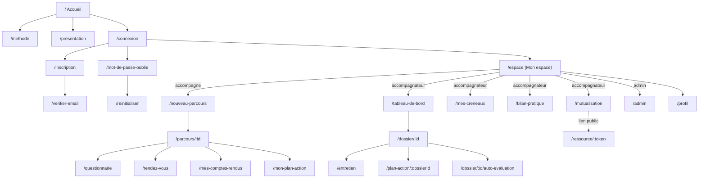
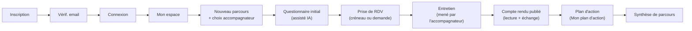
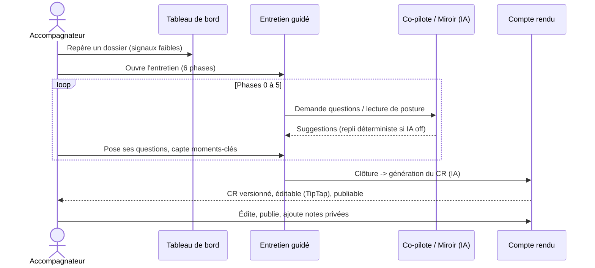
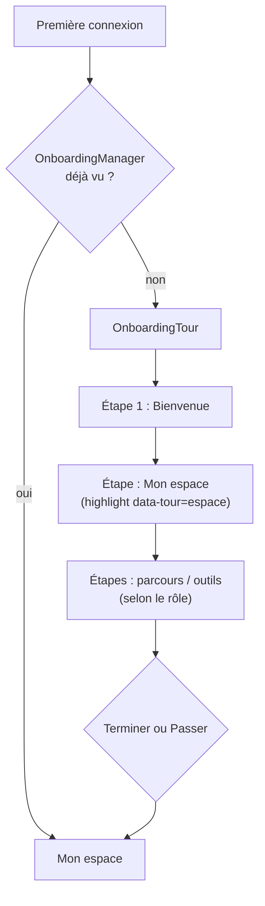

# Dossier UX/UI

Ce dossier décrit l'expérience et l'interface réellement implémentées dans **Boussole** : principes directeurs, design system maison, inventaire des composants, cartographie des écrans et des routes, parcours par rôle, personas, *user flows* et règles d'accessibilité. Il s'appuie exclusivement sur le code du frontend (`app/web/src`) : React 18 + Vite 5 + TypeScript 5, react-router-dom 6, état via React Context, UI en CSS maison (`index.css`, ~68 Ko), éditeur riche TipTap, animations CSS + framer-motion (glisser-déposer). Aucune librairie de composants tierce (pas de Material UI, pas de Tailwind) : le design system est entièrement artisanal et tokenisé.

## Objectifs de la page

- Documenter les **principes UX** et la manière dont ils se traduisent dans le code (clarté, posture, accessibilité, FALC, dark mode, responsive).
- Fournir l'**inventaire des composants UI réels** (~45) et le **design system** (classes, tokens de thème, animations).
- Cartographier la **navigation** (30 écrans, 24 routes) et les **parcours utilisateur** par rôle.
- Outiller la conception et les revues par des **personas** et des **user flows** Mermaid vérifiables.
- Tracer ce qui est **développé / partiel / prévu / absent** pour piloter la dette UX.

## 1. Principes UX

| Principe | Traduction concrète dans le produit | Niveau |
|---|---|---|
| **Clarté** | Mise en page sobre (`.page`, `.card`), largeur de lecture bornée (`--maxw: 80vw`, `max-width: 60ch` sur les paragraphes longs), hiérarchie de titres explicite, vocabulaire métier en français. | Développé |
| **Posture juste** | L'IA *seconde* sans décider : co-pilote d'entretien, miroir réflexif, coach de posture sont des aides consultatives ; l'accompagnateur reste maître. Chaque IA a un **repli déterministe** : jamais d'écran cassé. | Développé |
| **Accessibilité (RGAA 4.1)** | Lien d'évitement, repères ARIA (header/nav/main/footer), `aria-label` sur boutons-icônes, `role="img"` sur graphiques, focus visible, `prefers-reduced-motion`. Déclaration d'accessibilité publiée (`/accessibilite`) + **audit automatisé axe-core** (WCAG 2.1 AA) en CI. | Audité (voir §8) |
| **FALC (Facile À Lire et à Comprendre)** | Bascule globale `FalcToggle` dans l'en-tête + `FalcButton` contextuels ; feature `falc`. Simplifie le rendu textuel des contenus longs. | Développé |
| **Dark mode** | Thème sombre par inversion de tokens (`[data-theme="dark"]`), bascule `ThemeToggle` conditionnée à la feature `dark_mode`, préférence persistée. | Développé |
| **Mobile / responsive** | Layout fluide (`clamp()`, grilles `auto-fit minmax()`), bascule pleine largeur sous 900 px, grilles de phases en colonne unique sous 560 px. | Développé |

> **Hypothèse — confiance : moyenne** — La persistance de la préférence de thème (localStorage vs cookie) est gérée par `ThemeToggle` ; le mécanisme exact n'a pas été ré-inspecté pour cette page mais le pattern d'attribut `data-theme` sur la racine est confirmé.

## 2. Design system réel

Le design system est porté par **un seul fichier CSS** (`app/web/src/index.css`) organisé en sections commentées (header, layout, cards, formulaires, pages métier, widgets). Il n'y a **pas de fichier de tokens séparé** ni de CSS-in-JS : les tokens sont des variables CSS sur `:root`.

### 2.1 Tokens de thème

| Token | Clair | Sombre | Rôle |
|---|---|---|---|
| `--bleu-profond` | `#16324f` | `#a9cdeb` | Titres, accents, fonds de boutons primaires |
| `--bleu` | `#2f5d7c` | `#86b4d8` | Liens |
| `--sauge` | `#7c9a85` | `#7fa489` | Accent secondaire, focus (`outline`) |
| `--sable` / `--sable-2` | `#f5efe4` / `#faf6ee` | `#0f1a24` / `#16212c` | Fonds chauds, surfaces |
| `--texte` / `--texte-doux` | `#1f2a33` / `#4c5a64` | `#e7edf3` / `#a3b2bf` | Texte principal / secondaire |
| `--bordure` | `#e3dccd` | `#2d3a47` | Bordures de cartes et champs |
| `--blanc` | `#ffffff` | `#1b2530` | Surface de carte (renommée, pas littérale en sombre) |
| `--radius`, `--ombre`, `--maxw` | `16px`, ombre douce, `80vw` | idem (ombre plus marquée en sombre) | Forme, profondeur, largeur de contenu |

Le mode sombre **inverse le couple `bleu-profond` / `sable`** plutôt que de redéfinir chaque règle, ce qui maintient le contraste des boutons « fond bleu, texte sable ». Quelques surcharges ciblées existent (`.form-error`, `.form-success`, opacité des images).

### 2.2 Classes structurantes (extrait)

| Classe | Usage |
|---|---|
| `.app` / `.header` / `.main` / `.footer` | Squelette de page (flex column, header sticky avec `backdrop-filter`). |
| `.page`, `.page-title`, `.card`, `.cards` | Conteneurs de contenu et grilles de cartes. |
| `.btn`, `.btn-primary`, `.btn-ghost`, `.btn-sm` | Boutons (primaire = fond bleu profond, fantôme = bordure). |
| `.form`, `.field`, `.field-row`, `.checkbox`, `.form-error`, `.form-success` | Formulaires et états de validation. |
| `.steps`, `.phases`, `.phase`, `.flow`, `.principes` | Composants éditoriaux (méthode, 6 phases d'entretien). |
| `.auth-card`, `.legal` | Cartes d'authentification et pages légales. |
| `.pb` / `.pb.ok`, `.note`, `.muted` | Badges de statut, encarts, texte atténué. |

### 2.3 Animations

- **CSS** : transitions et keyframes pour la boussole (aiguille), le micro de dictée, la barre de progression IA, le co-pilote. Toutes sous garde `@media (prefers-reduced-motion: reduce)` (≥ 5 occurrences) → mouvement neutralisé si l'utilisateur le demande.
- **framer-motion** : utilisé **uniquement** dans `ActionList.tsx` (`Reorder`, `useDragControls`, `AnimatePresence`, `MotionConfig`) pour le **glisser-déposer du plan d'action**.
- **Typewriter** : `useTypewriter` (effet machine à écrire pour les rendus IA) respecte aussi `prefers-reduced-motion`.

> **Hypothèse — confiance : élevée** — framer-motion n'est pas un socle d'animation généralisé : l'essentiel des micro-interactions est en CSS, framer-motion étant réservé au DnD. Toute communication marketing présentant framer-motion comme « moteur d'animation de l'app » serait inexacte.

## 3. Inventaire des composants UI

`app/web/src/components` contient **~45 composants** (hors pages). Regroupement fonctionnel :

| Domaine | Composants |
|---|---|
| **Contenu riche / CR / synthèse** | `CompteRenduModal`, `SyntheseModal`, `RichTextEditor` (TipTap), `HtmlContent` (rendu sanitisé DOMPurify), `NotesPriveesModal`, `QuestionnaireDetailModal`, `EntretienDetailModal` |
| **Saisie & dictée** | `DictaInput`, `DictaTextarea`, `GradientSlider`, `EcouterButton` (lecture vocale), hook `useDictation` |
| **Boussole & visualisation** | `BoussoleParcours`, `NuageThemes`, `CarteParcours`, `charts/Gauge`, `charts/RadarChart`, `charts/BarsChart`, `charts/EvolutionLine` |
| **Relationnel** | `MeteoWidget`, `RoueEmotions`, `MicroJournal` |
| **Émergence** | `FilRougeCard`, `ResumeParcoursCard`, `ProblematisationCard`, `EmergencePartage` |
| **Posture & réflexivité (IA)** | `MiroirReflexifModal`, `CoachPosture`, `DebriefingModal`, `ReplayModal` |
| **Pilotage** | `PilotageBoard`, `Dashboard` (page) |
| **Plan d'action** | `ActionList` (DnD), `ActionDetailModal` |
| **Confort / éthique / RGPD** | `VisioButton`, `PushToggle`, `ExportDossierModal`, `AttestationModal`, `TransparenceModal`, `RgpdConsole`, `PlansManager` |
| **Navigation & chrome** | `AuthMenu`, `NotificationsBell`, `ThemeToggle`, `FalcToggle`, `FalcButton`, `Protected`, `AiProgress`, `ErrorBoundary` |
| **Onboarding** | `OnboardingManager`, `OnboardingTour` |
| **Parcours (accompagné)** | `MesParcours` |

Patterns transverses confirmés :
- **Feedback IA** : `AiProgress` (barre indéterminée + libellé d'étape défilant toutes les 1,8 s, `role="status"` / `aria-live="polite"`).
- **Robustesse** : `ErrorBoundary` global ; `HtmlContent` sanitise systématiquement via DOMPurify avant rendu.
- **Dictée mutualisée** : `useDictation` partage **un seul** `SpeechRecognition` pour toute l'app, avec file d'attente entre champs et garde-fous (reprise forcée si `onend` n'est pas émis) ; saisie clavier toujours équivalente si non supporté.

## 4. Navigation & structure des écrans

24 routes déclarées dans `App.tsx` ; **30 écrans** au total en comptant les pages légales et les vues de détail. Découpage : **publiques** (sans auth), **protégées par rôle** (`<Protected role="...">`), **publique tokenisée** (ressource mutualisée).

| Zone | Routes |
|---|---|
| Publiques | `/`, `/methode`, `/presentation`, `/accessibilite`, `/connexion`, `/inscription`, `/verifier-email`, `/mot-de-passe-oublie`, `/reinitialiser`, `/mentions-legales`, `/cgu`, `/confidentialite` |
| Publique tokenisée | `/ressource/:token` (ressource mutualisée, lien public) |
| Authentifié (tous rôles) | `/espace`, `/profil` |
| Accompagné | `/nouveau-parcours`, `/parcours/:id`, `/questionnaire`, `/rendez-vous`, `/mes-comptes-rendus`, `/mon-plan-action` |
| Accompagnateur | `/mes-creneaux`, `/entretien`, `/tableau-de-bord`, `/bilan-pratique`, `/mutualisation`, `/dossier/:id`, `/dossier/:id/auto-evaluation`, `/plan-action/:dossierId` |
| Admin | `/admin` |

### Diagramme de navigation

Ce graphe montre que `/espace` est le **hub central** post-connexion : la barre de navigation reste minimale (Accueil, Méthode, Présentation, Mon espace, plus FALC / thème / notifications / menu compte), et tout le reste se rejoint depuis « Mon espace » selon le rôle. `Protected` redirige tout accès non autorisé vers `/espace` (ou `/connexion` si non connecté).

## 5. Personas

| Persona | Profil | Objectifs | Frustrations | Écrans clés |
|---|---|---|---|---|
| **L'accompagnateur** (« Claire ») | Enseignante / référente mémoire, suit plusieurs alternants en parallèle. | Conduire des entretiens justes, produire des CR structurés rapidement, repérer les décrochages. | Charge de préparation, temps de rédaction des CR, perte de fil entre RDV. | `/tableau-de-bord`, `/entretien`, `/dossier/:id`, `/mes-creneaux`, `/bilan-pratique` |
| **L'accompagné / alternant** (« Amine ») | Étudiant de master en alternance, rédige son mémoire professionnel. | Avancer concrètement, savoir « où j'en suis », garder le moral, préparer ses RDV. | Sentiment d'isolement, angoisse de la page blanche, jargon académique. | `/espace`, `/parcours/:id`, `/questionnaire`, `/rendez-vous`, `/mes-comptes-rendus`, `/mon-plan-action` |
| **L'administrateur** (« Mohamed ») | Exploitant de la plateforme (ici l'auteur). | Gérer comptes, plans/features, traiter les demandes RGPD. | Demandes d'effacement à tracer, gating à configurer. | `/admin` (comptes, plans, console RGPD) |

> **Hypothèse — confiance : moyenne** — Les prénoms et traits (« Claire », « Amine », « Mohamed ») sont des personas de travail dérivés du jeu de démo (Mohamed = accompagnateur, Amine = accompagné). Ils ne figurent pas comme tels dans le code ; ils servent la conception, pas la spécification.

## 6. Parcours utilisateur par rôle

### 6.1 User flow — Accompagné : du parcours au compte rendu

Ce flux est le **chemin nominal** côté accompagné : il démarre un parcours (multi-parcours possible), choisit son accompagnateur, passe le questionnaire assisté, réserve un créneau (ou émet une demande si aucun n'est publié), puis consulte les livrables produits autour de l'entretien. Outils transverses accessibles tout du long depuis l'espace : météo intérieure, roue des émotions, micro-journal, résumé « où j'en suis », mode FALC.

### 6.2 User flow — Accompagnateur : conduire un entretien

Le co-pilote et le miroir sont **consultatifs** : l'accompagnateur garde la main à chaque phase. La génération du CR ne renvoie jamais d'erreur 500 : si l'IA est indisponible, un repli déterministe produit un brouillon structuré.

### 6.3 User flow — Accueil / onboarding

`OnboardingManager` décide de l'affichage ; `OnboardingTour` est une visite guidée modale (`role="dialog"`, `aria-modal`) avec **scénarios distincts par rôle** : 4 étapes pour l'accompagné et l'accompagnateur (la 2ᵉ surligne le lien « Mon espace » via `data-tour="espace"`), 1 étape pour l'admin. Navigation Précédent/Suivant/Passer, fermeture au clavier (Échap).

## 7. États, feedback et micro-interactions

| Type d'état | Traitement UI | Composant / preuve |
|---|---|---|
| **Chargement IA** | Barre indéterminée + libellé d'étape défilant, annoncé aux lecteurs d'écran. | `AiProgress` (`role="status"`, `aria-live="polite"`) |
| **Chargement standard** | Texte d'attente / boutons désactivés (`:disabled` → opacité 0,55). | `.btn-primary:disabled` |
| **Erreur de formulaire** | Encart rouge accessible (`.form-error`), variante sombre dédiée. | `.form-error` + surcharge `[data-theme="dark"]` |
| **Succès** | Encart vert (`.form-success`). | `.form-success` |
| **Erreur applicative** | Capture globale, écran de repli au lieu d'un crash blanc. | `ErrorBoundary` |
| **Dictée active** | Micro animé (pulsation), interim affiché ; fallback clavier si non supporté. | `DictaInput` / `DictaTextarea` / `useDictation` |
| **Notifications** | Cloche avec compteur dans l'en-tête. | `NotificationsBell` |
| **État vide** | *Information non identifiée de façon exhaustive dans le code pour cette page* — des messages « aucun élément » existent au cas par cas (listes de parcours, créneaux), sans composant `EmptyState` générique réutilisable. | — |

> **Hypothèse — confiance : faible** — L'absence d'un composant d'état vide générique est une déduction de l'inventaire (`components/`), pas une certitude exhaustive ; chaque liste gère son propre cas « vide » inline.

## 8. Accessibilité (RGAA 4.1)

État déclaré : **partiellement conforme**, déclaration publiée le 13 juin 2026 sur `/accessibilite`. Depuis, un **audit automatisé est intégré à la batterie de tests** : `app/tests/ui/accessibility.spec.ts` exécute **axe-core** (référentiel **WCAG 2.1 niveau AA**, socle du RGAA) sur 9 pages clés (accueil, connexion, inscription, méthode, présentation, accessibilité, espace accompagnateur, administration, wiki admin) et **échoue sur toute violation d'impact critique ou sérieux**. Cas `TC-A11Y-001..012`, rejoués à chaque push par la CI.

Corrections issues de cet audit : couleur de texte **sauge foncée** (`--sauge-texte`, contraste ≥ 4,5:1) pour les libellés ; **`aria-label`** sur les `<select>` de rôle/abonnement ; **contraste du mode sombre** corrigé pour les contrôles de formulaire, badges et boutons d'action destructive.

| Critère | Implémentation vérifiée | Statut |
|---|---|---|
| Lien d'évitement | `<a className="skip-link" href="#main">Aller au contenu</a>` dans `App.tsx`. | Développé |
| Repères ARIA | `header` / `nav aria-label` / `main#main` / `footer` ; `nav` du compte en `role="menu"` + `role="menuitem"` + `aria-expanded`. | Développé |
| Boutons-icônes étiquetés | `aria-label` sur la marque, les bascules, la cloche, les graphiques. | Développé |
| Graphiques décrits | Boussole et jauges en `role="img"` + libellé. | Développé |
| Focus visible | `outline: 2px solid var(--sauge)` sur les champs au focus. | Développé |
| Contrastes | Palette AA en clair et sombre ; information jamais portée par la seule couleur. | **Développé + audité (axe-core)** |
| Mouvement réduit | `prefers-reduced-motion` respecté (CSS + `useTypewriter` + `Gauge`). | Développé |
| Langue | `lang="fr"` déclarée. | Développé |
| **Éditeur riche TipTap** | Pas encore de revue d'accessibilité complète. | **Partiel — point d'attention** |
| **Dictée vocale** | Dépend du navigateur ; saisie clavier équivalente toujours offerte. | Partiel (dégradé propre) |
| **Tables/listes denses** | Restitution lecteur d'écran perfectible. | Partiel |

107+ occurrences d'attributs ARIA (`role`, `aria-*`) sont réparties sur 45 fichiers : l'accessibilité est traitée de façon diffuse et non en surcouche tardive.

## 9. Responsive

| Palier | Comportement |
|---|---|
| Grands écrans | Contenu borné à `80vw` centré (`--maxw`), en-tête/pied alignés sur le `main`. |
| ≤ 900 px (tablette/mobile) | `.main` reprend 100 % de largeur ; marges d'en-tête/pied resserrées. |
| ≤ 560 px | Grilles de phases d'entretien en colonne unique. |
| Toutes tailles | Grilles de cartes fluides (`repeat(auto-fit, minmax(…, 1fr))`), typographie en `clamp()`. |

Approche **fluide d'abord** (clamp + grilles auto-fit) plutôt qu'un jeu rigide de breakpoints ; deux *media queries* de rupture seulement (900 px, 560 px) en complément. PWA + push (`PushToggle`, web-push) renforcent l'usage mobile.

## Hypothèses

> **Hypothèse — confiance : élevée** — Le décompte « ~45 composants » correspond aux fichiers de `app/web/src/components` (hors `pages/`, `charts/` comptés à l'intérieur). « 30 écrans » agrège les 24 routes + vues de détail/légales ; ces chiffres sont des ordres de grandeur exacts à ±2 près selon la convention de comptage.

> **Hypothèse — confiance : moyenne** — Les personas (prénoms, frustrations) sont des artefacts de conception dérivés du jeu de démo, non présents dans le code.

> **Hypothèse — confiance : faible** — L'absence d'un composant générique d'état vide et le détail des messages « liste vide » n'ont pas été audités écran par écran.

## Risques & points d'attention

| Risque | Impact | Mitigation proposée |
|---|---|---|
| Design system mono-fichier (`index.css` ~68 Ko) | Couplage fort, risque de régression visuelle globale à chaque édition, pas de garde de non-régression CSS. | Découper en partials thématiques ; envisager des tests de régression visuelle (hors périmètre actuel). |
| Éditeur TipTap non audité a11y | Non-conformité RGAA partielle sur une fonction centrale (CR/synthèses). | Planifier une revue clavier + lecteur d'écran de l'éditeur. |
| Dépendance navigateur pour la dictée | Fonction indisponible sur certains navigateurs. | Déjà mitigé : fallback clavier systématique ; le signaler dans l'UI. |
| Pas de composant d'état vide unifié | Incohérences possibles de message/illustration entre écrans. | Introduire un `EmptyState` réutilisable. |
| Auto-évaluation RGAA (non auditée tiers) | Conformité revendiquée non opposable. | Conserver le wording « auto-évaluation » ; envisager un audit externe avant tout usage hors cadre académique. |
| framer-motion perçu comme moteur global | Attentes erronées sur l'animation. | Documenter (fait ici) son périmètre réel : DnD du plan d'action uniquement. |

## Recommandations

1. **Extraire les tokens** de `index.css` dans une section/fichier dédié et les documenter, pour préparer un futur thème ou une refonte sans toucher au layout.
2. **Auditer l'accessibilité de l'éditeur TipTap** (navigation clavier, libellés de barre d'outils) : c'est le principal écart RGAA restant.
3. **Mutualiser les états vides / chargement / erreur** dans des composants partagés (`EmptyState`, `Loader`) pour homogénéiser le feedback.
4. **Capitaliser sur `data-tour`** : étendre les ancres d'onboarding aux écrans métier clés (entretien, plan d'action) pour des visites guidées contextuelles.
5. **Tests de régression visuelle** légers (captures Playwright déjà en place pour l'E2E) sur les écrans à fort enjeu (entretien, CR, boussole), pour sécuriser les évolutions du CSS maison.

## Pages liées

- [Spécifications fonctionnelles](functional-specifications) — fonctionnalités couvertes par les écrans.
- [Exigences](requirements) — besoins fonctionnels et non fonctionnels (accessibilité, ergonomie).
- [Architecture technique](technical-architecture) — stack frontend, routage, contextes.
- [Stratégie de tests](testing-strategy) — E2E Playwright des 3 rôles, couverture UI.
- [Sécurité](security) — `Protected`, gating par feature, sanitisation DOMPurify.
- [Guide utilisateur](user-guide) — modes d'emploi par rôle.
- [Accessibilité — déclaration](#) *(page publique `/accessibilite` du produit, hors wiki)*.
- [Matrice de traçabilité](traceability-matrix) — liens exigences ↔ écrans.
